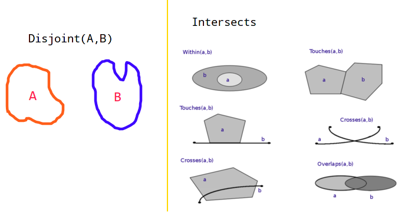
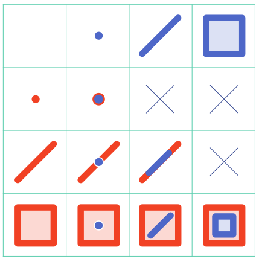
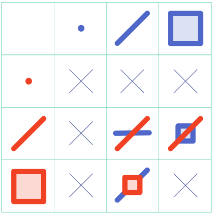
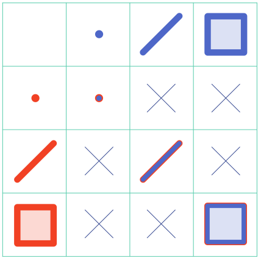
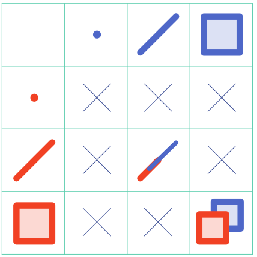
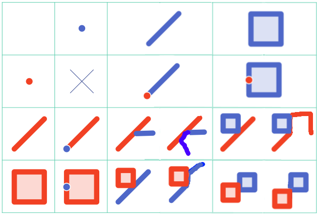
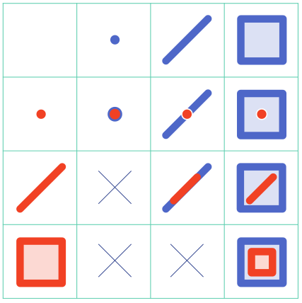
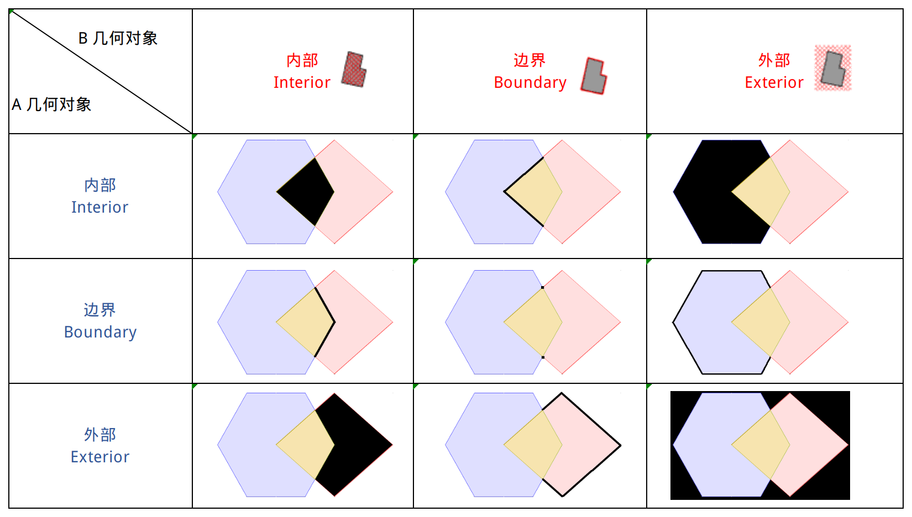

参考：<https://www.cnblogs.com/oloroso/p/14298258.html>

## 简述

**DE-9IM** 是**Dimensionally Extended 9-Intersection Model** 的缩写，直接翻译为 *维度扩展的 9 相交模型*好像比较别扭，但一时也找不到比较好的翻译。

DE-9IM 模型是用于描述两个 **二维几何对象（点、线、面）** 之间的空间关系的一种模型，它使用一个 `3 x 3` 的矩阵来描述几何关系类别（相交部分的维度）。

网上很多关于 DE-9IM 的介绍都是翻译自 <https://en.wikipedia.org/wiki/DE-9IM> 或者 [GeoTools/userguide/dim9](http://docs.geotools.org/latest/userguide/library/jts/dim9.html) 等文档的，我这里就不做这些翻译了。

## 空间关系

这里主要是说二维平面下的两个几何对象之间的空间关系。

主要有两种关系：

- 相交（Intersects）
- 相离（Disjoint）

**相离** 关系很简单，就是两个几何对象相互独立，之间没有任何相接触到的地方。形象的说，比如一张纸上画了两个**多边形**（或者**点**或**线**），你可以再画一条线把它们分开，而且这条画的线可以不碰到这两个多边形。

 

### 相交（Intersects）关系图解

相交（Intersects）关系就比较复杂一点了，它又可以分为好几类。

下面对相交（Intersects）的各种情况进行分类介绍，包括**点、线、面**相互之间形成相应关系的9种情况的图像说明（图是网上找的，来自一个国外的网站）。

下面的关系又称为`空间谓词`，下面的图式中都说明的是 `红色` 几何对象 相对于 `蓝色` 几何对象的空间关系（方向不能反）。

#### 包含（Contains ）

包含表示一个几何对象完全在另一个几何对象内部。

下面图是**红色几何对象包含（Contains）了蓝色几何对象的在其里头**的示意图。

`点`不可能包含`线`和`面`，`线`也不可能包含`面`在里头，所以有三个位置是 `X`。

 

#### 横跨（Crosses）

横跨关系一般又叫做交叉或者跨立，这里我还是觉得**横跨**比较合适。

横跨关系一定是建立在`线`与`线`或者`线`与`面`之间（可以理解为`线`才能够横在别的形状上嘛）。

下面图是**红色几何对象横跨（Crosses）在蓝色几何对象的上面**的示意图。

 

#### 等于（Equals）

等于（Equals）表示两几何对象完全一致（包括形状和位置），是一种**完全重合**的情况。

下面图是**红色几何对象等于（Equals） 蓝色几何对象**的示意图。

 

#### 重叠（Overlaps）

重叠（Overlaps）表示两个几何对象对象之间有**一部分**是重合的情况（完全重合就是 Equals 了）。

重叠只发生在 `线-线`、`面-面` 之间，`线`与`面`只能是`Crosses`、`Within`或者`Touches`，点没有长度和面积（就是不存在部分，不可以分割），不可能`Overlaps`。

下面图是**红色几何对象重叠（Overlaps）在蓝色几何对象上**的示意图。

 

#### 触碰（Touches）

触碰（Touches）这个一般又叫做**接触**或者**触及**，表示两个几何对象的`边界`部分有**重合部分**的情况，也就是说两个几何对象有公共点或者公共边线的情况。

`点`和`点`之间是没有`Touches`关系，`点`和`线`与`面`的触碰关系一定是`点`在**线的端点**或者**面的边上**。

`线`和`面`两种形状之间的`Touches`关系可能是有公共点，也可能是有公共边。

 

#### 被包含（Within）

被包含（Within）一般也描述为**在什么内部**（所以也有用 **inside** 的），表示一个几何对象完全处于另一个几何对象内部。这个其实就是**包含（Contains）**的反向关系。

就是说 `A Within B` 就等于是 `B Contains A`。

下面图是**红色几何对象被包含（Within）在蓝色几何对象里头**的示意图。

## DE-9IM 模型

**DE-9IM** 模型把几何对象分为 `内部`、`边界`、`外部` 三个部分，两个几何对象这三个部分两两之间的关系，就可以组合为一个`3X3`大小（就是 9 个值）的矩阵，这9个值的组合，就表示两个几何对象的空间关系。

  

如上图所示，淡紫色的多边形为`条件几何对象（A）`，淡红色的多边形为 `测试几何对象(B)`，图中的 **黑色** 部分表示两个几何对象对应的部分（内部、边界、外部）之间的相交（或者说重合）部分（ `A.[I/B/E] intersection B.[I/B/E]`）。

DE-9IM 用数值来表示相交（重合）部分的情况（维度），是点还是线还是面，或者是没有。

- `-1` 没有重合部分
- `0` 重合部分为`点`（零维）
- `1` 重合部分为`线`（一维）
- `2` 重合部分为`面`（二维）

如上面图中，它的 **DE-9IM** 计算值（在 GeoTools/GEOS 中使用 relate 计算）就是 `2 1 2 1 0 1 2 1 2`。

使用下面的方式来表示矩阵中①~⑨的值是以下的任意一种空间关系：

- `T` = 相交部分维度为 `0`、`1`、`2`。
- `F` = 相交部分维度 `< 0`。
- `*` = 相交部分维度为任意值。
- `0` = 相交部分维度为 `0`。
- `1` = 相交部分维度为 `1`。
- `2` = 相交部分维度为 `2`。

而两个几何对象具有什么空间关系（就是上面所说的`Intersects`、`Disjoint`、`Contains`...等），就可以通过两个几何对象的 DE-9IM 值来确定。

根据上面对各个空间谓词的定义，可以得到每个空间谓词对于的 DE-9IM 关系表示。一般我们写程序的时候不直接使用 `relate` 计算的结果去判断两个几何对象的空间关系，而是直接使用相应的空间谓词去判断。

| 空间谓词             | DE-9IM值                                                     | 说明                                                         | 等价于                |
| -------------------- | ------------------------------------------------------------ | ------------------------------------------------------------ | --------------------- |
| Equals               | `T*F**FFF*`                                                  | 如果两个几何对象的内部相交，并且一个几何对象的内部或边界没有任何部分与另一个几何对象的外部相交，那么这两个几何对象在拓扑上是相等的 | *Within* & *Contains* |
| Disjoint             | `FF*FF****`                                                  | 两个几何对象它们没有公共点。 它们形成了一组不连续的几何形状。 | *not Intersects*      |
| Touches              | `FT*******` 或 `F**T*****` 或 `F***T****`                    | 两个几何对象它们至少有一个公共点，但它们的内部不相交。       |                       |
| Contains             | `T*****FF*`                                                  | 被**测试几何对象B**位于**条件几何对象A**内部（A Contains B）。 | *Within(B,A)*         |
| Within(Inside)       | `T*F**F***`                                                  | 上面的 Contains 操作对象调换下方向就是。                     | *Contains(B,A)*       |
| Crosses              | `线` Corsses `面` = `T*T******` `面` Corsses `线` = `T*****T**` `线` Corsses `线` = `0********` | A Contains B：它们有一些**但不是全部的内部点**是相同的，并且相交部分的维度数小于A或B中至少一个的维度数。 |                       |
| Overlaps             | `面` Overlaps `面` = `T*T***T**` `线` Overlaps `线` = `1*T***T**` | A Overlaps B：它们有一些**但不是所有的点**是相同的，它们有相同的维数，两个几何内部的交点和这些几何本身的维数是相同的。 |                       |
| Intersects           | `T******** `或 `*T*******`或 `***T*****` 或 `****T****`      | 两个几何对象它们至少有一个公共点。                           | *not Disjoint*        |
| Covers （涵盖了）    | `T*****FF*` 或 `*T****FF*` 或 `***T**FF*` 或 `****T*FF*`     | A Covers B：A的至少一个点位于B，A的任何点都不位于B的外部     | *CoveredBy(B,A)*      |
| CoveredBy （被涵盖） | `T*F**F*** `或 `*TF**F***` 或 `**FT*F***` 或 `**F*TF***`     | A CoveredBy B：A上至少有一个点在 B 上，而 A 上没有一个点在b的外部 | *Covers(B,A)*         |

