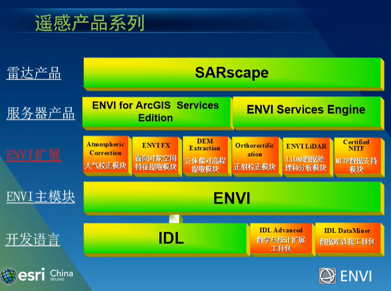
<https://www.bilibili.com/video/BV12x411j7q5/?spm_id_from=333.788.recommend_more_video.8&vd_source=e927bdbd7f7c7acf3f0e52be99902df9>

图像数据拉伸显示一般选择 Linear 2%

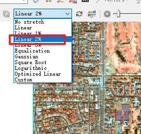

# TM 遥感影像不同波段组合用途整理

在 TM7 个波段光谱图像中，一般第 5 个波段包含的地物信息最丰富。3 个可见光波段（即第 1、2、3 波段）之间，两个中红外波段（即第 4、7 波段）之间相关性很高，表明这些波段的信息中有相当大的重复性或者冗余性。第 4、6 波段较特殊，尤其是第 4 波段与其他波段的相关性得很低，表明这个波段信息有很大的独立性。计算各种组合的熵值的结果表明，由一个可见光波段、一个中红外波段及第 4 波段组合而成的彩色合成图像一般具有最丰富的地物信息，其中又常以 4，5，3 或 4，5，1 波段的组合为最佳。第 7 波段只是在探测森林火灾、岩矿蚀变带及土壤粘土矿物类型等方面有特殊的作用。最佳波段组合选出后，要想得到最佳彩色合成图像，还必须考虑赋色问题。人眼最敏感的颜色是绿色，其次是红色、蓝色。因此，应将绿色赋予方差最大的波段。按此原则，采取 4、5、3 波段分别赋红、绿、蓝色合成的图像，色彩反差明显，层次丰富，而且各类地物的色彩显示规律与常规合成片相似，符合过去常规片的目视判读习惯。例如把 4、5 两波段的赋色对调一下，即 5、4、3 分别赋予红、绿、蓝色，则获得近似自然彩色合成图像，适合于非遥感应用专业人员使用。

**TM 影像**是指美国陆地卫星 4 ～ 5 号专题制图仪（thematic mapper）所获取的[多波段扫描影像](https://baike.baidu.com/item/%E5%A4%9A%E6%B3%A2%E6%AE%B5%E6%89%AB%E6%8F%8F%E5%BD%B1%E5%83%8F/9948181?fromModule=lemma_inlink)。

TM 影像有 7 个波段，以下是他们的波谱范围：

TM-1 为 0.45 ～ 0.52 微米，蓝光波段

TM-2 为 0.52 ～ 0.60 微米，绿光波段

TM-3 为 0.63 ～ 0.69 微米，红光波段，以上为可见光波段；

TM-4 为 0.76 ～ 0.90 微米，为近红外波段；

TM-5 为 1.55 ～ 1.75 微米，中红外波段

TM-6 为 10.40 ～ 12.50 微米，为热红外波段

TM-7 为 2.08 ～ 2.35 微米，为远红外波段；

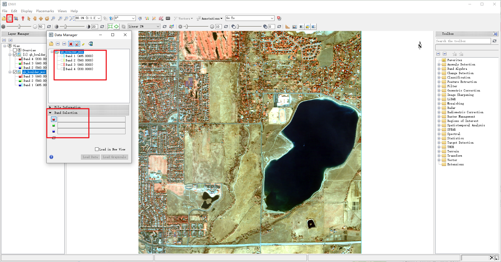

321：真彩色合成，即 3、2、1 波段分别赋予红、绿、蓝色，则获得自然彩色合成图像，图像的色彩与原地区或景物的实际色彩一致，适合于非遥感应用专业人员使用。

432：标准假彩色合成，即 4、3、2 波段分别赋予红、绿、蓝色，获得图像植被成红色，由于突出表现了植被的特征，应用十分的广泛，而被称为标准假彩色。举例：卫星遥感图像示蓝藻爆发情况

451：信息量最丰富的组合，TM 图像的光波信息具有 3 ～ 4 维结构，其物理含义相当于亮度、绿度、热度和湿度。

453：波段组合图像的色彩反差明显，层次丰富，而且各类地物的色彩显示规律与常规合成片相似，符合过去常规片的目视判读习惯。

472：采用 TM4、7、2 波段假彩色合成在 1:4 计算机插值放大技术和制作 1:5 万 TM 影像图并成 1:5 万工程地质图、塌岸发展速率的定量监测以及在单张航片上测算岩(断)层产状等方面，均有独到之处。

541：通过对（TM5、4、1）以及航空、航天多种遥感资料的解译分析可进行砂石矿遥感调查，初步解译查明调查区第四系地貌。即 5、4、3 分别赋予红、绿、蓝色，则获得近似自然彩色合成图像，适合于非遥感应用专业人员使用。

543：波段组合配以红、绿、蓝三种颜色生成假彩色合成图像，不仅类似于自然色，较为符合人们的视觉习惯，而且由于信息量丰富，能充分显示各种地物影像特征的差别，便于训练场地的选取，可以保证训练场地的准确性；对于计算机自动识别分类，采用主成分分析（K-L 变换）进行数据压缩，形成三个组分的图像数据，用于自动识别分类。

741：波段组合图像具有兼容中红外、近红外及可见光波段信息的优势，图面色彩丰富，层次感好，具有极为丰富的地质信息和地表环境信息；而且清晰度高，干扰信息少，地质可解译程度高，各种构造形迹显示清楚，不同类型的岩石区边界清晰，岩石地层单元的边界、特殊岩性的展布以及火山机构也显示清楚。

742：TM7、4、2 假彩色合成片进行解译，能解译出成矿区线性构造，环形影像,并在总结了遥感影像特征及成矿模式的基础上，对全区进厅成矿预测，为该区优选找矿靶区提供遥感依据。

743：TM7 波段对温度变化敏感，TM4、TM3 波段则分别属于红外光、红光区，能反映植被的最佳波段，并有减少烟雾影响的功能；同时 TM7、4、3（分别赋予红、绿、蓝色）的彩色合成图的色调接近自然彩色，故可通过 TM743 彩色合成图的分析来指挥林火蔓延与控制和灾后林木的恢复状况。

754：波段合成的标准假彩色图像中的蓝色、深蓝色等不同层次的颜色得以区别，从而可用作分析湖泊水位变化的地理规律。

**NASA 的 LANDSAT 卫星的主要波段**

| 波段号 | 波长(μm)  | 波长     | 性能和应用             |
| ------ | --------- | -------- | ---------------------- |
| 1      | 0.45~0.52 | 可见蓝光 | 对水有最大的穿透       |
| 2      | 0.52~0.60 | 可见绿光 | 对测量植物生活力较适用 |
| 3      | 0.63~0.69 | 可见红光 | 植被鉴定               |
| 4      | 0.76~0.90 | 近红外光 | 生物团和海岸线测量     |
| 5      | 1.55~1.75 | 中红外光 | 植被和土壤含水量       |
| 6      | 10.4~12.5 | 热红外光 | 土壤温度、热量测绘     |
| 7      | 2.08~2.35 | 红红外光 | 矿物测绘               |

# 透视浏览

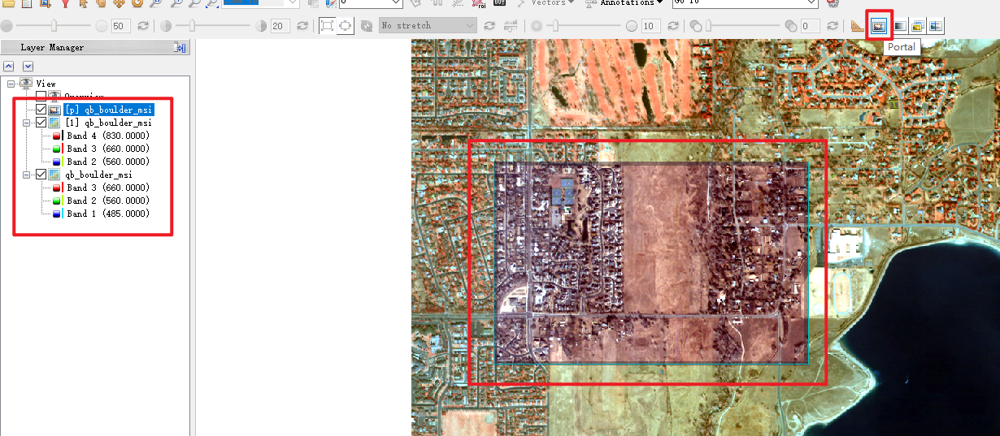

区域范围内会显示下一个图层

# dn 值查看

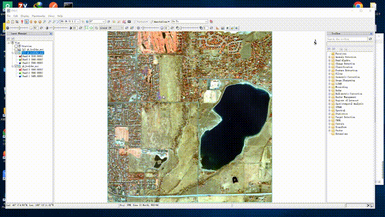

DN 值（Digital Number ）是遥感影像像元亮度值，记录的地物的灰度值。无单位，是一个整数值，值大小与传感器的辐射分辨率、地物发射率、大气透过率和散射率等有关。

# 窗口链接

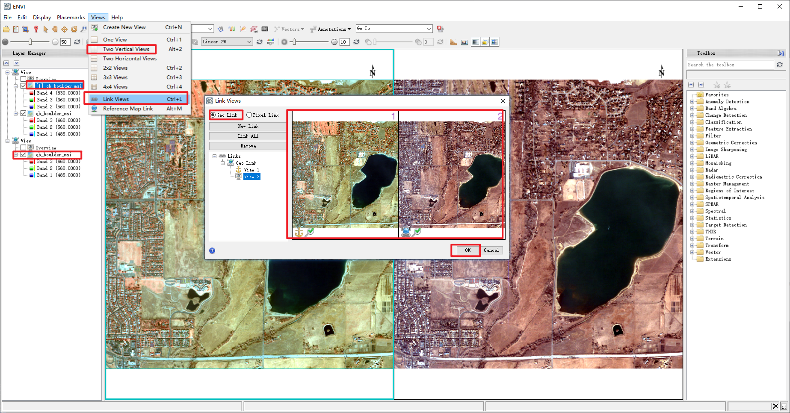

可以通过这种方式进行数据配准情况是否正确或不同数据源之间对比查看

# 保存数据

# ENVI classic 基本使用

三窗口显示 无需等待金字塔文件建立 可快速加载

## 窗口链接

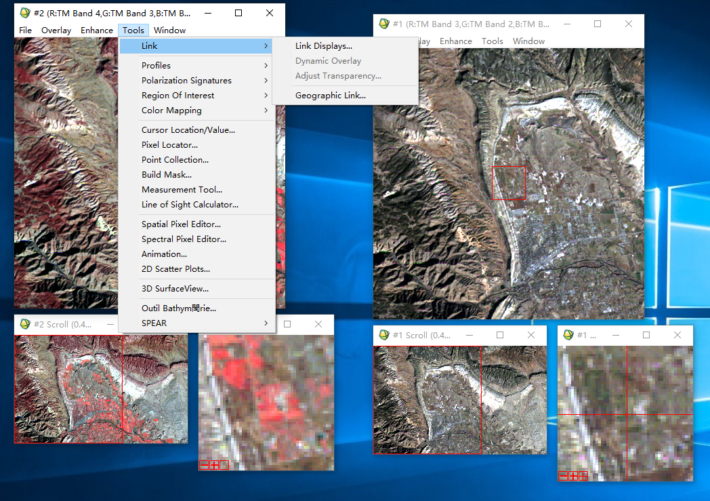

链接后鼠标在红框外点击，可显示链接窗口数据进行对比

断开窗口链接后，左键双击可查看像素值

## 图像增强

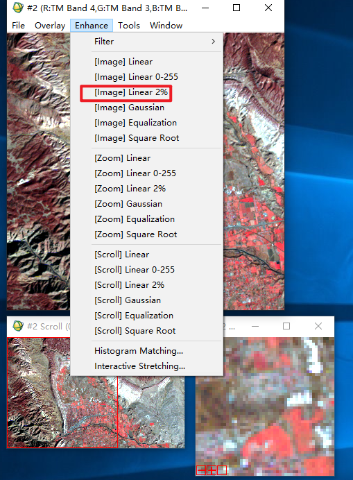

基于三个窗口进行图像增强，多使用基于主窗口 image

## 图像保存

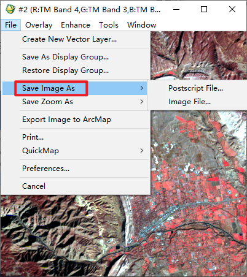

可以保存成当前显示样式

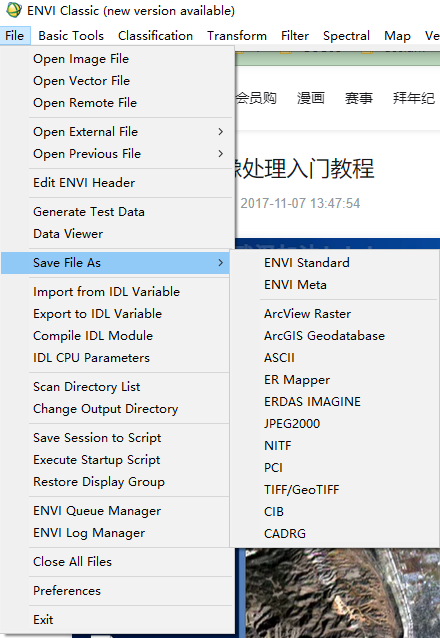

原始图像保存需要在工具栏中的那种方式进行保存

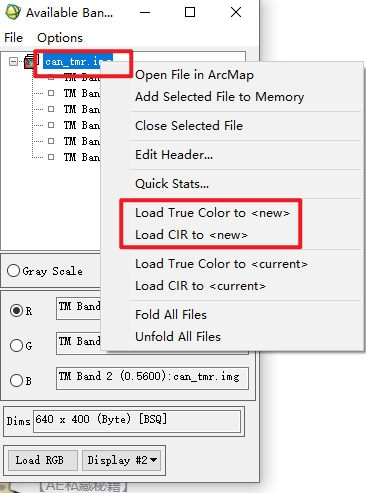

快速打开真彩色或标准假彩色方式
