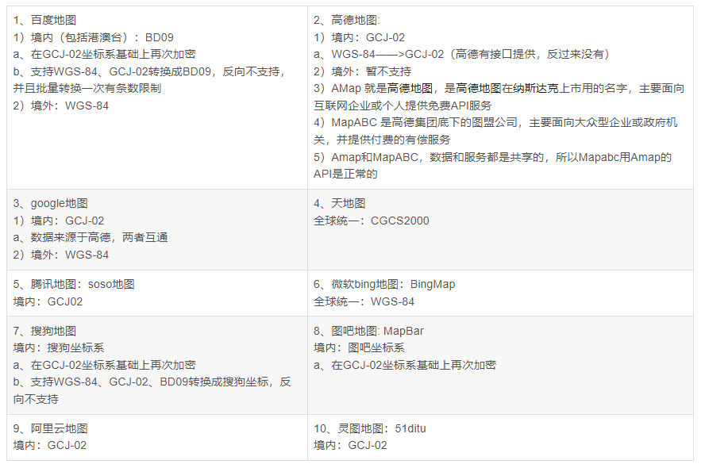

# 地理坐标系
说起地图总绕不开一个词：经纬度，通常用经纬度来表示地图上的一个点。事实上经纬度总是相对于一个地理坐标系而言的，对面向瓦片地图开发的技术人员而言，有必要对此有较为深入的了解。 首先明确：地理坐标系是针对地球在数学意义上的旋转椭球面定义的坐标系，以期通过经纬度实现对地球表面任一点的坐标定义。因此，经纬度表述椭球面的三维坐标（尽管它只有两个坐标值）。 地球的自然表面是一个由高山、深谷等构成的极不规则的曲面。陆地最高点珠穆朗玛峰高8844.43米，海洋最深处马里亚纳海沟深-11034米，两点高程差将近20000米。这样复杂的曲面在数学上无法表示，是不可以作为地图制图的基准面的。 为了寻求一个合理的基准面，前辈们经过推算发现：虽然地表是一个极不规则的曲面，但对整个地球而言它的形状很接近一个扁率很小的椭圆绕短轴旋转而成的椭球体。这个旋转椭球体是一个可基于椭圆长、短半轴，由简单数学公式表示的曲面，很适合作为地图投影、制图的基准面。 地理坐标系的核心实际上就是如何在数学上表达这样一个椭球体。
## 瓦片地图的地理坐标系
对于国外开发人员，面向瓦片地图说起起地理坐标系，情况会比较简单：通常就是WGS-84。国外瓦片地图，如：OpenStreetMap、ArcGIS Online、MapQuest、谷歌地球、谷歌地图（国内的不算）等经纬度都基于WGS84地理坐标系。 对国内的开发人员而言，情况就比较悲催了。由于国内某些特殊要求，我们不得不额外面对：GCJ02、BD09这两个东东（都不敢说是地理坐标系）。下面我们逐一介绍WGS84、GCJ02、BD09及其他坐标系。
### WGS84
WGS84与GPS相伴相生，WGS84给出地球椭球的定义： 长半轴:6378137扁率:1:298.257223563由GPS测量设备给出的经纬度都是基于WGS84地理坐标系，可直接叠加到基于WGS84坐标系的瓦片地图，如国外的OpenStreetMap、ArcGIS Online、MapQuest、谷歌地球等、国内的天地图。
### GCJ02
GCJ是国测局的拼音首字母。GCJ02坐标系（俗称：火星坐标系）严格意义上来说不是一种地理坐标系，而是在WGS84坐标系上人为随机加偏的坐标系，国内出版的各种地图系统(包括电子形式)，必须至少采用GCJ-02对地理位置进行首次加密。因此，国内瓦片地图，如：高德地图、腾讯地图、超图、360地图等都是基于GCJ02坐标系。
### BD09
百度地图独有坐标系，是在GCJ02上二次加偏的坐标系。 
### 未知坐标系
国内一些瓦片地图，如：搜狗地图和e都市都使用自家独有坐标系。由于应用范围不广，归类于未知坐标系，不做讨论。

**国内地图所采用的坐标系简介** 

## EPSG    <https://epsg.io/>

WKID与EPSG 

WKID即Well Known ID，众所周知的ID号的意思。EPSG是管理这些ID号的一个组织，网站是epsg.io 通常来说，一个GIS里的坐标系统，必须有一个WKID，某些特别的除外，下面会讲。例如，WKID=4326，即WGS84这个地理坐标系统的ID。 地理坐标系统和投影坐标系统均使用这套定义，但是不会重复，也没有规律说哪一段数字是地理坐标系统，哪一段是投影坐标系统。幸运的是，我们并不需要完全记完，网上这个WKID大全列表很容易找到，而且只需记住项目中用的、以及常见的即可。
常见EPSG: 
Ø EPSG4326 WGS84 美国GPS使用的一个全球地理坐标系统
Ø EPSG4490 CGCS2000 中国国家2000地理坐标系统
Ø EPSG3857 Web Mercator投影

ITRF 它是一个地心参考框架，由空间大地测量观测站的坐标和运动速度来定义，是[国际地球自转服务](https://baike.baidu.com/item/%E5%9B%BD%E9%99%85%E5%9C%B0%E7%90%83%E8%87%AA%E8%BD%AC%E6%9C%8D%E5%8A%A1/2103539?fromModule=lemma_inlink)的地面参考框架。 

坐标框架 坐标系包含的关系。
坐标系包括坐标原点和*坐标框架*,选择坐标原点就是选择参考系。选择*坐标框架*就是选择测量单位,两者都离不开观察者的参与。 

## 坐标转换

坐标系转换中主要是GCS转GCS，GCS转PCS就是投影，PCS转PCS是重投影。
GCS转GCS这属于空间解析几何里的空间直角坐标系的移动、转换问题，还有个更高级的说法：仿射变换。 欲将一个空间直角坐标系仿射到另一个坐标系的转换，需要进行平移、旋转、缩放三步，可以无序进行。
平移、旋转又有三个方向上的量，即平移向量=（dx,dy,dz）和旋转角度（A,B,C），加上缩放比例s，完成一个不同的坐标系转换（比如WGS84转西安80），就需要7参数。
地心坐标系是唯一的，即原点唯一，就说明平移向量是0向量，如果缩放比例是1，那么旋转角度（A,B,C）就是唯一的仿射参数，即3参数。
一般而言比较严密的是用七参数法（包括布尔莎模型，一步法模  型，海尔曼特等），即X平移，Y平移，Z平移，X旋转，Y旋转，Z  旋转，尺度变化K。  要求得七参数就需要在一个地区需要3个以上的已知点，如果区域范围不大，最远点间的距离不大于30Km(经验值)，这可以用三参数（莫洛登斯基模型），即X平移，Y平移，Z平移，而将X旋转，Y旋转，Z旋转，尺度变化K视为0，所以三参数只是七参数的一种特例。  在一个椭球的不同坐标系中转换可能会用到平面转换，现阶段一般分为四参数和平面网格拟合两种方法，以四参数法在国内用的较多，举个例子，在深圳既有北京54坐标又有深圳坐标，在这两种坐标之间转换就用到四参数，计算四参数需要两个已知点。

## 转换方式

**常用的转换方式（针对平面转换）**

**1.A平面坐标系——B平面坐标系（后面会用到）**

此时，A坐标系（转换前）称为源坐标系，B坐标系（转换后）称为目标坐标系。

涉及的常见转换参数：

**二参数：**

包含X平移，Y平移

**四参数：**

包含X平移，Y平移，旋转，尺度（缩放）

**七参数**，最常用的叫**布尔莎七参数**：

包含X平移，Y平移，Z平移，X旋转，Y旋转，Z旋转，尺度（缩放）

**2.相同椭球下，大地坐标系BL——平面坐标系XY（正算）**

通过设置椭球参数+投影方式+中央子午线

**3.相同椭球下，平面坐标系XY——大地坐标系BL（反算）**

同样通过设置椭球参数+投影方式+中央子午线，进行反推

[四参数，七参数相关概念](https://blog.csdn.net/DiXinWang/article/details/104465320?utm_medium=distribute.pc_relevant.none-task-blog-2~default~baidujs_baidulandingword~default-0-104465320-blog-111518206.pc_relevant_multi_platform_whitelistv4&spm=1001.2101.3001.4242.1&utm_relevant_index=3)

[参考链接](https://zhuanlan.zhihu.com/p/465773730)

[概念参考](https://blog.csdn.net/qq_24172609/category_10678978.html)

## 3度带6度带区别，中央经线及带号计算(投影坐标)

我国基本比例尺地形图除1：100万采用兰勃特投影（lambert）外，其他均采用高斯-克吕格投影。为减少投影变形，高斯-克吕格投影分为3度带或6度带投影。 

按国家规定我国1:2.5-1:50万地形图均采用6度分带；1:1万及更大比例尺地形图采用3度分带，以保证必要的精度。 

**6度分带投影：**即经差为6度，从零度子午线开始，自西向东每隔6度为一个投影带，全球共分60个带，用1，2，3，4，5，......表示。即东经0\~6度为第一度带，其中央经线的经度为东经3度；东经6~12度为第二带，其中央经线的经度为东经9度。 

**3度分带投影：**即经差为3度，从东经1.5度开始，自西向东每隔3度为一个投影带，全球共分120个带，用1，2，3，4，5，......表示。即东经1.5\~4.5度为第一度带，其中央经线的经度为东经3度；东经4.5\~7.5度为第二带，其中央经线的经度为东经6度；东经7.5~10.5度为第三带，其中央经线的经度为东经9度。**（这样分带的方法使6度带的中央经线均为3度带的中央经线。）** 

中央经线计算方法
当地中央子午线决定了当地的直角坐标系统，首先确定您的直角坐标系统是3度带还是6度带投影，然后再根据如下公式推算。

6度带：带号N=round[(L+3)/6]，即对(L+3)/6的值四舍五入取整数，L为当地经度；则中央子午线经度L0=6 × N-3。

3度带：带号N=round(L/3)，即对(L/3)的值四舍五入取整数，L为当地经度；则中央子午线经度L0=3 × N。自己的理解：

1.搜要转换的城市的经纬度

2.(经度也就是x/3)*3          (括号里取整)

3.来一个实例，以免时间长了忘记，以扬州坐标为例 x:119   y:32

119/3=39.66666

40*3=120

# 卫星相关
## 卫星的星下点
指的是卫星的瞬时位置和地球中心的连线与地球表面的交点，用地理经、纬度表示。当卫星在星下点进行摄像时，影像的几何畸变最小。星下点是卫星运动在地球表面的投影，其轨迹是一段时间内卫星在地面投影的连线。
## 几何畸变
指遥感成像过程中，受多种因素的综合影响，原始图像上地物的几何位置、形状、大小、尺寸、方位等特征与其对应的地面地物的特征往往是不一致的，这种不一致就是几何变形，也称几何畸变 。
## 星下点轨迹
对于位于星下点处的地面观察者来说，卫星就在天顶。卫星经过升交点时，星下点在赤道上。将星下点轨迹画在地图上便是星下点轨迹图。在星下点轨迹图上可以看出某一个时间卫星在某地的天顶附近。  在墨卡托投影地图上，近地卫星的星下点轨迹像一条正弦曲线。地球同步倾斜轨道卫星的星下点轨迹是一条8字形的封闭曲线。地球同步轨道卫星的星下点轨迹是一个点。不考虑轨道摄动，星下点轨迹所能达到的最南和最北的地理纬度数值等于轨道倾角值。 由于地球采用参考椭球体，这两种星下点将在同一个经圈上，其纬度相差也很小(几个角分【角分，又称弧分，是量度角度的单位，符号为 ′，在不会引起混淆时，可简称作分】)。在轨道设计中，常用星下点轨迹图来表示卫星飞经的区域。  例如，一颗轨道高度为13892km，轨道倾角60°，初始位置（0°E，0°N）的卫星24小时的星下点轨迹如图所示。   人造卫星的运动轨道取决于卫星的任务要求，区分为[低轨道](https://baike.baidu.com/item/%E4%BD%8E%E8%BD%A8%E9%81%93)、中高轨道、[地球同步轨道](https://baike.baidu.com/item/%E5%9C%B0%E7%90%83%E5%90%8C%E6%AD%A5%E8%BD%A8%E9%81%93)、[地球静止轨道](https://baike.baidu.com/item/%E5%9C%B0%E7%90%83%E9%9D%99%E6%AD%A2%E8%BD%A8%E9%81%93)、[太阳同步轨道](https://baike.baidu.com/item/%E5%A4%AA%E9%98%B3%E5%90%8C%E6%AD%A5%E8%BD%A8%E9%81%93)，大[椭圆轨道](https://baike.baidu.com/item/%E6%A4%AD%E5%9C%86%E8%BD%A8%E9%81%93)和[极轨道](https://baike.baidu.com/item/%E6%9E%81%E8%BD%A8%E9%81%93)。 
## 人造地球卫星轨道
从卫星起飞到卫星在轨道上运行工作，一直到卫星的寿命结束，卫星质心的运行轨迹，我们称之为人造地球卫星轨道。很明显，人造地球卫星轨道分为如下三个部分： 1、发射轨道：卫星从起飞到入轨，卫星质心的运动轨迹。我们称之为发射轨道。 2、入轨点：卫星进入运行轨道称为入轨，进入运行轨道的初始点，我们称之为入轨点。 3、运行轨道：卫星入轨后开始运行工作，一直到工作寿命结束，卫星质心的运动轨迹我们称之为运行轨道。
## 分类
如图，卫星并不是按正圆的轨迹运行。卫星轨道近似椭圆型的运行轨道。我们称它为开普勒椭圆轨道。 
### 按卫星运行的高度（人造地球卫星轨道离地面的高度）
根据卫星运行的高度，卫星轨道分为： 1、低轨道：卫星飞行高度小于1000公里； 2、中高轨道：卫星飞行高度在1000公里到20000公里之间； 3、高轨道：卫星飞行高度大于20000公里。
### 按卫星运行轨迹的偏心率(轨道形状)
根据卫星运行轨迹的偏心率，卫星轨道分为： 1、圆轨道：偏心率等于0； 2、近圆轨道：偏心率小于0.1； 3、椭圆轨道：偏心率大于0.1，而小于1.
### 按卫星运行轨道的倾角
根据卫星运行轨迹的倾角，卫星轨道分为： 1、赤道轨道：倾角等于0或180；（在赤道上空绕地球飞行） 2、极地轨道：倾角等于90；（经过地球南北极上空） 3、倾斜轨道：倾角不等于90、0或180（顺行轨道（与地球自转方向相同）/逆行轨道（与地球自转方向相反）） 还有，如果卫星轨道的周期与地球自转周期相同，卫星运行的方向也和地球自转的方向一致。这样的卫星轨道我们称它为**地球同步轨道**。如果该轨道的倾角为零，又是圆轨道时，我们就可以称之为**地球静止轨道**了。 如果卫星运行的方向和地球公转的方向一致，旋转的角速度也等于地球公转的角速度，这样的卫星轨道我们称之为**太阳同步轨道**。
#### 顺行轨道
顺行轨道的特点是轨道倾角即轨道平面与地球赤道平面的夹角小于90度。在这种轨道上运行的卫星，绝大多数离地面较近，高度仅为数百千米，故又将其称为近地轨道。中国地处北半球，要把卫星送入这种轨道，运载火箭要朝东南方向发射，这样能够利用地球自西向东自转的部分速度，从而可以节约火箭的能量。[地球自转速度](https://baike.baidu.com/item/%E5%9C%B0%E7%90%83%E8%87%AA%E8%BD%AC%E9%80%9F%E5%BA%A6)可以通过赤道自转速度、发射方位角和发射点[地理纬度](https://baike.baidu.com/item/%E5%9C%B0%E7%90%86%E7%BA%AC%E5%BA%A6)计算出来。不难想象，在赤道上朝着正东方向发射卫星，可利用的速度最大，纬度越高能用的速度越小。
#### 逆行轨道
[逆行轨道](https://baike.baidu.com/item/%E9%80%86%E8%A1%8C%E8%BD%A8%E9%81%93)的特征是轨道倾角大于90度。欲把卫星送入这种轨道运行，运载火箭需要朝西南方向发射。不仅无法利用地球自转的部分速度，而且还要付出额外能量克服地球自转。因此，除了太阳同步轨道外，一般都不利用这类轨道。
#### 赤道轨道
[赤道](https://baike.baidu.com/item/%E8%B5%A4%E9%81%93/106883#viewPageContent)轨道的特点是轨道倾角为0度，卫星在赤道上空运行。这种轨道有无数条，但其中的一条地球静止轨道具有特殊的重要地位。
#### 极轨道（polar orbit）
倾角为90°的人造地球卫星轨道。又称极地轨道。在极轨道上运行的卫星，每一圈内都可以经过任何纬度和南北两极的上空。由于卫星在任何位置上都可以覆盖一定的区域 ，因此，为覆盖南北极，轨道倾角并不需要严格的90°，只需在90°附近就行。 在工程上常把倾角在90°左右，但仍能覆盖全球的轨道也称为极轨道。近地卫星导航系统（如美国海军导航卫星系统）为提供全球的导航服务采用极轨道。许多地球资源卫星、气象卫星以及一些军事侦察卫星采用太阳同步轨道，它们的倾角与90°只相差几度，所以也可以称其为极轨道。还有一些研究极区物理的科学卫星也采用极轨道。
### 地球同步轨道
卫星在顺行轨道上绕地球运行时，其运行周期（绕地球一圈的时间）与地球的自转周期相同。这种卫星轨道叫地球同步轨道。
### 地球静止卫星轨道
如果地球同步轨道卫星正好在地球赤道上空离地面35786千米的轨道上绕地球运行，由于它绕地球运行的角速度与地球自转的角速度相同，运行周期和地球的自转周期相同，速度约为每秒3.07千米，从地面上看去它好像是静止的，这种卫星轨道叫地球静止卫星轨道。地球静止卫星轨道是地球同步轨道的特例，它只有一条。 
### 太阳同步轨道
太阳同步轨道。由于地球扁率（地球不是圆球形，而是在赤道部分隆起），卫星轨道平面绕地球自转轴旋转。如果卫星轨道平面绕地球自转轴的旋转方向和角速度与地球绕太阳公转的方向和平均角速度相同，则这种卫星轨道叫太阳同步轨道。
### 停泊轨道
**概述** 停泊轨道(parking orbit) 航天器为了转移到另一条轨道去而暂时停留的椭圆（圆）轨道，又称驻留轨道。 **分类** 停泊轨道按中心体不同分为地球停泊轨道、月球停泊轨道和行星停泊轨道。、 地球停泊轨道是发射月球探测器、登月载人飞船、[空间探测器](https://baike.baidu.com/item/%E7%A9%BA%E9%97%B4%E6%8E%A2%E6%B5%8B%E5%99%A8/2197594)和离地球较远的人造地球卫星（如静止卫星）的一个阶段，用于选择进入过渡轨道的入轨点，以弥补地面发射场地理位置固定的缺点，满足过渡轨道的要求。 月球和行星停泊轨道用于选择进入轨道的起点，以保证航天器降落在天体表面的指定地区。 对于返回地球的航天器，同样可以选择返回轨道的起点，以保证航天器能够准确进入再入走廊。此外，安排停泊轨道还为飞往新轨道之前提供最后全面检查航天器各系统可靠性的机会。
### 回归轨道(recursive orbit)
星下点轨迹周期性出现重叠现象的人造地球卫星轨道。重叠出现的周期称为回归周期。工程中回归周期的大小根据卫星的使命确定。 同一个回归周期对应有很多条轨道。如回归周期为一天时，运行的轨道周期可近似为24小时、8小时……，从中可以选出合适的运行周期以满足卫星使命的要求。在回归轨道上运行的卫星，每经过一个回归周期，卫星重新依次经过各地上空。这样可以对卫星覆盖的区域进行动态监视，借以发现这一段时间内目标的变化。  在轨道设计中，回归轨道仅限制轨道运行周期，若再选择其他参数，可设计出太阳同步回归轨道。这样的轨道兼有太阳同步轨道和回归轨道的特性。选择合适的发射时间，可使卫星在经过某些地区时这些地区有较好的光照条件。以获取地面图像为目的的卫星，像侦察卫星、气象卫星、地球资源卫星大都选择这种轨道。 回归轨道要求轨道周期在较长时间内保持不变，因此，卫星必须具备轨道修正能力，以便能够克服入轨时的倾角偏差、周期偏差和补偿大气阻力引起的周期衰减。
## 轨道摄动
实际上地球并不是完全的正圆形，而且除了作用于卫星上的地心引力外，还有太阳和月球的引力、太阳辐射压力等外力。这些外力会使卫星的实际运行轨道偏离开普勒轨道。这种偏离我们称之为轨道摄动。引起卫星轨道摄动的外力，我们称之为摄动力。 由于摄动力的存在，即使是静止卫星也不可能是绝对静止的，这就需要靠地面的测控站遥控卫星上的燃气喷射系统，调整卫星的定点确保卫星按轨道运行。
## 宇宙速度
第一宇宙速度又叫环绕速度：v1=7.9Km/s，它是卫星环绕地球做[匀速圆周运动](https://baike.baidu.com/item/%E5%8C%80%E9%80%9F%E5%9C%86%E5%91%A8%E8%BF%90%E5%8A%A8/1532545)的最大速度，也是在地球表面上发射卫星的最小发射速度。 第二宇宙速度又叫脱离速度：V2=11.2km/s，它是卫星脱离地球引力束缚而不再绕地球运动的最小发射速度。 第三宇宙速度又叫逃逸速度：v3=16.7Km/s，它是指卫星能脱离太阳束缚，飞到太阳系以外空间的最小发射速度
## 运行定律
人造地球卫星绕地球运行遵循开普勒行星运动三定律。 （1）卫星轨道为一椭圆，地球在椭圆的一个焦点上。其长轴的两个端点是卫星离地球最近和最远的点，分别叫做远地点和近地点。 （2）人造地球卫星在椭圆轨道上绕地球运行时，其运行速度是变化的，在远地点时最低，在近地点时最高。速度的变化服从面积守恒规律，即卫星的向径（卫星至地球的连线）在相同的时间内扫过的面积相等。 （3）人造地球卫星在椭圆轨道上绕地球运行，其运行周期取决于轨道的半长轴（与半长轴的二分之三次方成正比）。不管轨道形状如何，只要半长轴相同，它们就有相同的运行周期。人造地球卫星轨道的形状和大小由它的半长轴和半短轴的数值来决定。其半长轴和半短轴的数值越大，轨道越高；半长轴与半短轴相差越多，轨道的椭圆形越扁长；并长轴与半短轴相等则为圆形轨道。 
## 名词
### 历元
历法中标记时间的开始 ，在天文学中式一些天文变数作为参考的时刻点 ，例如天球座标或[天体](https://baike.baidu.com/item/%E5%A4%A9%E4%BD%93/749823)的椭圆[轨道要素](https://baike.baidu.com/item/%E8%BD%A8%E9%81%93%E8%A6%81%E7%B4%A0)，因为这些会受到[摄动](https://baike.baidu.com/item/%E6%91%84%E5%8A%A8/4777855)而随着时间变化。 
### 天球
是研究[天体](https://baike.baidu.com/item/%E5%A4%A9%E4%BD%93)的位置和运动，而引进的一个假想圆球。 一个与地球同球心，并有相同的自转轴，半径无限大的球。天空中所有的物体都可以当成投影在天球上的物件。地球的赤道和地理极点投射到天球上，就是天球[赤道](https://baike.baidu.com/item/%E8%B5%A4%E9%81%93/106883)和天极。天球是位置天文学上很实用的工具。 
### 轨道根数
（或称**轨道要素**或**轨道参数**）是描述在[牛顿运动定律](https://baike.baidu.com/item/%E7%89%9B%E9%A1%BF%E8%BF%90%E5%8A%A8%E5%AE%9A%E5%BE%8B)和[牛顿万有引力定律](https://baike.baidu.com/item/%E7%89%9B%E9%A1%BF%E4%B8%87%E6%9C%89%E5%BC%95%E5%8A%9B%E5%AE%9A%E5%BE%8B)的作用下的[天体](https://baike.baidu.com/item/%E5%A4%A9%E4%BD%93)或[航天器](https://baike.baidu.com/item/%E8%88%AA%E5%A4%A9%E5%99%A8)，在其[开普勒轨道](https://baike.baidu.com/item/%E5%BC%80%E6%99%AE%E5%8B%92%E8%BD%A8%E9%81%93)上运动时，确定其[轨道](https://baike.baidu.com/item/%E8%BD%A8%E9%81%93/77741)所必要的六个[参数](https://baike.baidu.com/item/%E5%8F%82%E6%95%B0)。由于运动的方式有许多种的参数表示法，依照选定的测量装置不同，对相同的轨道，有几种不同的方式来定义轨道根数。  [https://www.so.studiodahu.com/wiki/%E8%BB%8C%E9%81%93%E6%A0%B9%E6%95%B8](https://www.so.studiodahu.com/wiki/%E8%BB%8C%E9%81%93%E6%A0%B9%E6%95%B8)
### 开普勒的元素
传统上使用的轨道根数，是在[开普勒](https://baike.baidu.com/item/%E5%BC%80%E6%99%AE%E5%8B%92)和他的[开普勒定律](https://baike.baidu.com/item/%E5%BC%80%E6%99%AE%E5%8B%92%E5%AE%9A%E5%BE%8B)之后发展出来的，称为**开普勒元素**，主要有六个参数：

- [轨道倾角](https://baike.baidu.com/item/%E8%BD%A8%E9%81%93%E5%80%BE%E8%A7%92)(i)行星轨道面对黄道面的倾角；在升交点处从黄道面逆时针方向量到行星轨道面的角度。 
- 升交点黄经(Ω)行星轨道升交点的黄道经度。 
- [离心率](https://baike.baidu.com/item/%E7%A6%BB%E5%BF%83%E7%8E%87)(e)为椭圆扁平程度的一种量度，定义是椭圆两焦点间的距离与长轴长度的比值。 就是e=c/a。 
- 近日点辐角(ω)从升交点沿行星运动轨道逆时针量到近日点的角度。 
- [半长轴](https://baike.baidu.com/item/%E5%8D%8A%E9%95%BF%E8%BD%B4)(a)椭圆轨道长轴的一半，有时可视作平均轨道半径。 
- 在指定[历元](https://baike.baidu.com/item/%E5%8E%86%E5%85%83)的[平近点角](https://baike.baidu.com/item/%E5%B9%B3%E8%BF%91%E7%82%B9%E8%A7%92)(Mo)（或是近日点通过时间(To)）卫星对应于t0时刻的平近点角。 

使用以上的轨道根数，可找出天体按开普勒轨道（即[二体问题](https://baike.baidu.com/item/%E4%BA%8C%E4%BD%93%E9%97%AE%E9%A2%98)中的轨道）运行的位置，但在实际问题中，若天体所受的其他作用力不可忽略，便需加入这些[摄动](https://baike.baidu.com/item/%E6%91%84%E5%8A%A8)项来修正其位置。  注意被列出的最后一项是**指定历元的平近点角**，**历元**单纯的只是被指定的时刻，因为卫星的平近点角经常会改变，因此我们必须指出测量出这个角度的时刻。如果我们选择不同的时刻做测量，我们将得到不同数值的角度。进一步，当应用在真实的卫星上时，有许多种的力量作用于卫星上，都会导致轨道元素的微量改变。因为所有的元素都可能改变，历元就显得格外重要了。  轨道根数的其他表示法： 可以用[平近点角](https://baike.baidu.com/item/%E5%B9%B3%E8%BF%91%E7%82%B9%E8%A7%92){M}、[平黄经](https://baike.baidu.com/item/%E5%B9%B3%E9%BB%84%E7%BB%8F)、[真近点角](https://baike.baidu.com/item/%E7%9C%9F%E8%BF%91%E7%82%B9%E8%A7%92)或罕见的以[偏近点角](https://baike.baidu.com/item/%E5%81%8F%E8%BF%91%E7%82%B9%E8%A7%92)取代指定[历元](https://baike.baidu.com/item/%E5%8E%86%E5%85%83)的[平近点角](https://baike.baidu.com/item/%E5%B9%B3%E8%BF%91%E7%82%B9%E8%A7%92)（有时暦元本身就是一个轨道根数）。其他的轨道根数，像是[轨道周期](https://baike.baidu.com/item/%E8%BD%A8%E9%81%93%E5%91%A8%E6%9C%9F)可以从开普勒的元素计算出来，在这种情况下，轨道周期会取代轨道半长径成为一个轨道元素。在特定的历元下，可以只使用五个轨道根数来描述轨道，但这只有在平近点角的数值为0时的特殊状况下才能适用（明确的说，第六个根数是已知的，因为我们要求他必须是0，这样才能在记录下暦元和五个轨道根数来指定轨道）。 
### 近地点幅角
指轨道[近地点](https://baike.baidu.com/item/%E8%BF%91%E5%9C%B0%E7%82%B9/1155542)与[升交点](https://baike.baidu.com/item/%E5%8D%87%E4%BA%A4%E7%82%B9/7691256)之间对地心的张角。沿卫星运动方向从升交点量测到近地点，取值范围为0°-360°。
### 卫星星历
[http://t.zoukankan.com/rainbow70626-p-6012162.html](http://t.zoukankan.com/rainbow70626-p-6012162.html) 又称为两行轨道数据（TLE，Two-Line Orbital Element），是用于描述太空飞行体位置和速度的表达式———两行式轨道数据系统。 
#### 格式含义
卫星星历的结构为上下两行，每行69个字符，包括0～9、A～Z(大写)、空格、点和正负号，其他字符是无意义的。 第0行，将第1行视为0行，是卫星通用名称，最长为24个字符。 第1行和第2行是标准的卫星星历格式（TLE格式），每行69个字符，包括0～9，A～Z（大写）、空格、点和正/负号，除此之外的其他字符都是无意义也无效的。
#### 例子
下面讲讲TLE(Two-Line Element)两行数据。以北斗最近的数据为例 BEIDOU 2A 1 30323U 07003A  07067.68277059  .00069181  13771-5  44016-2 0  587 2 30323 025.0330 358.9828 7594216 197.8808 102.7839 01.92847527  650  真正的数据实际上是下面2行，但是上面有一行关于空间物体其他情况的一些信息(空间物体可以是卫星，可以是末级火箭，可以是碎片。这里简单起见，就叫卫星)。头一个是卫星名称。注意这个是会变的，而且不一定准确。卫星发射后的头几个TLE数据里，往往只叫Object A, B, C... 慢慢的会搞清楚哪个是卫星，哪个是末级火箭，哪个是分离时的碎片，并且给予相应的名称。但是如果这个是其他国家的保密卫星，则这个卫星名字就纯粹是美国的猜测了，比如我们的这个北斗。有些情况下，名称这一行里还包含了一些数字，关于卫星的尺度，亮度等等。 TLE第一行数据 1 30323U 07003A  07067.68277059  .00069181  13771-5  44016-2 0  587 30323U    30323是北美防空司令部(NORAD)给出的卫星编号。U代表不保密。我们看到的都是U，否则我们就不会看到这组TLE了   07003A  国际编号，07表示2007年(2位数字表示年份在50年以后会出问题，因为1957年人类发射了第一个轨道物体)，003表示是这一年的第3次发射。A则表示是这次发射里编号为A的物体，其他还有B，C，D等等。国际编号就是2007-003A.   07067.68277059  这个表示这组轨道数据的时间点。07还是2007年，067表示第67天，也就是3月8日。 68277059表示这一天里的时刻，大约是16时22分左右。 .000069181  平均运动的对时间一阶导数除2。注意这个并不是瞬时角速度 13771-5  平均运动对时间的二阶导数除6。   44016-2    BSTAR阻力系数。这3个量都是用于轨道摄动模型里面的。其实上前2个并没有真正被采用。 0  轨道模型。他们内部有不同数字代表不同模型，但是公布的都是0，也就是采用了SGP4/SDP4轨道模型    58  表示这是关于这个空间物体的第58组TLE 7 最后一位是校验位  TLE第二行数据  2 30323 025.0330 358.9828 7594216 197.8808 102.7839 01.92847527  650 30323  NORAD卫星编号。 025.0191  轨道倾角。这个和前面讲的轨道倾角完全对应   358.9828  升交点赤经,这个和前面讲的升交点赤经也完全对应 7594216  轨道偏心率，0.7597678，表示这是一个椭圆 197.8808    近地点幅角，这个和前面讲的也一样 102.7839    平近点角。这个表示这组TLE对应的时刻时，卫星在轨道的什么位置。 01.92847527  每天环绕地球的圈数。这个的倒数就是周期。可以看出北斗目前的周期大约是12小时。 而周期和轨道的半长轴有简单的换算关系。因此TLE的关于轨道的6要素和我们前面说的6要素是完全可以互相推导的。 65  发射以来飞行的圈数 0    校验位
### 星下点位置计算
[https://www.bilibili.com/read/cv836090](https://www.bilibili.com/read/cv836090)

星下点
星下点是地心与航天器连线与地面的交点（是考虑地球自转在内的），即航天器正下方投影到地面上的点，常用**地理/地心经纬度**描述星下点位置。  

二维视角理解星下点（不考虑地球自转）
地理/地心经纬度 我们以纬度为例区分这两种经纬度  

大角为地理纬度，小角为地心纬度
**地理纬度**是我们将地球理想化为一个**完美的球体**而建立的参数，即地心与位置点的连线与赤道平面形成的角，即“线面角”，范围是［0º,90º］，即0º≤纬度≤90º。

**地心纬度**是我们将地球看作一个**略扁的椭球**而建立的参数，但基本概念和地理纬度一致。

二者能像上图那样放在同一个二维椭圆模型（或三维椭球模型）中表示，其中E是地心，MN垂直于M所在椭圆（球）的表面交椭圆（球）半长轴于点N，ME与轨道平面形成的角为地心纬度，MN与轨道平面形成的角为地理纬度。

星下点轨迹

对于大多数轨道，星下点并不是单独存在的，无数个星下点构成了“**星下点轨迹**”。  

星下点轨迹

上图的星下点轨迹像不像三角函数图像呢？  

三角函数sin、cos图像部分
计算星下点位置参数，我们需要用到**三角函数**和**反三角函数**

三角函数
常见的三角函数是

f(x)＝tanx（x≠kπ＋π/2，k∈z）  

正切函数图像
f(x)＝sinx

f(x)＝cosx

分别是正切、正弦、余弦。当然，三角函数还有“余切cot（其函数值分别是对应的正切函数值的倒数）、正割sec（函数值同理是余弦函数值的倒数）、余割csc（正弦函数值的倒数）以及不常见的正矢、余矢、半正矢、半余矢、外正割、外余割”，这里我们用不到。

通过单位圆（即圆心在二维坐标原点上且半径为1的圆）引入三角函数  

单位圆与三角函数
在单位圆中，我们这样定义“角”：从x轴正方向开始旋转，逆时针为正角、顺时针为负角，x轴正方向为角的始边，旋转角度不受圆所谓的360º限制，只要一直转下去，角就无穷大，但我们可以“大角化小角”。在角的加减中也一样，逆时针角变大、顺时针角变小。

在上图中，设∝是一个任意角，OP为角的终边，设终边与单位圆（半径为1）交点P坐标为(x,y)

则sin∝＝y/R＝y

cos∝＝x/R＝x

tan∝＝y/x

三角函数“大角化小”、“互补互余转换”、“终边关于坐标轴对称转换”等可以通过诱导公式进行，在这里就不深入介绍了。  

正弦余弦函数基本性质
反三角函数
反三角函数是三角函数的反函数

反函数

我们假设原函数是f(x)，它的反函数是f'(x')

反函数的定义域（即反函数自变量x'的取值范围）是原函数的值域（即原函数的函数值或称因变量的取值范围f(x)），同理，反函数的值域（f'(x')）是原函数的定义域（x）

最经典的函数与反函数就是对数函数与指数函数了。

对于函数与反函数的图像变换，最简单的方法就是把原函数图像沿直线y＝x翻折，即可得到反函数图像，因为原函数与反函数的图像是关于直线y＝x对称的，在这里就不证明了。

对应常见的三角函数，常见的反三角函数分别是

f(x)＝arctanx

f(x)＝arcsinx（x∈[-1,1]）

f(x)＝arccosx（x∈[-1,1]）  

正弦与反正弦的函数图像
说白了三角函数就是应对“角知值未知”的情况，而反三角函数是应对“值知角未知”的情况。

不是在说星下点吗，怎么扯到数学上了2333

以上的概念引入就是为了下图这一计算星下点位置的公式

（注：公式中“tg”即正切“tan”的别称，“arctg”即反正切，“i”我们在第一期科普中已经介绍，是“轨道倾角”，“升节点”即“升交点”，第一期也已介绍，顺行轨道为“＋”，逆行轨道为“－”）  

计算星下点地心经纬度
在实际情况的星下点轨迹计算中要比理想状态下复杂得多，要考虑到轨道摄动（涉及许多摄动力，如中心体非球形摄动力、低轨道空气阻力等）等因素，由于这些因素星下点轨迹也在实时变化，对轨道及星下点轨迹要求高的卫星（如区域性服务卫星）需要轨道修正来保持星下点轨迹的相对稳定。  

理想状态下，处在轨道高度为13892km、轨道倾角为60°的圆形轨道且初始位置为（0°E，0°N）的一颗卫星的星下点轨迹（24小时制）
由于地球是形状不规则的椭球以及一些实际因素，一般来说从二维世界地图上看，星下点轨迹并不是单独的一条曲线，而是许许多多的平滑曲线，不同圈数对应不同的曲线，但是在三维地球上，它们能连在一起而形成一个很长的曲线，理想状态下一定圈数形成一个循环，就像下图一样。  

出舱时段神舟七号的星下点轨迹

# GNSS名词
#### 历书(Almanac)
由导航卫星传送的资料，包括所有卫星的轨道信息、时钟修正以及大气时延参数。这些资料用于支持快速卫星捕获。历书中的轨道信息不如星历表精确，但有效时间较长（一至两年）。
#### 模糊值 (Ambiguity)
当一个接收站对经过的一颗卫星进行连续观测，为重建载波相位中包含的一个未知整周数。
#### 天线增益（Antenna gain）
输入功率相等的条件下，实际天线与理想的辐射单元在空间同一点处所产生的信号的功率密度之比。它定量地描述一个天线把输入功率集中辐射的程度。
#### **幅宽**，可以称之为像幅宽度、即卫星扫描覆盖宽度。
实际上，相同的观测夹角在不 同的轨道高度上其观测** 幅宽**是不同的。观测幅宽对于侦察卫星星座轨道高度选择的影响是今后需要的研究的问题之一。
#### 天线相位中心（Antenna phase center）
在理论上认为天线辐射的信号是以这个点为圆心,向外辐射。点就是所谓的相位中心。
#### 纬度幅角(Argument of Latitude)
真近点角与近地点幅角的和。
#### 近地点幅角 (Argument of Perigee)
在椭圆轨道的焦点上观察到的从升交点到轨道天体至焦点的最近距离处的角度或弧段,此角度是在轨道平面上沿轨道天体运动方向度量的。
#### 原子钟（Atomic Clock）
使用铯元素或铷元素制作的精准时钟，估计每一百万年仅有一秒之误差。
#### 升交点(Ascending Node)
一个物体的轨道从南至北穿过参考平面（亦即赤道平面）的点。
#### 方位(Azmuth)
由一个固定方向（如北方）与物体方向在水平方向的角距离。
#### 带通滤波器（band-pass filter）
一个允许特定频段的波通过同时屏蔽其他频段的设备。
#### 带宽(Bandwidth)
信号携带信息能力的量度，用该信号的谱宽度（频域）表示，单位为赫兹。
#### 基带（Baseband）
信源（信息源，也称发射端）发出的没有经过调制（进行频谱搬移和变换）的原始电信号所固有的频带（频率带宽），称为基本频带，简称基带。
#### 基线(Baseline)
当两个观测点同步接收导航卫星资料，并用差分方法进行数据处理时，这两个点之间的三维向量距离叫做基线。
#### 差拍(Beat Frequency)
两个频率的信号混频时产生的两个附加频率之中的任何一个。这两个拍频等于原来两个频率的和或差。
#### 二进制双相调制(Binary Biphase Modulation)
在一个频率恒定的载波上的0度或180度的相位变化（分别代表二进制的0或1）。GPS信号是双相调制的。
#### 二进制脉冲编码调制(Binary Pulse Code Modulation)
使用一串二进制数字（编码）的脉冲调制。这种编码通常由“0”或“1”来表示，而“0”和“1”是具有明确含义（如波的相位变化或方向变化）的。
#### C/A码(C/A Code)
C/A是Coares/Acquisition或Clear/Acquisition的缩写,C/A码的字意是容易捕获的码。它调制在 GPS L1信号上，是1023个伪随机二进制双相调制序列。其码速率为1.023MHz，因此码的重复周期为一毫秒。该C/A码用来提供良好的捕获特性。
#### 载波(Carrier)
是一个无线电波。能用调制的方法使它至少有一个特怔量（如频率、振幅、相位）发生改变而偏离它的已知参考值。
#### 载波差拍相差(Carrier Beat Phase)
当输入的含有多普勒频移的卫星载波信号与接收器中产生的标称恒定参考频率产生差拍（产生差频信号）所得到的信号相位。
#### 载波频率(Carrier Frequency)
无线电发射机的未经调制的原始输出频率。 GPS L1的载波频率为1575.42兆赫。 
#### 天球赤道(Celestial Equator)
旋转的地球地理赤道投射在天球上的大圆。它的两极就是北南天极。
#### 天球子午线(Celestial Meridian)
天球上经过两个天极（天顶和天底）的垂直大圆。
#### 码元（Chip)
以二进制脉冲编码发射一个“0”或“1”所需的时间长度。C/A码的一个码元宽度约为977毫微秒，对应距离为293米。
#### 码速率(Code rate)
每秒钟的码元数（例如C/A码的码速率＝1.023MHz）。
#### 钟差(Clock Offset)
两个时钟走时的恒定差。
#### 格林威治时间 （Coordinated Universal Time (UTC) ）
1986年将格林威治时间设为世界标准时间。它是以原子测量法为基础，而非地球自转。格林威治时间仍然是最基本的子午线标准时区﹝零个经度﹞，其时间是由GPS卫星来保存的。
#### 相关型通道(Correlation -Type Channel)
一种GPS接收通道，利用一个延迟锁定回路（DLL）以保持接收器中产生的GPS码的复制码与从卫星上接收到的码之间的吻合（出现相关峰）。
#### 垂线偏差(Deflaction of the Verticle)
椭圆的法线与垂直方向（真铅垂线）的夹角。因为这个角既有大小又有方向，所以它常被分解为两个分量，一个沿子午线方向，另一个沿卯酉圈与其垂直。
#### 大地坐标系统（Datum）
一种专为地球表面运算所设计的数学运算模式，一个特定的大地坐标系统是以地图上的经纬线为参考。
#### 差分处理(Differential Processing)
接收器间，卫星间和历元间的GPS观测结果都可以用来作差分处理。尽管许多种组合都是可能的，但目前关于GPS差分处理的习惯是首先在接收器间进行差分处理（一次差分），然后是卫星间进行差分处理（二次差分），最后是测量历元间作差分处理（三次差分）。 接收器间一次差分测量是指由两个接收器同时测定同一卫星信号的瞬时相位差； 二次差分测量是对一颗卫星的一次差分和选定的参考卫星的一次差分再进行差分处理。 三次差分测量就是某一历元时间的二次差分与上一历元时间的同一个二次差分之间进行差分处理 。 可以用码相位或载波相位的测量数据来作差分GPS的解，在差分载波相位解中必须解模糊值。
#### 差分（相对）定位(Differential (Relative) Positioning)
两个（或更多的）同时跟踪相同卫星的进行接收器的相对坐标的测定。动态差分定位是一种通过一个（或多个）监测站向移动的接收器发送差分修正码而实现实时定位的技术。GPS静态差分的目的是测定一对接收器之间的基线向量。
#### 精度因子（Dilution of Precision 缩写为 DOP）
用几何学关系描述定位不定性的参数，表为: DOP＝SQRT TRACE（A A） 在导航学中，一般用精度因子（DOP）这个概念来表示误差的放大倍数。接收机通常也会将精度因子值同定位结果一起输出，以供用户参考。较小的DOP值意味着较小的误差。 A是用于瞬时位置解算中的设计矩阵（它与卫星和接收器的几何位置有关）。精度因子的类型由定位解的参数决定，在GPS应用中的几个标准述语如下： GDOP：几何DOP----三个座标加钟差； PDOP：位置DOP----三个坐标； HDOP：水平DOP----两个水平坐标。 VDOP：高程DOP----只有高度。 TDOP：时间DOP----只有钟差。 RDOP：相对DOP----归化到60秒钟。
#### 多普勒辅助（Doppler Aiding）
利用观测的多普勒载波相位来平滑码相位的测量值。也称载波辅助平滑或载波辅助跟踪。
#### 多普勒频移(Doppler Shift)
所接收到的信号的频移，取决于发射机与接收器间的距离的变化率。见“重建载波相位”
#### 二次差分模糊值解(Double-Difference Ambiguity Resolution)
确定一组模糊值的一种方法。该值使在求解两个接收器基线矢量解时的方差减至最小。
#### 动态定位(Dynamic Positioning)
按时间顺序求解运动中的接收器的坐标。每一组坐标只由一次信号取样来确定，且通常进行实时解算。
#### 地球地心坐标(Earth-Centered Earth-Fixed 缩写为 ECEF）
通常指一个坐标系统，以地心为中心随地球转动。在笛卡尔坐标系中X指向是本初（格林威治）子午线与赤道的交点。X与Y矢量随地球转动，Z是指向旋转轴方向。
#### 笛卡尔坐标系
直角坐标系和斜坐标系的统称，相交于原点的两条[数轴](https://baike.baidu.com/item/%E6%95%B0%E8%BD%B4/10021993)，构成了平面[仿射坐标系](https://baike.baidu.com/item/%E4%BB%BF%E5%B0%84%E5%9D%90%E6%A0%87%E7%B3%BB/3417748) [1]  。如两条数轴上的度量单位相等，则称此[仿射坐标系](https://baike.baidu.com/item/%E4%BB%BF%E5%B0%84%E5%9D%90%E6%A0%87%E7%B3%BB/3417748)为笛卡尔坐标系。两条数轴互相垂直的笛卡尔坐标系，称为笛卡尔直角坐标系，否则称为笛卡尔斜角坐标系。
#### 偏近点角(Eccentric Anomaly E)
在二体问题中的规范化变量。E通过开普勒等式与平近点角M联系起来，即 M＝E－e·sin（E），e为偏心率。
#### 偏心率(Eccentricity)
从一椭圆中心至其焦点的距离与半长轴之比，e＝(1－b²/a²）－1/2，a 和 b 是椭圆的半长轴与半短轴
#### 黄道(Ecliptic)
地球绕太阳运行的轨道平面。指北为该系统的角动量方向，也叫黄道极。
#### 高程(Elevation)
高于平均海平面的高度或在大地水准面之上的垂直距离。
#### 高程遮蔽角(Elevation Mask Angle)
低于此仰角的卫星将被GPS接受机忽略。此角一般定为10度，以避免因建筑物、树木及多路径传播引起的干扰和大气效应。
#### 大地椭球高程(Ellipsoid Height)
从大地椭球面起算的垂直距离。它与海平面高程不同，因为椭球面并不完全与大地水准面吻合。GPS 接收器输出的定位高度是以WGS-84坐标系为参考的 。
#### 星历表(Ephemeris)
一个天体轨道参数表，可以用来计算天体的精确位置随时间的变化。用户可使用广播星历表或经处理后的精密星历表。
#### 历元(Epoch)
测量时间间隔或数据频度。例如：某正在进行的测量工作每五秒钟测量并记录一次，则历元为五秒钟。
#### 快速转换频道(Fast Switching Chennal)
以足够短的时间来转换频道，其时间之短只能覆盖（通过软件预测）载波差拍相位的整数部分。
#### 扁率(Flattening)
一个椭圆的形状参数。 f＝(a-b)/a＝1-(1-e²)1/2 ,在此 a＝半长轴， b＝半短轴， e＝偏心率
#### 频段(Frequency Band)
在电磁波谱中的一个特定频率范围。
#### 频谱(Frequency Spectrum)
构成信号的各频率成分的振幅随频率的变化。
#### 基频(Fundamental Frequency)
GPS中使用的基频F为10.23MHz 。L1、L2载波频率是基频的整数倍。 L1＝154 F＝1575.42 M Hz L2＝120 F＝1227.60MHz
#### 地心(Geocenter)
地球质量中心。
#### 大地基准点（Geodetic Datum）
设计用来最佳拟合一部分或全部大地水准面的一种数学模式。它由大地椭球体及该椭球体与由大地基准原点所决定的地形表面的关系来定义的。这种关系一般（但不是必须）由六个要素来确定：大地纬度、经度、原点高程、原点上垂线偏差的两个分量、以及从原点至另一点连线的大地方位角。
#### 大地水准面(Geoid)
与平均海平面重合且想象延伸过大陆的特殊等位面。这个面在任何点上都与重力方向垂直。
#### 大地水准面高程(Geoid Height)
大地水准面上的高程，通常叫做平均海拔高度。
#### GNSS
全球导航卫星系统（Global Navigation Satellite System），它是泛指所有的卫星导航系统，包括全球的、区域的和增强的。
#### GPS(Globle Positioning System)
全球定位系统。包括空间段（多达24颗位于六个不同轨道平面上的NAVSTAR卫星）、控制段（五座监控站，一座主控站及三座上行站）以及用户段（GPS接收器）。 NAVSTAR卫星携载极其精确的原子钟并连续发射相干信号。（NAVSTAR是GPS系统卫星的名称）。
#### 引力常数(Gravitational Constent)
在牛顿引力定律中比例常数。 G＝6.672×10Nm²/kg²
#### 格林威尼平时(Greenwich Mean Time 缩写为 GMT）
一般指世界时，[世界时](https://baike.baidu.com/item/%E4%B8%96%E7%95%8C%E6%97%B6)[UT](https://baike.baidu.com/item/UT/4044923) [1] 即[格林尼治](https://baike.baidu.com/item/%E6%A0%BC%E6%9E%97%E5%B0%BC%E6%B2%BB/3065623) [1] 平太阳时间，是指格林尼治所在地的标准时间，也是表示地球自转速率的一种形式。以[地球自转](https://baike.baidu.com/item/%E5%9C%B0%E7%90%83%E8%87%AA%E8%BD%AC/799188)为基础的时间计量系统。地球自转的角度可用地方[子午线](https://baike.baidu.com/item/%E5%AD%90%E5%8D%88%E7%BA%BF)相对于地球上的基本参考点的运动来度量。为了测量地球自转，人们在地球上选取了两个基本参考点：春分点（见[分至点](https://baike.baidu.com/item/%E5%88%86%E8%87%B3%E7%82%B9)）和平太阳点，由此确定的时间分别称为[恒星时](https://baike.baidu.com/item/%E6%81%92%E6%98%9F%E6%97%B6/692631)和平太阳时。 事实上，表达“世界时”是不明确的（当需要好于几秒的准确性时），因为它有几个版本，最常用的是协调世界时间（UTC）和UT1。 除了UTC之外，所有这些版本的UT都基于地球相对于远距离天体（星和类星体）的旋转，但是具有缩放因子和其他调整以使它们更接近太阳时间。 UTC基于国际原子时间，添加闰秒保持在UT1的0.9秒内。
#### 方格坐标(Grid )
一个规律的垂直与水平线的空间图型，在地图上构成一个四方块区域，建立航点时可供参考。
#### 转换字(HOW)
GPS信息中的转换字是用于将C/A编码转换到P编码的时间同步的信息。
#### 倾角(Inclination)
卫星轨道平面与其它参考平面（例如赤道平面）的夹角。
#### 整数偏差项（Integer Bias terms）
当卫星经过接收器天线时，接收器对卫星传来的无线电波进行高精度计数。然而当它开始计数时并没有关于至卫星的波数的信息。在卫星和天线之间的这个未知波数称为整数偏差项。
#### 积分多普勒(Integrated Doppler)
在一段时间内对多普勒频移或相位的测量值。
#### 电离层时延(Ionospheric Delay)
波在电离层中传播时会被延迟。电离层是一种色散媒质且在时间空间上是不均匀的。相位时延决定于电子含量并影响载波信号。群时延决定于电离层中的色散并影响信号调制（编码），相位时延和群时延大小相同但符号相反。
#### 运动测量(Kinematic Surveying)
只需短时间的观测资料的连续差分载波相位测量的一种方式。操作常数包括确定一已知基线或从一已知基线开始，最少跟踪四颗卫星。一个接收器应固定安装在一控制点上，其它接收器在被测点间移动。
#### 开普勒轨道根数(Keplerian Orbital Elements)
可描述任意天文轨道。开普勒六个轨道根数如下： a＝长半轴  Ω＝升交点的赤经 e＝偏心率  i＝轨道平面倾角 w＝近地点幅角 T0＝通过近地点的历元
#### L1频率（L1 Frequency）
GPS发射的两种L频道无线电载波之一；L1频率为1575.42MHz，波长为19cm，L1上调制了两种虚拟随机噪声电码，即C/A电码与P-电码，以及每秒五十个位的卫星信息。
#### L2频率（L2 Frequency ）
GPS发射的两种L频道无线电载波之一；L2频率为1227.60MHz，波长为24cm。L2上仅调制P-电码以及五十个位的卫星信息。
#### 纬度（Latitude）
某位置距赤道北或南方之距离，以0~90度来做测量，纬度的1分相当于1海里。
#### L波段(L Band)
从390MHz至1550MHz的无线电波段。
#### 经度（Longitude）
本初子午线的东西方向距离﹝以度数来测量﹞，它是从北极贯穿英国格林威治到南极之距离。
#### 磁北（Magnetic North）
观测者磁场北极的方向，通常以指北磁针指示。
#### 磁偏角（Magnetic Variation）
受地球磁场在行星中不同位置改变的影响，造成磁罗经读数的误差，是真北量至磁北的偏差表，一般约为偏西3度。
#### 平近点角(Mean Anomaly)
M=n( t-T )，n是平均运动，t是时间，T是通过近地点的时刻。
#### P编码(P Code)
调制在L1或L2上的受保护的或精确的码。P码是一个非常长的（约10比特)，以10．23MHz的码速率经伪随机二进制双相调制在GPS载波上的序列，其周期为38周。在这种编码中，每颗卫星都有它自己独自的一周段,每周重设一次。在反盗用时，P码被加密组成Y码。在美国国防部的控制下，只有经授权的用户才能使用Y码。
#### 近地点(Perigee)
在绕地球为中心的轨道上几何距离最小的点，即轨道上物体的最近点。
#### 重建载波相位（Reconstructed carrier phase）
是输入的（经多普勒位移的）GPS载波相位与接收仪产生的（名为固定的）参考频率相位，两者之差。
#### 极运动(Polar Motion)
地球自转轴相对地球的运动。这种运动是不规则的，以约24公里的振幅和约430天的基本周期作圆运动。（也叫做张德勒颤动）
#### 本初子午线（Prime Meridian）
0度经线，作为测量东西经度的参考线，此子午线通过英国的格林威治。
#### 伪随机噪声（PRN）
伪随机噪声，一个由多个“1”和“0”组成的序列，表面上象噪声那样的随机分布，但实际上可被精确复制。PRN码的最显著特性是对于所有的延迟或滞后（除非它们完全吻合）都有较低的自相关值。每颗NAVSTAR卫星都有其独特的C/A码和P伪随机噪声码。
#### 伪卫星(pseudolite)
一个在地面上的GPS发射站，它发播在结构上与真的GPS卫星信号相似的信号。伪卫星是用来改善GPS的精度和完整性，特别是设在机场附近。
#### 伪随机码（Pseudo-Random Code ）
二进制系列群中的任何一组，呈现似噪声的性质。重要的是此系列具有最小值自动关联，零延迟(Zero lag)除外。
#### 伪距(Pseudorange)
卫星与接收天线间视在传播时间的量度，并用一段距离来表达。视在信号传播时间乘以光速便得到伪距。伪距与真实几何距离不同是因为卫星和接收器的时钟有偏差，有传播时延和其它误差。视在传播时间由接收到的GPS码与接收器内产生的GPS码的复制码进行相关所要求的时移来决定。时移就是信号接收时间（基于接收器的时钟时间）和信号发射时间（基于卫星的时钟时间）的差。
#### 距离率(Range Rate)
卫星和接收器间的距离的变化率。到卫星的距离会因卫星和接收器的运动而变化，测量卫星信号的载波频率的多普勒频移就得到距离变化率（或称伪距率）。
#### 重建载波相位(Reconstructed Carrier Phase)
重建载波相位（Reconstructed carrier phase）是输入的（经多普勒位移的）GPS载波相位与接收仪产生的（名为固定的）参考频率相位，两者之差。接收的具有多普勒频移的GPS载波相位与接收器内产生的频率恒定参考频率的相位差。对静态定位，重建的载波相位是由接收器内时钟给定的历元时刻进行采样。重建载波相位变化是连续对多普勒频移来进行积分的结果，实际上积分的是卫星信号和接收器参考振荡器的频差。一旦初始距离（或相位模糊值）被确定，重建的载波相位便与卫星至接收器的距离联系起来，即卫星至接收器的距离变化一个GPS载波波长（对L1为19厘米）将导致重建的载波相位有一周的变化。
#### 赤经(Right Ascension)
从春分点向东沿天球赤道至升交点的角距离，向东为正，以与轨道平面间的夹角相区别。
#### 长半轴(Semi-major Axis)
椭圆长轴的一半。
#### 恒星日(Sidereal Day)
连续两次向上穿越春分点之间的时间。一个恒星日比一个太阳日短四秒整。
#### 同时（同步）测量(Simultaneous Measurements)
在两个完全相同历元时间进行的测量，或是在时间上非常靠近，但时间的不一致的影响能够通过观测方程中的修正项（而不是参数估计）来调节。
#### 斜距(Slope Distance)
两个站间的三维距离，即两点间（弦）最短的距离。
#### 慢转换频道(Slow Switching Channel)
一个可转换的通道，其切换周期很长，以至能覆盖载波差拍相位的整数部分。
#### 太阳日(Solar Day)
连续两次向上穿越太阳之间的时间。
#### 真北 （True North）
为地球北极方向，磁罗经会由于地球的磁场影响而略有偏差，GPS 机器可针对此偏差做矫正。
#### 真近点角(True Anomaly)
在轨道平面上进行度量的角距离。占在地心(在焦点上)看近地点到目前卫星位置（轨道物体）的角距离。
#### 世界时(Universal Time)
格林尼治平太阳时。以下是广泛应用的一些世界时定义： UTO 由观测恒星而得的，世界时与恒星时的时差是不变的，为3分56.555秒。 UT1 经极移修正后的UTO。 UT2 经地球自转率的季节变化修正后的UTO。 UTC 世界协调时；走时均匀的原子时间系统，且与UT2在时间上极相近的。由美国海军天文台（USNO）管理。 GPS时间与UTC有如下的简单关系： UTC－GPS＝UTC 时差(1996年为11秒)。
#### 横轴墨卡托投影坐标系统（Universal Transverse Mercator (UTM)）
一个世界性的投影坐标系统，从参考点利用北方及东方距离的测量，所得到的一个坐标显示格式，横轴墨卡托投影坐标系统是美国地质学调查地形图的主要坐标测量系统 世界横轴墨卡托正形地图投影，是横向墨卡托投影特例,简写为UTM。它包括60个北－南向的分区，每个区的宽度占经度六度。
#### 春分(Vernal Equinox)
每年两次赤道与黄道和地球与太阳的连线相交的那两个日期之一。在这两天中，地球上各点都是日夜各12个小时，因此叫做“分”，或“等夜”。在北半球与春分点相对应的为春分。
#### WGS－84
世界大地测量系统（1984），从1984年1月被GPS使用的数学椭球，其长半轴为6378.137Km，扁率为1/298.257223563。
# 地理信息系统（GIS）
## 地理信息系统（Geographic Information System ，即GIS）
一门集计算机科学、信息学、地理学等多门科学为一体的新兴学科，它是在计算机软件和硬件支持下，运用系统工程和信息科学的理论，科学管理和综合分析具有空间内涵的地理数据，以提供对规划、管理、决策和研究所需信息的空间信息系统。
## 图层
将空间信息按其几何特征及属性划分成的专题。
## 栅格
栅格结构是最简单最直接的空间数据结构，是指将地球表面划分为大小均匀紧密相邻的网格阵列，每个网格作为一个象元或象素由行、列定义，并包含一个代码表示该象素的属性类型或量值，或仅仅包括指向其属性记录的指针。因此，栅格结构是以规则的阵列来表示空间地物或现象分布的数据组织，组织中的每个数据表示地物或现象的非几何属性特征。特点：属性明显，定位隐含，即数据直接记录属性本身，而所在的位置则根据行列号转换为相应的坐标，即定位是根据数据在数据集中的位置得到的，在栅格结构中，点用一个栅格单元表示；线状地物用沿线走向的一组相邻栅格单元表示，每个栅格单元最多只有两个相邻单元在线上；面或区域用记有区域属性的相邻栅格单元的集合表示，每个栅格单元可有多于两个的相邻单元同属一个区域。
## 矢量
它假定地理空间是连续，通过记录坐标的方式尽可能精确地表示点、线、多边形等地理实体，坐标空间设为连续，允许任意位置、长度和面积的精确定义。对于点实体，矢量结构中只记录其在特定坐标系下的坐标和属性代码；对于线实体，用一系列坐标对的连线表示；多边形是指边界完全闭合的空间区域，用一系列坐标对的连线表示。
## “拓扑”（Topology）
拓扑一词来源于希腊文，它的原意是“形状的研究”。拓扑学是几何学的一个分支，它研究在拓扑变换下能够保持不变的几何属性——拓扑属性（拓扑属性：一个点在一个弧段的端点，一个点在一个区域的边界上；非拓扑属性：两点之间的距离，弧段的长度，区域的周长、面积）。这种结构应包括：唯一标识，多边形标识，外包多边形指针，邻接多边形指针，边界链接，范围（最大和最小x、y坐标值）。地理空间研究中三个重要的拓扑概念（1）连接性：弧段在结点处的相互联接关系；（2）多边形区域定义：多个弧段首尾相连构成了多边形的内部区域；（3）邻接性：通过定义弧段的左右边及其方向性来判断弧段左右多边形的邻接性。
## 空间分析方法
1、空间信息的测量：线与多边形的测量、距离测量、形状测量；2、空间信息分类：范围分级分类、邻域功能、漫游窗口、缓冲区；3、叠加分析：多边形叠加、点与多边形、线与多边形；4、网络分析：路径分析、地址匹配、资源匹配；5、空间统计分析：插值、趋势分析、结构分析；6、表面分析：坡度分析、坡向分析、可见度和相互可见度分析。
## 欧拉数
最通常的空间完整性，即空洞区域内空洞数量的度量，测量法称为欧拉函数，它只用一个单一的数描述这些函数，称为欧拉数。数量上，欧拉数=（空洞数）-（碎片数-1），这里空洞数是外部多边形自身包含的多边形空洞数量，碎片数是碎片区域内多边形的数量。有时欧拉数是不确定的。
## 缓冲区分析
是指根据数据库的点、线、面实体基础，自动建立其周围一定宽度范围内的缓冲区多边形实体，从而实现空间数据在水平方向得以扩展的空间分析方法。缓冲区在某种程度上受控于目前存在的摩擦表面、地形、障碍物等，也就是说，尽管缓冲区建立在位置的基础上，但是还有其他实质性的成分。确定缓冲区距离的四种基本方法：随机缓冲区、成因缓冲区、可测量缓冲区、合法授权缓冲区。 [https://www.osgeo.cn/tutorial/k2014](https://www.osgeo.cn/tutorial/k2014)
## DEM——数字高程模型（Digital Elevation Model）
地形模型不仅包含高程属性，还包含其它的地表形态属性，如坡度、坡向等。DEM通常用地表规则网格单元构成的高程矩阵表示，广义的DEM还包括等高线、三角网等所有表达地面高程的数字表示。在地理信息系统中，DEM是建立数字地形模型（DigitalTerrain Model）的基础数据，其它的地形要素可由DEM直接或间接导出，称为“派生数据”，如坡度、坡向。
## 空间插值
空间插值常用于将离散点的测量数据转换为连续的数据曲面，以便与其它空间现象的分布模式进行比较，它包括了空间内插和外推两种算法。空间内插算法：通过已知点的数据推求同一区域未知点数据。空间外推算法：通过已知区域的数据，推求其它区域数据。
## 泰森多边形
通过数学方法定义、平分点间的空间并以直线相连结，在点状物体间生成多边形的方法。
## 栅格自动叠加
基于网格单元的多边形叠加是一个简单的过程，因为区域是由网格单元组成的不规则的块，它共享相同的一套数值和相关的标注。毫无疑问，网格单元为基础的多边形叠加缺乏空间准确性，因为网格单元很大，但是类似于简单的点与多边形和线与多边形叠加的相同部分，由于它的简单性，因此可以获得较高的灵活程度和处理速度。
## 拓扑矢量叠加
如何决定实体间功能上的关系，如定义由特殊线相连的左右多边形，定义线段间的关系去检查交通流量，或依据个别实体或相关属性搜索已选择实体。它也为叠加多个多边形图层建立了一种方法，从而确保连结着每个实体的属性能够被考虑，并且因此使多个属性相结合的合成多边形能够被支持。这种拓扑结果称作最小公共地理单元(LCGU)。
## 矢量多边形叠加
点与多边形和线与多边形叠加使用的主要问题是，线并不总是出现在整个区域内。解决该问题的最强有力的办法是让软件测定每组线的交叉点，这就是所谓的结点。进行矢量多边形的叠加，其任务是基本相同的，除了必须计算重叠交叉点外，还要定义与之相联系的多边形线的属性。
## 布尔叠加
一种以布尔代数为基础的叠加操作。
## 制图建模
用以指明应用命令组合来回答有关空间现象问题的处理。制图模型是针对原始数据也包括导出数据和中间地图数据进行一系列交互有序的地图操作来模拟空间决策的处理。
## 地理模型的类型
类似统计同类的描述性模型和与推理统计技术相关的规则性模型。
## 元数据
关于数据的数据，对数据库内容的全面描述,其目的是促进数据集的高效利用和充分共享。使用元数据的理由：性能上，完整性、可扩展性、特殊性、安全性；功能上，差错功能、浏览功能、程序生成。
## 聚合
将单个数据元素进行分类的大量数字处理过程。
## 克立金法
依靠地球自然表面随距离的变化概率而确定高程的一种精确内插方法。
## 四叉树
一种压缩数据结构，它把地理空间定量划分为可变大小的网格，每个网格具有相同性质的属性。

## BIM

建筑信息模型

## CIM

城市信息模型，以BIM为基础，是BIM在0城市范围内的扩展，实现数据孪生城市的基础和关键

# POSTGIS中的相关名词

CRS

“坐标参考系统”。地理坐标系和投影坐标系的组合。

GDAL

[地理空间数据抽象库](http://gdal.org/)，发音为“GOO-duhl”，一个开源栅格访问库，支持大量格式，广泛用于开源和专有软件。

GeoJSON

“Javascript Object Notation”，一种在 Javascript 虚拟机中解析速度非常快的文本格式。在空间方面，通常使用[GeoJSON](http://geojson.org/)的扩展规范。

地理信息系统

[地理信息系统](http://en.wikipedia.org/wiki/Geographic_information_system)或地理信息系统捕获、存储、分析、管理和呈现与位置相关的数据。

GML

[地理标记语言](http://www.opengeospatial.org/standards/gml)。GML 是表示空间要素信息的[OGC标准 XML 格式。](https://postgis.net/workshops/postgis-intro/glossary.html#term-OGC)

JSON

“ [Javascript Object Notation](http://en.wikipedia.org/wiki/JSON) ”，一种在 Javascript 虚拟机中解析速度非常快的文本格式。在空间方面，通常使用[GeoJSON](http://geojson.org/)的扩展规范。

JSTL

[“JavaServer Page Template Library”，一个用于JSP](https://postgis.net/workshops/postgis-intro/glossary.html#term-JSP)的标记库，它将 JSP 中处理的许多标准功能（数据库查询、迭代、条件）封装到一个简洁的语法中。

JSP

“JavaServer Pages”是一个用于 Java 服务器应用程序的脚本系统，它允许标记和 Java 程序代码交织。

KML

“Keyhole 标记语言”，Google 地球使用的空间 XML 格式。Google Earth 最初是由一家名为“Keyhole”的公司编写的，因此名称中有（现在模糊的）引用。

OGC

[开放地理空间联盟](http://opengeospatial.org/)( OGC) 是一个制定地理空间服务规范的标准组织。

OSGeo

[开源地理空间基金会](http://osgeo.org/)( OSGeo) 是一个致力于推广和支持开源地理空间软件的非营利性基金会。

SFSQL

[OGC](https://postgis.net/workshops/postgis-intro/glossary.html#term-OGC)的Simple [Features for SQL](http://www.opengeospatial.org/standards/sfs) (SFSQL) 规范定义了构成标准空间数据库的类型和函数。

SLD

[OGC](https://postgis.net/workshops/postgis-intro/glossary.html#term-OGC)[的样式化图层描述符](http://www.opengeospatial.org/standards/sld)( SLD)规范定义了一种格式，用于描述矢量要素的制图渲染。

SRID

“空间参考 ID”是分配给特定“坐标参考系统”的唯一编号。PostGIS 表**spatial_ref_sys**包含大量众所周知的 srid 值和坐标参考系统的文本表示。

SQL

“[结构化查询语言](http://en.wikipedia.org/wiki/SQL)”是查询关系数据库的标准手段。

SQL/MM

[SQL Multimedia](http://www.fer.hr/_download/repository/SQLMM_Spatial-_The_Standard_to_Manage_Spatial_Data_in_Relational_Database_Systems.pdf); 包括关于扩展类型的几个部分，包括关于空间类型的重要部分。

SVG

“[可缩放矢量图形](http://en.wikipedia.org/wiki/Scalable_Vector_Graphics)”是基于 XML 的文件格式的一系列规范，用于描述静态和动态（即交互式或动画）二维矢量图形。

WFS

[OGC](https://postgis.net/workshops/postgis-intro/glossary.html#term-OGC)的Web[要素服务](http://www.opengeospatial.org/standards/wfs)(WFS) 规范定义了一个用于在 Web 上读取和写入地理要素的接口。

WMS

[OGC](https://postgis.net/workshops/postgis-intro/glossary.html#term-OGC)的Web[地图服务](http://www.opengeospatial.org/standards/wms)(WMS) 规范定义了一个接口，用于在 Web 上请求呈现的地图图像。

WKB

“Well-known binary”。指 Simple Features for SQL 规范 ( [SFSQL](https://postgis.net/workshops/postgis-intro/glossary.html#term-SFSQL) ) 中描述的几何图形的二进制表示。

WKT

“[Well-known text](http://en.wikipedia.org/wiki/Well-known_text) ”。可以引用几何图形的文本表示，字符串以“POINT”、“LINESTRING”、“POLYGON”等开头。或者可以引用 CRS 的文本表示，字符串以“PROJCS”、“ [GEOGCS](https://postgis.net/workshops/postgis-intro/glossary.html#term-CRS) ”等开头. 众所周知的文本表示是[OGC](https://postgis.net/workshops/postgis-intro/glossary.html#term-OGC)标准，但没有自己的规范文档。WKT（用于几何和 CRS）的第一个描述出现在[SFSQL](https://postgis.net/workshops/postgis-intro/glossary.html#term-SFSQL) 1.0 规范中。

