# 前期准备

参考<https://blog.csdn.net/bailang_zhizun/article/details/120992244>

需要文件及工具：

- [OSG源码](<https://www.openscenegraph.com/index.php/download-section/stable-releases/237-openscenegraph-3-6-5-release-download>)

  > 这里使用的是3.6.5版本

- [OSG第三方依赖库](<https://www.openscenegraph.com/index.php/download-section/dependencies>)

  > 需要与编译器版本一致

- [数据包](<https://www.openscenegraph.com/index.php/download-section/data>)

  > 这里下载的是3.6.5版本

- [cmake编译工具](<https://cmake.org/download/>)

  > 官方推荐2.6.x,这里直接下最新版就行

- vs2017

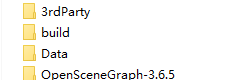

> build文件夹自己新建的，用来存储编译后的文件

使用vs2017 编译大概用时3小时

# cmake构建

## 构建前的准备

为了方便编译，在硬盘下建立一个OSG文件夹，然后分别建立如下3个文件夹：

OpenSceneGraph-3.6.5: 用于存放解压后的 OpenSceneGraph-OpenSceneGraph-3.6.5.zip 文件

3rdParty:   用于存放解压后的 3rdParty_VS2017_v141_x64_V11_full.7z 文件

Data:        用于存放解压后的 OpenSceneGraph-Data-3.4.0.zip

build:       用于存放编译后的文件

## 开始构建

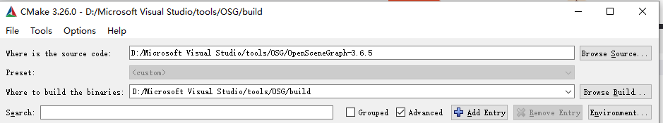

如图配置源文件目录和编译后的生成目录 

点击“Configure”按钮，按如下所示进行配置： 

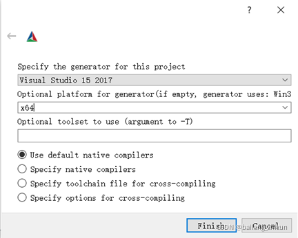 

点击“Finish”按钮

 修改参数

- ACTUAL_3RDPARTY_DIR -----3rdParty的目录 
- BUILD_OSG_EXAMPLES-----打勾
- CMAKE_INSTALL_PREFIX-----build的目录

再次点击“Configure”按钮

还是有红色的选项，BUILD_MFC_EXAMPLE 打钩（切记！！！VS2017一定要安装MFC开发组件！！！） 

再次点击“Configure”按钮，此时没有红色选项 

然后点击“Generate”按钮，进行生成 

## 有关MFC相关的报错问题

VS2017没有安装MFC组件 


MFC的编译平台不一致

打开 Examples osgviewerMFC 工程属性面板

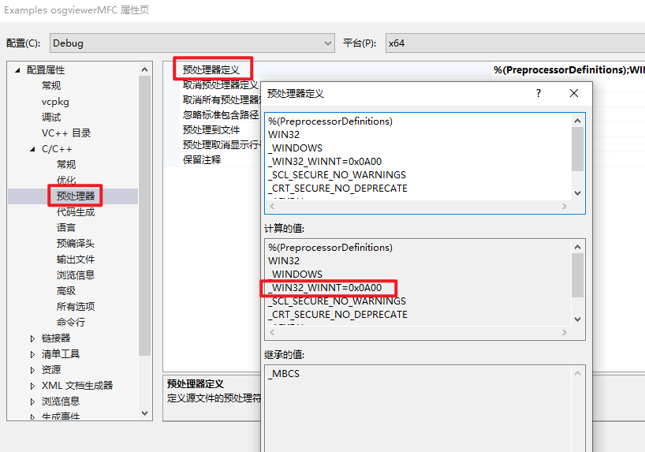

打开 Examples osgviewerMFC 工程中的 afxwin.h 文件进行修改

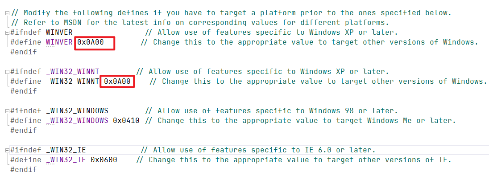

[参考链接--使用 Windows 标头 - Win32 apps | Microsoft Docs](<https://learn.microsoft.com/zh-cn/windows/win32/winprog/using-the-windows-headers?redirectedfrom=MSDN>) 

# 编译

## ALL_BUILD编译

在build目录中找到生成的OpenSceneGraph.sln文件，然后使用vs2017打开

选择生成->批生成

选择 ALL BUILD 的 Debug 和 Release

然后点击“生成”，此时会花费比较久的时间（我的机器上大概用了3个小时左右）。如果前面配置的没有错误的话，此时应该不会报错 

## INSTALL编译

ALL_BUILD编译完成之后，需要进行INSTALL编译

选择生成->批生成

选择INSTALL 的 Debug 和 Release

点击“生成”按钮，进行编译生成，这部分会快一些 

# 配置环境变量

添加系统环境变量 OSG_FILE_PATH，值为前面的Data的目录 

然后在Path变量中添加前面生成目录build目录中的bin目录 

# 测试

## 命令行测试

在命令行中输入osgversion

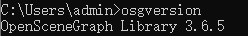

在命令行中输入osglogo 

这里出现两个小问题：文字和图片渲染显示有误

解决:cmake修改参数

- 取消勾选 OSG_TEXT_USE_FONTCONFIG 
- 配置freetype路径
  - 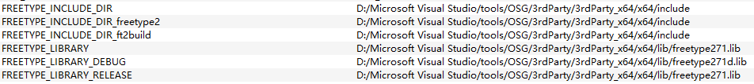
- 配置jpeg路径
  - 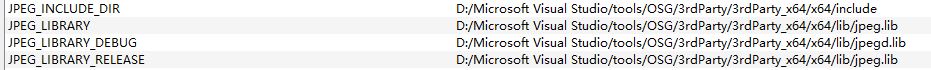
- Configure->Generate，然后重新打开 .sln解决方案，生成->批生成，先ALL_BUILD，然后再 INSTALL 


## 新建项目测试

在vs2017中新建C++控制台程序项目，项目属性，选择x64，然后配置头文件目录为build的目录下的include目录 

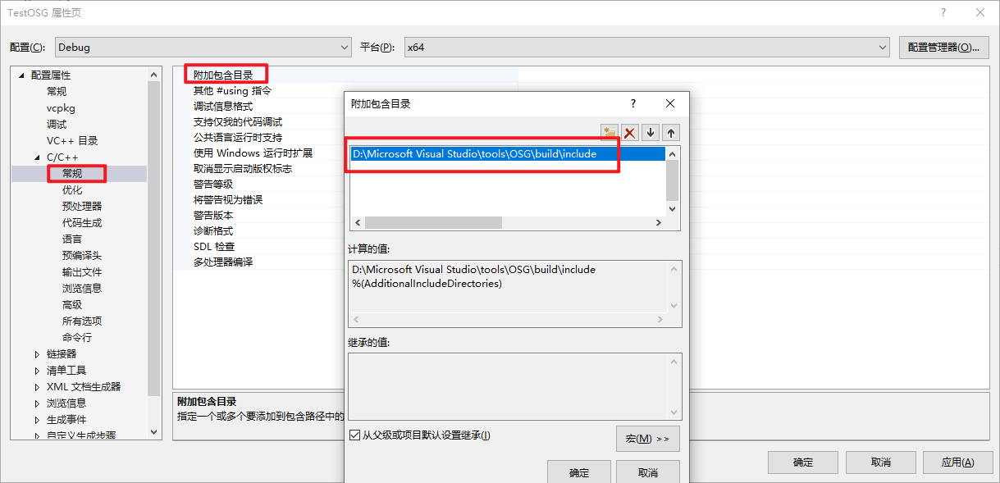

配置链接库文件，添加以下链接库

> OpenThreadsd.lib
> osgd.lib
> osgDBd.lib
> osgUtild.lib
> osgGAd.lib
> osgViewerd.lib
> osgTextd.lib
> （注：在编译生成的lib文件中，每个lib文件有一对名称相似的文件，其中文件名最后一个字母为“d”的为Debug版本所使用的，没有“d”的为Release版本所使用的。）

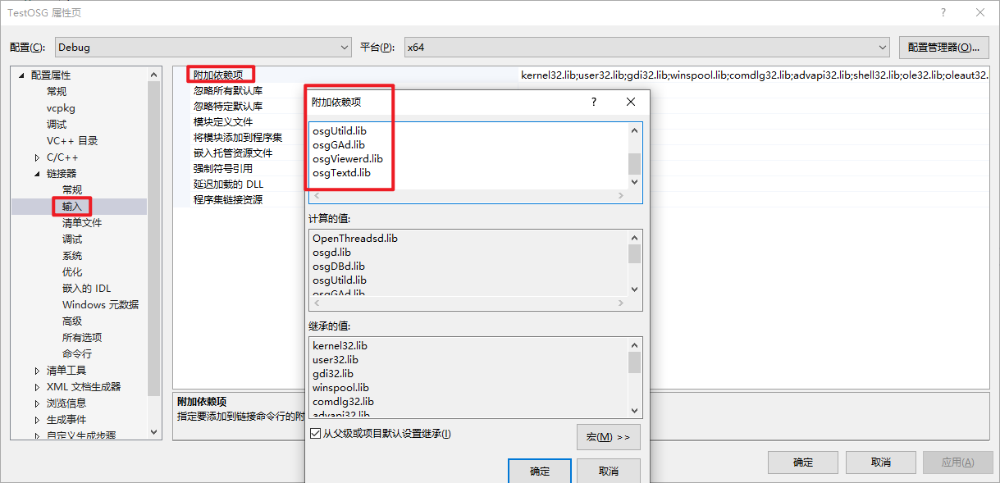

配置链接库的目录（build目录下的lib目录） 

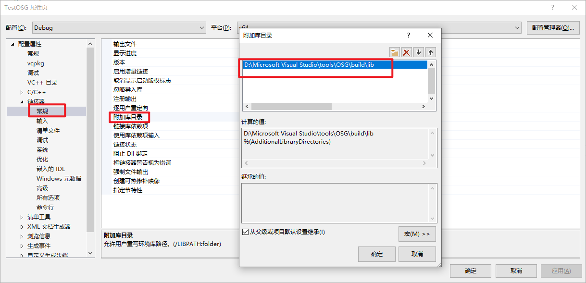

在程序文件中编写以下代码： 

```c++
#include <osgViewer/Viewer>
#include <osgDB/ReadFile>

int main()
{
	osgViewer::Viewer viewer;
	viewer.setSceneData(osgDB::readNodeFile("cow.osg"));
	return viewer.run();
}
```

会报错，经调试发现，main函数中什么语句都不写，只是单纯的包含这两个头文件就会报这些错误 ，所以应该不是代码的问题，经查，应该是预处理器未定义的原因，需要在预处理器中添加 WIN32 

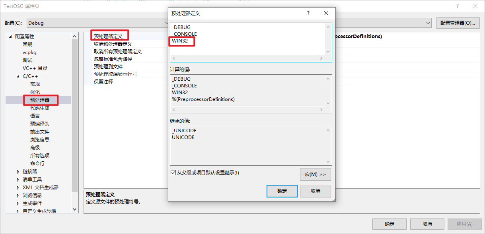

运行结果：


