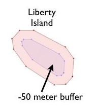

https://blog.csdn.net/m0_51197424/article/details/124926792

# psql 基础知识

获得内部帮助，结果将被分页；您可以使用`space`  来浏览列表。

```sh
\?
```

可能的 SQL 命令列表

```sh
\h
```

获取有关特定 SQL 命令的帮助

```sh
\h create database
```

列出所有数据库

```sh
\l
```

想查看根服务器目录？

```sh
\! ls -la
```

描述一个表，`\d`不带任何参数将显示当前数据库中所有表和对象的列表。如果  `+`  附加了 ，您还将看到扩展信息，例如每个表在磁盘上的大小。

`\d`  您可以使用的元命令集中还有更多  。更常见的示例是  `\dn` （所有模式）、  `\dv` （所有可用视图）、  `\du` （所有用户）、  `\df` （所有函数）、`\dp`（表、视图和序列访问权限）

默认情况下，psql 带有一个分页器，它只显示您正在查看的内容的片段，您可以分页浏览结果。

- [空格键] 可让您翻阅结果。
- 向下箭头让您可以选择显示其余部分或转到底部

如果你只是运行了上面的表描述，`\d+ weather`并且你不得不翻阅大量的结果，你可以关闭 psql 分页器

```sh
\pset pager 0
#将其重新打开。
\pset pager 1
```

查询

快速查询

```sql
SELECT event_type FROM weather LIMIT 20;
```

查询缓冲区

您还可以将查询编写为多行条目。这些将跨多行串在一起，`psql`直到遇到`;`。`psql`将创建所谓的查询缓冲区，直到您以`;`结尾. `\r`将重置您的查询缓冲区。

现在尝试多行查询

```sql
SELECT DISTINCT(event_type)
FROM weather
WHERE state = 'HAWAII';
```

定时

您可以让 psql 通过设置为您的查询运行一个计时器

```sh
\timing
```

再次尝试查询，您会看到运行需要多长时间

```sql
SELECT DISTINCT(event_type)  FROM weather LIMIT 40;
```

`psql`将允许您使用基本的 sql 更新 DDL、表、列和数据。您可以从此命令行运行插入、删除、更新语句。尝试快速更新语句。

```sql
UPDATE weather SET magnitude = 40 WHERE episode_id = 57676;
```

退出

```sh
\q
```

# 索引（B 树）

## B 树样本

在建立索引之前，explain analyze 告诉我们什么是执行时间？

```sql
EXPLAIN ANALYZE
SELECT * FROM weather WHERE event_type = 'Winter Storm';
```

现在创建一个索引

```sql
CREATE INDEX idx_weather_type ON weather(event_type);
```

## 多列 B 树索引

索引并不总是只为单列创建——Postgres 也支持多列索引。如果您知道您将同时在多个列上进行大量查询，这些将很有用。

删除我们创建的第一个索引

```sql
DROP INDEX idx_weather_type;
```

```sql
EXPLAIN ANALYZE SELECT * FROM weather WHERE event_type = 'Winter Storm'   AND damage_crops > '0';
```

```sql
CREATE INDEX idx_storm_crop ON weather(event_type,damage_crops);
```

查已创建的索引

```sql
SELECT indexname, indexdef FROM pg_indexes WHERE tablename = 'weather';
```

# 分区用例

## 数据生命周期和成本管理

使用分区的主要好处是有助于数据的生命周期管理。大数据变得非常昂贵，因此归档您不再需要的数据对于管理成本非常重要。使用分区来管理数据生命周期意味着您将频繁地将数据滚动到存档中，从而允许您轻松删除/存档表，因为该数据不再需要存在于某个数据库中。


性能：人们经常在分区方面寻找的另一个好处是查询性能。特别是当您的查询专门使用索引或分区键时。您可以通过直接针对单个日期范围而不是整个数据集来真正加快查询时间。


时间戳

https://www.jianshu.com/p/b3cfc0912328

时间函数

https://www.cnblogs.com/T-CYP/p/15129095.html

## 分区类型

根据您希望如何细分数据，有多种不同类型的分区。

- 范围分区可能是最常见的，通常用于时间或整数序列数据。
- 列表分区也很流行，尤其是当您的数据库很容易被某种公共字段分隔时——比如位置或整个集合中的特定数据片段。
- 散列分区也可用，但只有在无法获得明确定义的分区模式时才应使用。
- 复合分区将组合其中的一个或多个，例如同一数据集中的基于时间的分区和列表分区。

# JSON 基础知识

Postgres 有两种 JSON 数据类型： JSONB 和 JSON。JSONB 是 JSON 的优化二进制版本，存储速度较慢，但针对查询和处理进行了优化。JSON 是数据的精确副本，查询功能有限。在本教程中，我们将专门使用 JSONB。

## JSONB 数据类型

在 Postgres 中，JSONB 只是一种数据类型。与许多数据类型一样，它带有自己的一组函数。在 Postgres 中，这些函数提供了提取、比较、创建和操作 JSONB 的能力。涵盖 JSONB 的全部可能性（和注意事项）需要永远，本教程旨在推动您沿着这条道路进行自己的探索。

首先，一个简单的 JSONB 对象可以像下面这样简单：

```sql
SELECT '{"name": "batman", "superpower": "fighting skills"}'::jsonb;
```

数组可以是 JSONB 的顶级元素：

```sql
SELECT '["batman", "superman"]'::jsonb;
```

JSONB 可以是嵌套在数组中的对象。使用数组和对象，您可以随心所欲地深入了解结构！

```sql
SELECT '[{"name": "batman"}, {"name": "superman"}]'::jsonb;
```

使用`jsonb_to_recordset`，我们可以将 数组转换为一组记录:

```sql
SELECT
	*
FROM jsonb_to_recordset('[{"name": "batman"}, {"name": "superman"}]'::jsonb) AS x(name TEXT);
```

正如我们刚刚展示的从 JSON 到记录集的转换，我们也可以从记录集转换回 JSON 。您可以将任何对象转换为 JSONB，包括表中的一行：

```sql
SELECT
	to_jsonb(employees)
FROM employees
LIMIT 5;
```

如果要过滤列，请执行以下操作：

```sql
SELECT
	to_jsonb(truncated_employees)
FROM (
	SELECT first_name, last_name FROM employees LIMIT 10
) AS truncated_employees;
```

## 从 JSONB 数据中提取数据

从 JSONB 数据中提取数据有两种不同的方法：运算符和 JSONPath。运算符如下所示。

```sql
SELECT
	('{"name": "batman", "superpower": "fighting skills"}'::jsonb)->'name';
```

上面，我们使用运算符从 json 对象中提取名称`->`。请注意，此示例和以下示例使用了略有不同但相似的运算符。我们稍后会解释其中的区别。接下来，我们提取数组的第一个值：

```sql
SELECT
	('[{"name": "batman"}, {"name": "superman"}]'::jsonb)[0]->>'name';
```

我们使用数组表示法`[0]`返回数组的第一个元素，然后使用`->>`运算符返回 name 属性的值。

对于顶级数组，使用`0`作为要检索的值：

```sql
SELECT
	('["batman", "superman"]'::jsonb)->>0;
```

如果查看[Postgres JSON 函数](https://www.postgresql.org/docs/13/functions-json.html)，您会看到大量 JSON 操作和查询运算符。

上面是使用运算符的示例，下面我们将使用 JSONPath。JSONPath 允许更具表现力的操作和提取。下面，我们使用 JSONPath 而不是运算符复制前面的 2 个示例：

而且，如果您想在数组上运行查询，它将如下所示：

```sql
SELECT
	jsonb_path_query(('[{"name": "batman"}, {"name": "superman"}]'::jsonb), '$[0].name');
```

可是等等！还有更多。使用 JSONPath，您还可以使用以下语法提取数组中对象的值`$.key`：

```sql
SELECT
	jsonb_path_query(('[{"name": "batman"}, {"name": "superman"}]'::jsonb), '$.name');
```

JSONPath 比这更深。您可以执行许多 Javascript 也允许的操作，例如数学、正则表达式、字符串操作等。

## 创建 JSONB 列

创建 JSONB 列类似于创建任何列。下面，我们`my_new_json_column`在 employees 表中添加一列：

```sql
ALTER TABLE employees ADD COLUMN my_new_json_column JSONB DEFAULT NULL;
```

此语句使用`ALTER TABLE`命令添加数据类型为 JSONB 的列。

## 将数据插入 JSONB 列

向 JSONB 中插入一条新记录非常简单：

```sql
INSERT INTO employees (first_name, last_name, start_date, job_title, systems_access) VALUES ('Chris', 'Winslett', current_date, 'Master of the Highwire', '{"crm": 1662186380, "helpdesk": 1663290134, "admin_panel": null}');
```

上面，我们使用了一个对象，该对象带有表示系统名称的键，以及一个纪元时间戳来表示该人最后一次访问该特定系统的时间。

## 顶级对象：如何查询

对于顶级对象查询，我们将使用`systems_access`列。它已经填充了一个具有键值对的 1 层对象，其中键代表系统，值代表最后一次与系统交互的时间戳，例如：

```json
{
  "crm": 1663290134.65564,
  "helpdesk": 1662186380.689519,
  "admin_panel": null
}
```

我们选择 EPOCH 时间戳是因为它可以让我们避免一些复杂的日期转换。通过使用浮点数，在后面的示例中，我们可以简单地索引包含在 JSONB 中的浮点数，而日期会引入比教程保证更多的复杂性。具体的复杂性是因为将文本转换为日期不是不可变的，因此不能用于构建索引。

让我们将此 JSONB 对象作为 SELECT 语句的一部分返回：

```sql
SELECT
	systems_access
FROM employees
WHERE id = 1;
```

我们甚至可以在`systems_access`. 下面，我们使用两个不同的运算符返回`crm`和键中的值：`helpdesk`

```sql
SELECT
	systems_access->'crm' AS crm_value,
	systems_access->>'helpdesk' AS helpdesk_value
FROM employees
WHERE id = 1;
```

返回什么数据类型？下面，我们`pg_typeof`用来检查返回的数据类型：

```sql
SELECT
	pg_typeof(systems_access->'crm') AS crm_type,
	pg_typeof(systems_access->>'helpdesk') AS helpdesk_type
FROM employees
WHERE id = 1;
```

哇。一个是`jsonb`，另一个是`text`，但为什么呢？如果您仔细查看查询，当返回`crm`值时，我们使用`->`，而当返回`helpdesk`值时，我们使用`->>`. 由于返回的数据类型，这种语法差异很重要。

可以想象，了解返回对象的类型对于条件所需的比较很重要。与 Javascript 不同，Postgres 需要相当明确的数据类型才能正确进行比较（日期除外，但那是一个不同的教程）。

`crm`让我们对过去 7 天内访问过的每个人运行一个查询。换句话说，我们如何为 JSONB 字段中的`crm`键应用条件？`systems_access`下面是一个将过滤这些值的查询。我们可以运行类似下面的东西吗？

```sql
SELECT
	first_name,
	last_name
FROM employees
WHERE
	systems_access->>'crm' > EXTRACT('epoch' FROM now() - '7 day'::interval);
```

但是，答案是否定的，因为我们收到错误消息：

```sh
ERROR:  operator does not exist: text > numeric
LINE 5: WHERE systems_access->>'crm' > EXTRACT('epoch' FROM now() - ...
```

Postgres 不比较文本和数字。为什么是`systems_access->>'crm'`文本而不是数字？存储 JSONB 时，每个值都是文本。我们有 2 个选项：将相等性作为文本进行比较或转换为数字。 作为文本进行比较会呈现不正确的结果。

```sql
SELECT
	first_name,
	last_name
FROM employees
WHERE
	(systems_access->>'crm')::float > EXTRACT('epoch' FROM now() - '7 day'::interval);
```

现在，一条命令正常运行了！它返回你想要的记录。按`q`键退出长列表。要查看那些从未访问过的人，让我们找到那些 CRM 具有 NULL 值的人：

```sql
SELECT
	first_name,
	last_name
FROM employees
WHERE
	(systems_access->>'crm') IS NULL;
```

按`q`键退出长列表。尝试在这上面进行强制转换（例如`::float`）——尝试删除它。铸造对于这种比较重要吗？`->`当您探索 Postgres 中的 JSONB 查询时，请记住和 之间存在差异 `->>`，以及如何转换值以进行正确比较。

## 顶级对象：如何更新

有两种方法可以更新 JSONB 列：1) 更新整个数据，或 2) 更新部分数据。旁注：对于两者，Postgres 将更改视为整个更新，我们仅使用函数来计算新值并避免从应用程序层进行往返。

更新整个列很简单：

```sql
UPDATE employees
SET
	systems_access = '{"crm": 1661637946.452246, "helpdesk": 1658433308.494507, "admin_panel": null}'
WHERE id = 1;
```

但是，如果我们想更新单个值，我们可以执行以下操作：

```sql
UPDATE employees
SET
	systems_access = systems_access || jsonb_build_object('admin_panel', extract(epoch from now()))
WHERE id = 1;
```

运算符合并`||`两个对象，并用右侧对象的键覆盖左侧对象的键。并且，我们使用`jsonb_build_object`创建一个新对象，其中等于中的任何一个值都可以是变量。

## 顶级对象：使用 BTREE 建立索引

我们有两种方法来索引顶级对象。此外，选择合适的索引也有一些注意事项。索引单个值时，使用`BTREE`是最佳选择。

从一个简单的`BTREE`索引开始，假设我们想要基于`systems_access`具有访问权限的字段进行查询`crm`。对于这个索引，我们在将该字段转换为`int`.

```sql
CREATE INDEX employees_systems_access_crm
ON employees
USING BTREE (((systems_access->>'crm')::float));
```

然后，当我们运行以下查询时，它会使用索引：

```sql
EXPLAIN SELECT
	*
FROM employees
WHERE
	(systems_access->>'crm')::float > extract('epoch' FROM now() - '3 day'::interval);
```

运行上面的命令，你会看到输出有一个`Index cond`，表明它使用索引进行查找。如果您没有看到`Index cond`，则需要通过运行 来更新表统计信息`ANALYZE employees;`。

实验运行`EXPLAIN`上面的命令。尝试`DROP INDEX employees_systems_access_crm`，然后重新运行`EXPLAIN`. 然后，重新创建索引并运行`EXPLAIN`. 比较输出。现在，尝试将间隔从 3 天更改为 10 天——注意到它恢复为表扫描了吗？这是 Postgres 优化器使用表统计信息来确定表扫描比索引扫描更快。我们使用的相对较小的数据集意味着索引可能比表扫描慢。

## 顶级对象：使用 GIN 建立索引

在这些沙箱数据大小下使用 GIN 索引时，查询优化器并不总是选择使用索引。我们将逐步创建索引，但要知道优化器会有自己的想法。对于性能，上述`BTREE`方法是最可预测的索引方法。尽管如此，我们还是想展示 GIN 索引如何工作。

如果我们想查询该`systems_access`字段的任何值怎么办？然后，我们想为此使用 GIN 索引。

```sql
CREATE INDEX employees_systems_access ON employees USING GIN ((systems_access) jsonb_path_ops);
```

现在，让我们看看是否可以使用索引作为我们查询的一部分`EXPLAIN`：

```sql
EXPLAIN SELECT
	*
FROM employees
WHERE
	systems_access @@ ('$.helpdesk > ' || extract('epoch' FROM now() - '3 day'::interval)::text)::jsonpath;
```

此查询可能不会使用索引，因为我们需要更新表统计信息。为此，请运行`ANALYZE employees;`，然后重新运行上面的查询。

一旦成功，让我在这里提醒一下，`jsonb_path_ops`索引创建时的声明与`@@`运算符的使用相结合对于成功至关重要。使用`GIN`索引时，将您希望匹配的运算符与您希望运行的比较相匹配。例如，如果我们运行以下查询，则不会使用索引：

```sql
EXPLAIN SELECT
	*
FROM employees
WHERE
	systems_access->>'helpdesk' = '1';
```

这个例子的要点是在使用 JSONB 时，构建索引和使用这些索引的查询需要时间和理解。如果我们`jsonb_path_ops`在创建索引的时候去掉了，那么原来使用的查询`@@`也将无法使用索引。此外，如果您的运算符的右侧包含两个值，例如`{"helpdesk": 1, "crm": 1}`，那么它也将无法使用索引。

## 结构化数据

关于数据结构（又名模式）的注意事项：您可能听说过关于 JSON 数据库的术语“无模式”。这是用词不当。所有应用程序都定义了数据结构，问题是：应用程序堆栈的哪一部分强制执行数据结构？使用 Postgres 表时，数据结构在数据库级别强制执行。通常，在使用 JSON 时，数据结构在应用程序级别强制执行。

在设计 JSON 数据时，重要的是要考虑您将如何使用和查询数据。我们有很多选项来构建可以在 employees 表中找到的地址数据。例如，我们可以使用以下结构——花几秒钟将其与我们上面使用的值进行比较。

```json
{
  "home": {
    "street": "698 Candlewood Lane",
    "city": "Cabot Cove",
    "state": "Maine",
    "country": "United States"
  }
}
```

以上并没有错——但我想稍后再举一些关于更新数组的例子。我认为上面的语法对于我们的用例来说更简单，除非你想索引它。为什么索引更难？要提取值，键（即`home`）可能与预期不同。我们也可以使用顶级地址，但这样我们就不能存储多个地址。

设计 JSON 时应该进行大量的思考和实验，其中一些最好通过经验来学习。最后，勇往直前，犯错误，继续前进。没有什么是“无模式”的。

# 转换数据类型

## 什么是数据类型？

- 数据类型主要由
  - 它代表的特定类型的数据
  - 它可以采用的值
  - 可以对其进行的操作
- PostgreSQL 自带超过 49 种开箱即用的数据类型（数字、文本、字符、布尔值、货币、几何形状、IP 地址和网络等）
- 您甚至可以创建自己的数据类型，但那是一个不同的教程

## 什么是转换？

转换是人们想要用来将 PostgreSQL 中的数据从一种数据类型转换为另一种数据类型的方法。

在 PostgreSQL 中执行此操作的主要功能是

`CAST ( expression AS target_type );`

可以从一种数据类型转换为具有某些限制的任何数据类型：

- 转换数值类型时，要转换的表达式必须匹配 target_type 的可能范围，有关更多信息，请参阅[Postgres 文档](https://www.postgresql.org/docs/current/datatype-numeric.html#DATATYPE-NUMERIC-TABLE)。
- 根据 PostgreSQL 文档：“转换必须使两种类型（源、目标）可以二进制强制转换，这意味着可以“免费”执行转换而无需调用任何函数。这要求相应的值使用相同的内部表示。例如，类型`text`和`varchar`是双向可强制转换的。二元强制不一定是对称关系。例如，强制转换 from `xml`to `text`"（[此处为源文档](https://www.postgresql.org/docs/current/sql-createcast.html)）

示例：有些可能有效，有些可能无效

```sql
select cast('1' as integer);
select cast('10000000000' as integer); × 值 "10000000000" 超出类型 integer 的范围
select cast('10000000000' as bigint); × 无效的类型 integer 输入语法: "abc"
select cast('abc' as integer);
select cast('1' as text);
select cast('true' as boolean);
```

## pg_typeof() 函数

此函数将有助于在当前教程中了解 PostgreSQL 如何解释发送给它的数据：

```sql
select pg_typeof(1);
```

对于文本，如果我们不将其转换为正确的数据类型，该函数将返回“未知”，因为 PostgreSQL 中有许多数据类型可以处理它，如文本、字符、varchar ......

```sql
select pg_typeof('abc'),pg_typeof(cast ('abc' as text));
```

## 为什么转换很重要？

令非 DBA 感到沮丧的常见错误消息是：

```
 `ERROR:  operator does not exist: integer ~~ unknown
 `ERROR:  function repeat(integer, unknown) does not exist
```

- 你可以看看功能，看到它应该可以，但是为什么它不起作用？可能是因为以下原因：
  - SQL 是一种强类型语言
  - 比较不同数据类型（文本与字符串）时比较失败
  - 函数需要特定的特定数据类型作为声明的一部分

## 隐式转换

有时，不需要转换，因为 PostgreSQL 会在可以完成时为您自动转换。这称为“隐式转换”。在这个例子中，我们尝试添加字符串 '12' 和数字 10：它会起作用，因为 PostgreSQL 可以将该字符串 '12' 转换为数字以满足两项的加法：

```sql
select '12'+10 as implicit_cast;
```

请注意，这里的 '12' 可以通过隐式转换自动转换为整数，因为随后可以满足“+”和 10（整数）。对于“12.1”，这将不再有效，因为“12.1”不能转换为整数！

```sql
select '12.1'+10 as implicit_cast;
```

因此，为了让它起作用，将 10 转换为数字，因为字符串 '12.1” 的数字表示不是整数，而是数字：

```sql
select '12.1'+cast(10 as numeric) as implicit_cast;
```

使用 PostgreSQL 编码时的一个好习惯是避免隐式转换！然后应用程序开发人员将更好地控制他的代码，尽可能避免隐式转换。

## 布尔值和 NULL

关于布尔值，如果给定一个整数，0 将为假，所有其他值将为真。如果给出了表示布尔值的文本，则任何类似 t、tr、true、true、y、ye、yes、on 的内容都将为真，而任何类似 f、fa、fal、fals、false、n、no、of、off 的内容将是错误的。其他任何东西都会抛出错误。

将 NULL 转换为任何其他数据类型时，结果总是 null。艰难，请注意链“null”不是 NULL 值 :-)

```sql
with tests
(test)
   as (values
    ('tRUe')
    ,('F')
    ,('on')
    ,('of')
    ,('ye')
    ,(NULL)
   )
  select
   test
   , pg_typeof(test) as typeof_test
   , test::boolean as test_bolean_value
   from
   tests;
```

## 从/到日期和时间戳的转换

大多数情况下，转换用于将一些表示日期的文本转换为实际日期或日期/时间，以便通常在 WHERE 子句中进行比较。

我们将使用 2000-2014 年美国出生的公共数据集深入研究 SQL。但首先，我们将使用新表和日期格式以更以 Postgres 为中心的方式创建数据集：

```sql
CREATE TABLE births_cast (
    id serial,
    day date,
    births int
);
INSERT INTO births_cast (day, births)
SELECT make_date(year, month, date_of_month),
	births
FROM US_births_20002014_SSA;
```

对我们的数据集的第一个简单查询，我们想知道美国有多少人在 2001 年 6 月 10 日出生：

```sql
select day, births from births_cast where day=cast('2001-06-10' as date);
```

特殊运算符“::”是 cast() 函数的一个很好的替代品：您会发现它可能更具可读性。至少，它更短：

```sql
select day, births from births_cast where day='2001-06-10'::date;
```

关于那个“::”特殊运算符，根据应用程序的语言，它可能很难使用，因为开发人员可能不得不转义这些字符。如果遇到此问题，请在 SQL 查询中改用 cast() 函数。选择日期，出生日期来自出生日期 ='2001-06-10'::date;

PostgreSQL 还可以使用隐式转换，这意味着它试图了解用户想要什么，以这种方式隐藏数据类型转换机制。不过，我们不建议这样做，因为它可能会导致一些不良情况。在这种情况下，隐式转换按预期工作；

```sql
select day, births from births_cast where day='2001-06-10';
```

但是，如果您使用与 ISO 日期（'YYYY-MM-DD'）不同的方式，如 PostgreSQL 上面所假设的那样，则可能会导致一些困难。以下查询仍然适用于我们 playground 数据库的当前设置：

```sql
select day, births from births_cast where day='06/10/2001';
```

但那是因为使用的日期样式被定义为“ISO, MDY”：

```sql
show datestyle;
```

在世界的不同地方，日期样式最常见的可能是“ISO,DMY”：

```sql
set datestyle to 'ISO, DMY';

select day, births from births_cast where day='06/10/2001';
```

在这里，PostgreSQL 将搜索的不是“June, 10th”，而是“October, 6th”！

这就是我们建议开发人员尽可能使用 ISO 日期格式的原因。

当您将日期转换为时间戳时也要小心，反之亦然：

从时间戳转换为日期时，基本上会删除小时（和时区，具体取决于源数据类型）：

```sql
select current_timestamp, current_timestamp::date, current_date, localtimestamp, localtimestamp::date;
```

但是当相反时，从日期到时间戳，添加小时“00:00:00”，是否带有时区，具体取决于目标数据类型：

```sql
select current_date::timestamp, current_date::timestamptz;
```

## 间隔

转换为间隔对于日期操作很有用，并且可以很容易地用文本链表示，例如“90 天 10 分 10 秒”：

```sql
select current_timestamp + '90 days 10 minutes 10 seconds'::interval as test;
```

如前所述，如果将间隔添加（也适用于减法）到日期，假设日期的小时部分为“00:00:00”，间隔值将添加到 0：

```sql
select current_date + '90 days 10 minutes 10 seconds'::interval as test;
```

另一个例子，日期和间隔计算。人们想要获得当月的最后一天。使用 PostgreSQL，日期函数加上一些日期和间隔计算允许：将当前日期截断到月份将在返回的时间戳上添加默认的“1”作为日期。从那里，我们然后向该时间戳添加一个完整的月份（tz 或不）然后我们从该时间戳中减去一天，最后添加一个转换以将其表示为日期：

```sql
select
	 current_date as today
	,date_trunc('month', current_date::timestamptz) as today_truncated_to_month
  ,(date_trunc('month', current_date + '1 month'::interval) - '1 day'::interval)::date as last_day_of_current_month;
```

## 数据类型转换和索引

让我们在列日创建一个索引，它是一个整数：

```sql
create index on births_cast (births);
```

只有在搜索中设置了整数值时，索引才可用。例如，如果将其转换为数字，则不会使用索引：

```sql
explain select count(*) from births_cast where births=7674;
explain select count(*) from births_cast where births=7674::numeric;
```

这就是为什么在后面的查询中，会发出顺序表出生，而不是在第一个查询中发出（位图）索引扫描。

在数据类型之间转换时请记住这一点。它会对你的表现产生很大的影响。

如果您真的需要经常将给定的数据类型转换为另一种数据类型：

- 也许您只是遇到了模式问题，您必须更改列的数据类型，这将是最简单和最有效的事情。然后你的索引将匹配你的查询
- 或者如果你不能这样做，你可以在你经常使用的转换上创建一个函数索引。

# [CTE](https://www.postgresql.org/docs/current/queries-with.html)和[窗口函数](https://www.postgresql.org/docs/current/functions-window.html)

我们提出了一种同时使用 CTE 和窗口函数的解决方案。CTE 是一个通用的表表达式，它允许您将复杂的查询拆分为不同的命名部分，并在稍后的查询中引用这些部分。在我们的`WITH`案例中，声明就是您定义 CTE 的方式`weekly_births`。窗口函数允许您将结果集划分为帧（即不同的组）并运行函数以在帧之间进行比较。在这种情况下，我们使用`lag(births, 1) OVER (ORDER BY WEEK DESC) prev_births`as 窗口函数来返回前一周的`births`值。我们可以通过这个结果集看到这一点，它汇总了一周内的所有出生，然后还收集了前一周的数据：

```sql
WITH weekly_births AS
(
	SELECT date_trunc('week', day) week,
    	sum(births) births
    FROM births
    GROUP BY 1
)
SELECT week,
	  births,
	  lag(births, 1) OVER (
          ORDER BY week DESC
      ) prev_births
FROM weekly_births;
```

# 自定义数据类型：DOMAINS

## 为什么要创建自定义数据类型？

自定义数据类型将主要帮助您实现数据完整性，确保存储在数据库中的数据与您希望的一样。

## DOMAIN 用法

定义您自己的域对于防止插入不需要的格式化数据或与您想要的内容不完全对应的数据非常有用。

相关文档页面：[https ://www.postgresql.org/docs/current/sql-createdomain.html](https://www.postgresql.org/docs/14/sql-createdomain.html)

例子：

```sql
create table person_using_checks (
    id          integer generated always as identity primary key   ,
    firstname   text not null   ,
    lastname    text not null   ,
    birth_date  date   ,
    email       text not null   ,
    check (birth_date>'1930-01-01'::date)   ,
    check (email ~ '^[A-Za-z0-9._%-]+@[A-Za-z0-9.-]+[.][A-Za-z]+$')
);
```

请注意，在该示例中，我们使用新`GENERATED { ALWAYS | BY DEFAULT } AS IDENTITY`方法创建代理键（有关详细信息，请参阅[https://www.postgresql.org/docs/15/sql-createtable.htm ）。](https://www.postgresql.org/docs/15/sql-createtable.htm)

创建表后，尝试插入此数据：

```sql
insert into person_using_checks (firstname,lastname,birth_date,email)
values ('Jhon','Doe','1970-01-01'::date,'john@doe.org');
```

```sql
insert into person_using_checks (firstname,lastname,birth_date,email)
values ('Georges','Washington','1732-02-22'::date,'georges@whitehouse.gov.us');

insert into person_using_checks (firstname,lastname,birth_date,email)
values ('Starman','Sky','1972-04-28','unknown');
```

在最后两个例子中，PostgreSQL 告诉你那里出了什么问题……

如果你只有那个表来管理这种数据，你可以让它保持原样。但是，如果您想将这些检查应用于其他表，那么最好的方法是在 PostgreSQL 中创建域，这样您就可以将该域定义应用于您想要的任何表，其中数据在您看来必须相同。

让我们创建这两个域：

```sql
create domain date_of_birth as date
	check (value > '1930-01-01'::date) ;
create domain valid_email as text
	not null
	check (value ~* '^[A-Za-z0-9._%-]+@[A-Za-z0-9.-]+[.][A-Za-z]+$') ;
```

请注意，date_of_birth 域仍然允许空值，但 valid_email 不允许。

您可以使用以下命令在 psql 中列出您的域：

```sh
\dD
```

一旦创建了这些域，我们将使用这些域创建一个新表，而不需要额外的检查，因为这些现在是通过域完成的：

```sql
create table person_using_domains (
    id integer generated always as identity primary key
    , firstname   text not null
    , lastname    text not null
    , birth_date  date_of_birth
    , email       valid_email
);
```

尝试在这个新表中插入与之前相同的数据，看看会发生什么：

```sql
insert into person_using_domains (firstname,lastname,birth_date,email)
values ('Jhon','Doe','1970-01-01'::date,'john@doe.org');
```

```sql
insert into person_using_domains (firstname,lastname,birth_date,email)
values ('Georges','Washington','1732-02-22'::date,'georges@whitehouse.gov.us');

insert into person_using_domains (firstname,lastname,birth_date,email) values ('Starman','Sky','1972-04-28','unknown');
```

PostgreSQL 仍然不想要该数据，但消息发生了一些变化，它现在指的是域的约束。

假设应用程序现在已经进化，我们只想存储 1980 年之后出生的人。

您必须首先删除域的约束并创建一个新域，因为至少在目前，PostgreSQL 不允许动态修改域的检查约束（请参阅[https://www. postgresql.org/docs/current/sql-alterdomain.html](https://www.postgresql.org/docs/current/sql-alterdomain.html)完整的 ALTER DOMAIN 命令）：

```sql
alter domain date_of_birth drop constraint date_of_birth_check ;
```

如果您查看 psql 中的域定义，您将看到不再列出检查：

```sh
\dD date_of_birth
```

现在让我们重新创建它：

```sql
alter domain date_of_birth add check (value > '1980-01-01'::date);
```

PostgreSQL 将拒绝，因为我们插入的 John Doe 出生于纪元 0，即 01/01/1970.. 然后，该记录与 date_of_birth 域要求不匹配。

我们可以在该更改域中使用“无效”来强制执行此操作，这意味着 PostgreSQL 的文档：“不验证现有存储数据的约束有效性”。这是一种强制措施，让不满足数据检查的数据存在于我们的数据库中：

```sql
alter domain date_of_birth add check (value > '1980-01-01'::date) not valid;
```

通过这样做，现在我们可以要求 PostgreSQL 检查是否遵守该特定域的检查：

```sql
alter domain date_of_birth validate constraint date_of_birth_check ;
```

它不会告诉哪些数据违反了“新约束”。你必须自己弄清楚，选择所有不匹配的数据（where birth_date < '1980-01-01'::data …）然后做必要的事情来整理你的数据库，例如，创建一个具有相同列的 person_history 表并将此数据移动到其中，或者只是删除它，具体取决于您真正想要做什么。

构建架构时应定义域。仔细考虑每一列，它可能是什么类型的域，你想要什么检查约束，它是否可以为空，默认值是否有意义等等。

我们经常看到域未被使用，这很糟糕，因为在对特定类型的数据进行任何修改时，比方说邮政编码，人们将不得不一一修改表的任何列，这很容易出错并忘记那个特定表中的这个特定列也必须修改，而人们只是忘记了它......如果你在表的定义中有 CHECKs 来验证给定的邮政编码类型列是否有效，那就更糟了：你必须修改每一个也是如此！

如今，大多数用于创建和维护模式的工具将允许您定义自己的域并在工具内部进行管理，然后很可能会为您构建一个完整的 SQL 脚本来创建域、表、索引等……使用它！您的架构可读性和可维护性将真正得到极大的提高。

## (您自己的)TYPE 用法

相关文档页面：[https ://www.postgresql.org/docs/current/sql-createtype.html](https://www.postgresql.org/docs/14/sql-createtype.html)

### 四种形式

用户定义的类型可以有 4 种形式：

1. 复合类型，由属性名称和数据类型的列表指定
2. 枚举类型，由引用标签的列表组成
3. 范围类型，打造多功能范围
4. 您需要的全新标量基本类型，具有您需要在数据库中正确处理的所有功能。

这里的第 4 种形式不会在本教程中介绍，因为它应该是一个全新的教程，因为它庞大而复杂。它也必须作为超级用户创建，“因为错误的类型定义可能会混淆甚至崩溃服务器”，根据 PostgreSQL 的文档。

## 复合型

假设您的应用程序管理一个投递系统，信件或包裹投递到某个地方。这个应用程序大部分时间都会使用包的 ID，比如，在应用程序的任何地方。但是信件或包裹本身的特征（如尺寸和重量）使用不多，除非传递给将确定包裹类型的函数。

假设任何大于 10 x 13（英寸或任何单位）且重于 18（盎司或任何单位）的东西都被归类为 box，而任何其他东西都被归类为 letter。

我们将创建一个新的数据类型，作为具有 2 个维度和一个权重的包，以及使用这个新的复合数据类型的表包。在我们使用创建的新数据类型创建新表包之后：

```sql
create type physical_package as (
    height    numeric
    , width     numeric
    , weight    numeric
);
create table packages (
    id            bigint  generated always as identity primary key
    , properties    physical_package
);
```

我们现在可以使用“::”运算符（或 cast() 函数，如果需要）将正确格式化的数据转换为 physical_package 数据类型。这对许多用途都很有用，其中包括以可读的方式插入值：

```sql
insert into
packages
(
    properties
)
values
(
    '(10.3,4.0,0.5)'::physical_package
),
(
    '(5,3.0,0.2)'::physical_package
),
(
    '(100,200,400)'::physical_package
),
(
    '(4,10,50)'::physical_package
),
(
    '(12,10,100)'::physical_package
),
(
    '(3.5,5,3.5)'::physical_package
);
```

要访问复合数据类型的“列”，您不能像 my_tape_name.my_sub_type 那样简单地选择，因为它会混淆 PostgreSQL 的解析器，例如 my_tape_name 实际上被视为表名......然后必须将类型名称设置到括号中，如下所示在此示例中，为避免该错误：

```sql
select id,(properties).weight from packages;
```

创建复合类型的一大好处是它可以作为参数传递给函数，或者函数也可以返回它。让我们创建一个函数来对包裹进行分类，无论是信封还是包裹：

```sql
create function categorize_package (
    p  physical_package
) returns text
as
$$
select
case when (
    case when (p).height>10.0 then true else false end
    or case when (p).width >13.0 then true else false end
    or case when (p).weight>18.0 then true else false end)
    then
    	'box'
    else
    	'letter'
    end
 ;
 $$ language sql;
```

看看我们如何使用新创建的类型来简化函数的参数列表。

这个 SQL 函数使用了一个技巧：它是 3 个“case when”行中每一行的逻辑比较，如果 3 个“case when”中至少有一个为真，则返回 true。当发生这种情况时，大写 when 为真，表示它是一个盒子，否则，它是一个字母。

由于在单个查询中使用此功能，我们现在可以简单地对每个包进行分类：

```sql
select id, properties, categorize_package(properties) from packages;
```

我们还可以使用它对聚合进行一些数学运算：

```sql
select categorize_package(properties), count(*) from packages group by 1;
```

它也可以用于查找包中的字母，因此，在 WHERE 子句中：

```sql
select id, properties from packages where categorize_package(properties)='letter';
```

## 枚举类型

当你想用 PostgreSQL 模拟枚举类型（在许多编程语言中通常命名为 enum）时，你必须使用 CREATE TYPE 来创建它。例如，不能使用具有某些默认值的域来创建它。

让我们创建一个像 enum 这样的包类别，每个类别都必须是一个包裹或一个信封：

```sql
create type package_cat as enum ('box','letter');
```

现在我们可以修改 categorize_package()函数。为避免出现问题，我们必须先将其删除，因为您可能已经在本教程的前一阶段创建了它：

```sql
drop function categorize_package;
create function categorize_package (
   p  physical_package
) returns package_cat
as
$$
  select
    case when (
      case when (p).height>10.0 then true else false end or
      case when (p).width>13.0 then true  else false end or
      case when (p).weight>18.0 then true else false end
    ) then 'box'::package_cat else 'letter'::package_cat end
  ;
$$ language sql;
```

在这个例子中，你必须注意两件事：

- 函数可以返回我们创建的类型，而不仅仅是 PostgreSQL 提供的基本数据类型
- 我们将函数的 'box'和'letter'输出转换为 package_cat 数据类型，否则该函数无效，因为我们在其标题中提到它“返回 package_cat”

您可能会认为，所有这些看起来都有些矫枉过正。它只是允许人们在任何情况下都拥有它想要的数据。在应用程序中，我们现在可以考虑一种具有非常特殊物理特性的新类别“明信片” 。然后我们只需要将该值添加到 package_cat 所在的“枚举”中：

```sql
alter type package_cat add value 'postcard';
```

请注意，遗憾的是，由于 PostgreSQL 允许我们向任何“枚举”添加值，我们无法从中删除 (a) 个值。如果你需要，你必须：

1. 将现有的“ enum”重命名为 my_enum_old
2. 使用您要保留的值创建新类型，例如 my_enum
3. 更新列以使用新创建的类型，使用 ALTER TABLE ... ALTER COLUMN ... TYPE my_enum ...
4. 删除旧的 my_enum

要查看该“枚举”的所有元素，一种简单的方法是发出“\dT+”命令并查看其中的“元素”列：

```psql
\dT+ package_cat
```

现在必须调整函数 categorize_package()，使用明信片的特征将其归类为明信片，本教程中不需要进一步介绍。

我们现在可以创建另一个表，其中添加了类型为“ package_cat”的新列，我们不再容忍任何空值

```sql
create table packages_with_category (
		id            bigint  generated always as identity primary key
	, properties    physical_package  not null
	, category      package_cat       not null
);
```

让我们在上面插入数据：

```sql
insert into
packages_with_category
  (
     properties
    ,category
  )
values
  (
     '(10.3,4.0,0.5)'::physical_package
    ,'box'::package_cat
  ),
  (
     '(5,3.0,0.2)'::physical_package
    ,'letter'::package_cat
  ),
  (
     '(100,200,400)'::physical_package
    ,'box'::package_cat
  ),
  (
     '(4,10,50)'::physical_package
    ,'box'::package_cat
  ),
  (
     '(12,10,100)'::physical_package
    ,'box'::package_cat
  ),
  (
     '(3.5,5,3.5)'::physical_package
    ,'postcard'::package_cat
  );
```

正如预期的那样，任何插入错误内容的尝试都会失败：

```sql
insert into
packages_with_category
  (
     properties
    ,category
  )
values
  (
     '(6,6,6)'::physical_package
    ,'stuff'::package_cat
  );
```

同样，与域一样，这种自定义数据类型有助于按预期存储数据，确保数据质量。

## 范围类型

Range 类型在 PostgreSQL 中已经有一段时间是一种常见的数据类型。但是范围数据类型的内置子类型基本上仅限于整数、大整数、数字、带或不带时区的时间戳 和日期。

因此，创建新范围类型的常见用法是让它处理其他子类型。

假设对于每个包裹，当可接受的交付延迟发生变化时，客户接受了一些价格折扣。像运输公司做的最好，3 天可以送达，最多 10 天送达。然后我们可以定义一个区间范围。让我们创建由间隔组成的新范围类型：

```sql
create type delay as range (
	subtype = interval
);
```

现在我们创建一个新表，将以前的自定义数据类型和这个新的：

```sql
create table packages_with_delay (
		id                bigint generated always as identity primary key
	, properties        physical_package          not null
	, category          package_cat               not null
  , acceptable_delay  delay                     not null
);
```

现在我们插入数据：

```sql
insert into
packages_with_delay
  (
     properties
    ,category
    ,acceptable_delay
  )
values
  (
     '(10.3,4.0,0.5)'::physical_package
    ,'box'::package_cat
    ,'[3 hours,3 days]'::delay
  ),
  (
     '(5,3.0,0.2)'::physical_package
    ,'letter'::package_cat
    ,'[3 days, 10 days]'
  ),
  (
     '(100,200,400)'::physical_package
    ,'box'::package_cat
    ,'[5 days, 30 days]'
  ),
  (
     '(4,10,50)'::physical_package
    ,'box'::package_cat
    ,'[1 day, 10 days]'
  ),
  (
     '(12,10,100)'::physical_package
    ,'box'::package_cat
    ,'[3 hours, 2 days]'
  ),
  (
     '(3.5,5,3.5)'::physical_package
    ,'postcard'::package_cat
    ,'[3 days, 1 month]'
  );
```

作为使用示例，今天必须发送新货物，它应该在 1 或 2 天内到达。今天应该随这批货件一起寄送的相关包裹有哪些？

```sql
select
    id
   ,acceptable_delay
from
   packages_with_delay
where
   acceptable_delay @> '[1 day,2 day]'::delay;
```

还有一艘船我们正在某处装货，根据海况，大约 20 天到 1 个月到货，哪些包裹应该上船？

```sql
select
    id
   ,acceptable_delay
from
   packages_with_delay
where
   acceptable_delay @> '[20 days,1 month]'::delay;
```

说到范围类型，注意不要混淆“重叠”和“包含”运算符。重叠是'&&'，如下所示：

```sql
select
    id
   ,acceptable_delay
from
   packages_with_delay
where
   acceptable_delay && '[6 days,1 month]'::delay;
```

虽然“包含”是'@>'（或'<@'，具体取决于您对比较元素的排序方式）：

```sql
select
    id
   ,acceptable_delay
from
   packages_with_delay
where
   acceptable_delay @> '[6 days,1 month]'::delay;
```

仔细比较这两个结果。查看[PostgreSQL 文档中](https://www.postgresql.org/docs/current/functions-range.html#RANGE-OPERATORS-TABLE)[的范围运算符表](https://www.postgresql.org/docs/current/functions-range.html#RANGE-OPERATORS-TABLE)以获取更多信息。

## 结论

在[Craig Kerstiens](https://www.crunchydata.com/blog/composite-types)的这篇博文中，结论非常有趣，写在实际结论之前：

以我的拙见，枚举类型将帮助您获得最佳质量的数据。我们建议不要使用那么多，最重要的是，要有很长的值列表。比方说，如果您需要超过 10 个值的枚举，您宁愿使用一个表来存储它们，并在源表和新创建的表之间应用一些引用（完整性）。

如果您处理很多函数，或者当您对数据进行某种非规范化时，自定义复合类型可能会非常方便。有时它可以看作是存储在实际表中的元组的“先前版本”。其他人用一些 tablename_hist 来跟踪变化等。

自定义范围类型的用法可能是较少的用法之一，因为范围数据类型的内置子类型肯定会满足您的所有需求。

JSON(B) 在 PostgreSQL 中的兴起确实在某种程度上改变了人们对复合类型和数组的兴趣，PostgreSQL 长期支持复合类型和数组，从而允许新的用法。

# 序列和范围求和

序列对象（也叫序列生成器）就是用`CREATE SEQUENCE` 创建的特殊的单行表。一个序列对象通常用于为行或者表生成唯一的标识符。

PostgreSQL 中序列主要涉及到的函数是 :

| 函数                              | 返回类型 | 描述                                                                                                                                                                                                                                        |
| --------------------------------- | -------- | ------------------------------------------------------------------------------------------------------------------------------------------------------------------------------------------------------------------------------------------- |
| nextval(regclass)                 | bigint   | 递增序列对象到它的下一个数值并且返回该值。这个动作是自动完成的。即使多个会话并发运行 nextval，每个进程也会安全地收到一个唯一的序列值。                                                                                                      |
| currval(regclass)                 | bigint   | 在当前会话中返回最近一次 nextval 抓到的该序列的数值。(如果在本会话中从未在该序列上调用过  nextval，那么会报告一个错误。)请注意因为此函数返回一个会话范围的数值，而且也能给出一个可预计的结果，因此可以用于判断其它会话是否执行过 nextval 。 |
| lastval()                         | bigint   | 返回当前会话里最近一次 nextval 返回的数值。这个函数等效于 currval，只是它不用序列名为参数，它抓取当前会话里面最近一次 nextval 使用的序列。如果当前会话还没有调用过 nextval，那么调用 lastval 将会报错 。                                    |
| setval(regclass, bigint)          | bigint   | 重置序列对象的计数器数值。设置序列的 last_value 字段为指定数值并且将其 is_called 字段设置为 true，表示下一次 nextval 将在返回数值之前递增该序列。                                                                                           |
| setval(regclass, bigint, boolean) | bigint   | 重置序列对象的计数器数值。功能等同于上面的 setval 函数，只是 is_called 可以设置为 true 或 false。如果将其设置为 false，那么下一次 nextval 将返回该数值，随后的 nextval 才开始递增该序列。                                                   |

注意序列名中有大写字母时，regclass 参数值需要用双引号括和单引号一起括起来，比如：

> select nextval('"ACT_ChecklistItem_Id_seq"');

除了 setval 函数，还有另一种方法也是修改 sequence 的 start_value，也是会更新序列的当前值：

> 项目部署上去需要插入一些基础数据，所以新增数据的 ID 不是从 1 开始，修改 sequence 的 start_value (下次执行 nextval 得到的是 start_value，而不是 start_value+1) 。
>
> ```sql
> alter sequence s_seq restart with 2
> ```
>
> 相当于 select setval('s_seq',2,false)

数据分组

```sql
CREATE SEQUENCE aoc;
SELECT setval('aoc', 1);
SELECT
	calories_count,
	CASE WHEN calories_count = ''  THEN nextval('aoc') ELSE currval('aoc') END FROM calories;
```

分组求和

```sql
SELECT SUM(calories_count) OVER(partition by currval) FROM
    (SELECT CASE WHEN calories_count = '' then 0 else calories_count :: int end as calories_count,
     CASE WHEN calories_count = '' THEN nextval('aoc') ELSE currval('aoc') END
     FROM calories
    ) x;
```

在这种情况下，因为我们使用的是窗口函数，所以这将为每一行计算一次这些值的总和，但是该组的总和将是相同的。

最大值

请注意，我们不关心它来自哪一行，也不关心重复的条目。我们只关心这个新表中的最大值。让我们使用  [CTE](https://www.postgresql.org/docs/current/queries-with.html)来使事情看起来更好，而不是子选择。由于目标之一是在尽可能少的 SQL 语句中执行此操作，因此让我们将其  `setval()`   放入 CTE 的顶部：

```sql
WITH setup AS (SELECT setval('aoc',1)),      x AS (SELECT CASE WHEN calories_count = '' then 0 else calories_count :: int end as calories_count, CASE WHEN calories_count = '' THEN nextval('aoc') ELSE currval('aoc') END FROM setup, calories),      y AS (SELECT sum(calories_count) OVER(partition by currval) from x) SELECT max(sum) FROM y;
```

# 间隔数据类型

https://www.imangodoc.com/48014.html

# [空间数据库标准](https://zhuanlan.zhihu.com/p/384639042)

## SFA SQL 和 SQL MM

### Simple Feature Access SQL, SFA SQL

SFA SQL 是 OGC 制定的标准 OGC 全称是开放地理空间信息联盟(Open Geospatial Consortium)，是一个非盈利的[国际标准组织](https://link.zhihu.com/?target=https%3A//baike.baidu.com/item/%25E5%259B%25BD%25E9%2599%2585%25E6%25A0%2587%25E5%2587%2586%25E7%25BB%2584%25E7%25BB%2587/6039607)，它制定了数据和服务的一系列标准，GIS 厂商按照这个标准进行开发可保证空间数据的互操作。OGC 的官方网站为：[http://www.opengeospatial.org](https://link.zhihu.com/?target=http%3A//www.opengeospatial.org/)。

Simple Feature Access SQL（SFA SQL）即地理信息简单要素的 SQL 实现规范，它属于 OGC 制定的 Simple Feature Access 规范的第二部分。Simple Feature Access 规范的两部分分别为：

- Simple Feature Access - Part 1: Common Architecture（[https://www.ogc.org/standards/sfa](https://link.zhihu.com/?target=https%3A//www.ogc.org/standards/sfa)） —— 定义几何对象的通用架构，描述了通用的简单要素地理集合对象模型，及集合对象的不同表达方式和空间参考系统的表达方式，具有平台独立性。
- Simple Feature Access - Part 2: SQL Option（[https://www.ogc.org/standards/sfs](https://link.zhihu.com/?target=https%3A//www.ogc.org/standards/sfs)） —— 定义了第一部分定义的简单要素模型在数据库中的实现，给出了内模式下几何类型(geometry type)的定义及相关实现。

### SQL Multimedia Part3: Spatial, SQL/MM

SQL/MM 是 ISO（International Standard Organization，国际标准化组织）提出的标准，SQL/MM 第三部分空间定义了**矢量数据**存储与检索的相关标准，解释了基于这些数据类型如何使用存储、获取和处理空间数据。

SQL-MM Part3 定义大量插值曲线类型来扩展 SQL 规范定义的简单要素类型。

由于空间技术变得不那么特殊，而且几乎是高端关系数据库都会有的一部分，OGC 所管理的大部分内容都渐渐归属于 ANSI/ISO SQL。因此，你通常会看到较新的 SQL/MM 规范使用带有“**ST\_**”前缀的术语表示空间类型，如 ST_Geometry 和 ST_Polygon，而不是使用之前的 OGC/SFSQL（SQL 的空间特征）规范中的 Geometry 和 Polygon。

### 两种标准对比分析

这两个标准公共部分的接口已经相互兼容，但在内容覆盖面和某些概念的界定上存在一定的差异

- SFA SQL 在标记文本类型、空间数据存储实现上比 SQL/MM 定义的更宽泛
- SQL/MM 涉及了 SFA SQL 尚未涉及的拓扑数据结构、网络模型等方面的内容

没有统一的 SDB 标准，导致 SDBMS 差异

- PostGIS 更符合 SFA SQL 标准
- Oracle Spatial 更兼容 SQL/MM 标准

SQL/MM 和 SFA SQL 有相互融合的趋势

- SFA SQL 对部分类和函数按 SQL/MM 的形式进行了封装。
- SQL/MM 提供了两个符合 SFA SQL 的短名字视图。

SQL/MM 和 SFA SQL 优势互补，总体而言 SQL/MM 的覆盖面更广。

# [PostgreSQL](https://zhuanlan.zhihu.com/p/81814954)

centos 安装[postgresql-15.0](https://link.zhihu.com/?target=https%3A//www.postgresql.org/ftp/source/)

```bash
 # 检查编译环境 指定安装目录
 ./configure --prefix=/usr/local/pgsql
```

报错：configure: error: readline library not found 如果出现以上错误，说明你的系统缺少 readline 库，这时输入：
rpm -qa | grep readline
如果提示：readline-6.0-4.el6.x86_64
那么，你的电脑缺少 readline-devel 库，你只要安装一下 readline-devel 就行了：
yum -y install readline-devel
再次 rpm -qa | grep readline
提示：
readline-devel-6.0-4.el6.x86_64
readline-6.0-4.el6.x86_64
说明 readline-devel 安装成功。

报错：configure: error: zlib library not found 出现这种错误，说明你的系统缺少 zlib 库，输入： rpm -qa | grep zlib，如果出现如下提示：
zlib-1.2.3-29.el6.x86_64
zlib-1.2.3-29.el6.i686
jzlib-1.0.7-7.5.el6.x86_64
则说明，你的电脑缺少 zlib-devel 库，安装一下即可：
yum install zlib-devel;
这时，再 rpm -aq | grep zlib
zlib-1.2.3-29.el6.x86_64
zlib-1.2.3-29.el6.i686
jzlib-1.0.7-7.5.el6.x86_64
zlib-devel-1.2.3-29.el6.x86_64
说明 zlib-devel 安装成功。如果你的系统以上库均缺失，则要全部安装。

```bash
# 编译
make clean
make
```

```bash
# 安装
make install
```

```bash
# 创建一个postgres用户来操作数据库：
adduser postgres
# 设置用户密码 -- postgres
passwd postgres
# 在/usr/local/pgsql目录下创建data文件夹
mkdir -p /usr/local/pgsql/data
# 改变data文件夹的所有者为postgres
chown -R postgres:postgres /usr/local/pgsql/data
```

```bash
# 配置环境变量
bash 登陆的时候读取配置文件的顺序如下:
.bash_profile
.bash_login
.profile
按这个顺序只要读到一个就不再读取其他两个。全局的/etc/profile是最先读的，/etc/profile里面的配置可以在以上三个文件中覆盖掉。
# 切换到postgres用户
su - postgres
# 编辑/etc/.profile
vim .profile
export PGHOME=/usr/local/pgsql
export PGDATA=$PGHOME/data
export LD_LIBRARY_PATH=$PGHOME/lib
export PATH=$PATH:$HOME/.local/bin:$HOME/bin:$PGHOME/bin
# 重新启用一下配置文件
source .bashrc
```

```bash
# 初始化数据库 指定
initdb -D /usr/local/pgsql/data/
# 启动数据库服务
pg_ctl -D /usr/local/pgsql/data/ start
# 进入默认数据库
psql -U postgres
# 设置postgres这个用户的密码 -- postgres
\password
# 退出数据库
\q
```

```bash
# 配置数据库
# 修改/usr/local/pgsql/data下配置文件
默认创建的数据库无法接受远程链接在pg_hba.conf中加入一下命令
host all  all  0/0 md5
该命令允许任何账户远程连接数据库，连接时需要提供密码
pg_hba.conf 是一个黑白名单的访问控制文件，可以控制允许哪些IP地址访问数据库
# 修改/usr/local/pgsql/data下配置文件
编辑 postgresql.conf 文件
修改
  # listen_addresses = 'localhost'
  # port = 5432
参数listen_addresses 表示的是监听地址，默认是在 localhost监听，这会造成远程主机无法访问，需要把监听地址改为实际的网络地址，一种简单的方式是把地址改为'*'
listen_addresses = '*'
参数port表示数据库的端口，默认为5432，如果一台机器上安装了多个数据库实例，可对post进行了修改
对于上述两个参数，需要重启数据库才会生效
注：如果修改了host端口，需要在/etc/profile 或者 ~/.bash_profile 在加入一行内容exprot PGHOST=新的端口
# 重启postgressql服务
pg_ctl restart
```

使用 pgAdmin 连接 postgres（连接成功可使用）

```
可在本地安装windows环境下的pg，和服务器相同版本，配置二进制路径后可以使用pgsql命令
help查看帮助
```

使用 navicat 连接 postgres(连接成功，但报错 column "datlastsysoid" does not exist at character 17)

# PostgreSQL 的 TOAST 技术

## **一、TOAST 是什么？**

TOAST 是**“The Oversized-Attribute Storage Technique”（超尺寸属性存储技术）**的缩写，主要用于存储一个大字段的值。

要理解 TOAST，我们要先理解**页（BLOCK）**的概念。在 PG 中，页是数据在文件存储中的基本单位，其大小是固定的且只能在编译期指定，之后无法修改，默认的大小为 8KB。同时，PG 不允许一行数据跨页存储。那么对于超长的行数据，PG 就会启动 TOAST，将大的字段压缩或切片成多个物理行存到另一张系统表中（**TOAST 表**），这种存储方式叫**行外存储**。

## **二、使用 TOAST**

只有特定的数据类型支持 TOAST，因为那些整数、浮点数等不太长的数据类型是没有必要使用 TOAST 的。

另外，支持 TOAST 的数据类型必须是变长的。在变长类型中：

- 前 4 字节（32bit）称为**长度字**，长度字后面存储具体的内容或一个指针。
- 长度字的高 2bit 位是**标志位**，后面的 30bit 是**长度值**（表示值的总长度，包括长度字本身，以字节计）。
- 由长度值可知 TOAST 数据类型的逻辑长度最多是 30bit，即 1GB(2^30-1 字节）之内。
- 前 2bit 的标志位，一个表示**压缩标志位**，一个表示是否**行外存储**，如果两个都是零，那么表示既未压缩也未行外存储。
- 如果设置了压缩标志标志位，表示该数值被压缩过（使用的是非常简单且快速的 LZ 压缩方法），使用前必须先解压缩。
- 如果设置了行外存储标志位，则表示该数值是在行外存储的。此时，长度字后面的部分只是一个指针，指向存储实际数据的 TOAST 表中的位置。如果两个标志位都设置了，那么这个行外数据也会被压缩。不管是哪种情况，长度字里剩下的 30bit 的长度值都表示数据的实际尺寸，而不是压缩后的长度。

在 PG 中每个表字段有四种 TOAST 的策略：

- **PLAIN** —— 避免压缩和行外存储。只有那些不需要 TOAST 策略就能存放的数据类型允许选择（例如 int 类型），而对于 text 这类要求存储长度超过页大小的类型，是不允许采用此策略的。
- **EXTENDED** —— 允许压缩和行外存储。一般会先压缩，如果还是太大，就会行外存储。这是大多数可以 TOAST 的数据类型的默认策略。
- **EXTERNAL** —— 允许行外存储，但不许压缩。这让在 text 类型和 bytea 类型字段上的子串操作更快。类似字符串这种会对数据的一部分进行操作的字段，采用此策略可能获得更高的性能，因为不需要读取出整行数据再解压。
- **MAIN** —— 允许压缩，但不许行外存储。不过实际上，为了保证过大数据的存储，行外存储在其它方式（例如压缩）都无法满足需求的情况下，作为最后手段还是会被启动。因此理解为：尽量不使用行外存储更贴切。

首先创建一张 blog 表，查看它的各字段的 TOAST 策略：

```sql
create table blog(id int, title text, content text);
```

```pgsql
\d+ blog;
```

```
                                           Table "public.blog"
 Column  |  Type   | Collation | Nullable | Default | Storage  | Compression | Stats target | Description
---------+---------+-----------+----------+---------+----------+-------------+--------------+-------------
 id      | integer |           |          |         | plain    |             |              |
 title   | text    |           |          |         | extended |             |              |
 content | text    |           |          |         | extended |             |              |
Access method: heap
```

可以看到，interger 默认 TOAST 策略为 **PLAIN** ，而 text 为 **EXTENDED** 。

另外可以修改某个字段系统默认分配的 TOAST 策略，假如要将上面 blog 表中的 content 字段的 TOAST 策略改成**EXTERNAL**，就可以这样：

```sql
ALTER TABLE blog ALTER content SET STORAGE EXTERNAL;
```

## **三、TOAST 表的结构**

如果一个表中有任何一个字段是可以 TOAST 的，那么 PostgreSQL 会自动为该表建一个相关联的 TOAST 表，其 OID 存储在**pg_class**系统表的**reltoastrelid**记录里，行外的内容保存在 TOAST 表里。

查看 blog 表对应的 TOAST 表的 OID:

```sql
select relname,relfilenode,reltoastrelid from pg_class where relname='blog';
```

```
relname | relfilenode | reltoastrelid
---------+-------------+---------------
 blog    |       16400 |         16403
```

通过上述语句，我们查到 blog 表的 oid 为 16400，其对应 TOAST 表的 oid 为 16403（关于 oid 和 pg_class 的概念，请参考[PG 官方文档](https://link.zhihu.com/?target=https%3A//www.postgresql.org/docs/9.5/static/index.html)），那么其对应 TOAST 表名则为： \*\*pg_toast.pg_toast_16400（注意这里是 blog 表的 oid ）。

行外存储被切成了多个 Chunk 块，每个 Chunk 块大约是一个 BLOCK 的四分之一大小，如果块大小为 8KB（默认就是 8KB），则 Chunk 大约为 2KB（比 2KB 略小一点），每个 Chunk 都作为独立的行存储在 TOAST 表中。

TOAST 表有三个字段：

- **chunk_id** —— 用来表示特定 TOAST 值的 OID ，可以理解为具有同样 chunk_id 值的所有行组成原表（这里的 blog ）的 TOAST 字段的一行数据。
- **chunk_seq** —— 用来表示该行数据在整个数据中的位置。
- **chunk_data** —— 该 Chunk 实际的数据。

我们看下上面的 TOAST 表**pg_toast.pg_toast_16400**的定义：

```pgsql
\d+ pg_toast.pg_toast_16400;
```

```
TOAST 数据表 "pg_toast.pg_toast_16400"
    栏位    |  类型   | 存储
------------+---------+-------
 chunk_id   | oid     | plain
 chunk_seq  | integer | plain
 chunk_data | bytea   | plain
拥有表: "public.blog"
索引：
    "pg_toast_16400_index" PRIMARY KEY, btree (chunk_id, chunk_seq)
访问方法 heap
```

在 chunk_id 和 chunk_seq 上有一个唯一的索引，提供对数值的快速检索。

因此，一个表示行外存储的指针数据中包括了要查询的 TOAST 表的 OID 和特定数值的 chunk_id（也是一个 OID 类型）。为了方便，指针数据还存储了逻辑数据的尺寸（原始的未压缩的数据长度）及实际存储的尺寸（如果使用了压缩，则两者不同）。加上头部的长度字，一个 TOAST 指针数据的总尺寸是 20 字节。

## **四、TOAST 技术实践**

现在我们来实际验证下 TOAST:

```sql
 insert into blog values (1, 'title', '0123456789');
 select * from blog ;
```

```
 id | title |  content
----+-------+------------
  1 | title | 0123456789
(1 row)
```

```sql
select * from pg_toast.pg_toast_16400;
```

```sql
 chunk_id | chunk_seq | chunk_data
----------+-----------+------------
(0 rows)
```

可以看到因为 content 只有 10 个字符，所以没有压缩，也没有行外存储。然后我们使用如下 SQL 语句增加 content 的长度，每次增长 1 倍，同时观察 content 的长度，看看会发生什么情况？

```sql
update blog set content=content||content where id=1;
select id,title,length(content) from blog;
```

```
id | title | length
----+-------+--------
  1 | title |     20
(1 行记录)
```

反复执行如上过程，直到 pg_toast_16400 表中有数据：

```sql
select chunk_id,chunk_seq,length(chunk_data) from pg_toast.pg_toast_16400;
```

```
 chunk_id | chunk_seq | length
----------+-----------+--------
    16411 |         0 |   1996
    16411 |         1 |   1996
```

可以看到，直到 content 的长度为 327680 时（已远远超过页大小 8K），对应 TOAST 表中才有了 2 行 数据，且长度都是略小于 2K，这是因为 extended 策略下，先启用了压缩，然后才使用行外存储。

下面我们将 content 的 TOAST 策略改为 EXTERNAL ，以禁止压缩。

```sql
alter table blog alter content set storage external;
\d+ blog;
```

然后再插入一条数据:

```sql
 insert into blog values(2, 'title', '0123456789');
```

重复上面的操作，直到 pg_toast_16400 表中有数据

```
 chunk_id | chunk_seq | length
----------+-----------+--------
    16417 |         0 |   1996
    16417 |         1 |   1996
    16417 |         2 |   1996
    16417 |         3 |   1996
    16417 |         4 |   1996
    16417 |         5 |   1996
    16417 |         6 |   1996
```

因为不允许压缩，所以新的操作在 TOAST 表中生成了更多 Chunk 块行记录。通过以上操作得出以下结论：

- 如果策略允许压缩，则 TOAST 优先选择压缩。
- 不管是否压缩，一旦数据超过 2KB 左右，就会启用行外存储。
- 修改 TOAST 策略，不会影响现有数据的存储方式。

## **五、TOAST 技术总结**

TOAST 比那些更直接的方法（比如允许行值跨越多个页面）有更多优点。 假设查询通常是用相对比较短的键值进行匹配的，那么执行器的大多数工作都将使用主行项完成。TOAST 过的属性的大值只是在把结果集发送给客户端的时候才被抽出来（如果它被选中）。 因此，主表要小得多，并且它的能放入到共享缓冲区中的行要比没有任何行外存储的方案更多。 排序集也缩小了，并且排序将更多地在内存里完成。一个小测试表明，一个典型的保存 HTML 页面以及它们的 URL 的表占用的存储（包括 TOAST 表在内）大约只有裸数据的一半，而主表只包含全部数据的 10%（URL 和一些小的 HTML 页面）。与在一个非 TOAST 的对照表里面存储（把全部 HTML 页面裁剪成 7Kb 以匹配页面大小）同样的数据相比，运行时没有任何区别。

# PG 的表空间

## **一、表空间概述**

有时我们需要把不同的表放到不同的存储介质或不同的文件系统下，这时就需要使用表空间。

表空间允许数据库管理员在文件系统中定义用来存放表示数据库对象的文件的位置。一旦被创建，表空间就可以在创建数据库对象时通过名称引用。

通过使用表空间，管理员可以控制一个 PostgreSQL 安装的磁盘布局。 这么做至少有两个用处：

- 如果初始化集簇所在的分区或者卷用光了空间，而又不能在逻辑上扩展或者做别的什么操作，那么表空间可以被创建在一个不同的分区上，直到系统可以被重新配置。
- 表空间允许管理员根据数据库对象的使用模式来优化性能。例如，一个很频繁使用的索引可以被放在非常快并且非常可靠的磁盘上，如一种非常贵的固态设备。同时，一个很少使用的或者对性能要求不高的存储归档数据的表可以存储在一个便宜但比较慢的磁盘系统上。

## **二、表空间的使用**

**2.1、创建表空间**

CREATE TABLESPACE 语句的官方文档：[http://postgres.cn/docs/11/sql-createtablespace.html](https://link.zhihu.com/?target=http%3A//postgres.cn/docs/11/sql-createtablespace.html)


**2.2、默认表空间与临时表的表空间**

当初始化数据库集簇时，会自动创建两个表空间：

- **pg_global**表空间被用于共享系统目录。
- **pg_default**表空间是 template1 和 template0 数据库的默认表空间（并且，因此也将是所有其他数据库的默认表空间，除非被一个 CREATE DATABASE 中的 TABLESPACE 子句覆盖）。

可以使用[default_tablespace](https://link.zhihu.com/?target=http%3A//postgres.cn/docs/11/runtime-config-client.html%23GUC-DEFAULT-TABLESPACE)参数指定默认的表空间，例如：

```
SET default_tablespace = space1; CREATE TABLE foo(i int);
```

当 default_tablespace 被设置为非空字符串，那么它就为没有显式 TABLESPACE 子句的 CREATE TABLE 和 CREATE INDEX 命令提供一个隐式 TABLESPACE 子句。

[temp_tablespaces](https://link.zhihu.com/?target=http%3A//postgres.cn/docs/11/runtime-config-client.html%23GUC-TEMP-TABLESPACES)参数用于决定临时表和索引的位置，以及用于大数据集排序等目的的临时文件的位置。

**2.3、查看现有表空间的集合**

要确定现有表空间的集合，可检查[pg_tablespace ](https://link.zhihu.com/?target=http%3A//postgres.cn/docs/11/catalog-pg-tablespace.html)系统目录，例如：

```
SELECT spcname FROM pg_tablespace;
```

[psql](https://link.zhihu.com/?target=http%3A//postgres.cn/docs/11/app-psql.html)程序的\db 元命令也可以用来列出现有的表空间。

**2.4、创建表、索引、约束等时指定表空间**


**2.5、表空间之间的移动**


**2.6、删除表空间**

要删除一个空的表空间，使用[DROP TABLESPACE](https://link.zhihu.com/?target=http%3A//postgres.cn/docs/11/sql-droptablespace.html)命令。

## **三、表空间的目录**


## 四、参考资料

- [《PostgreSQL 修炼之道》](https://link.zhihu.com/?target=https%3A//book.douban.com/subject/26389922/)
- [PostgreSQL 表空间官方文档](https://link.zhihu.com/?target=http%3A//www.postgres.cn/docs/12/manage-ag-tablespaces.html)
- [CREATE TABLESPACE 语句的官方文档](https://link.zhihu.com/?target=http%3A//postgres.cn/docs/11/sql-createtablespace.html)
- [ALTER TABLESPACE 语句官方文档](https://link.zhihu.com/?target=http%3A//postgres.cn/docs/11/sql-altertablespace.html)

# Linux（centos）中使用源码安装 PostGIS(太复杂了)

docker 安装

```sh
docker pull postgis/postgis:10-3.2-alpine

docker run -d --name your_container_name -p 5432:5432 -e POSTGRES_PASSWORD=123456 postgis/postgis:10-3.2-alpine
```

# 空间数据库

**PostGIS**是一个**空间数据库**，**Oracle Spatial**和**SQL Server**(2008 和之后版本）也是**空间数据库**。

但是这意味着什么？是什么使**普通数据库**变成**空间数据库**？

简短的答案是...

**空间数据库像存储和操作数据库中其他任何对象一样去存储和操作空间对象**。

下面简短介绍了**空间数据库**的发展，然后回顾了将**空间数据**与数据库关联起来的三个要素：**数据类型**、**索引**和**函数**

- **空间数据类型**用于指定图形为**点**（point）、**线**（line）和**面**（polygon）
- 多维度**空间索引**被用于进行空间操作的高效处理（注意是多维度哦，而不是只有针对二维空间数据的索引）
- **空间函数**构建于 SQL 语言中，用于进行空间属性和空间关系的查询

**空间数据类型**、**空间索引**和**空间函数**组合在一起，提供了灵活的结构用于空间数据库的性能优化和分析。

## 空间数据类型


**空间数据类型**按类型层次结构组织。每个子类型继承其父类型的结构（属性）和行为（方法或函数）

## 空间索引和边界框（bounding box）

**普通数据库**提供**索引机制**以允许对数据子集进行快速、随机地访问。

标准的数据类型（number、string、date）的**索引**通常是[B-tree](https://link.zhihu.com/?target=http%3A//en.wikipedia.org/wiki/B-tree)索引（**B 树索引**），**B 树索引**使用自然排序顺序（natural sort order）对数据进行分区，以便将数据放入分层树中。

**数字**、**字符串**和**日期**的自然排序顺序很容易确定 —— 每个值都小于、大于或等于其他值。

但是由于**多边形**（Polygon）可以重叠，可以相互包含，并且可以排列在二维（或更多维数）空间中，因此无法使用**B 树索引**有效地索引它们。

**空间数据库**提供了一个“**空间索引**（spatial index）”，它回答了“哪些对象在这个特定的边界框内？”这个问题。

**边界框**（bounding box）—— 或者称为包围盒 BBOX，唉，随便了——是平行于坐标轴且包含给定地理**要素**（feature）的最小的矩形。

边界框示例

使用**边界框**是为了判断”A 被包含在 B 中吗？"这个问题，对多边形进行计算，计算量非常大而且难以计算，但在计算矩形的情况下，计算比较容易，而且速度非常快。

即使是最复杂的多边形和线串（LineString)也可以用一个简单的**边界框**来表示。

**索引**必须快速执行才能起到理想的作用。因此，**空间索引**不像**B 树索引**那样提供精确的结果，而是提供近似的结果。

"多边形内部包含哪些线段“将由**空间索引**解释为”这个多边形**边界框**内部包含哪些线段**边界框**？“

各种数据库实际实现的**空间索引**差异很大，最常见的实现是[R-tree](https://link.zhihu.com/?target=http%3A//en.wikipedia.org/wiki/R-tree)（在 PostGIS 中使用），但在其他**空间数据库**中也有基于[四叉树](https://link.zhihu.com/?target=http%3A//en.wikipedia.org/wiki/Quadtree)（Quadtrees）的实现和[基于网格的索引](https://link.zhihu.com/?target=http%3A//en.wikipedia.org/wiki/Grid_%28spatial_index%29)（grid-based indexes）的实现。

## 空间函数

关于查询的数据操作，**普通数据库**提供的函数功能包括连接字符串、对字符串执行哈希操作、对数值进行数学运算以及从日期中提取信息等。

**空间数据库**为分析几何信息、确定空间关系和操作几何图形提供了一套完整的**空间函数。**

**空间函数**中的大部分可以被归纳为以下五类：

- 转换 —— 在 geometry（PostGIS 中存储空间信息的格式）和外部数据格式之间进行转换的函数
- 管理 —— 管理关于空间表和 PostGIS 组织的信息的函数
- 检索 —— 检索几何图形的属性和空间信息测量的函数
- 比较 —— 比较两种几何图形的空间关系的函数
- 生成 —— 基于其他几何图形生成新图形的函数

函数列表可能非常长，[OGC](https://link.zhihu.com/?target=https%3A//postgis.net/workshops/postgis-intro/glossary.html%23term-ogc) [SFSQL](https://link.zhihu.com/?target=https%3A//postgis.net/workshops/postgis-intro/glossary.html%23term-sfsql)定义了一组通用空间函数规范，PostGIS 实现了这些规范（并另外实现了其他有用的空间函数）。

# PostGIS

PostGIS 通过向 PostgreSQL 添加对**空间数据类型**、**空间索引**和**空间函数**的支持，将 PostgreSQL 数据库管理系统转换为**空间数据库**。

因为 PostGIS 是建立在 PostgreSQL 之上的，所以 PostGIS 自动继承了重要的"**企业级**"特性以及开放源代码的标准。

可以说 PostGIS 仅仅只是 PostgreSQL 的一个插件，但是它将 PostgreSQL 变成了一个强大的空间数据库！

## PostgreSQL

**PostgreSQL**是一个强大的对象关系数据库管理系统（ORDBMS）。

它是在**BSD 风格**的许可下发布的，因此是自由和开放源代码的软件。

和许多其他开源程序一样，PostgreSQL 不是由任何一家公司控制、运维的，而是有一个由众多开发人员和公司组成的全球社区来开发它。

PostgreSQL 从一开始就考虑到**类型扩展** —— 能够在运行时添加新的数据类型、函数和访问方法的机制。

正因为如此，PostGIS 扩展可以由单独的开发团队开发，但仍然可以非常紧密地集成到 PostgreSQL 数据库中。

## PostgreSQL 特点

- 被证明默认情况下强大的**可靠性**和**事务完整性**（ACID）
- 严谨地支持**SQL 标准**（完整 SQL92)
- 可插拔的**类型扩展**和**功能扩展**
- 面向社区的发展模式（开源）
- 不限制列大小（"**TOAST**"机制-The Oversized-Attribute Storage Technique，超尺寸属性存储技术））以支持大型 GIS 对象
- 通用索引结构（Generic Index Structure - GIST）允许**R-Tree 索引**
- 易于添加自定义功能、函数

## PostGIS 安装(windows)

### **一、安装 PostgreSQL**

在安装 PostGIS 前首先必须安装**PostgreSQL**，然后在安装好的**Stack Builder**中选择安装 PostGIS 组件。

PostgreSQL 安装文件下载地址是[https://www.enterprisedb.com/downloads/postgres-postgresql-downloads](https://link.zhihu.com/?target=https%3A//www.enterprisedb.com/downloads/postgres-postgresql-downloads)

这里使用的 PostgreSQL 版本是 9.6。

双击下载的文件，所有设置都使用默认设置即可，只是需要设置超级用户 postgres 的密码。

### **二、安装 PostGIS**

安装 PostgreSQL 安装完成后，提示运行**Stack Builder**。通过该工具安装 PostGIS。

Stack Builder 运行后，选择安装目标软件为 PostgreSQL 9.6 on port 5432。然后在安装程序选择对话框中选择 PostGIS 2.3。（在这里如果不能安装 PostGIS，也可以去[PostGIS 官网](https://link.zhihu.com/?target=http%3A//download.osgeo.org/postgis/windows/pg94/)下载 PostGIS 进行安装）。


然后 Stack Builder 会下载 PostGIS 2.3 的安装程序。下载后就会安装，在设置安装组件时，最好选择"**Create spatial database**"，以便在创建数据库时可以以此作为模板。对于其他步骤的设置都选择默认值即可。

### **三、PgAdmin**

PostgreSQL 有许多管理工具，主要的一个是**psql**，一个输入 SQL 命令查询的命令行工具。

另一个流行的 PostgreSQL 管理工具是免费的开源图形工具**pgAdmin**，在 pgAdmin 中完成的所有查询都可以使用 psql 完成。

**3.1、**找到 pgAdmin 并启动它


**3.2、**如果是第一次运行 pgAdmin，应该有一个已在 pgAdmin 中配置的 PostGIS 服务器条目（localhost:5432）。双击该条目，并在密码框中输入密码，以连接到数据库。


### **四、创建一个数据库**

**4.1、**打开数据库的树结构选项，查看可用的数据库。postgres 数据库是默认的 postgres 用户所属的用户数据库，我们不用理会这个数据库。


**4.2、**鼠标右击**数据库**选项并选择**新建数据库**：


**4.3、**如下图所示，填写“**新建数据库**”表单，然后单击“**确定**”：


4**.4、**选择 nyc 这个新建的数据库，并打开它以显示对象树，将会看到 public 架构（即模式-schema-相当于数据库中的一个命名空间）：


**4.5、**单击下面所示的 SQL 查询按钮（或转到**工具** > **查询工具**）。


**4.6、**在查询文本区域中输入以下查询语句以加载**PostGIS 空间扩展**：

```
CREATE EXTENSION postgis;
```


**4.7、**单击工具栏中的**执行查询**按钮（或按 F5）以"执行查询"。


**2.8、**现在，通过运行 PostGIS 函数来确认是否在数据库中安装了 PostGIS 扩展插件：

```
SELECT postgis_full_version();
```


至此，已经成功地创建了 PostGIS 空间数据库！

### **五、涉及到的函数**

- [PostGIS_Full_Version()](https://link.zhihu.com/?target=http%3A//postgis.net/docs/manual-3.0/PostGIS_Full_Version.html) —— 返回完整的 PostGIS 版本信息和配置信息。

# 加载空间数据

## PostGIS shapefile 工具

**注**：若启动不了，提示缺少 libintl-9.dll 文件，打开 shp2pgsql-gui.exe 程序目录，在 postgresql 安装目录../postgresql/11/bin/postgisgui 下复制一份 libintl-8.dll 副本，改名为 libintl-9.dll 即可。

操作步骤：

1. 连接数据库

2. 添加 shp 文件(注：路径中不可含有中文)

3. Schema:导入那个模式

   Table：导入的表名

   Geo_Column：空间信息的列名

   SRID：空间参考信息，需要在 spatial_ref_sys（该表记录着 postGIS 提供的空间参考信息）表中查看对应的值

4. 单击"**Options**"按钮查看加载选项。加载程序将使用快速“**COPY**（复制）"模式，并在加载数据后默认创建**空间索引**

5. 最后，单击"**Import**"按钮并观察导入过程。这可能需要几分钟的时间来加载

> 注：geom 字段是此工具导入 shp 数据增加的字段，若使用 arcgis 导入到 Postgis 中，则字段为 shape。

> 注:dbf: dbf file (.dbf) can not be opened.
>
> 1. 导入的 shp 文件路径太深，换成短路径；
> 2. 导入的 shp 文件名称/路径中有中文，去掉；
> 3. 将需要导入数据的 shp 文件、dbf 文件、prj 等文件放在到同一个文件夹内，且名字要一致；

## SRID

可直接在 PostGIS 内部对 spatial_ref_sys 表进行查询
查询 SRID(空间参考标识符)也就是 EPSG - 它定义了我们数据的**地理坐标系统**和**投影**的所有参数

```sql
SELECT srtext FROM spatial_ref_sys WHERE srid =4490;
```

**注意**：PostGIS 的 spatial_ref_sys 表是一个**OGC 标准表**，用于定义数据库已知的所有空间参考系统。PostGIS 附带的数据列出了 3000 多个已知的空间参考系统以及在它们之间进行转换/重新投影所需的详细信息。

[参考链接](https://www.zhihu.com/people/li-yang-qiao-89)

# 简单的 SQL 语句(有点类似聚合函数)

# 几何图形（geometry）

## 一、添加几个几何图形

```sql
CREATE TABLE geometries (name varchar, geom geometry);

INSERT INTO geometries VALUES
  ('Point', 'POINT(0 0)'),
  ('Linestring', 'LINESTRING(0 0, 1 1, 2 1, 2 2)'),
  ('Polygon', 'POLYGON((0 0, 1 0, 1 1, 0 1, 0 0))'),
  ('PolygonWithHole', 'POLYGON((0 0, 10 0, 10 10, 0 10, 0 0),(1 1, 1 2, 2 2, 2 1, 1 1))'),
  ('Collection', 'GEOMETRYCOLLECTION(POINT(2 0),POLYGON((0 0, 1 0, 1 1, 0 1, 0 0)))');

SELECT name, ST_AsText(geom) FROM geometries;
```

上面的示例创建了一个**表**（geometries），然后向该**表**中插入 5 个**几何图形**数据（geometry）：

- 一个**点**（POINT）
- 一条**线**（LINESTRING）
- 一个**多边形**（POLYGON）
- 一个**内含孔洞的多边形**（POLYGON with a hole）
- 一个**图形集合**（GEOMETRYCOLLECTION）

最后，查询表中的数据并输出。

## **二、元数据表**

为了符合**Simple Features for SQL**（[SFSQL](https://link.zhihu.com/?target=https%3A//postgis.net/workshops/postgis-intro/glossary.html%23term-sfsql)）规范，PostGIS 提供了两张表用于追踪和报告数据库中的**几何图形**（这两张表中的内容相当于元数据）：

- 第一张表**spatial_ref_sys** —— 定义了数据库已知的所有**空间参照系统**，稍后将对其进行更详细的说明。
- 第二张表（实际上是**视图**-view）**geometry_columns** —— 提供了数据库中所有空间数据表的描述信息。


geometry_columns 视图的结构

让我们来看一下数据库中的 geometry_columns 表，像原先那样将以下命令粘贴到**查询工具**中：

```
SELECT * FROM geometry_columns;
```


- **f_table_catalog**，**f_table_schema**，和**f_table_name**提供各个**几何图形**（geometry）的**要素表**（feature table）—— 即空间数据表 —— 的完全限定名称，分别是数据库名、模式名、空间数据表名。
- **f_geometry_column**包含对应空间数据表中用于记录几何信息的属性列的列名**。**
- **coord_dimension**定义几何图形的维度（2 维、3 维或 4 维）
- **srid**会引用自 spatial_ref_sys 表的空间参考标识符
- **type**列定义了几何图形的类型。比如"**点（Point）**"和"**线串（Linestring）**"等类型。

通过查询该表，GIS 客户端和数据库可以确定检索数据时的预期内容，并可以执行任何必要的投影、处理、渲染而无需检查每个**几何图形**（geometry）—— 这些就是元数据所带来的作用。

**注意**：如果 nyc**数据库**的**表**没有指定 26918 的 srid，那该怎么办呢？通过更新**表**很容易修复：

```
SELECT UpdateGeometrySRID('nyc_neighborhoods','geom',26918);
```

## **三、表示真实世界的对象**

**Simple Features for SQL**（[SFSQL](https://link.zhihu.com/?target=https%3A//postgis.net/workshops/postgis-intro/glossary.html%23term-sfsql)）规范是 PostGIS 开发的原始指导标准，它定义了如何表示真实世界的对象。

通过形成连续的图形并以固定的分辨率对其进行数字化，实现了对真实世界的合理表示。

SFSQL 只规定了对真实世界对象的二维表示，然而，PostGIS 已自行扩展了 3 维和 4 维的表示。最近，**SQL-Multimedia Part 3**（[SQL/MM](https://link.zhihu.com/?target=https%3A//postgis.net/workshops/postgis-intro/glossary.html%23term-sql-mm)）规范正式定义了它们自己的三维表示。

示例的表包含不同几何图形类型的混合。我们可以使用读取**几何图形**元数据的函数获取每个对象的基本信息：

- **ST_GeometryType(geometry)** —— 返回几何图形的类型
- **ST_NDims(geometry)** —— 返回几何图形的维数
- **ST_SRID(geometry)** —— 返回几何图形的空间参考标识码

```sql
SELECT name, ST_GeometryType(geom), ST_NDims(geom), ST_SRID(geom)
FROM geometries;
```

### 3.1 点（Points）


空间**点**（Point）表示地球上的单个位置。**点**由单个坐标表示（包括 2 维、3 维或 4 维）。

当详细的细节（例如形状和大小）在目标空间尺度上不重要时，真实世界中的对象可以直接用**点**表示。例如，世界地图上的城市可以描述为**点**，而在一幅州地图中可以将城市表示为**多边形**。

```sql
SELECT ST_AsText(geom)
FROM geometries
WHERE name = 'Point';
```

针对**点**的一些特定**空间函数**包括：

- **ST_X(geometry)** —— 返回 X 坐标
- **ST_Y(geometry)** —— 返回 Y 坐标
- **ST_Z(geometry)** —— 返回 Z 坐标
- **ST_M(geometry)** —— 返回 M 信息

所以，我们这样来读取一个**点**图形的坐标值：

```sql
SELECT ST_X(geom), ST_Y(geom)
FROM geometries
WHERE name = 'Point';
```

**纽约市地铁站（nyc_subway_stations）**表是一个以**点**表示的数据集。以下**SQL 查询**将返回一个**点**图形数据（在 ST_AsText 列中）：

```sql
SELECT name, ST_AsText(geom)
FROM nyc_subway_stations
LIMIT 1;
```

```
    name     |                 st_astext
--------------+-------------------------------------------
 Cortlandt St | POINT(583521.854408956 4507077.862599085)
```

### 3.2 线串（Linestring）


**线串**（Linestring）是表示两个或多个位置之间的路径，它的形式是由两个或多个**点**组成的有序序列。道路和河流通常表示为**线串**。

如果**线串**的起始点和结束点是同一个**点**，则称其是**闭合的**（closed），可以使用**ST_IsClosed**函数进行测试。

如果**线串**不与自身交叉或接触（如果**线串**是闭合的，则排除结束点），则称其是**简单的**（simple），可以使用**ST_IsSimple**函数进行测试。

**线串**既可以是**闭合的**，也可以是**简单的**。

**纽约的街道网络数据（nyc_streets）**在前面的章节中已经加载到数据库中了，这个数据集包含名称和类型等详细信息。

一条真实的街道可能由许多**线串**组成，每条**线串**代表一段具有不同属性特征的道路。

以下**SQL 查询**将返回一个**线串**图形的信息（在 ST_AsText 列中）

```sql
SELECT ST_AsText(geom)
FROM geometries
WHERE name = 'Linestring';
```

```
LINESTRING(0 0,1 1,2 1,2 2)
```

用于处理**线串**的一些特定**空间函数**包括：

- **ST_Length(geometry)** —— 返回线串的长度
- **ST_StartPoint(geometry)** —— 将线串的第一个坐标作为点返回
- **ST_EndPoint(geometry）** —— 将线串的最后一个坐标作为点返回
- **ST_NPoints(geometry)** —— 返回线串的坐标数量

```sql
SELECT ST_Length(geom)
FROM geometries
WHERE name = 'Linestring';
```

### **3.3 多边形（Polygon）**


**多边形**（Polygon）是区域的表示形式。**多边形**的外部边界由一个**环**（Ring）表示（**外环**），这个**环**是一个**线串**，如上面定义的，它既是闭合的，又是简单的。**多边形**中的**孔**（hole）也由**环**表示（**内环**）。

**多边形**用于表示重视**大小**和**形状**这两个特征的地理对象。城市边界、公园、建筑或水体都通常需要表示为**多边形**，当比例尺足够大时，可以观测它们的面积。道路和河流有时也可以表示为**多边形**。

以下**SQL 查询**将返回两个**多边形**图形的信息（在 ST_AsText 列中）：

```sql
SELECT ST_AsText(geom)
FROM geometries
WHERE name LIKE 'Polygon%';
```

**注意**：我们不是在 WHERE 子句中使用"**=**"符号，而是使用**LIKE**运算符执行字符串匹配操作。你可能习惯使用"**\***"符号作为模式匹配中的单字符或多字符匹配，但在 SQL 中，使用"**%**"符号和 LIKE 运算符来告诉系统执行全局匹配。

关于**多边形**图形的一些特定**空间函数**包括：

- **ST_Area(geometry)** —— 返回多边形的面积

- **ST_NRings(geometry)** —— 返回多边形中环的数量（通常为 1 个，其他是孔）

- **ST_ExteriorRing(geometry)** —— 以线串的形式返回多边形最外面的环

- **ST_InteriorRingN(geometry, n)** —— 以线串形式返回指定的内部环

- **ST_Perimeter(geometry)** —— 返回所有环的长度

  我们可以使用**空间函数**计算**多边形**的面积：

  ```sql
  SELECT name, ST_Area(geom)
  FROM geometries
  WHERE name LIKE 'Polygon%';
  ```

  ```
        name       | st_area
  -----------------+---------
   Polygon         |       1
   PolygonWithHole |      99
  ```

### 3.4 图形集合（Collection）

有四种图形**集合**（Collection）类型，它们将多个简单几何图形组合为**图形集合**：

- **MultiPoint** —— 点集合
- **MultiLineString** —— 线串集合
- **MultiPolygon** —— 多边形集合
- **GeometryCollection** —— 由任意几何图形（包括其他 GeometryCollection）组成的异构集合

**集合**更多地出现在 GIS 软件中，而不是在通用图形软件中。

**集合**对于将**真实世界的对象**直接建模为**空间对象**非常有用。例如，如何对被**路权**（**路权**指交通参与者的权利）分割的多个**道路部分**进行建模？答案是将其作为**MultiPolygon**建模，其组成部分位于**路权**的两侧。

我们示例中的**几何图形集合**包含一个多边形和一个点：

```sql
SELECT name, ST_AsText(geom)
FROM geometries
WHERE name = 'Collection';
```

用于处理**图形集合**的一些特定**空间函数**：

- **ST_NumGeometries(geometry)** —— 返回集合中的组成部分的数量
- **ST_GeometryN(geometry, n)** —— 返回集合中指定的组成部分
- **ST_Area(geometry)** —— 返回集合中所有多边形组成部分的总面积
- **ST_Length(geometry)** —— 返回所有线段组成部分的总长度

## **四、几何图形输入和输出**

在数据库中，**几何图形**（Geometry）以仅供 PostGIS 使用的格式存储在磁盘上。为了让外部程序插入和检索有用的**几何图形**信息，需要将它们转换为其他应用程序可以理解和解析的格式。

幸运的是，PostGIS 支持以多种格式进行**几何图形**的输入和输出。

①Well-known text（[WKT](https://link.zhihu.com/?target=https%3A//postgis.net/workshops/postgis-intro/glossary.html%23term-wkt)）

- **ST_GeomFromText(text, srid)** —— 返回 geometry
- **ST_AsText(geometry)** —— 返回 text
- **ST_AsEWKT(geometry)** —— 返回 text

②Well-known binary（[WKB](https://link.zhihu.com/?target=https%3A//postgis.net/workshops/postgis-intro/glossary.html%23term-wkb)）

- **ST_GeomFromWKB(bytea)** —— 返回 geometry
- **ST_AsBinary(geometry)** —— 返回 byte
- **ST_AsEWKB(geometry)** —— 返回 byte

③Geographic Mark-up Language（[GML](https://link.zhihu.com/?target=https%3A//postgis.net/workshops/postgis-intro/glossary.html%23term-gml)）

- **ST_GeomFromGML(text)** —— 返回 geometry
- **ST_ASGML(geometry)** —— 返回 text

④Keyhole Mark-up Language（[KML](https://link.zhihu.com/?target=https%3A//postgis.net/workshops/postgis-intro/glossary.html%23term-kml)）

- **ST_GeomFromKML(text)** —— 返回 geometry
- **ST_ASKML(geometry)** —— 返回 text

⑤[GeoJson](https://link.zhihu.com/?target=https%3A//postgis.net/workshops/postgis-intro/glossary.html%23term-geojson)

- **ST_AsGeoJSON(geometry)** —— 返回 text

⑥Scalable Vector Graphics([SVG](https://link.zhihu.com/?target=https%3A//postgis.net/workshops/postgis-intro/glossary.html%23term-svg)）

- **ST_AsSVG(geometry)** —— 返回 text

以上函数最常见的用法是将**几何图形**的**文本**（text）表示形式转换为内部表示形式：

请注意，除了具有**几何图**形表示形式的**文本**参数外，还可以指定一个提供几何图形**SRID**的数字参数。

以下**SQL 查询**展示了一个**WKB**表示形式的示例（将**二进制**输出转换为 ASCII 格式以进行打印时，需要调用**encode()**）：

```sql
SELECT encode(
  ST_AsBinary(ST_GeometryFromText('LINESTRING(0 0,1 0)')),
  'hex');
```

在本教程中，将使用 WKT，以确保你能够理解我们正在查看的**几何图形**。但是，在大多数实际生产环境中（如查看 GIS 应用程序中的数据、将数据传输到 web 客户端或远程处理数据），WKB 是首选的格式。

由于 WKT 和 WKB 是在[SFSQ](https://link.zhihu.com/?target=https%3A//postgis.net/workshops/postgis-intro/glossary.html%23term-sfsql)L 规范中定义的，因此它们不能处理 3 维或 4 维的几何图形。对于这些情况，PostGIS 定义了**Extended Well Known Text（EWKT）**和**Extended Well Known Binary（EWKB）**格式以用于处理 3 维或 4 维的几何图形。

它们提供了与 WKT 和 WKB 相同的格式化功能，并且是在增加了**维度**的情况下。

以下是 WKT 中**三维**（3D）**线串**示例：

```sql
SELECT ST_AsText(ST_GeometryFromText('LINESTRING(0 0 0,1 0 0,1 1 2)'));
```

```
LINESTRING Z (0 0 0,1 0 0,1 1 2)
```

注意：文本表示形式发生了变化！这是因为 PostGIS 的文本输入程序在使用方面是自由的。它可以使用：

- 十六进制编码的 EWKB
- 扩展的 EWKT
- ISO 标准的 WKT

但是在输出端，**ST_AsText()**只返回**ISO 标准**的 WKT 格式。

除了**ST_GeometryFromText**函数之外，还有许多其他方式可以从 WKT 或类似的格式输入中创建几何图形：

```sql
-- Using ST_GeomFromText with the SRID parameter
SELECT ST_GeomFromText('POINT(2 2)',4326);

-- Using ST_GeomFromText without the SRID parameter
SELECT ST_SetSRID(ST_GeomFromText('POINT(2 2)'),4326);

-- Using a ST_Make* function
SELECT ST_SetSRID(ST_MakePoint(2, 2), 4326);

-- Using PostgreSQL casting syntax and ISO WKT
SELECT ST_SetSRID('POINT(2 2)'::geometry, 4326);

-- Using PostgreSQL casting syntax and extended WKT
SELECT 'SRID=4326;POINT(2 2)'::geometry;
```

除了用于各种格式（WKT、WKB、GML、KML、JSON、SVG、MVT 等）的输出函数外，PostGIS 还有各种格式（WKT、WKB、GML、KML、JSON 等）的输入函数。

大多数应用程序使用 WKT 或 WKB 几何图形创建函数，但是也可以使用其他格式的几何图形创建函数。

下面是一个使用 GML 输入和输出 JSON 的示例：

```sql
SELECT ST_AsGeoJSON(ST_GeomFromGML('<gml:Point><gml:coordinates>1,1</gml:coordinates></gml:Point>'));
```

## 五、从文本转换

到目前为止，我们看到的[WKT](https://link.zhihu.com/?target=https%3A//postgis.net/workshops/postgis-intro/glossary.html%23term-wkt)字符串都是'text'类型，我们使用 PostGIS 的函数**ST_GeomFromText()**将它们转换为'**gometry**'类型。

PostgreSQL 包含一个简短形式的语法，允许数据从一种类型转换到另一种类型，即类型转换语法：

```sql
olddata::newtype
```

例如，将 double 类型转换为**文本字符串**类型：

```sql
SELECT 0.9::text;
```

以下 SQL 语句将一个 WKT 字符串转换成一个**几何图形**（geometry）：

```sql
SELECT 'POINT(0 0)'::geometry;
```

关于使用类型转换语法创建**几何图形**，需要注意一点：除非指定 SRID，否则将得到一个包含未知 SRID 的**几何图形**。

可以使用 EWKT 形式指定 SRID，该形式可以在前面包含一个 SRID：

```sql
SELECT 'SRID=4326;POINT(0 0)'::geometry;
```

## 总结函数列表

具体可查[文档](http://postgis.net/docs/)

- **sum(expression)**聚合以返回一组记录的总和
- **count(expression)**聚合以返回一组记录的大小
- **ST_GeometryType(geometry)**返回几何的类型
- **ST_NDims(geometry)**返回几何的维数
- **ST_SRID(geometry)**返回几何的空间参考标识符号
- **ST_X(point)**返回 X 纵坐标
- **ST_Y(point)**返回 Y 坐标
- **ST_Length(linestring)**返回线串的长度
- **ST_StartPoint(geometry)**返回第一个坐标作为一个点
- **ST_EndPoint(geometry)**返回最后一个坐标作为一个点
- **ST_NPoints(geometry)**返回线串中的坐标数
- **ST_Area(geometry)**返回多边形的面积
- **ST_NRings(geometry)**返回环的数量（通常为 1，如果有孔则更多）
- **ST_ExteriorRing(polygon)**将外环作为线串返回
- **ST_InteriorRingN(polygon, integer)**将指定的内部环作为线串返回
- **ST_Perimeter(geometry)**返回所有环的长度
- **ST_NumGeometries(multi/geomcollection)**返回集合中的零件数
- **ST_GeometryN(geometry, integer)**返回集合的指定部分
- **ST_GeomFromText(text)**返回`geometry`
- **ST_AsText(geometry)**返回 WKT`text`
- **ST_AsEWKT(geometry)**返回 EWKT`text`
- **ST_GeomFromWKB(bytea)**返回`geometry`
- **ST_AsBinary(geometry)**返回 WKB`bytea`
- **ST_AsEWKB(geometry)**返回 EWKB`bytea`
- **ST_GeomFromGML(text)**返回`geometry`
- **ST_AsGML(geometry)**返回 GML`text`
- **ST_GeomFromKML(text)**返回`geometry`
- **ST_AsKML(geometry)**返回 KML`text`
- **ST_AsGeoJSON(geometry)**返回 JSON`text`
- **ST_AsSVG(geometry)**返回 SVG`text`

## 一些操作

### PostgreSQL 将查询结果输出到新表

#### 方式 1–新建表后插入查询结果

1. 通过[CREATE TABLE](http://www.postgres.cn/docs/9.4/sql-createtable.html)新建表 films

2. 通过[INSERT](http://www.postgres.cn/docs/9.4/sql-insert.html)将查询结果插入到新表

   ```sql
   INSERT INTO films SELECT * FROM tmp_films WHERE date_prod < '2004-05-07';
   ```

#### 方式 2–生成新表时同时填充查询结果

- 命令:[CREATE TABLE AS](http://www.postgres.cn/docs/9.4/sql-createtableas.html):从一条查询的结果中定义一个新表

- 示例:创建一个只包含表 films 中最近的记录的新表 films_recent：

  ```sql
  CREATE TABLE films_recent AS
   SELECT * FROM films WHERE date_prod >= '2002-01-01';
  ```

- **注意:若添加参数 TEMP,则表示生成临时表 类似命令: [SELECT INTO](http://www.postgres.cn/docs/9.4/sql-selectinto.html)**

### PostgreSQL 中的距离计算问题 st_length

```sql
float ST_Length(geometry a_2dlinestring);
float ST_Length(geography geog, boolean use_spheroid=true);
```

描述：

```
对于几何图形类型：如果几何图形是线串、多重线串、ST_Curve、ST_MultiCurve，则返回该几何图形的二维笛卡尔长度。对于面状几何图形，返回0；使用 ST_Perimeter 取而代之的是。长度单位由几何图形的空间参考系确定。

对于地理类型：使用反测地线计算执行计算。长度单位以米为单位。如果PostGIS是使用Proj版本4.8.0或更高版本编译的，则椭球体由SRID指定，否则由WGS84独占。如果 use_spheroid=false ，则计算基于球体而不是椭球体。
```

注：**3857 以米为单位,4326 以度为单位**

地理数据的类型：**geography**和**geometry**
在数据库中,
地理坐标系类型是 geography；
投影坐标系的类型是 geometry

类型`geography`的数值单位是度，如数据(117.435974 33.609617) 表示 东经 117.435974 度, 北纬 33.609617 度；

但对于`geometry`类型，在 4326 投影标准中表示为 东经 117.435974 度, 北纬 33.609617 度，但在 3857 的投影标准中则表示为东经 117.435974 米 北纬 33.609617 米

解决：

```
直接把LineString 或 MultiLineString输入函数，属于 geometry 类型，所以如果是计算地理上面的数据，是不准确的。因此，使用ST_GeographyFromText函数将数据从geometry 类型转换为geography ，然后再进行计算，调用的就是第二个方法，得到正确的结果。
```

```sql
select name, st_length(st_geographyfromtext(st_astext(geom))) as length
from nyc_streets;
```

[参考](https://blog.csdn.net/weixin_42153503/article/details/105725237)

计算两点距离（在值为经纬度时使用 ST_GeographyFromText）

> 注：默认创建的类型时 geometry, 如果想直接创建 geography 需要指定类型 GEOGRAPHY

```sql
select ST_Distance(
  ST_GeographyFromText('POINT(-118.4079 33.9434)'),
  ST_GeographyFromText('POINT(2.5559 49.0083)')
);
```

# 空间关系

到目前为止，我们只使用了**测量**（ST_Area、ST_Length）、**序列化**（ST_GeomFromText）或者**反序列化**（ST_AsGML）**几何图形**（geometry）的空间函数。这些函数的共同之处在于它们一次只能处理一个几何图形。

空间数据库之所以强大，是因为它们不仅能存储几何图形，而且还能够分析几何图形之间的关系。

诸如"**哪一个是离公园最近的自行车位？**"或者"**地铁线路和街道的交叉路口在哪里?**"这样的问题，只能通过比较、分析表示自行车位、街道和地铁线路的几何图形来回答。

**OGC 标准**定义了以下一组用于比较几何图形的方法。

## **一、ST_Equals**

**ST_Equals(geometry A, geometry B)**用于测试两个图形的空间相等性。

如果两个**相同类型**的几何图形具有**相同的 x、y 坐标值**，即如果第二个图形与第一个图形的空间形状与位置相等（空间相等性），则 ST_Equals()返回 TRUE。

```sql
-- 测试
select name, geom, st_astext(geom) from beijingshi where name='长安街';

select name from beijingshi where st_equals(geom, '0105000020110F000001000000010200000004000000F57A9C0E09365D40BF3B016621304440DE5E4EE008365D404C410AE0DE2F4440277E731C0B365D40472ECDE7BB2F444089ED301E0C365D40BE4A3E76972F4440');
```

## 二、ST_Intersects、ST_Disjoint、ST_Crosses 和 ST_Overlaps

**ST_Intersects**、**ST_Crosses**和**ST_Overlaps**都用于测试几何图形内部是否相交。


如果两个图形有相同的空间部分，即如果它们的边界或内部相交，则 ST_Intersects(geometry A, geometry B)返回 TRUE。


ST_Intersects()方法的对立方法是**ST_Disjoint(geometry A, geometry B)**。

如果两个几何图形没有相交的部分，则它们不相交，反之亦然。

事实上测试"not intersect"（!ST_Intersects）通常比测试"disjoint"（ST_Disjoint）更有效，因为 intersect 测试会自动使用**空间索引**。


对于 multipoint/polygon、multipoint/linestring、linestring/linestring、linestring/polygon 和 linestring/multipolygon 的比较，如果相交生成的几何图形的维度小于两个源几何图形的最大维度，且相交集位于两个源几何图形的内部，则**ST_Crosses(geometry A, geometry B)**将返回 TRUE（其实就是判断两个几何图形是否交叉）。


**ST_Overlaps(geometry A, geometry B)**比较两个相同维度的几何图形，如果它们的结果集与两个源几何图形都不同但具有相同维度，则返回 TRUE（其实就是判断两个几何图形是否叠置）。

## 三、ST_Touches

**ST_Touches()**测试两个几何图形是否在它们的边界上接触，但在它们的内部不相交。


如果两个几何图形的**边界相交**，或者只有一个几何图形的内部与另一个几何图形的边界相交，则**ST_Touches(geometry A, geometry B)**将返回 TRUE。

## 四、ST_Within 和 ST_Contains

如果第一个几何图形完全位于第二个几何图形内，则 ST_Within(geometry A, geometry B)返回 TRUE，ST_Within()测试的结果与 ST_Contains()完全相反。

如果第二个几何图形 B 完全包含在第一个几何图形 A 内，则 ST_Contains(geometry A, geometry B)返回 TRUE。

## **五、ST_Distance 和 ST_DWithin**

一个常见的 GIS 问题是"**找到这个物体周围距离它 X 的所有其他物体**"。

**ST_Distance(geometry A, geometry B)**计算两个几何图形之间的最短距离，并将其作为浮点数返回。这对于实际报告几何图形之间的距离非常有用。

```sql
SELECT ST_Distance(
ST_GeometryFromText('POINT(0 5)'),
ST_GeometryFromText('LINESTRING(-2 2, 2 2)'));
```

为了测试两个几何图形之间的距离是否在某个范围之内，ST_DWithin()函数提供了一个基于索引加速的功能。

这对于"**在距离道路 500 米的缓冲区内有多少棵树?**"这样的问题很有用，你不必计算实际的缓冲区，只需测试距离关系即可。


```sql
-- 例子：判断地铁站附近10m内的街道
SELECT name
FROM nyc_streets
WHERE ST_DWithin(
        geom,
        ST_GeomFromText('POINT(583571 4506714)',26918),
        10
      );
```

# 空间连接

**空间连接**（spatial joins）是**空间数据库**的主要组成部分，它们允许你使用**空间关系**作为**连接键**（join key）来连接来自不同**数据表**的信息。我们认为“标准 GIS 分析”的大部分内容可以表示为空间连接。

任何在两个表之间提供 true/false 关系的函数都可以用来驱动**空间连接**，但最常用的函数是：ST_Intersects、ST_Contains 和 ST_DWithin。

## 一、连接和汇总

**JOIN**和**GROUP BY**的组合支持通常在 GIS 系统中的某些分析。

```sql
-- 曼哈顿行政区的各个社区的人口和种族构成是什么？
SELECT
  neighborhoods.name AS neighborhood_name,
  Sum(census.popn_total) AS population,
  100.0 * Sum(census.popn_white) / Sum(census.popn_total) AS white_pct,
  100.0 * Sum(census.popn_black) / Sum(census.popn_total) AS black_pct
FROM nyc_neighborhoods AS neighborhoods
JOIN nyc_census_blocks AS census
ON ST_Intersects(neighborhoods.geom, census.geom)
WHERE neighborhoods.boroname = 'Manhattan'
GROUP BY neighborhoods.name
ORDER BY white_pct DESC;
```

注：[strpos(string, substring)](http://www.postgresql.org/docs/current/static/functions-string.html)：PostgreSQL 字符串函数，返回指定子字符串的整数位置。

## 二、高级连接

创建一个新表枚举我们想要汇总的所有行，然后将这个表加入到原始查询中

```sql
-- 例子：
-- 新建遍历表
CREATE TABLE subway_lines ( route char(1) );
INSERT INTO subway_lines (route) VALUES
  ('A'),('B'),('C'),('D'),('E'),('F'),('G'),
  ('J'),('L'),('M'),('N'),('Q'),('R'),('S'),
  ('Z'),('1'),('2'),('3'),('4'),('5'),('6'),
  ('7');
-- 结合原始查询
SELECT
  lines.route,
  100.0 * Sum(popn_white) / Sum(popn_total) AS white_pct,
  100.0 * Sum(popn_black) / Sum(popn_total) AS black_pct,
  Sum(popn_total) AS popn_total
FROM nyc_census_blocks AS census
JOIN nyc_subway_stations AS subways
ON ST_DWithin(census.geom, subways.geom, 200)
JOIN subway_lines AS lines
ON strpos(subways.routes, lines.route) > 0
GROUP BY lines.route
ORDER BY black_pct DESC;
```

# 空间索引

**空间索引**是空间数据库的三个关键特性之一。**空间索引**使得使用空间数据库存储大型数据集成为可能。在没有**空间索引**的情况下，对要素的任何搜索都需要对数据库中的每条记录进行"顺序扫描"。**索引**通过将数据组织到**搜索树**中来加快搜索速度，**搜索树**可以快速遍历以查找特定记录。

**空间索引**是 PostGIS 的最大价值之一。在前面的示例中，构建**空间连接**需要对整个表进行相互比较。这样做的代价很高：连接两个各包含 10000 条记录的表（每个表都没有**索引**）将需要进行 100000000 次比较；如果使用**空间索引**，则比较次数可能低至 20000 次。

> 注：当加载 beijingshi 时，**pgShapeLoader**会自动创建名为 beijingshi_geom_idx 的**空间索引**。
>
> **DROP INDEX**语句从数据库系统中删除现有索引。有关更多信息，请参见[PostgreSQL 文档](https://link.zhihu.com/?target=http%3A//www.postgresql.org/docs/7.4/interactive/sql-dropindex.html)。

```sql
-- 删除索引
DROP INDEX nyc_census_blocks_geom_idx;
-- 添加索引
CREATE INDEX nyc_census_blocks_geom_idx
ON nyc_census_blocks
USING GIST (geom);
```

> **注意**：**USING GIST**子句告诉 PostgreSQL 在构建索引时使用 generic index structure（**GIST-通用索引结构**）。创建索引时，如果收到类似错误：ERROR:index row requires 11340 bytes，maximum size is 8911，则可能是因为没有添加 USING GIST 子句。

## 一、空间索引是怎样工作的？

标准数据库索引基于某个列的值创建层次结构树。**空间索引**略有不同-它们不能索引几何要素本身，而是索引几何要素的边界框。


在上图中，与**黄星**相交的线串数是一条，即**红线**。但是与**黄色框**相交的要素的边界框是两个，红框和蓝框。

空间数据库回答"**哪些直线与黄星相交**"这一问题使用的方法是，首先使用**空间索引**（速度非常快）判断"**哪些框与黄色框相交**"，然后仅对第一次返回的几何要素进行"**哪些直线与黄星相交**"的精确计算。

对于一个大的数据表来说，这种先计算出近似结果，然后进行精确测试的"两遍"机制可以从根本上减少计算量。（这种思想就是**粗调和精调**的思想，就像显微镜一样有粗粒度的调整和细粒度的调整。很多事物都涉及到这个思想，它的作用就是减少了耗费的代价）

PostGIS 和 Oracle Spatial 都具有相同的"**R-Tree**"空间索引结构。R-Tree 将数据分解为**矩形**（rectangle）、**子矩形**（sub-rectangle）和**子-子矩形**（sub-sub rectangle）等。它是一种可自动处理可变数据的密度和对象大小的自调优（self-tuning）索引结构。

> 注："="操作符的功能从 2.4.0 版后已经更改为判断几何图形的坐标是否相等，如果需要判断几何图形的边界框是否相等，请使用"~="操作符替代。

[geometry_a && geometry_b](http://postgis.net/docs/geometry_overlaps.html)：若 A 的范围框覆盖了 B 的，则返回 TRUE.

[geometry_a = geometry_b](http://postgis.net/docs/ST_Geometry_EQ.html)：若 A 的空间范围框和 B 的一致，返回 TRUE.

[ST_Intersects(geometry_a, geometry_b)](http://postgis.net/docs/ST_Intersects.html)：若 Geometries 对象或 Geography 对象存在 “空间相交”，即有任意部分重叠，返回 TRUE，否则返回 FALSE.


> **空间索引函数**
>
> 不是所有函数都会使用空间索引的，如果存在空间索引，那么支持使用空间索引的函数会自动使用它。

- [ST_Intersects](http://postgis.net/docs/ST_Intersects.html)
- [ST_Contains](http://postgis.net/docs/ST_Contains.html)
- [ST_Within](http://postgis.net/docs/ST_Within.html)
- [ST_DWithin](http://postgis.net/docs/ST_DWithin.html)
- [ST_ContainsProperly](http://postgis.net/docs/ST_ContainsProperly.html)
- [ST_CoveredBy](http://postgis.net/docs/ST_CoveredBy.html)
- [ST_Covers](http://postgis.net/docs/ST_Covers.html)
- [ST_Overlaps](http://postgis.net/docs/ST_Overlaps.html)
- [ST_Crosses](http://postgis.net/docs/ST_Crosses.html)
- [ST_DFullyWithin](http://postgis.net/docs/ST_DFullyWithin.html)
- [ST_3DIntersects](http://postgis.net/docs/ST_3DIntersects.html)
- [ST_3DDWithin](http://postgis.net/docs/ST_3DDWithin.html)
- [ST_3DDFullyWithin](http://postgis.net/docs/ST_3DDFullyWithin.html)
- [ST_LineCrossingDirection](http://postgis.net/docs/ST_LineCrossingDirection.html)
- [ST_OrderingEquals](http://postgis.net/docs/ST_OrderingEquals.html)
- [ST_Equals](http://postgis.net/docs/ST_Equals.html)

前四个是查询中最常用的，[ST_DWithin](http://postgis.net/docs/ST_DWithin.html)  对于 “一定距离内”、“一定半径内” 的查询是非常重要的，能获得指数级别的查询性能。

为了把空间索引加速功能添加到不在上述列表中的函数中（譬如，[ST_Relate](http://postgis.net/docs/ST_Relate.html)），你可以向下文的例子一样添加一个 index-only 子句。

## 二、纯索引查询

PostGIS 中最常用的函数（ST_Contains、ST_Intersects、ST_DWithin 等）都包含**自动索引过滤器**。但有些函数（如 ST_Relate）不包括**索引过滤器**。

要使用索引执行边界框搜索（即**纯索引查询**-Index only Query-没有过滤器），需要使用"**&&**"运算符。对于几何图形，&&运算符表示"边界框重叠或接触"（纯索引查询），就像对于数字，"**=**"运算符表示"值相同"。

对"West Village"社区人口的**纯空间索引查询**与更精确的查询进行比较 ：

```sql
-- 纯空间索引查询（仅比较了边框相交）
SELECT Sum(popn_total)
FROM nyc_neighborhoods neighborhoods
JOIN nyc_census_blocks blocks
ON neighborhoods.geom && blocks.geom
WHERE neighborhoods.name = 'West Village';

-- 精确查询（两遍，比较边框相交后，又比较了严格相交，结果相对更少，更精确）
SELECT Sum(popn_total)
FROM nyc_neighborhoods neighborhoods
JOIN nyc_census_blocks blocks
ON ST_Intersects(neighborhoods.geom, blocks.geom)
WHERE neighborhoods.name = 'West Village';
```

## 三、分析（ANALYZE）

PostgreSQL 查询规划器（query planner）智能地选择何时使用或不使用**空间索引**来计算查询。与直觉相反，执行**空间索引**搜索并不总是更快：如果搜索将返回表中的每条记录，则遍历索引树以获取每条记录实际上比从一开始线性读取整个表要慢（注意这句话）。

为了弄清楚要处理的数据的大概内容（读取表的一小部分信息，而不是读取表的大部分信息），PostgreSQL 保存每个索引列中数据分布的**统计信息**。默认情况下，PostgreSQL 定期收集统计信息。但是，如果你在短时间内更改了表的构成，则统计数据将不会是最新的。

为确保统计信息与表内容匹配，明智的做法是在表中加载和删除大容量数据后手动运行**ANALYZE 命令**。这将强制统计系统收集所有索引列的统计信息。

ANALYZE 命令要求 PostgreSQL 遍历该表并更新用于查询操作而估算的内部统计信息。

```sql
analyze beijingshi;
```

## 四、清理（VACUUM）

值得强调的是，仅仅创建**空间索引**不足以让 PostgreSQL 有效地使用它。每当创建新索引或对表大量更新、插入或删除后，都必须执行**清理（VACUUMing）**。**VACUUM**命令要求 PostgreSQL 回收表页面中因记录的更新或删除而留下的任何未使用的空间。

**清理**对于数据库的高效运行非常关键，因此，PostgreSQL 提供了一个“**自动清理**（autovacuum）"选项。

默认情况下，**自动清理机制**会根据活动级别确定的合理时间间隔自动清理（恢复空间）和分析（更新统计信息）。虽然这对于高度事务性的数据库是必不可少的功能，但在添加索引或大容量数据之后等待自动清理运行是不明智的，如果执行大批量更新，则应该手动运行 VACUUM 命令。

根据需要，可以单独执行清理和分析。发出 VACUUM 命令不会更新数据库统计信息；同样，执行 ANALYZE 命令也不会清理未使用的表空间。这两个命令都可以针对整个数据库、单个表或单个列运行。

```sql
VACUUM ANALYZE beijingshi;
```

# 投影数据

地球不是平的，也没有简单的方法把它放在一张平面纸地图上（或电脑屏幕上），所以人们想出了各种巧妙的解决方案（**投影**）。

每种投影方案都有优点和缺点，一些**投影**保留面积特征；一些**投影**保留角度特征，如**墨卡托投影**（Mercator）；一些**投影**试图找到一个很好的中间混合状态，在几个参数上只有很小的失真。所有**投影**的共同之处在于，它们将（地球）转换为**平面笛卡尔坐标系**，选择哪种投影取决于你将如何使用数据（需要哪些数据特征，面积？角度？或者其他）。

我们在加载纽约数据时"邂逅"了投影。（回想一下令人讨厌的 SRID 26918）。但是，有时需要在空间参考系统之间进行变换和重新投影。PostGIS 包含更改数据投影（重投影）的功能，即使用**ST_Transform(geometry, srid)**函数就可以实现重投影。另外，为了查看和设置几何图形的空间参照标识符，PostGIS 提供了**ST_SRID(geometry）**和**ST_SetSRID(geometry，SRID）**函数。

我们可以使用 ST_SRID(geometry)函数确认数据的 SRID：

```sql
SELECT ST_SRID(geom) FROM beijingshi LIMIT 1;
```

“3857”的定义是什么？正如我们在“[加载数据部分](http://postgis.net/workshops/zh_Hans/postgis-intro/loading_data.html#loading-data)”中看到的，定义包含在`spatial_ref_sys`表中。事实上，有**两个**定义。“well-known text ” ( [WKT](http://postgis.net/workshops/zh_Hans/postgis-intro/glossary.html#term-WKT) ) 定义在`srtext`列中，列中还有“proj.4”格式的第二个定义`proj4text`。

```sql
SELECT * FROM spatial_ref_sys WHERE srid = 3857;
```

实际上，srtext 和 proj4text 列都很重要：srtext 列由 GeoServer、uDig 和 FME 等外部程序使用；proj4text 列由 PostGIS 的内部程序使用。

## **一、比较数据**

综合起来，坐标和 SRID（严谨的说应该是空间参考系统）一起定义了地球上的一个位置。没有 SRID，坐标只是一个抽象而没有实际意义的概念。“**笛卡尔**”坐标平面被定义为放置在地球表面的“平面”坐标系。由于 PostGIS 函数在这样的坐标系统上工作，因此关于两个几何图形的比较的操作都要基于同一 SRID。

```sql
SELECT ST_Equals(
         ST_GeomFromText('POINT(0 0)', 4326),
         ST_GeomFromText('POINT(0 0)', 26918)
         );
-- ERROR: 错误:  ST_Equals: Operation on mixed SRID geometries (Point, 4326) != (Point, 26918)
```

**注意：空间索引**是基于存储的几何图形的 SRID 构建的。如果在不同的 SRID 中进行比较，则通常不使用**空间索引**。最佳做法是为数据库中的所有表选择一个 SRID。仅在向外部程序读取或写入数据时使用转换函数将数据转换为基于指定 SRID 的数据。

## **二、转换数据**

如果查看 SRID 26918 的 Proj4 定义，我们可以看到投影是**UTM**（Universal Transverse Mercator） **zone 18**，度量单位为**米**。

```proj4
+proj=utm +zone=18 +datum=NAD83 +units=m +no_defs
```

让我们将一些数据从**投影坐标**转换为**地理坐标**（也称为"**经度**（longitude）/ **纬度**（latitude）"）。

若要将数据从一种 SRID 转换为另一种 SRID，必须首先验证几何图形是否具有有效的 SRID。由于我们已经确认了当前数据中的 SRID，所以接下来仅需要将**投影坐标系统**的 SRID 转换为**地理坐标系统**的 SRID。

地理坐标最常见的 SRID 是**4326(WGS84 地理坐标系统）**，对应于"**WGS84 球体**上的**经度**/**纬度**"，你可以在[http://spatialreference.org](https://link.zhihu.com/?target=http%3A//spatialreference.org)站点上看到该定义：

```sql
SELECT srtext FROM spatial_ref_sys WHERE srid = 4326;


GEOGCS["WGS 84",DATUM["WGS_1984",SPHEROID["WGS 84",6378137,298.257223563,AUTHORITY["EPSG","7030"]],AUTHORITY["EPSG","6326"]],PRIMEM["Greenwich",0,AUTHORITY["EPSG","8901"]],UNIT["degree",0.0174532925199433,AUTHORITY["EPSG","9122"]],AUTHORITY["EPSG","4326"]]
```

将 Broad St 地铁站的坐标转为**地理坐标：**

```sql
SELECT ST_AsText(ST_Transform(geom,4326))
FROM nyc_subway_stations
WHERE name = 'Broad St';
```

如果加载数据或创建新几何图形而未指定 SRID，则 SRID 的值将为 0。回想一下，在[几何图形](https://link.zhihu.com/?target=https%3A//blog.csdn.net/qq_35732147/article/details/85258273)中，当我们创建几何表时，我们并没有指定 SRID。如果我们查询数据库，则应该知道所有"nyc\_表"的 SRID 值都为 26918，而 geometries 表的 SRID 默认值为 0。

若要查看表的 SRID，请查询数据库的 geometry_columns 视图表：

```sql
SELECT f_table_name AS name, srid
FROM geometry_columns;
```

然而，如果你知道坐标的 SRID 是什么，则可以使用**ST_SetSRID()**对几何图形进行 SRID 设置。然后，你将能把几何图形的现有坐标系统转换为其他坐标系统。

```sql
SELECT ST_AsText(
 ST_Transform(
   ST_SetSRID(geom,26918),
 4326)
)
FROM geometries;
```

> 注：ST_AsKML(geom)结果坐标是**地理坐标**，而不是投影坐标，然而我们并没有调用 ST_Transform()，为什么？因为 KML 标准规定所有坐标都必须是**地理坐标**（实际上是 EPSG: 4326），所以 ST_AsKML()函数会自动进行坐标转换。

# Geography

坐标为"**地理（geographics）**"形式或者说是" 纬度（latitude）/经度（longitude）"形式的数据非常常见。

与**Mercator（墨卡托）**、**UTM（通用横轴墨卡托）**、**Stateplane**中的坐标不同，**地理坐标**不是**笛卡尔平面坐标**（Cartesian coordinates）。**地理坐标**并不表示平面上与原点的线性距离，相反，这些球坐标描述了地球上的角坐标。在球坐标中，点由该点与参考子午线（经度）的旋转角度和该点与赤道的角度（纬度）指定。


您可以将地理坐标视为近似笛卡尔坐标并继续进行空间计算。然而，距离、长度和面积的测量是没有**意义**的。由于球坐标测量**角**距离，单位为“度”。此外，索引和真/假测试（如相交和包含）的近似结果可能会变得非常错误。当接近两极或国际日期变更线等问题区域时，点之间的距离会变大。

为了计算出真实的距离，我们不能把**地理坐标**近似的看成笛卡尔平面坐标，而应该把它们看成是球坐标。我们必须把两点之间的距离作为球面上的真实路径来测量——**大圆**（大圆被定义为过球心的平面和球面的交线）的一部分。

从 1.5 版开始，PostGIS 通过**地理（geography）数据类型**提供此功能。

PostGIS 使用两种数据类型："**geometry**"和"**geography**" 。关于上面的测量应该使用 geography 而不是 geometry 类型。也就是说使用 geography 这种数据类型时，PostGIS 的内部计算是基于实际地球球体来计算的；而使用 geometry 这种数据类型时，PostGIS 的内部计算是基于平面来计算的。

```sql
SELECT ST_Distance(
  ST_GeographyFromText('POINT(-118.4079 33.9434)'), -- Los Angeles (LAX)
  ST_GeographyFromText('POINT(2.5559 49.0083)')     -- Paris (CDG)
);
```

```
  st_distance
------------------
 9124665.27317673
```

所有 geography 计算的返回值都以**米**为单位

## 一、使用 Geography

为了将 geometry 数据加载到 geography 表中，首先需要将 geometry 转换到 EPSG:4326（经度-longitude/纬度-latitude），然后再将其转换为 geography。

**ST_Transform(geometry, srid)**函数能将坐标转换为地理坐标，

**Geography(geometry)**函数能将基于 EPSG:4326 的 geometry 数据类型转换为 geography 数据类型 。


在 geography 表上构建**空间索引**与在 geometry 表上构建**空间索引**完全相同

```sql
CREATE INDEX nyc_subway_stations_geog_gix
ON nyc_subway_stations_geog
USING GIST (geog);
```

不同之处在于：geography 空间索引将正确地处理覆盖极点或国际日期变更线的要素的查询，而 geometry 空间索引则不会。

对于 geography 类型，只有相关的少量空间函数：

- **ST_AsText(geography)**返回`text`
- **ST_GeographyFromText(text)**返回`geography`
- **ST_AsBinary(geography)**返回`bytea`
- **ST_GeogFromWKB(bytea)**返回`geography`
- **ST_AsSVG(geography)**返回`text`
- **ST_AsGML(geography)**返回`text`
- **ST_AsKML(geography)**返回`text`
- **ST_AsGeoJson(geography)**返回`text`
- **ST_Distance(geography, geography)**返回`double`
- **ST_DWithin(geography, geography, float8)**返回`boolean`
- **ST_Area(geography)**返回`double`
- **ST_Length(geography)**返回`double`
- **ST_Covers(geography, geography)**返回`boolean`
- **ST_CoveredBy(geography, geography)**返回`boolean`
- **ST_Intersects(geography, geography)**返回`boolean`
- **ST_Buffer(geography, float8)**返回`geography`
- **ST_Intersection(geography, geography)**返回`geography`

> 注意：缓冲区（ST_Buffer）和相交（ST_Intersection）函数实际上是转换为几何图形的顶部的包装器，并且不是在球坐标中本机执行的。因此，它们可能无法为无法完全转换为平面表示的非常大范围的对象返回正确的结果。
>
> 例如，**ST_Buffer(geography,distance)**函数将地理对象转换为“最佳”投影，对其进行缓冲，然后将其转换回地理。如果没有“最佳”投影（对象太大），则操作可能会失败或返回格式错误的缓冲区。

## 二、创建一个 Geography 表

用于创建含有 geography 列的新表的 SQL 与用于创建 geography 表的 SQL 非常相似。但是，geography 包含在表创建时直接指定表类型的功能。例如：

```sql
CREATE TABLE airports (
  code VARCHAR(3),
  geog GEOGRAPHY(Point)
);

INSERT INTO airports VALUES ('LAX', 'POINT(-118.4079 33.9434)');
INSERT INTO airports VALUES ('CDG', 'POINT(2.5559 49.0083)');
INSERT INTO airports VALUES ('KEF', 'POINT(-22.6056 63.9850)');
```

在表定义中，GEOGRAPHY(Point)将 airport 数据类型指定为点。新的 geography 字段不会在 geometry_columns 视图中注册，相反，它们是在名为**geography_columns**的视图中注册的。

```sql
SELECT * FROM geography_columns;
```

```
f_table_catalog | f_table_schema | f_table_name | f_geography_column | coord_dimension | srid | type
-----------------+----------------+--------------+--------------------+-----------------+------+-------
 cityshp         | public         | airports     | geog               |               2 | 4326 | Point
```

## 三、转换为 Geometry (olddata::newtype)

使用类型转换语法创建集合图形，需要注意一点：除非指定 SRID，否则将会得到一个包含未知 SRID 的几何图形，可以使用 EWKT 形式指定 SRID，该形式在前面包含一个 SRID:

```sql
SELECT 'SRID=4326;POINT(0 0)'::geometry;
```

虽然 geography 类型的空间函数已经可以处理许多问题，但有时你可能需要访问仅由 geometry 类型支持的其他空间函数。幸运的是，你可以将对象从 geography 转换为 geometry。

PostgreSQL 的类型转换语法是将**:: typename**附加到希望转换的值的末尾。因此，2::text 将数字 2 转换为文本字符串"2"；'POINT(0 0)' :: geometry 将点的文本表示形式转换为 geometry 点。

ST_X(point)函数仅支持 geometry 类型，那我们怎样才能从我们的 geography 类型数据中读取 X 坐标呢？

```sql
SELECT code, ST_X(geog::geometry) AS longitude FROM airports;
```

```
 code | longitude
------+-----------
 LAX  | -118.4079
 CDG  |    2.5559
 KEF  |  -22.6056
```

通过将::geometry 附加到 geography 值后面，可以将对象转换为 SRID 为 4326 的 geometry。现在，我们就可以使用任何的 geometry 函数了。但是，请记住-现在我们的对象是 geometry，坐标将被解释为**笛卡尔平面坐标**，而不是**球体坐标**。

## 四、为什么使用 Geography

地理坐标是大众普遍接受的坐标——每个人都知道经度/纬度的含义，但很少有人理解 UTM 坐标的含义。那么为什么不一直用 geography 类型呢？

- 首先，如前所述，可直接支持 geography 类型的函数要少得多。
- 其次，球体上的计算要比笛卡尔计算计算量大得多。例如，基于笛卡尔平面坐标的计算距离的公式（Pythagoras)涉及一次对 sqrt()的调用，基于球体坐标的计算距离的公式包含两次 sqrt()调用、一次 arctan()调用、四次 sin()调用和两次 cos()调用，三角函数的计算是非常耗费资源的。

那么，结论是什么呢？

**如果你的数据在地理范围上是紧凑的（包含在州、县或市内），请使用基于笛卡尔坐标的 geometry 类型**，因为范围小，所以可以使你的数据有意义。有关可能的参考系统的选择，请参见[http://spatialreference.org](https://link.zhihu.com/?target=http%3A//spatialreference.org/)站点并输入您所在区域的名称。

**如果你需要测量在地理范围上是分散的数据集（覆盖世界大部分地区）的距离，请使用 geography 类型。**通过基于 geography 类型运行而节省的应用程序级别复杂性将抵消任何硬件性能问题。同时通过将 geography 类型转换为 geometry 类型的方法可以消除大多数功能限制问题。

# 几何图形创建函数

"**几何图形创建函数**"以几何图形作为输入并输出新的图形。

## 一、ST_Centroid / ST_PointOnSurface

组成空间查询时的一个常见需求是将多边形要素替换为要素的点表示。这对于空间连接（spatial join）非常有用，因为在两个多边形图层上使用 St_Intersects(geometry, geometry)通常会导致重复计算：位于两个多边形的边界上的多边形将与两侧的多边形都相交，将其替换为点将强制它位于一侧或另一侧，而不是与两侧的多边形都相交。

- **ST_Centroid(geometry)** —— 返回大约位于输入几何图形的**质心**上的点。这种简单的计算速度非常快，但有时并不可取，因为返回点不一定在要素本身上。如果输入的几何图形具有凹性（形如字母'C'的几何图形），则返回的质心可能不在图形的内部。
- **ST_PointOnSurface(geometry)** —— 返回保证在输入多边形内的点。从计算上讲，它比 centroid 操作代价要大得多。

```sql
-- Compare the location of centroid and point-on-surface for a concave geometry

SELECT ST_Intersects(geom, ST_Centroid(geom)) AS centroid_inside,
       ST_Intersects(geom, ST_PointOnSurface(geom)) AS pos_inside
FROM (VALUES
    ('POLYGON ((30 0, 30 10, 10 10, 10 40, 30 40, 30 50, 0 50, 0 0, 0 0, 30 0))'::geometry)
  ) AS t(geom);
```

```
centroid_inside | pos_inside
-----------------+------------
 f               | t
```

## 二、ST_Buffer

**缓冲区操作**在 GIS 工作流中很常见，在 PostGIS 中也可以进行缓冲区操作。 **ST_Buffer(geometry, distance)**接受几何图形和缓冲区距离作为参数，并输出一个多边形，这个多边形的边界与输入的几何图形之间的距离与输入的缓冲区距离相等。


```sql
-- Make a new table with a Liberty Island 500m buffer zone
CREATE TABLE liberty_island_zone AS
SELECT ST_Buffer(geom,500)::geometry(Polygon,26918) AS geom
FROM nyc_census_blocks
WHERE blkid = '360610001001001';
```


ST_Buffer 函数也接受负的距离值，从而在输入的多边形内构建内接多边形。而对于线串和点，只会返回空值。



## 三、ST_Intersection

另一个经典的 GIS 操作 - **叠置**（overlay）- 通过计算两个重叠多边形的**交集**来创建新的几何图形。

**ST_Intersection(geometry A, geometry B)**函数返回两个参数共有的空间区域（或直线，或点）。如果参数不相交，该函数将返回一个空几何图形。

```sql
SELECT ST_AsText(ST_Intersection(
  ST_Buffer('POINT(0 0)', 2),
  ST_Buffer('POINT(3 0)', 2)
));
```


## 四、ST_Union

在前面的示例中，我们将几何图形相交，创建一个新的几何图形，新的几何图形包含来自两个输入图形的线串。

**ST_Union**将两个几何图形合并起来。

ST_Union 函数有两种形式：

- **ST_Union(geometry, geometry)** —— 接受两个几何图形参数并返回合并的并集。例如，将上面示例中的 ST_Intersection()函数替换为 ST_Union()函数后，结果如下：

```sql
-- What is the total area these two circles cover?
-- Using ST_Buffer to make the circles!
SELECT ST_AsText(ST_Union(
  ST_Buffer('POINT(0 0)', 2),
  ST_Buffer('POINT(3 0)', 2)
));
```


- **ST_Union([geometry])** —— 接受一组几何图形并返回全部几何图形的并集。ST_Union([geometry])可与 GROUP BY 语句一起使用，以创建经过细致合并的基本几何图形集。这种操作非常强大。

> 唯一的键**blkid**实际上包含了有关较高级别的地理区划的信息。以下是我们之前使用的自由岛的部分键
>
> ```
> 360610001001001 = 36 061 000100 1 001
>
> 36     = State of New York
> 061    = New York County (Manhattan)
> 000100 = Census Tract
> 1      = Census Block Group
> 001    = Census Block
> ```

所以我们可以通过分组合并 blkid 键前 5 个数字相同的所有几何图形来创建县地图。要有耐心，这个计算代价比较大，可能需要一到两分钟。

```sql
-- Create a nyc_census_counties table by merging census blocks
CREATE TABLE nyc_census_counties AS
SELECT
  ST_Union(geom)::Geometry(MultiPolygon,26918) AS geom,
  SubStr(blkid,1,5) AS countyid
FROM nyc_census_blocks
GROUP BY countyid;
```


# pgsql 中 distinct 与 distinct on 的用法

## distinct 与 distinct on 区别和联系


1. distinct 的用法

语法：select distinct 列名[, 列名...] from 表名
distince 作用: **列内去重**————去掉某一(多)列中重复的值

2. distinct on 的用法

**实现从每个分组中取最 XXX 的一条数据**

语法：select distinct on (分组列名) 列名[, 列名...] from 表名

distince on 作用: **组内去重**————把记录根据" (分组列名)" 的值进行分组，并返回分组后每一组的第一行。

a. 如果没有使用 order by 子句，则返回的第一条数据是随机的。

b.使用了 order by 子句后，则返回的第一条数据是确定的,可以实现取最 XXX 的一条数据

# WITH 查询

`WITH`提供了一种方式来书写在一个大型查询中使用的辅助语句。这些语句通常被称为公共表表达式或 CTE，它们可以被看成是定义只在一个查询中存在的临时表。在`WITH`子句中的每一个辅助语句可以是一个`SELECT`、`INSERT`、`UPDATE`或`DELETE`，并且`WITH`子句本身也可以被附加到一个主语句，主语句也可以是`SELECT`、`INSERT`、`UPDATE`或`DELETE`。

[参考](http://postgres.cn/docs/14/queries-with.html)

## 例讲 CTE

WITH 语句最基本的功能是把复杂查询语句拆分成多个简单的部分，如下例所示

```sql
WITH regional_sales AS (
  SELECT region, SUM(amount) AS total_sales
  FROM orders
  GROUP BY region
), top_regions AS (
  SELECT region
  FROM regional_sales
  WHERE total_sales > (SELECT SUM(total_sales)/10 FROM regional_sales
)
SELECT
  region,
  product,
  SUM(quantity) AS product_units,
  SUM(amount) AS product_sales
FROM orders
WHERE region IN (SELECT region FROM top_regions)
GROUP BY region, product;
```

该例中，定义了两个 WITH 辅助语句，regional_sales 和 top_regions。前者算出每个区域的总销售量，后者了查出所有销售量占所有地区总销售里 10%以上的区域。主语句通过将这个 CTEs 及订单表关联，算出了顶级区域每件商品的销售量和销售额。

当然，本例也可以不使用 CTEs 而使用两层嵌套子查询来实现，但使用 CTEs 更简单，更清晰，可读性更强。

## 在 WITH 中使用数据修改语句

可以使用 WITH，在一条 SQL 语句中进行不同的操作

```sql
WITH moved_rows AS (
  DELETE FROM products
  WHERE
    "date" >= '2010-10-01'
  AND "date" < '2010-11-01'
  RETURNING *
)
INSERT INTO products_log
SELECT * FROM moved_rows;
```

本例通过 WITH 中的 DELETE 语句从 products 表中删除了一个月的数据，并通过`RETURNING`子句将删除的数据集赋给 moved_rows 这一 CTE，最后在主语句中通过 INSERT 将删除的商品插入 products_log 中。

如果 WITH 里面使用的不是 SELECT 语句，并且没有通过 RETURNING 子句返回结果集，则主查询中不可以引用该 CTE，但主查询和 WITH 语句仍然可以继续执行。这种情况可以实现将多个不相关的语句放在一个 SQL 语句里，实现了在不显式使用事务的情况下保证 WITH 语句和主语句的事务性。

```sql
WITH d AS (
  DELETE FROM foo
),
u as (
  UPDATE foo SET a = 1
  WHERE b = 2
)
DELETE FROM bar;
```

## WITH 使用注意事项

1. WITH 中的数据修改语句会被执行一次，并且肯定会完全执行，无论主语句是否读取或者是否读取所有其输出。而 WITH 中的 SELECT 语句则只输出主语句中所需要记录数。
2. WITH 中使用多个子句时，这些子句和主语句会并行执行，所以当存在多个修改子语句修改相同的记录时，它们的结果不可预测。
3. 所有的子句所能“看”到的数据集是一样的，所以它们看不到其它语句对目标数据集的影响。这也缓解了多子句执行顺序的不可预测性造成的影响。
4. 如果在一条 SQL 语句中，更新同一记录多次，只有其中一条会生效，并且很难预测哪一个会生效。
5. 如果在一条 SQL 语句中，同时更新和删除某条记录，则只有更新会生效。
6. 目前，任何一个被数据修改 CTE 的表，不允许使用条件规则，和 ALSO 规则以及 INSTEAD 规则。

[参考](http://www.jasongj.com/sql/cte/)

# 几何图形的有效性

在 90%的情况下，"为什么我的查询给了我一个'TopologyException'错误"的问题的答案是"一个或多个输入的几何图形是无效的"，这就引出了这样一个问题:几何图形"**无效**"是什么意思？我们为什么要关注它?

## 一、什么是有效性？

对于多边形来说，有效性是最重要的，因为多边形定义了有界区域，需要很好的结构。线串非常简单，不会无效，点也不会无效。

多边形**有效性**的一些规则很明显，而另一些规则是任意的（事实上，是任意的）。

- 多边形的环必须闭合
- 内环必须位于外环的内部
- 环不能自相交（它们不能相互接触，也不能交叉）
- 除了在某个点接触，环不能与其他环接触

最后两条规则属于任意类别。定义多边形的其他规则也是自洽合理的，但是上面的规则是 PostGIS 所遵循的[OGC](https://link.zhihu.com/?target=https%3A//postgis.net/workshops/postgis-intro/glossary.html%23term-ogc) [SFSQL](https://link.zhihu.com/?target=https%3A//postgis.net/workshops/postgis-intro/glossary.html%23term-sfsql)标准所定义的多边形有效性的规则。

规则之所以重要，是因为几何图形的计算依赖于输入的几何图形的结构。可以构建没有结构假设的算法，但这些程序往往非常慢，因为任何无结构程序的第一步都是分析输入并在其中构建结构。

这里有一个解释为什么几何图形的结构重要的例子。首先这个多边形是**无效的**：

```
POLYGON((0 0, 0 1, 2 1, 2 2, 1 2, 1 0, 0 0));
```

在此图中，你可以更清楚地看到无效的原因


这个多边形的外环实际上是一个数字 8 的形状，中间有一个自交点（也就是这个多边形的环自相交了）。图形程序成功地渲染了多边形填充，使其在视觉上看起来是一个"区域"：两个一个单位的正方形，因此多边形总面积为两个单位的面积。

让我们看看 PostGIS 数据库认为多边形的面积是多少：

```sql
SELECT ST_Area(ST_GeometryFromText(
         'POLYGON((0 0, 0 1, 1 1, 2 1, 2 2, 1 2, 1 1, 1 0, 0 0))'
));
```

```
0
```

## 二、检测有效性

在前面的示例中，我们可以轻易发现一个多边形是无效的。然而我们如何在一个包含数百万个几何图形的表中检测无效？答案是使用**ST_IsValid(geometry)**函数：

```sql
SELECT ST_IsValid(ST_GeometryFromText(
         'POLYGON((0 0, 0 1, 1 1, 2 1, 2 2, 1 2, 1 1, 1 0, 0 0))'
));
```

```
false
```

现在我们知道这个图形是无效的，但是我们不知道为什么无效。我们可以使用**ST_IsValidReason(geometry)**函数来查找无效的原因：

```sql
SELECT ST_IsValidReason(ST_GeometryFromText(
         'POLYGON((0 0, 0 1, 1 1, 2 1, 2 2, 1 2, 1 1, 1 0, 0 0))'
));
```

```
Ring Self-intersection[1 1]
```

请注意，除了原因（**自相交**），图形自相交的坐标（coordinate(1 1))也被返回了。

我们也可以使用**ST_IsValid(geometry)**函数来测试数据表：

```sql
-- Find all the invalid polygons and what their problem is
SELECT name, boroname, ST_IsValidReason(geom)
FROM nyc_neighborhoods
WHERE NOT ST_IsValid(geom);
```

## 三、修复无效的图形

首先，坏消息是：没有 100%确定的方法来修复无效的几何图形。最坏的情况是使用 ST_IsValid(geometry)函数识别它们，然后将单独它们移动到另一张表，导出该表，然后在外部（比如说桌面端 GIS 软件）修复它们。

下面是 SQL 的一个示例，它将无效的几何图形从原表转移到另一张表中。

```sql
-- Side table of invalids
CREATE TABLE nyc_neighborhoods_invalid AS
SELECT * FROM nyc_neighborhoods
WHERE NOT ST_IsValid(geom);

-- Remove them from the main table
DELETE FROM nyc_neighborhoods
WHERE NOT ST_IsValid(geom);
```

在视觉上修复无效几何图形的一个好工具是**OpenJump**([http://openjump.org](https://link.zhihu.com/?target=http%3A//openjump.org/))，它在**Tools->QA->Validate Selected Layers**.下包含一个验证程序。

现在好消息是：可以使用以下任何一种方法在数据库中修复很大一部分的缺陷：

- ST_MakeValid 函数
- ST_Buffer 函数

### **3.1、ST_MakeValid 函数**

**ST_MakeValid**函数尝试在不对输入几何图形进行更改的情况下修复缺陷。不会删除或移动任何顶点，只需重新排列对象的结构即可。对于清晰但无效的数据来说，这个函数非常适用，对于杂乱无章且无效的数据来说，这个函数可能并不适用。

```sql
-- Fix the invalid figure-8 polygon
SELECT ST_AsText(ST_MakeValid(
         'POLYGON((0 0, 0 1, 1 1, 2 1, 2 2, 1 2, 1 1, 1 0, 0 0))'
));
```

ST_MakeValid 函数成功地将几何图形"8"转换为表示相同面积的 multi-polygon。

### **3.2、ST_Buffer**

使用缓冲区技巧清理时，可以利用缓冲区的生成方式来达到修复几何图形的目的：缓冲区几何图形是全新的几何图形，由关于原始图形的偏移线构建。如果不偏移原始线（零），则新几何图形在结构上将与原始几何图形相同，但由于它是使用[OGC](https://link.zhihu.com/?target=https%3A//postgis.net/workshops/postgis-intro/glossary.html%23term-ogc)拓扑规则构建的，因此它将是有效的。

例如，这里有一个典型的无效现象——"**香蕉多边形**" —— 一个环，它包围着一个区域，但弯曲着接触自己，留下一个"孔洞（hole）"，实际上并不是一个孔洞（违背了上面所说的环不能自相交的规则）。

```
POLYGON((0 0, 2 0, 1 1, 2 2, 3 1, 2 0, 4 0, 4 4, 0 4, 0 0))
```


在多边形上计算零偏移缓冲区将返回有效的[OGC](https://link.zhihu.com/?target=https%3A//postgis.net/workshops/postgis-intro/glossary.html%23term-ogc)多边形，该多边形由在一点接触的外环和内环组成。

```sql
SELECT ST_AsText(
         ST_Buffer(
           ST_GeometryFromText('POLYGON((0 0, 2 0, 1 1, 2 2, 3 1, 2 0, 4 0, 4 4, 0 4, 0 0))'),
           0.0
         )
);
```

```
POLYGON((0 0,0 4,4 4,4 0,2 0,0 0),(2 0,3 1,2 2,1 1,2 0))
```

# 几何图形的相等

在处理几何图形时确定相等可能很困难。PostGIS 支持三种不同的函数与操作符，可以用来确定不同级别的相等。为了说明这些函数和操作符，我们将使用以下多边形。


使用以下命令加载这些多边形

```sql
CREATE TABLE polygons (id integer, name varchar, poly geometry);
INSERT INTO polygons VALUES
  (1, 'Polygon 1', 'POLYGON((-1 1.732,1 1.732,2 0,1 -1.732,
      -1 -1.732,-2 0,-1 1.732))'),
  (2, 'Polygon 2', 'POLYGON((-1 1.732,-2 0,-1 -1.732,1 -1.732,
      2 0,1 1.732,-1 1.732))'),
  (3, 'Polygon 3', 'POLYGON((1 -1.732,2 0,1 1.732,-1 1.732,
      -2 0,-1 -1.732,1 -1.732))'),
  (4, 'Polygon 4', 'POLYGON((-1 1.732,0 1.732, 1 1.732,1.5 0.866,
      2 0,1.5 -0.866,1 -1.732,0 -1.732,-1 -1.732,-1.5 -0.866,
      -2 0,-1.5 0.866,-1 1.732))'),
  (5, 'Polygon 5', 'POLYGON((-2 -1.732,2 -1.732,2 1.732,
      -2 1.732,-2 -1.732))');
```

## 一、精确相等（ST_OrderingEquals）

精确相等是通过按顺序逐个比较两个几何图形的顶点来确定的，以确保它们在位置上是相同的。下面的例子说明了这种方法的有效性是如何受到限制的。

```sql
SELECT a.name, b.name, CASE WHEN ST_OrderingEquals(a.poly, b.poly)
    THEN 'Exactly Equal' ELSE 'Not Exactly Equal' end
FROM polygons as a, polygons as b;
```

在此示例中，多边形仅与自身相等，而不等于其他看似相等的多边形。对于多边形 1、2 和 3，顶点处于相同的位置，但定义顺序不同，因此不相等。多边形 4 在六条边上都有共线（因此是冗余的）顶点，导致与多边形 1 不相等。

## 二、空间相等（ST_Equals）

正如我们在上面看到的，精确的相等（ST_OrderingEquals）并没有考虑到几何图形的空间性质。有一个名为**ST_Equals**的函数，可用于测试几何图形的空间相等性或等价性。

```sql
SELECT a.name, b.name, CASE WHEN ST_Equals(a.poly, b.poly)
    THEN 'Spatially Equal' ELSE 'Not Equal' end
FROM polygons as a, polygons as b;
```

这些结果更符合我们对相等的直觉理解。多边形 1 到 4 被认为是相等的，因为它们包含相同的区域。请注意，无论是绘制多边形的方向、定义多边形的起点，还是包含的点的个数的差异在这里都不重要。重要的是多边形包含相同的空间区域，它们就相等。

## **三、包围框相等（~=）**

在最坏的情况下，需要精确相等来比较几何图形中的每个顶点以确定相等。这可能会比较慢（计算量比较大），并且可能不适合数量很多的几何图形。为了更快地进行比较，提供了包围框（bounding box）相等运算符 ' **~=** ' 。这仅在包围框（矩形）上操作，确保几何图形占用相同的二维范围，但不一定占用相同的空间。

```sql
SELECT a.name, b.name,
  CASE WHEN a.poly ~= b.poly
       THEN 'Equal Bounds'
       ELSE 'Non-equal Bounds' END
  FROM polygons AS a, polygons AS b;
```


如你所见，我们所有在空间上相等的几何图形也有相等的包围框。不同的是，与多边形 5 的测试也是相等的，因为它与其他几何图形一样具有相同的**包围框**。那这有什么用呢？虽然这将在稍后详细介绍，但简短来说就是这样可以使用空间索引，在连接或筛选数据时，可以将大量的比较集快速减少为更易于处理的子集（先粗调后精调）。

# 线性参考

**线性参考**是一种表示要素的方法，这些要素可以通过引用一个基本的线性要素来描述。使用线性参照建模的常见示例包括：

- 公路资产，这些资产使用公路网络沿线的英里来表示。
- 道路养护作业，指在一对英里测量之间沿着公路网发生的作业。
- 水产库存，其中鱼的存在位置被记录为距离上游的一段位置之间。
- 河流的水文特征，以河流的某一个点到另一个点作为参考。

线性参考模型的优点是，从属空间观测信息不需要与基准空间观测信息分开记录，对基础观测信息进行更新时，从属观测信息将自动更新从而追踪新几何图形。

注意：ESRI 的线性参照约定是有一个线性空间要素的**基表**和一个非空间的**事件表**，其中非空间的**事件表**包括对空间要素的外键引用和沿参照要素的测量值。我们将使用术语"**事件表(event table)**"来表示我们构建的非空间表。

## 一、创建线性参考

如果有一个要引用到线性网络的现有点表，要计算各点的线性参考比例，请使用**ST_LineLocatePoint**函数，该函数接受线串和点，并返回该点沿线串的线性参考比例。

```sql
-- Simple example of locating a point half-way along a line
SELECT ST_LineLocatePoint('LINESTRING(0 0, 2 2)', 'POINT(1 1)');
-- Answer 0.5

-- What if the point is not on the line? It projects to closest point
-- 即做(0, 2)点到线串(0 0, 2 2)的垂线，使用对应的垂足点来求线性参考比例
SELECT ST_LineLocatePoint('LINESTRING(0 0, 2 2)', 'POINT(0 2)');
-- Answer 0.5
```

我们可以使用 ST_LineLocatePoint 函数根据 nyc_subway_stations 创建相对于街道的"**事件表**"。

```sql
-- 下面所有的SQL都是用来创建新的事件表的
CREATE TABLE nyc_subway_station_events AS
-- 我们首先需要找到一组可能最接近的候选者
-- streets, 按id和distance排列...
WITH ordered_nearest AS (
SELECT
  ST_GeometryN(streets.geom,1) AS streets_geom,
  streets.gid AS streets_gid,
  subways.geom AS subways_geom,
  subways.gid AS subways_gid,
  ST_Distance(streets.geom, subways.geom) AS distance
FROM nyc_streets streets
  JOIN nyc_subway_stations subways
  ON ST_DWithin(streets.geom, subways.geom, 200)
ORDER BY subways_gid, distance ASC
)
-- 我们使用'distinct on'使每个地铁站信息只出现一次。
-- 然后，我们可以将这条街道信息置入ST_LinLocatePoint函数，使其沿着它的候选地铁站来计算
SELECT
  DISTINCT ON (subways_gid)
  subways_gid,
  streets_gid,
  ST_LineLocatePoint(streets_geom, subways_geom) AS measure,
  distance
FROM ordered_nearest;

-- 主码对于可视化软件很有用
ALTER TABLE nyc_subway_station_events ADD PRIMARY KEY (subways_gid);
```

> ST_GeometryN:返回集合中的第 n 个几何对象 ST_Geometry，n 从 1 开始。

一旦我们有了一个**事件表**，将其转换回一个空间视图是很有趣的，这样我们就可以将**事件**相对于派生出它们的原始点进行可视化。

要从线性参考比例值得到位于线段上的对应点，我们可以使用**ST_LineInterpolatePoint**函数，下面是关于我们前面的简单例子的逆过程：

```sql
-- Simple example of locating a point half-way along a line
SELECT ST_AsText(ST_LineInterpolatePoint('LINESTRING(0 0, 2 2)', 0.5));
-- Answer POINT(1 1)
```

我们可以将 nyc_subway_station_events 表连接回 nyc_streets 表，并使用 measure 属性生成**空间事件点**（这个示例中是地铁站点），而无需引用原始 nyc_subway_stations 表。

```sql
-- New view that turns events back into spatial objects
CREATE OR REPLACE VIEW nyc_subway_stations_lrs AS
SELECT
  events.subways_gid,
  ST_LineInterpolatePoint(ST_GeometryN(streets.geom, 1), events.measure) AS geom,
  events.streets_gid
FROM nyc_subway_station_events events
JOIN nyc_streets streets
ON (streets.gid = events.streets_gid);
```


查看街道上的**原始地铁站点**（红点）和**事件点**（绿点），你可以看到**事件**是如何被直接**捕捉**到最近的街道线的（**事件点**全部位于街道线上）。

> **注意**：**线性参考函数**的一个令人惊讶的用法与线性参考模型无关。如上所示，可以使用这些函数将点**捕捉**到线性要素（即可以使用**线性参考**来实现**捕捉**功能）。对于像 GPS 轨迹或其他预期参考线性网络的输入这样的用例，**捕捉**是一个方便的功能

## 二、相关函数列表

- **ST_LineInterpolatePoint(geometry A, double measure)**：返回沿直线插值的点。
- **ST_LineLocatePoint(geometry A, geometry B)**：返回一个介于 0 和 1 之间的浮点数，表示 LineString 上离给定点最近的点的位置。
- **ST_Line_Substring(geometry A, double from, double to)**：返回一个线串，它是输入的子串，以二维总长度的给定分数开始和结束。
- **ST_Locate_Along_Measure(geometry A, double measure)**：返回派生几何集合值，其中包含与指定度量匹配的元素。
- **ST_Locate_Between_Measures(geometry A, double from, double to)**：返回派生的几何集合值，其中包含与指定的度量范围匹配的元素。
- **ST_AddMeasure(geometry A, double from, double to)**：返回一个派生几何，测量元素在起点和终点之间线性插值。如果几何没有测量维度，则添加一个。

# 维数扩展的 9 交集模型

## 一、什么是维数扩展的 9 交集模型

"**维数扩展的 9 交集模型**-[Dimensionally Extended 9-Intersection Model](https://en.wikipedia.org/wiki/DE-9IM)"（**DE9IM**）是一个用于建模两个空间对象如何交互的框架。

首先，每个空间对象都具有：

- 内部（interior)
- 边界（boundary）
- 外部（exterior）


**内部**是以环为边界的里面的那一部分；**边界**是环本身；**外部**是边界外的一切。

对于线性要素，**内部**、**边界**和**外部**不太为人所知:


**内部**是以端点为界限的线的那一部分；**边界**是线性要素的端点；**外部**是平面中除**内部**和**边界**外的所有其他部分。

对于点来说，更奇怪：**内部**是点，**边界**是空集，**外部**是平面上除点以外的所有其他部分。

使用这些**内部**、**外部**和**边界**的定义，任何一对空间要素之间的关系都可以用一对要素的**内部**/**边界**/**外部**/之间九个可能的交集的维数来表征。


对于上例中的多边形，**内部**的交集是二维区域，因此矩阵的对应部分用"2"填充。**边界**仅在零维点处相交，因此对应矩阵部分用"0"填充。

当两个几何图形的这三个部分（**内部**，**边界**，**外部**）之间没有交集时，将用"**F**"填充矩阵中对应的部分。

下面是另一个示例，关于线串的一部分和多边形相交的例子：


关于它们的交集的**DE9IM 矩阵**如下：


请注意，以上两个要素的**边界**实际上根本不相交（线的端点与多边形的**内部**相交，而不是与多边形的**边界**相交，反之亦然），因此 B/B 单元用"F"填充。

虽然让人从视觉上填写**DE9IM 矩阵**很有趣，但如果计算机能够做到这一点就更好了，这就是**ST_Relate**函数的作用。

前面的示例可以使用简单的矩形和直线进行简化，其空间关系与上面的多边形和线串的空间关系相同:


我们可以使用 SQL 生成 DE9IM 信息：

```sql
SELECT ST_Relate(
         'LINESTRING(0 0, 2 0)',
         'POLYGON((1 -1, 1 1, 3 1, 3 -1, 1 -1))'
);
```

```
1010F0212
```

与我们视觉上计算的结果相同，但以 9 个字符的字符串形式返回。将结果以三行的形式呈现：

```
101
0F0
212
```

但是，**DE9IM 矩阵**的强大之处不在于生成它们，而在于使用它们作为匹配参数来查找彼此之间具有特定关系的几何图形。


## 二、查找具有特定关系的几何图形

在数据库中添加数据

```sql
CREATE TABLE lakes ( id serial primary key, geom geometry );
CREATE TABLE docks ( id serial primary key, good boolean, geom geometry );

INSERT INTO lakes ( geom )
  VALUES ( 'POLYGON ((100 200, 140 230, 180 310, 280 310, 390 270, 400 210, 320 140, 215 141, 150 170, 100 200))');

INSERT INTO docks ( geom, good )
  VALUES
        ('LINESTRING (170 290, 205 272)',true),
        ('LINESTRING (120 215, 176 197)',true),
        ('LINESTRING (290 260, 340 250)',false),
        ('LINESTRING (350 300, 400 320)',false),
        ('LINESTRING (370 230, 420 240)',false),
        ('LINESTRING (370 180, 390 160)',false);
```

假设我们有一个湖泊（Lakes）和码头（Docks）的数据模型，进一步假设码头必须位于湖泊内部，并且必须在一端接触到湖泊的边界。我们能在数据库中找到所有符合这一规则的码头吗？


我们的合法码头具有以下特点：

- 它们的**内部**与湖泊**内部**有一个线性（一维）相交
- 它们的**边界**与湖泊**内部**有一个点（0 维）相交
- 它们的**边界**与湖泊**边界**也有一个点（0 维）相交
- 它们的**内部**与湖泊**外部**没有相交（F）


```sql
select docks.*
from docks
join lakes
on ST_Intersects(docks.geom, lakes.geom)
where ST_Relate(docks.geom, lakes.geom, '1FF00F212');
```

```
id | good |                                        geom
----+------+------------------------------------------------------------------------------------
  1 | t    | 010200000002000000000000000040654000000000002072400000000000A069400000000000007140
  2 | t    | 0102000000020000000000000000005E400000000000E06A4000000000000066400000000000A06840
```

> 注意，ST_Relate 的三参数版本（重载函数）的使用，如果前两个几何图形参数的关系与第三个**DE9IM 模型**参数匹配，则返回 ture；如果不匹配，则返回 false。

另外，对于更松散的匹配搜索，第三个参数允许 DE9IM 数据模型字符串使用通配符：

- "\*"表示"此单元格中的任何值都可以接受"
- "T"表示"任何非假值（0、1 或 2）都可以接受"

例如，我们在示例图形中添加一个与湖泊边界具有二维相交的码头：

```sql
INSERT INTO docks ( geom, good )
VALUES ('LINESTRING (140 230, 150 250, 210 230)',true);
```

```sql
select docks.*
from docks
join lakes
on ST_Intersects(docks.geom, lakes.geom)
where ST_Relate(docks.geom, lakes.geom, '1*F00F212');
```

如果要将这个新增的码头在**ST_Relate 函数**检查中被视为符合规则，则需要更改 ST_Relate 函数的第三个参数。

因为要使码头**内部**和湖泊**边界**的相交可以是 1（我们的新情况）或 F（我们的原始情况）。因此，我们使用"\*"通配符覆盖所有情况。

```
id | good |                                                        geom

----+------+------------------------------------------------------------------------------------------------
--------------------
  1 | t    | 010200000002000000000000000040654000000000002072400000000000A069400000000000007140
  2 | t    | 0102000000020000000000000000005E400000000000E06A4000000000000066400000000000A06840
  7 | t    | 01020000000300000000000000008061400000000000C06C400000000000C062400000000000406F400000000000406
A400000000000C06C40
```

## 三、数据质量测试

**TIGER 数据**在准备时经过仔细的质量控制，因此我们希望我们的数据也符合严格的标准。例如：任何**人口普查块**（census blocks）都不应与任何其他**人口普查块**重叠。我们能对我们的数据进行测试吗？


```sql
SELECT a.gid, b.gid
FROM nyc_census_blocks a, nyc_census_blocks b
WHERE ST_Intersects(a.geom, b.geom)
  AND ST_Relate(a.geom, b.geom, '2********')
  AND a.gid != b.gid
LIMIT 10;
```

同样，我们预计街道数据都是有尾节点的，也就是说，我们预计相交点只发生在街道直线的末端，而不是中点。


我们可以通过查找是否有相交但**边界**之间的交点不是零维的街道（也就是，线端点之间没有接触）来测试这一点：

```sql
SELECT a.gid, b.gid
FROM nyc_streets a, nyc_streets b
WHERE ST_Intersects(a.geom, b.geom)
  AND NOT ST_Relate(a.geom, b.geom, '****0****')
  AND a.gid != b.gid
LIMIT 10;
```

# 基于索引的聚簇

数据库只能以从磁盘获取信息的速度检索信息。小型数据库将完全位于于 RAM 缓存（内存），并摆脱物理磁盘访问速度慢的限制。但是对于大型数据库，对物理磁盘的访问将限制数据库的信息检索速度。

数据是偶尔写入磁盘的，因此存储在磁盘上的有序数据与应用程序访问或组织该数据的方式之间不需要存在任何关联。

加速数据访问的一种方法是确保可能在同一结果集中一起被检索的记录位于硬盘上的相近物理位置。这就是所谓的"**聚簇**（**clustering**）"。

要使用正确的聚簇方案可能很棘手，但可以遵循一条通用性规则：索引定义了数据的自然排序方案，该方案类似于检索数据的访问模式。

正因为如此，在某些情况下，以与索引相同的顺序对磁盘上的数据进行排序可以加速数据访问速度。

## 一、基于 R-Tree 的聚簇

空间数据倾向于在客户端的窗口中访问：想想 Web 应用程序或桌面应用程序中的地图窗口。窗口中的所有数据都具有相近的位置信息（否则它们将不在相同的窗口中！）。

因此，基于空间索引的聚簇对于将通过空间查询访问的空间数据是有意义的：相似的事物往往具有相似的位置（**地理学第一定律**）。

让我们根据 nyc_census_blocks 的空间索引对该表数据进行聚簇（将数据放置在硬盘上的相近物理位置）：

```sql
-- Cluster the blocks based on their spatial index
CLUSTER nyc_census_blocks USING nyc_census_blocks_geom_idx;
```

该命令按照空间索引 nyc_census_blocks_geom_idx 所定义的顺序将数据重新写入 nyc_census_blocks。你能感觉到访问数据的速度的差异吗？可能不会，因为表很小，很容易装入内存（缓存在内存中），所以磁盘访问开销不会影响性能。

R-Tree 的一个令人惊讶的地方是，基于空间数据而递增构建的 R-Tree 可能没有很高的**叶子结点**（每个叶子结点对应一个地理区域和一个磁盘页）的空间协调性、一致性（spatial coherence）。我们更喜欢使用空间更均衡紧凑、排列合理的 R-tree 索引结构进行集群，比如这种平衡的 R-Tree（balanced R-Tree）。

在 PostGIS 中没有**平衡 R-Tree 的**算法，但我们有一个有用的代替方法，可以对空间数据根据空间自相关的顺序进行排列，即**ST_GeoHash()**函数。

## 二、GeoHash 上的聚簇

要使用[ST_GeoHash()](http://postgis.net/docs/ST_GeoHash.html)函数进行聚簇，首先需要在数据上有一个**geohash 索引**。幸运的是，它们很容易构建。

geohash 算法仅适用于地理（经度/纬度）坐标中的数据，因此我们需要在对其进行哈希操作之前先转换几何图形（转换为 EPSG:4326，即经度/纬度）：

```sql
CREATE INDEX nyc_census_blocks_geohash ON nyc_census_blocks (ST_GeoHash(ST_Transform(geom, 4326)));
```

一旦有了 geohash 索引，就可以使用和 R-Tree 聚簇相同的语法进行聚簇。

```sql
CLUSTER nyc_census_blocks USING nyc_census_blocks_geohash;
```

现在，数据就很好地以空间自相关的顺序排列！

# 三维

> 注：PostGIS2.0 及更高版本才支持的功能

## 一、3-D 几何图形

到目前为止，我们一直在处理 2-D 几何图形（二维几何图形），只有 X 和 Y 坐标。但是 PostGIS 支持所有几何图形类型额外的维度，对于每个坐标，另外还能支持用于表示高度信息的"**Z**"维度以及用于添加额外附加信息的"**M**"维度（通常为时间、道路英里或距离信息）。

对于 3-D 和 4-D 几何图形，额外的维度将作为几何图形中每个顶点的额外坐标添加，并且几何图形类型将得到增强，以指示如何解译额外的维度信息。添加额外维度信息会为每个基本几何图形额外添加三种几何图形类型：

- 点 —— **PointZ**、**PointM**和**PointZM**
- 线串 —— **LinestringZ**、**LinestringM**和**LinestringZM**
- 多边形 —— **PolygonZ**、**PolygonM**和**PolygonZM**
- 等等

对于 well-known text（[WKT](https://link.zhihu.com/?target=https%3A//postgis.net/workshops/postgis-intro/glossary.html%23term-wkt)）的表示，高维几何图形由**ISO SQL/MM**规范提供。附加维度信息仅添加到类型名称后的文本字符串中，额外坐标添加在 X/Y 信息之后，例如：

- **POINT ZM(1 2 3 4)**
- **LINESTRING M(1 1 0, 1 2 0, 1 3 1, 2 2 0)**
- **POLYGON Z((0 0 0, 0 1 0, 1 1 0, 1 0 0, 0 0 0))**

在处理 3-D 和 4-D 几何图形时，ST_AsText()函数将返回上述表示。

对于**well-known binary（WKB）**表示，高维几何图形的格式由 ISO SQL/MM 规范提供。该格式的 BNF 表可在[http://svn.osgeo.org/postgis/trunk/doc/bnf-wkb.txt](https://link.zhihu.com/?target=http%3A//svn.osgeo.org/postgis/trunk/doc/bnf-wkb.txt) 查询。

除了标准类型的高维形式外，PostGIS 还包括一些在三维空间中有意义的新类型：

- **TIN（不规则三角网）**允许将三角形网格建模为数据库中的行。
- **POLYHEDRALSURFACE（多面体表面）**可以在数据库中对体积对象进行建模。

由于这两种类型都用于对三维对象建模，因此使用 Z 变量才是真正有意义的。POLYHEDRALSURFACE Z 的一个示例是 1 单位立方体：

```sql
POLYHEDRALSURFACE Z (
  ((0 0 0, 0 1 0, 1 1 0, 1 0 0, 0 0 0)),
  ((0 0 0, 0 1 0, 0 1 1, 0 0 1, 0 0 0)),
  ((0 0 0, 1 0 0, 1 0 1, 0 0 1, 0 0 0)),
  ((1 1 1, 1 0 1, 0 0 1, 0 1 1, 1 1 1)),
  ((1 1 1, 1 0 1, 1 0 0, 1 1 0, 1 1 1)),
  ((1 1 1, 1 1 0, 0 1 0, 0 1 1, 1 1 1))
)
```

## 二、3-D 函数

有许多函数可用于计算三维对象之间的关系：

- **ST_3DClosestPoint** — 返回 g1 上最接近 g2 的 3 维点。这是 3D 最短线的第一个点。
- **ST_3DDistance** — 对于几何类型返回投影单位中两个几何之间的 3 维笛卡尔最小距离（基于空间参考）。
- **ST_3DDWithin** — 对于 3d (z) 几何类型如果两个几何 3d 距离在单位数内，则返回 true。
- **ST_3DDFullyWithin** — 如果所有 3D 几何都在彼此之间的指定距离内，则返回 true。
- **ST_3DIntersects** — 如果几何在 3d 中“空间相交”，则返回 TRUE - 仅适用于点和线串
- **ST_3DLogestLine** — 返回两个几何图形之间的 3 维最长线
- **ST_3DMaxDistance** — 对于几何类型返回投影单位中两个几何之间的 3 维笛卡尔最大距离（基于空间参考）。
- **ST_3DShortestLine** — 返回两个几何之间的 3 维最短线

例如，我们可以使用**ST_3DDistance**函数计算单位立方体与点之间的距离：

```sql
-- This is really the distance between the top corner
-- and the point.
SELECT ST_3DDistance(
  'POLYHEDRALSURFACE Z (
    ((0 0 0, 0 1 0, 1 1 0, 1 0 0, 0 0 0)),
    ((0 0 0, 0 1 0, 0 1 1, 0 0 1, 0 0 0)),
    ((0 0 0, 1 0 0, 1 0 1, 0 0 1, 0 0 0)),
    ((1 1 1, 1 0 1, 0 0 1, 0 1 1, 1 1 1)),
    ((1 1 1, 1 0 1, 1 0 0, 1 1 0, 1 1 1)),
    ((1 1 1, 1 1 0, 0 1 0, 0 1 1, 1 1 1))
  )'::geometry,
  'POINT Z (2 2 2)'::geometry
);

-- So here's a shorter form.
SELECT ST_3DDistance(
  'POINT Z (1 1 1)'::geometry,
  'POINT Z (2 2 2)'::geometry
);

-- Both return 1.73205080756888 == sqrt(3) as expected
```

## 三、N-D 索引

一旦有了更高维度的数据，对其进行索引可能是有意义的。但是，在应用**多维索引**（multi-dimensional index）之前，应该仔细考虑数据在所有维度中的分布情况。

索引仅在使用 WHERE 条件查询中大幅减少返回行数时才有用。要使更高维度的索引有用，数据必须分布在该维度的广泛范围中（相对于你正在构造的查询）

- 一组 DEM（数字高程模型）点可能并不适合构建 3-D 索引，因为涉及到的查询通常是提取一个 2-D 点框，而很少尝试选择 Z 维度上的信息。
- 如果 X/Y/T 空间中的一组 GPS 轨迹在所有维度上频繁重叠，这可能适合构建 3-D 索引，因为数据集在所有维度都会有很大的差异。

你可以为任何维度（甚至混合维度）的数据创建多维索引。例如，要在 nyc_streets 表上创建多维索引。

```sql
CREATE INDEX nyc_streets_gix_nd ON nyc_streets
USING GIST (geom gist_geometry_ops_nd);
```

该`gist_geometry_ops_nd`参数告诉 PostGIS 使用 ND 索引而不是标准的 2-D 索引。

构建索引后，可以在查询中使用**&&&**索引操作符，**&&&**和**&&**是相同的语义——边界框相交——区别在于，**&&&**使用几何图形的所有维度来应用这个语义。**维数不匹配的几何图形不会相交。**

要使用**N-D 索引**搜索 nyc_streets 表，只需将**&&**2-D 索引运算符替换为**&&&**3-D 索引运算符。

```sql
-- N-D index operator
SELECT gid, name
FROM nyc_streets
WHERE geom &&&
      ST_SetSRID('LINESTRING(586785 4492901,587561 4493037)' :: geometry,26918);

-- 2-D index operator
SELECT gid, name
FROM nyc_streets
WHERE geom &&
      ST_SetSRID('LINESTRING(586785 4492901,587561 4493037)' :: geometry,26918);
```

结果应该是一样的。一般来说，**N-D 索引**只比**2-D 索引**执行速度稍慢一些，所以只使用**N-D 索引**，因为**N-D 查询**将提高查询的多维度选择性。

# 最近领域搜索

> 注：PostGIS2.0 及更高版本才支持的功能

## 一、什么是最近邻域搜索？

一个常见的空间查询是："距离一个要素最近的是哪些要素？"

与距离查询不同，**最近邻域搜索**（Nearest Neighbour Search）没有限制候选几何图形在什么范围之内，任何距离的要素都将被接受，只要它们是最近的。这引出了关于传统的索引辅助查询的一个问题，这些查询需要一个搜索框，因此需要某种测量值来限定这个框。

执行**最近邻域搜索**的简单方法是按与要查询的几何图形的距离对候选表进行排序，然后获取最小距离对应的表记录。

```sql
-- Closest street to Broad Street station is Wall St
SELECT streets.gid, streets.name
FROM
  nyc_streets streets,
  nyc_subway_stations subways
WHERE subways.name = 'Broad St'
ORDER BY ST_Distance(streets.geom, subways.geom) ASC
LIMIT 1;
```

这种方法的问题是，它强制数据库计算查询几何图形和候选要素表中每个要素之间的距离，然后对它们进行排序。对于一个庞大的候选要素表，这不是一个合理的方法。

提高性能的一种方法是向搜索添加**空间索引约束**。这需要一个神奇的数字：我们可以在查询几何图形周围搜索的最小方框是什么？并且仍然可以找到至少一个候选几何图形？

如果启用计时，可以看到下面的方框辅助查询和上面的简单查询之间的性能差异。

```sql
-- Closest street to Broad Street station is Wall St
SELECT streets.gid, streets.name
FROM
  nyc_streets streets,
  nyc_subway_stations subways
WHERE subways.name = 'Broad St'
AND streets.geom && ST_Expand(subways.geom, 200) -- Magic number: 200m
ORDER BY ST_Distance(streets.geom, subways.geom) ASC
LIMIT 1;
```

这种方法的问题在于 200 米这个神奇的数字，如果在 200 米内没有道路呢？我们可能不会得出结果：因为虽然总会有一个近邻要素，但它可能不在 200 米之内。

> ST_Expand() 类似于  [ST_Buffer](https://www.osgeo.cn/postgis-manual/ST_Buffer.html) ，除非缓冲在所有方向上扩展几何体，而 ST_Expand 则沿每个轴扩展边界框。

### **二、基于索引的 KNN**

"**KNN**"代表"**K nearest neighbours（K 近邻）**"，其中"**K**"是要寻找的结果的数量。

KNN 是一种基于纯空间索引的近邻搜索方法。通过在索引中上下移动，搜索可以在不指定任何半径的情况下找到最近的候选几何图形，因此该技术适用于具有高度变量数据密度的大表，并且具有很高的性能。

**注意**：KNN 功能仅在 PostgreSQL 9.1 和 PostGIS 2.0 或更高版本上可用。

KNN 系统的工作原理是评估 PostGIS 的 R-Tree 索引中几何图形边界框之间的距离。

由于索引是使用几何图形的边界框构建的，因此任何不是点的几何图形之间的距离都将不精确：它们将是几何图形边界框之间的距离，而不是几何图形之间的距离。

基于索引的 KNN 查询的语法在查询的 ORDER BY 子句中放置了一个特殊的"**基于索引的距离运算符**"，在本例中使用了"**<->**"运算符。有两种基于索引的距离运算符:

- **<->** —— 表示边界框中心之间的距离
- **<#>** —— 表示边界框边界之间的距离

基于索引的**距离运算符**的一侧必须是字面几何值。可以使用返回为单个几何图形的子查询代替，也可以使用一个 WKT 几何图形代替。

```sql
-- 离 Broad Street 站最近的 10 条街道是？
SELECT
  streets.gid,
  streets.name
FROM
  nyc_streets streets
ORDER BY
  streets.geom <->
  (SELECT geom FROM nyc_subway_stations WHERE name = 'Broad St')
LIMIT 10;

-- 使用几何 EWKT 文字的相同查询

SELECT ST_AsEWKT(geom)
FROM nyc_subway_stations
WHERE name = 'Broad St';
-- SRID=26918;POINT(583571.9059213118 4506714.341192182)

SELECT
  streets.gid,
  streets.name,
  ST_Distance(
    streets.geom,
    'SRID=26918;POINT(583571.9059213118 4506714.341192182)'::geometry
    ) AS distance
FROM
  nyc_streets streets
ORDER BY
  streets.geom <->
  'SRID=26918;POINT(583571.9059213118 4506714.341192182)'::geometry
LIMIT 10;
```

请记住，所有计算都是在边界框上完成的。地铁站点的边界框就是该点本身，因此是准确的。**但是街道的边界框和街道线串几何图形本身是不一样的**。

那么"**<#>"**运算符呢？如果我们计算边界框边界之间的距离，车站就会落在华尔街边界框内，车站与华尔街的边界框之间的距离为 0，所以它作为返回结果的第一个条目返回对吗？ (不是)

```sql
-- 离 Broad Street 站最近的 10 条街道是？
SELECT
  streets.gid,
  streets.name
FROM
  nyc_streets streets
ORDER BY
  streets.geom <#>
  'SRID=26918;POINT(583571.9059213118 4506714.341192182)'::geometry
LIMIT 10;
```

有许多带有大的边界框的要素，这些边界框也与车站重叠，所以车站与它们的边界框的距离也为 0。。。那到底该怎么搞？

要获得高性能但精确的近邻计算，正确的方法是使用一个子查询提取前 100 个可能的结果（或者，如果你认为你的数据在分布上更均匀，则可以选择一个较小的数字），然后再计算所有这些结果与车站（Broad St）的真实距离，并从该结果集合返回最近的记录。

```sql
-- “最近”的 100 条街道到 Broad Street 站是？
WITH closest_candidates AS (
  SELECT
    streets.gid,
    streets.name,
    streets.geom
  FROM
    nyc_streets streets
  ORDER BY
    streets.geom <->
    'SRID=26918;POINT(583571.9059213118 4506714.341192182)'::geometry
  LIMIT 100
)
SELECT gid, name
FROM closest_candidates
ORDER BY
  ST_Distance(
    geom,
    'SRID=26918;POINT(583571.9059213118 4506714.341192182)'::geometry
    )
LIMIT 1;
```

请注意，在请注意，在查询点表时，由于边界框与点完全相同，因此可以直接使用按空间索引排序的结果，而不必使用子查询。

查询点表时，由于边界框与点完全相同，因此可以直接使用按空间索引排序的结果，而不必使用子查询。

```sql
-- The 10 nearest stations to Broad St station
SELECT gid, name
FROM nyc_subway_stations
ORDER BY geom <-> 'SRID=26918;POINT(583571.905921312 4506714.34119218)'::geometry
LIMIT 10;
```

[参考](https://www.cnblogs.com/yjh1995/category/1681488.html?page=1)
[参考知乎](https://zhuanlan.zhihu.com/p/146895238)
[参考官网](http://postgis.net/workshops/zh_Hans/postgis-intro/index.html)

# Pigsty：开箱即用的数据库发行版

添加用户并授予 sudo 免密权限<https://blog.csdn.net/d1240673769/article/details/102608222>

```bash
bash -c "$(curl -fsSL http://download.pigsty.cc/get)"  # 下载最新pigsty源代码
cd ~/pigsty
./download pkg                                         # 可选，下载离线软件包加速
./configure                                            # 根据当前环境生成配置
./infra.yml                                            # 在当前节点上完成安装
```

执行完毕后，您已经在**当前节点**完成了 Pigsty 的安装，上面带有完整的基础设施与一个开箱即用的 PostgreSQL 数据库实例，当前节点的 5432 对外提供数据库[服务](https://pigsty.cc/zh/docs/pgsql/concept/service)，80 端口对外提供所有[WebUI](https://pigsty.cc/zh/docs/overview/interface)类服务。

80 端口为所有 Web 图形界面服务的访问端点。尽管可以绕过 Nginx 直接使用端口访问各项服务，例如 3000 端口的 Grafana，但强烈建议用户通过在本机[配置 DNS](https://pigsty.cc/zh/docs/deploy/prepare/dns)的方式，使用域名访问各项 Web 子服务。

> 访问 [http://g.pigsty](http://g.pigsty/) 或 `http://<primary_ip>:3000` 即可浏览 Pigsty 监控系统主页
>
> (用户名: admin, 密码: pigsty)

遥想公瑾当年

德哥 digoal

# 空间查询汇总

## 数据准备

创建数据库

安装 postgis 插件支持空间数据

```sql
CREATE EXTENSION postgis;
SELECT postgis_full_version();
```

qgis 连接 postgis

加载需要导入的矢量数据

**导入数据（存 4326 或 4490）**

在表名之后输入对应 espg(gcj02)以区分

点线面均单独为表

省市等在表中添加对应列，多个省市 shp 数据利用 QGIS 进行合并图层导入 PG

> 通过合并矢量图层的方式导入数据
>
> 矢量 - 数据管理工具 - 合并矢量图层

**通过 pgsql 可以进行 gcj02 偏移**

```
见`坐标转换`
```

# PG 切片

ST_TileEnvelope()

ST_AsMVTGeom()

ST_AsMVT()

https://blog.csdn.net/goddave/article/details/122661043

https://blog.csdn.net/qq_35241223/article/details/106439268?spm=1001.2101.3001.6650.6&utm_medium=distribute.pc_relevant.none-task-blog-2%7Edefault%7ECTRLIST%7ERate-6-106439268-blog-108468542.pc_relevant_3mothn_strategy_recovery&depth_1-utm_source=distribute.pc_relevant.none-task-blog-2%7Edefault%7ECTRLIST%7ERate-6-106439268-blog-108468542.pc_relevant_3mothn_strategy_recovery&utm_relevant_index=10

# PG 栅格数据扩展

[_PostGIS_ Raste](https://www.baidu.com/link?url=U6ec9BBC79b5UCCEbVrfQ8w4YvhaF5VSfvBEGR1PIsqWFcPUi0My7_BmKNDLmUlx&wd=&eqid=ebea81da000033ae0000000663aaab61)

java pg shp,geojson 入库
