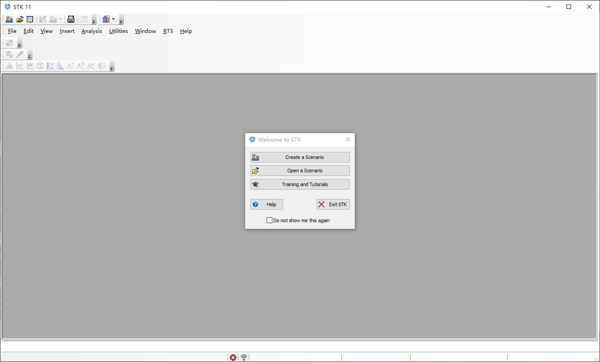
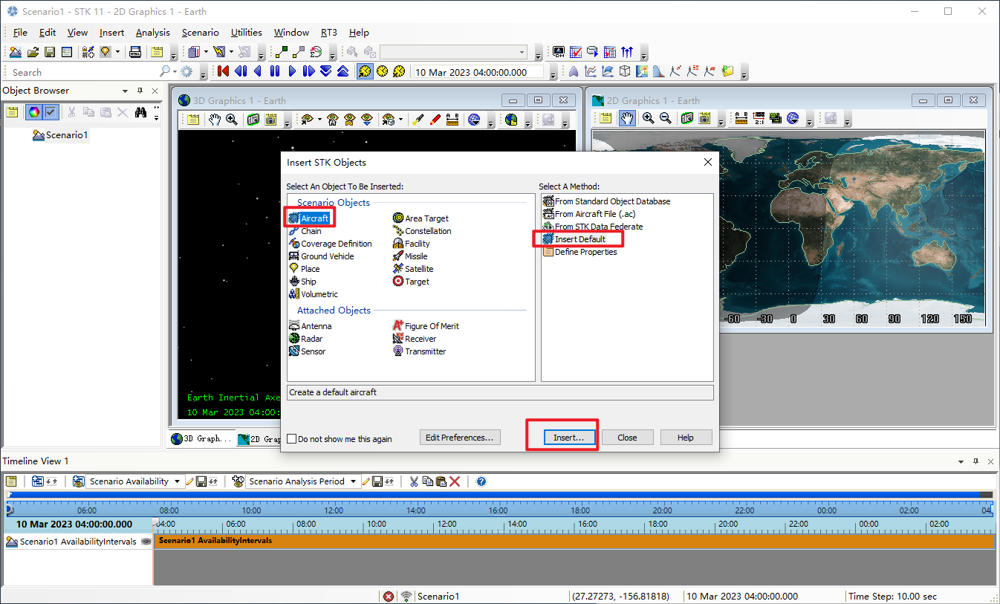
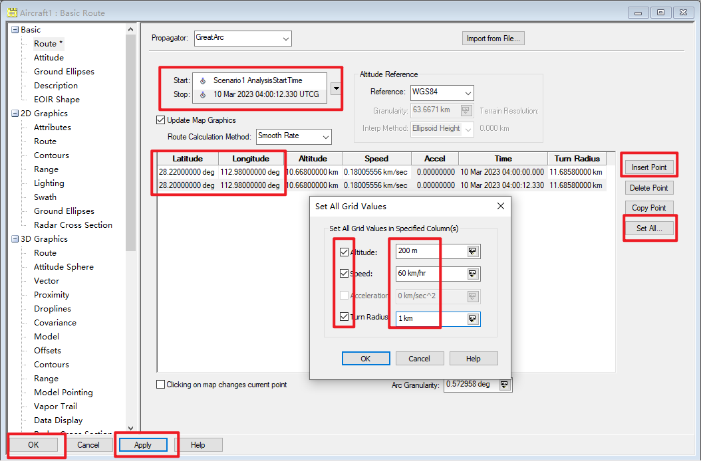
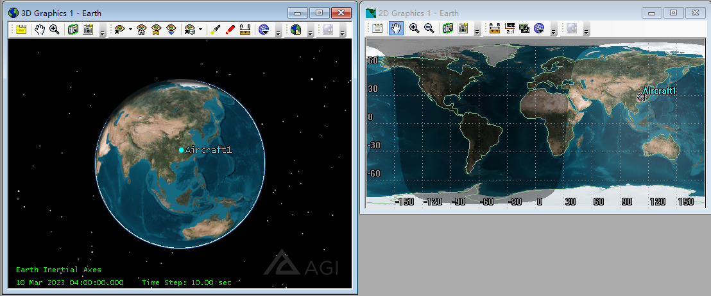
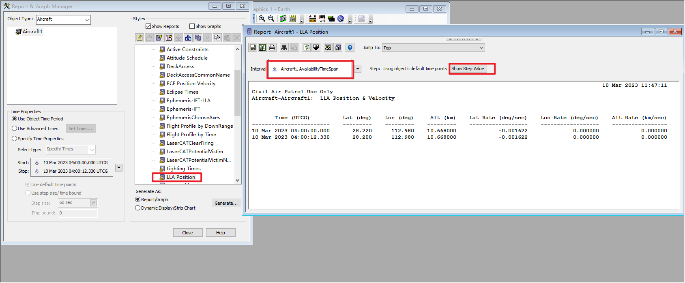
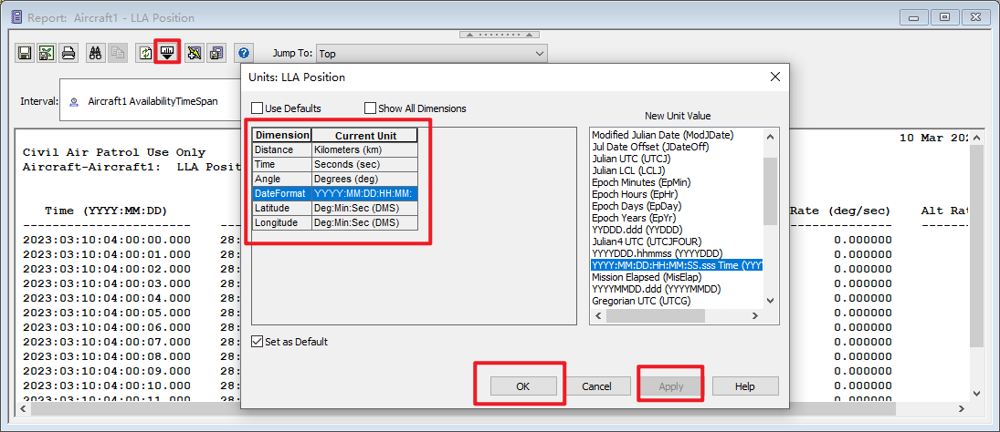
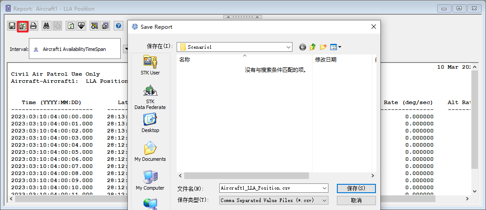
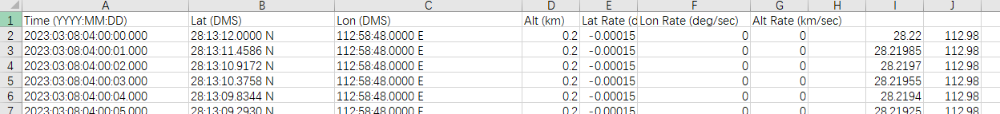

[参考 matlab 版本对应的 STK](https://blog.csdn.net/VILAKO/article/details/120897342)
[STK 相关坐标系](https://zhuanlan.zhihu.com/p/63365900)
[STK 中天体坐标系的定义](https://blog.csdn.net/stk10/article/details/103263324?spm=1001.2101.3001.6650.1&utm_medium=distribute.pc_relevant.none-task-blog-2%7Edefault%7ECTRLIST%7ERate-1-103263324-blog-111719287.t5_download_comparev1&depth_1-utm_source=distribute.pc_relevant.none-task-blog-2%7Edefault%7ECTRLIST%7ERate-1-103263324-blog-111719287.t5_download_comparev1&utm_relevant_index=2)

[STK11 官方 Tutorial 学习笔记 ](https://zhuanlan.zhihu.com/p/585193898)

## 度分秒转经纬度：

STK 中可以把航线的数据单位改为 Deg:Min:Sec(DMS)

| 度 MID(B2,1,2)                                                 |
| -------------------------------------------------------------- |
| 分 MID(B2,4,2)                                                 |
| 秒 MID(B2,7,7)                                                 |
| 度分秒转经纬度 mid(B2,1,2)+(mid(B2,4,2)/60)+(mid(B2,7,7)/3600) |
| 度分秒转经纬度:L=D+M/60+S/3600                                 |
| D 度 M 分 S 秒                                                 |

## 使用 STK 制作飞行器航迹数据

创建一个场景

插入一个飞行器对象

双击飞行器对象设置相关数据

- 开始时间和结束时间按照需求来

- 插入点数据（这里是起点和终点，【可添加多点，相当于飞行过程中的转折点】）

  

这时发现飞行器以及航线数据已经添加到视图当中了

右击飞行器对象选择 Report & Graph Manager,在列表中选择 LLA Position

首先设置一下步长以及数据单位

数据已经生成成功了，可以保存为 csv 格式数据

