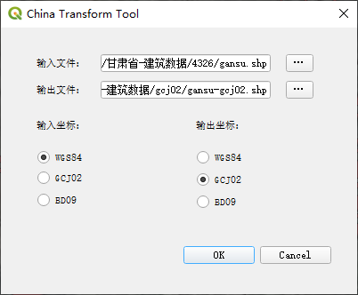

# J2000 -> CGCS2000

j2000 -> 4326 -> 4490
球面坐标/轨道六根数 -> 空间直角坐标系(J2000) ->空间直角坐标系(WGS84) - >  经纬度（WGS84） -> 经纬度（CGCS2000）

## 坐标

J2000 = EME2000 

地心惯性坐标系ECI :j2000平赤道地心坐标系 

前缀“J”代表这是一个[儒略纪元](https://baike.baidu.com/item/%E5%84%92%E7%95%A5%E7%BA%AA%E5%85%83?fromModule=lemma_inlink)法， 其原点也是在地球质心，xy平面为J2000时刻的地球平赤道面，x轴指向J2000时刻的平春分点（J2000时刻平赤道面与平黄道面的一个交点）。此坐标系常被作为地球卫星的惯性坐标系，卫星运动积分等都在此坐标系计算。 

坐标形式：

轨道六根数
空间直角坐标系
球面坐标

地理坐标系
地心地固坐标系 ECEF ：WGS84  -  4326
CGCS2000  -  4490

注：对于精度在10m以上的数据来说、WGS84坐标系=CGCS2000坐标系 （偏差仅有0.11mm）

[卫星导航坐标系统转换工具](http://www.gnssopenlab.org/show_content.php?id=1787)

地理坐标系（GCS）
**地理坐标系**你就理解为在地球这个球体上建立的坐标系，所以它的**单位是度分秒**，比如北京的坐标（东经116°20′、北纬39°56′）。


投影坐标系
**投影坐标系**就更好理解了，它就是将地理坐标投影到平面上建立的坐标系，所以**单位是米**。

**地心地固坐标系**（**E**arth-**C**entered, **E**arth-**F**ixed，简称**ECEF**）简称**地心坐标系**，是一种以[地心](https://baike.baidu.com/item/%E5%9C%B0%E5%BF%83?fromModule=lemma_inlink)为原点的[地固坐标系](https://baike.baidu.com/item/%E5%9C%B0%E5%9B%BA%E5%9D%90%E6%A0%87%E7%B3%BB?fromModule=lemma_inlink)（也称[地球坐标系](https://baike.baidu.com/item/%E5%9C%B0%E7%90%83%E5%9D%90%E6%A0%87%E7%B3%BB?fromModule=lemma_inlink)），是一种[笛卡儿坐标系](https://baike.baidu.com/item/%E7%AC%9B%E5%8D%A1%E5%84%BF%E5%9D%90%E6%A0%87%E7%B3%BB?fromModule=lemma_inlink)。原点 O (0,0,0)为地球质心，z 轴与地轴平行指向[北极点](https://baike.baidu.com/item/%E5%8C%97%E6%9E%81%E7%82%B9?fromModule=lemma_inlink)，x 轴指向[本初子午线](https://baike.baidu.com/item/%E6%9C%AC%E5%88%9D%E5%AD%90%E5%8D%88%E7%BA%BF?fromModule=lemma_inlink)与赤道的交点，y 轴垂直于xOz平面(即东经90度与赤道的交点)构成右手坐标系。 

[java实现CGCS2000大地坐标（投影）和WGS84经纬度坐标互转](https://blog.csdn.net/gis_zhouda/article/details/121404438)
[地理坐标系与投影坐标系的区别](https://blog.csdn.net/aganliang/article/details/81784133)

FK5星表(J2000参考星表)

# 坐标转换

坐标系转换中主要是GCS转GCS，GCS转PCS就是投影，PCS转PCS是重投影。
GCS转GCS这属于空间解析几何里的空间直角坐标系的移动、转换问题，还有个更高级的说法：仿射变换。 欲将一个空间直角坐标系仿射到另一个坐标系的转换，需要进行平移、旋转、缩放三步，可以无序进行。
平移、旋转又有三个方向上的量，即平移向量=（dx,dy,dz）和旋转角度（A,B,C），加上缩放比例s，完成一个不同的坐标系转换（比如WGS84转西安80），就需要7参数。
地心坐标系是唯一的，即原点唯一，就说明平移向量是0向量，如果缩放比例是1，那么旋转角度（A,B,C）就是唯一的仿射参数，即3参数。
一般而言比较严密的是用七参数法（包括布尔莎模型，一步法模  型，海尔曼特等），即X平移，Y平移，Z平移，X旋转，Y旋转，Z  旋转，尺度变化K。  要求得七参数就需要在一个地区需要3个以上的已知点，如果区域范围不大，最远点间的距离不大于30Km(经验值)，这可以用三参数（莫洛登斯基模型），即X平移，Y平移，Z平移，而将X旋转，Y旋转，Z旋转，尺度变化K视为0，所以三参数只是七参数的一种特例。  在一个椭球的不同坐标系中转换可能会用到平面转换，现阶段一般分为四参数和平面网格拟合两种方法，以四参数法在国内用的较多，举个例子，在深圳既有北京54坐标又有深圳坐标，在这两种坐标之间转换就用到四参数，计算四参数需要两个已知点。

# 转换方式

**常用的转换方式（针对平面转换）**

**1.A平面坐标系——B平面坐标系（后面会用到）**

此时，A坐标系（转换前）称为源坐标系，B坐标系（转换后）称为目标坐标系。

涉及的常见转换参数：

**二参数：**

包含X平移，Y平移

**四参数：**

包含X平移，Y平移，旋转，尺度（缩放）

**七参数**，最常用的叫**布尔莎七参数**：

包含X平移，Y平移，Z平移，X旋转，Y旋转，Z旋转，尺度（缩放）

**2.相同椭球下，大地坐标系BL——平面坐标系XY（正算）**

通过设置椭球参数+投影方式+中央子午线

**3.相同椭球下，平面坐标系XY——大地坐标系BL（反算）**

同样通过设置椭球参数+投影方式+中央子午线，进行反推

[四参数，七参数相关概念](https://blog.csdn.net/DiXinWang/article/details/104465320?utm_medium=distribute.pc_relevant.none-task-blog-2~default~baidujs_baidulandingword~default-0-104465320-blog-111518206.pc_relevant_multi_platform_whitelistv4&spm=1001.2101.3001.4242.1&utm_relevant_index=3)

[参考链接](https://zhuanlan.zhihu.com/p/465773730)

[概念参考](https://blog.csdn.net/qq_24172609/category_10678978.html)

# SGP4模型

DP4 (Simplified Deep Space Perturbations)即简化深空摄动模型,应 用 于 远 离 地 球 或 者 轨 道 周 期 大 于 225 分 钟 的 物 体 。 如 果 将 TLE 轨 道 报 代 入 SGP4 模 型 , 可 以 成 功地对轨道周期小于225分的空间目标进行预测, 求解出目标物体在任意时刻的位置和速度。（两行根数 -> WGS84）参考开源项目<https://github.com/joshuaferrara/node-sgp4> <https://github.com/jtaala/java-tle-to-czml>

# 3度带6度带区别，中央经线及带号计算(投影坐标)

我国基本比例尺地形图除1：100万采用兰勃特投影（lambert）外，其他均采用高斯-克吕格投影。为减少投影变形，高斯-克吕格投影分为3度带或6度带投影。 

按国家规定我国1:2.5-1:50万地形图均采用6度分带；1:1万及更大比例尺地形图采用3度分带，以保证必要的精度。 

**6度分带投影：**即经差为6度，从零度子午线开始，自西向东每隔6度为一个投影带，全球共分60个带，用1，2，3，4，5，......表示。即东经0\~6度为第一度带，其中央经线的经度为东经3度；东经6~12度为第二带，其中央经线的经度为东经9度。 

**3度分带投影：**即经差为3度，从东经1.5度开始，自西向东每隔3度为一个投影带，全球共分120个带，用1，2，3，4，5，......表示。即东经1.5\~4.5度为第一度带，其中央经线的经度为东经3度；东经4.5\~7.5度为第二带，其中央经线的经度为东经6度；东经7.5~10.5度为第三带，其中央经线的经度为东经9度。**（这样分带的方法使6度带的中央经线均为3度带的中央经线。）** 

中央经线计算方法
当地中央子午线决定了当地的直角坐标系统，首先确定您的直角坐标系统是3度带还是6度带投影，然后再根据如下公式推算。

6度带：带号N=round[(L+3)/6]，即对(L+3)/6的值四舍五入取整数，L为当地经度；则中央子午线经度L0=6 × N-3。

3度带：带号N=round(L/3)，即对(L/3)的值四舍五入取整数，L为当地经度；则中央子午线经度L0=3 × N。自己的理解：

1.搜要转换的城市的经纬度

2.(经度也就是x/3)*3          (括号里取整)

3.来一个实例，以免时间长了忘记，以扬州坐标为例 x:119   y:32

119/3=39.66666

40*3=120


# WGS84 -> CGCS2000

## js转换：wgs坐标转换为cgcs2000

1、js源码：<https://github.com/proj4js/proj4js>

2、引用包中dist/proj4.js文件

3、

```js
//根据自己的坐标系参数定义 proj4字符串
         var wgs84 = '+proj=longlat +ellps=WGS84 +datum=WGS84 +no_defs  ';
         var cgcs2000 = '+proj=tmerc +lat_0=0 +lon_0=120 +k=1 +x_0=500000 +y_0=0 +ellps=GRS80 +units=m +no_defs';

//将cgcs2000坐标转换成wgs84坐标
var xy=proj4(cgcs2000, wgs84, [item.GEO_X, item.GEO_Y]);
```

## ArcGIS10  WGS84 -> CGCS2000

WGS84 -> ITRF2000 -> CGCS2000 

1. 通过 ArcToolBox(数据管理工具 -> 投影和变换 -> 投影)工具转换
2. 输出坐标系选择104124（ITRF2000）
3. 通过ArcCatalog(选择转换后的ITRF2000数据 -> 右键属性中，坐标系选择4490(CGCS2000)，确定)

## PostGIS转换

使用PostGIS转换WGS84到CGCS2000(geom字段)
从[github](https://github.com/geocompass/pg-coordtransform)下载后，运行sql，即可，wgs84 -> gcj02 -> cgcs2000、

## QGIS

插件：china transform tool



# 常见概念

WKID与EPSG 

WKID即Well Known ID，众所周知的ID号的意思。EPSG是管理这些ID号的一个组织，网站是epsg.io 通常来说，一个GIS里的坐标系统，必须有一个WKID，某些特别的除外，下面会讲。例如，WKID=4326，即WGS84这个地理坐标系统的ID。 地理坐标系统和投影坐标系统均使用这套定义，但是不会重复，也没有规律说哪一段数字是地理坐标系统，哪一段是投影坐标系统。幸运的是，我们并不需要完全记完，网上这个WKID大全列表很容易找到，而且只需记住项目中用的、以及常见的即可。
常见EPSG: 
Ø EPSG4326 WGS84 美国GPS使用的一个全球地理坐标系统
Ø EPSG4490 CGCS2000 中国国家2000地理坐标系统
Ø EPSG3857 Web Mercator投影


ITRF 它是一个地心参考框架，由空间大地测量观测站的坐标和运动速度来定义，是[国际地球自转服务](https://baike.baidu.com/item/%E5%9B%BD%E9%99%85%E5%9C%B0%E7%90%83%E8%87%AA%E8%BD%AC%E6%9C%8D%E5%8A%A1/2103539?fromModule=lemma_inlink)的地面参考框架。 


坐标框架 坐标系包含的关系。
坐标系包括坐标原点和*坐标框架*,选择坐标原点就是选择参考系。选择*坐标框架*就是选择测量单位,两者都离不开观察者的参与。 

# GIS数据存储 

业务数据 ：MySQL等普通数据库 
栅格数据 ：MongoDB 
矢量数据 ：PostGIS 
少量数据时： 
1、栅格数据、无需编辑的矢量文件数据 可以直接存放在计算机硬盘文件夹中。
2、在业务数据库相关表中加入 经度x、纬度y、高度z 字段后，直接将矢量数据存放在业务数据库中。

[参考](http://marsgis.cn/doc/study-gis.pdf)


# 坐标转换相关代码(GCJ02 BD09 WGS84)

java方式

```java
package com.maple.util;
import java.math.BigDecimal;

/**
 * 功能:提供坐标偏移公共类
 */
public class CoordinateUtil {
    static double a = 6378245.0;
    static double ee = 0.00669342162296594323;
    static double pi = 3.14159265358979324;
    static double x_pi = 3.14159265358979324 * 3000.0 / 180.0;

    /**
     * GCJ02(国家局、高德、谷歌)转换为百度坐标
     *
     * @param x
     * @param y
     * @return double[2] xy
     */
    public static double[] bd_encrypt(double x, double y) {
        double z = Math.sqrt(x * x + y * y) + 0.00002 * Math.sin(y * x_pi);
        double theta = Math.atan2(y, x) + 0.000003 * Math.cos(x * x_pi);
        double[] xy = new double[2];
        xy[0] = new BigDecimal(z * Math.cos(theta) + 0.0065).setScale(6, BigDecimal.ROUND_HALF_UP).doubleValue();
        xy[1] = new BigDecimal(z * Math.sin(theta) + 0.006).setScale(6, BigDecimal.ROUND_HALF_UP).doubleValue();
        return xy;
    }

    /**
     * 百度坐标转换为GCJ02(国家局、高德、谷歌)
     *
     * @param x
     * @param y
     * @return double[2] xy
     */
    public static double[] bd_decrypt(double x, double y) {
        x = x - 0.0065;
        y = y - 0.006;
        double z = Math.sqrt(x * x + y * y) - 0.00002 * Math.sin(y * x_pi);
        double theta = Math.atan2(y, x) - 0.000003 * Math.cos(x * x_pi);
        double[] xy = new double[2];
        xy[0] = new BigDecimal(z * Math.cos(theta)).setScale(6, BigDecimal.ROUND_HALF_UP).doubleValue();
        xy[1] = new BigDecimal(z * Math.sin(theta)).setScale(6, BigDecimal.ROUND_HALF_UP).doubleValue();
        return xy;
    }

    private static double transLat(double x, double y) {
        double ret = -100.0 + 2.0 * x + 3.0 * y + 0.2 * y * y + 0.1 * x * y + 0.2 * Math.sqrt(x > 0 ? x : -x);
        ret += (20.0 * Math.sin(6.0 * x * pi) + 20.0 * Math.sin(2.0 * x * pi)) * 2.0 / 3.0;
        ret += (20.0 * Math.sin(y * pi) + 40.0 * Math.sin(y / 3.0 * pi)) * 2.0 / 3.0;
        ret += (160.0 * Math.sin(y / 12.0 * pi) + 320 * Math.sin(y * pi / 30.0)) * 2.0 / 3.0;
        return ret;
    }

    private static double transLon(double x, double y) {
        double ret = 300.0 + x + 2.0 * y + 0.1 * x * x + 0.1 * x * y + 0.1 * Math.sqrt(x > 0 ? x : -x);
        ret += (20.0 * Math.sin(6.0 * x * pi) + 20.0 * Math.sin(2.0 * x * pi)) * 2.0 / 3.0;
        ret += (20.0 * Math.sin(x * pi) + 40.0 * Math.sin(x / 3.0 * pi)) * 2.0 / 3.0;
        ret += (150.0 * Math.sin(x / 12.0 * pi) + 300.0 * Math.sin(x / 30.0 * pi)) * 2.0 / 3.0;
        return ret;
    }

    private static boolean outOfChina(double x, double y) {
        if (x < 72.004 || x > 137.8347)
            return true;
        if (y < 0.8293 || y > 55.8271)
            return true;
        return false;
    }

    /**
     * 原始坐标(WGS84)转换为GCJ02(国家局、高德、谷歌)
     *
     * @param x
     * @param y
     * @return double[2] xy
     */
    public static double[] WgsToGcj(double x, double y) {
        double[] gcjLoc = new double[2];
        if (outOfChina(x, y)) {
            gcjLoc[0] = x;
            gcjLoc[1] = y;
            return gcjLoc;
        }
        double dLat = transLat(x - 105.0, y - 35.0);
        double dLon = transLon(x - 105.0, y - 35.0);
        double radLat = y / 180.0 * pi;
        double magic = Math.sin(radLat);
        magic = 1 - ee * magic * magic;
        double sqrtMagic = Math.sqrt(magic);
        dLat = (dLat * 180.0) / ((a * (1 - ee)) / (magic * sqrtMagic) * pi);
        dLon = (dLon * 180.0) / (a / sqrtMagic * Math.cos(radLat) * pi);
        gcjLoc[1] = new BigDecimal(y + dLat).setScale(14, BigDecimal.ROUND_HALF_UP).doubleValue();
        gcjLoc[0] = new BigDecimal(x + dLon).setScale(14, BigDecimal.ROUND_HALF_UP).doubleValue();

        return gcjLoc;
    }

    /**
     * GCJ02(国家局、高德、谷歌)转换为原始坐标(WGS84)
     *
     * @param x
     * @param y
     * @return double[2] xy
     */
    public static double[] GcjToWgs(double x, double y) {
        double[] wgLoc = new double[2];
        double wgX = x, wgY = y;
        double dX, dY;
        double[] currGcLoc = new double[2];
        int maxCount = 100;
        int count = 0;
        while (true) {
            currGcLoc = WgsToGcj(wgX, wgY);
            dX = x - currGcLoc[0];
            dY = y - currGcLoc[1];
            if (Math.abs(dY) < 1e-5 && Math.abs(dX) < 1e-5) {  // 1e-6 ~ centimeter level accuracy
                // Result of experiment:
                //   Most of the time 2 iterations would be enough for an 1e-8 accuracy (milimeter level).
                //
                wgLoc[0] = new BigDecimal(wgX).setScale(6, BigDecimal.ROUND_HALF_UP).doubleValue();
                wgLoc[1] = new BigDecimal(wgY).setScale(6, BigDecimal.ROUND_HALF_UP).doubleValue();
                break;
            }
            wgX += dX;
            wgY += dY;
            if (count > maxCount) {//超过100次计算未满足条件，返回0
                wgLoc[0] = 0;
                wgLoc[1] = 0;
                break;
            }
            count++;
        }
        return wgLoc;
    }

    public static double EARTH_RADIUS = 6378137;

    private static double rad(double d) {
        return d * Math.PI / 180.0;
    }

    /**
     * 根据两点间经纬度坐标（double值），计算两点间距离，单位为米
     *
     * @param lng1
     * @param lat1
     * @param lng2
     * @param lat2
     * @return
     */
    public static double getDistance(double lng1, double lat1, double lng2, double lat2) {
        double radLat1 = rad(lat1);
        double radLat2 = rad(lat2);
        double a = radLat1 - radLat2;
        double b = rad(lng1) - rad(lng2);
        double s = 2 * Math.asin(Math.sqrt(Math.pow(Math.sin(a / 2), 2) +
                Math.cos(radLat1) * Math.cos(radLat2) * Math.pow(Math.sin(b / 2), 2)));
        s = s * EARTH_RADIUS;
        s = Math.round(s * 10000) / 10000;
        return s;
    }
}
```

js方式

```js
/**
 * @author lyr
 * @date 2019/6/24
 * @Description: 坐标转换公共方法
 */
const a = 6378245.0;
const ee = 0.00669342162296594323;
const pi = 3.14159265358979324;
const x_pi = 3.14159265358979324 * 3000.0 / 180.0;
const EARTH_RADIUS = 6378137;

/**
 * GCJ02(国家局、高德、谷歌)转换为百度坐标
 */
export function bd_encrypt(x,y) {
    let z = Math.sqrt(x * x + y * y) + 0.00002 * Math.sin(y * x_pi);
    let theta = Math.atan2(y, x) + 0.000003 * Math.cos(x * x_pi);
    let xy = [];
    xy[0] = z * Math.cos(theta) + 0.0065;
    xy[1] = z * Math.sin(theta) + 0.006;
    return xy;
}

/**
 * 百度坐标转换为GCJ02(国家局、高德、谷歌)
 */
export function bd_decrypt(x,y) {
    x = x - 0.0065;
    y = y - 0.006;
    let z = Math.sqrt(x * x + y * y) - 0.00002 * Math.sin(y * x_pi);
    let theta = Math.atan2(y, x) - 0.000003 * Math.cos(x * x_pi);
    let xy = [];
    xy[0] = z * Math.cos(theta);
    xy[1] = z * Math.sin(theta);
    return xy;
}

/**
 * GCJ02(国家局、高德、谷歌)转换为原始坐标(WGS84)
 */
export function GcjToWgs(x,y) {
    let wgLoc = [];
    let wgX = x, wgY = y;
    let dX, dY;
    let currGcLoc = [];
    let maxCount = 100;
    let count = 0;
    while (true) {
        currGcLoc = WgsToGcj(wgX, wgY);
        dX = x - currGcLoc[0];
        dY = y - currGcLoc[1];
        if (Math.abs(dY) < 1e-5 && Math.abs(dX) < 1e-5) {  // 1e-6 ~ centimeter level accuracy
            wgLoc[0] = wgX;
            wgLoc[1] = wgY;
            break;
        }
        wgX += dX;
        wgY += dY;
        if (count > maxCount) {//超过100次计算未满足条件，返回0
            wgLoc[0] = 0;
            wgLoc[1] = 0;
            break;
        }
        count++;
    }
    return wgLoc;
}

/**
 * 原始坐标(WGS84)转换为GCJ02(国家局、高德、谷歌)
 */
export function WgsToGcj(x,y) {
    let gcjLoc = [];
    if (outOfChina(x, y)) {
        gcjLoc[0] = x;
        gcjLoc[1] = y;
        return gcjLoc;
    }
    let dLat = transLat(x - 105.0, y - 35.0);
    let dLon = transLon(x - 105.0, y - 35.0);
    let radLat = y / 180.0 * pi;
    let magic = Math.sin(radLat);
    magic = 1 - ee * magic * magic;
    let sqrtMagic = Math.sqrt(magic);
    dLat = (dLat * 180.0) / ((a * (1 - ee)) / (magic * sqrtMagic) * pi);
    dLon = (dLon * 180.0) / (a / sqrtMagic * Math.cos(radLat) * pi);
    gcjLoc[1] = y + dLat;
    gcjLoc[0] = x + dLon;
    return gcjLoc;
}

export function transLat(x,y) {
    let ret = -100.0 + 2.0 * x + 3.0 * y + 0.2 * y * y + 0.1 * x * y + 0.2 * Math.sqrt(x > 0 ? x : -x);
    ret += (20.0 * Math.sin(6.0 * x * pi) + 20.0 * Math.sin(2.0 * x * pi)) * 2.0 / 3.0;
    ret += (20.0 * Math.sin(y * pi) + 40.0 * Math.sin(y / 3.0 * pi)) * 2.0 / 3.0;
    ret += (160.0 * Math.sin(y / 12.0 * pi) + 320 * Math.sin(y * pi / 30.0)) * 2.0 / 3.0;
    return ret;
}

export function transLon(x,y) {
    let ret = 300.0 + x + 2.0 * y + 0.1 * x * x + 0.1 * x * y + 0.1 * Math.sqrt(x > 0 ? x : -x);
    ret += (20.0 * Math.sin(6.0 * x * pi) + 20.0 * Math.sin(2.0 * x * pi)) * 2.0 / 3.0;
    ret += (20.0 * Math.sin(x * pi) + 40.0 * Math.sin(x / 3.0 * pi)) * 2.0 / 3.0;
    ret += (150.0 * Math.sin(x / 12.0 * pi) + 300.0 * Math.sin(x / 30.0 * pi)) * 2.0 / 3.0;
    return ret;
}

export function outOfChina(x,y) {
    if (x < 72.004 || x > 137.8347)
        return true;
    if (y < 0.8293 || y > 55.8271)
        return true;
    return false;
}


export function rad(d) {
    return d * Math.PI / 180.0;
}

/**
 * 根据两点间经纬度坐标（double值），计算两点间距离，单位为米
 */
export function getDistance(lng1,lat1,lng2,lat2) {
    let radLat1 = rad(lat1);
    let radLat2 = rad(lat2);
    let a = radLat1 - radLat2;
    let b = rad(lng1) - rad(lng2);
    let s = 2 * Math.asin(Math.sqrt(Math.pow(Math.sin(a / 2), 2) +
        Math.cos(radLat1) * Math.cos(radLat2) * Math.pow(Math.sin(b / 2), 2)));
    s = s * EARTH_RADIUS;
    s = Math.round(s * 10000) / 10000;
    return s;
}
```

npm方式

```js
安装：
npm install coordtransform
使用：
let coordtransform=require('coordtransform');
//国测局坐标(火星坐标,比如高德地图在用),百度坐标,wgs84坐标(谷歌国外以及绝大部分国外在线地图使用的坐标)
//百度经纬度坐标转国测局坐标
var bd09togcj02 = coordtransform.bd09togcj02(116.404, 39.915);
//国测局坐标转百度经纬度坐标
var gcj02tobd09 = coordtransform.gcj02tobd09(116.404, 39.915);
//wgs84转国测局坐标
var wgs84togcj02 = coordtransform.wgs84togcj02(116.404, 39.915);
//国测局坐标转wgs84坐标
var gcj02towgs84 = coordtransform.gcj02towgs84(116.404, 39.915);
console.log(bd09togcj02);
console.log(gcj02tobd09);
console.log(wgs84togcj02);
console.log(gcj02towgs84);
//result
//bd09togcj02:   [ 116.39762729119315, 39.90865673957631 ]
//gcj02tobd09:   [ 116.41036949371029, 39.92133699351021 ]
//wgs84togcj02:  [ 116.41024449916938, 39.91640428150164 ]
//gcj02towgs84:  [ 116.39775550083061, 39.91359571849836 ]
```

TW区域投影

TWD97 3822

 

 