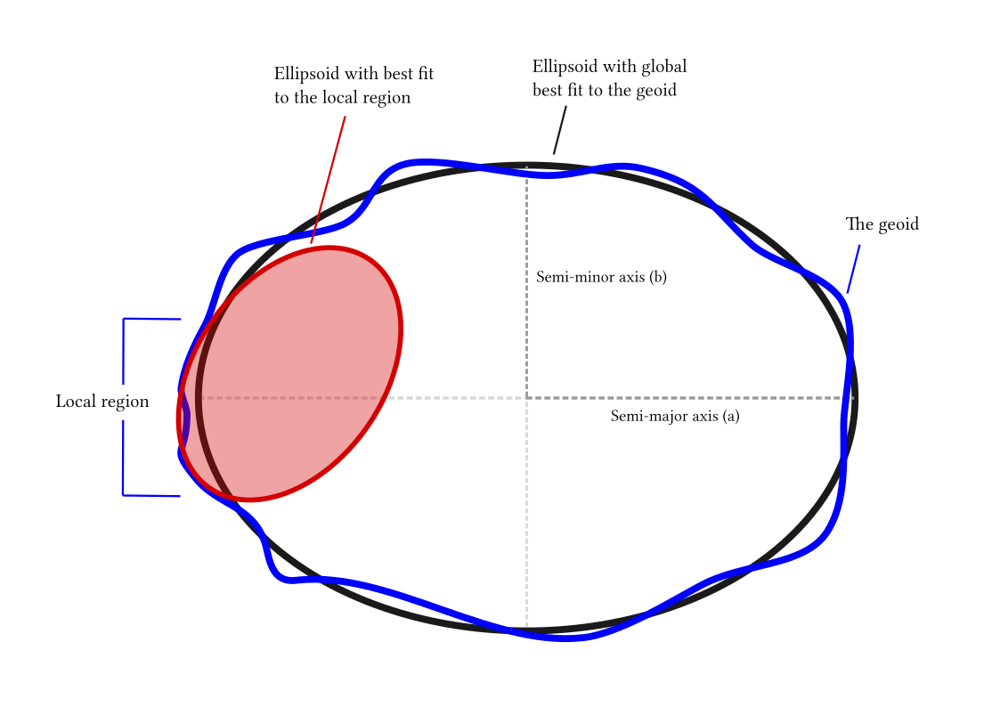

PROJ9.1.1 文档机翻+理解

# conda 环境

conda 包管理器包括几个 PROJ 包。我们建议从 conda-forge 频道安装：

```bash
conda install -c conda-forge proj
```

使用 conda 您还可以安装 PROJ 数据包。以下是安装 proj-data 包的方法：

```bash
conda install -c conda-forge proj-data
```

可用的还有遗留包

```
proj-datumgrid-europe proj-datumgrid-north-america proj-datumgrid-oceania proj-datumgrid-world
```

# 快速开始

坐标转换由 PROJ 术语中的“proj-strings”定义。proj-string 描述了任何转换，无论它是多么简单或复杂。最简单的情况是大地坐标的投影。

proj-strings 保存给定坐标变换的参数，例如

```
+proj=merc +lat_ts=56.5 +ellps=GRS80
```

即，proj-string 由投影说明符 、+proj 适用于投影的多个参数以及（如果需要）对基准偏移的描述组成。在上面的例子中，大地坐标被转换为墨卡托投影的投影空间，真实比例的纬度在 GRS80 椭球上北纬 56.5 度。PROJ 中的每个投影都由一个简写标识，merc 如上例所示。

通过使用上述投影定义作为命令行实用程序 proj 的参数，我们可以将大地坐标转换为投影空间：

```bash
proj +proj=merc +lat_ts=56.5 +ellps=GRS80
```

如果按上述方式调用，proj 将处于交互模式，让您手动键入输入数据并在屏幕上显示响应。 proj 可以像任何 UNIX 过滤器一样工作，这意味着您还可以将数据通过管道传输到该实用程序，例如使用以下 echo 命令：

```bash
echo 55.2 12.2 | proj +proj=merc +lat_ts=56.5 +ellps=GRS80


3399483.80      752085.60
```

PROJ 还捆绑了 cs2cs 实用程序，该实用程序用于从一个坐标参考系统转换到另一个坐标参考系统。假设我们想将上面的墨卡托坐标转换为 UTM，我们可以使用 cs2cs 来实现：

```bash
echo 3399483.80 752085.60 | cs2cs +proj=merc +lat_ts=56.5 +ellps=GRS80 +to +proj=utm +zone=32


6103992.36      1924052.47 0.00
```

注意+to 分隔源和目标投影定义的参数。

如果您碰巧知道您正在转换的两个坐标参考系统的 EPSG 标识符，您可以将它们与 cs2cs 一起使用：

```bash
echo 56 12 | cs2cs +init=epsg:4326 +to +init=epsg:25832

231950.54      1920310.71 0.00
```

在上面的示例中，我们将 WGS84 参考系中的大地坐标转换为 ETRS89 参考系中的 UTM zone 32N 坐标。UTM 坐标

# 制图投影

PROJ 的基础是库中提供的大量[投影](https://proj.org/operations/projections/index.html)。本节专门介绍可用于 PROJ 库中任何投影的通用参数。

以下是可应用于大多数坐标系定义的 **PROJ 参数列表**。 此表不试图描述特定投影类型特有的参数。 这些可以在记录各个投影的页面上找到。

| Parameter | Description                                                                                                                               |
| --------- | ----------------------------------------------------------------------------------------------------------------------------------------- |
| +a        | Semimajor radius of the ellipsoid axis（ 椭球体长半轴长度 ）                                                                              |
| +axis     | Axis orientation（ 轴方向 ）                                                                                                              |
| +b        | Semiminor radius of the ellipsoid axis（椭球体短半轴长度）                                                                                |
| +ellps    | Ellipsoid name (see `cs2cs -le`)（椭球体名称）                                                                                            |
| +k        | Scaling factor (deprecated)（比例因子 弃用）                                                                                              |
| +k_0      | Scaling factor（比例因子 缩放比例）                                                                                                       |
| +lat_0    | Latitude of origin（纬度原点）                                                                                                            |
| +lon_0    | Central meridian（中央子午线/中央经线）                                                                                                   |
| +lon_wrap | Center longitude to use for wrapping (see below)（用于环绕的中心经度 见下文）                                                             |
| +over     | Allow longitude output outside -180 to 180 range, disables wrapping (see below)（允许在 -180 到 180 范围之外的经度输出，禁用换行 见下文） |
| +pm       | Alternate prime meridian (typically a city name, see below)（备用本初子午线（通常是城市名称，见下文）                                     |
| +proj     | Projection name (see `proj -l`)（投影名称）                                                                                               |
| +units    | meters, US survey feet, etc.(see `cs2cs -lu`)（单位 米、美国测量英尺等）                                                                  |
| +vunits   | vertical units.（垂直单位）                                                                                                               |
| +x_0      | False easting（东伪偏移）                                                                                                                 |
| +y_0      | False northing（北伪偏移）                                                                                                                |

> **中央子午线又叫中央经线**，就是每个时区的中间那条经线.每 15 个经度是一个时区.
>
> 0 度 15 度 30 度 45 度等等就是中央经线,他们与东西各 7.5 个经度组成一个时区
>
> 按照国际上这种规定，全球划为 24 个时区，每个时区跨经度 15°，并把以 0° 经线为中央经线（或标准经线）的时区定为中时区；把 180° 经线为中央经线的时区称为十二时区，即 180° 经线西东两侧分别为东十二区和西十二区。每个时区都以中央经线的地方时为该区的区时。
>
> 按照上述规定，可以知道，每一时区的中央经线都是 15° 的整数倍（东一区＝ 1×15°，东二区＝ 2×15°，……），任意两个时区间的界线的经度都是该时区的中央经线的度数 ±7.5°。

## 单位(units)

水平单位可以使用`+units`关键字指定一个单位的符号名(如:`us-ft`)。另外转换为米单位可以使用`+to_meter`关键字指定(如: 美国英尺为 0.304800609601219 米)。`-lu`参数用于 cs2cs 或 proj 可以列出支持单位名称.默认单位是度(degrees)。

垂直单位(Z)可以使用`+vunits`关键字指定一个单位的符号名(如: `us-ft`)。另外转换为米单位可以使用`+vto_meter`关键字指定(如: 美国英尺为 0.304800609601219 米).`-lu`参数用于 cs2cs 或 proj 可以列出支持单位名称。如果没有指定垂直单位，垂直单元将默认为与水平坐标相同的.

> [proj](https://proj.org/apps/proj.html#proj)根本不处理垂直单位，因此`+vto_meter`参数将被忽略。

输出单位的缩放可以通过应用` +k_0` 参数来完成。 返回的坐标按 `+k_0 `参数分配的值缩放。

可以理解为十进制度或弧度的参数的输入单位按照惯例被解释为十进制度。

输入单位的明确规范可以通过向输入值添加适当的后缀来完成。

| Suffix | Unit                      |
| ------ | ------------------------- |
| d      | Decimal degrees（十进制） |
| D      | Decimal degrees           |
| °      | Decimal degrees           |
| r      | Radians（弧度）           |
| R      | Radians                   |

使用示例。中央子午线的经度+lon_0=90，也可以更明确地用十进制度数单位表示为+lon_0=90d，或者用弧度单位表示为+lon_0=1.570796r（近似值）。

## 东伪偏移/北伪偏移（False Easting/Northing）

几乎所有坐标系都允许存在东移 (`x_0`) 和北移 (`y_0`)。 请注意，即使坐标系是其他单位，这些值始终以米表示。 某些坐标系（例如 UTM）具有隐含的东移和北移值。

## 超范围部分经度环绕（Longitude Wrapping）

默认情况下，PROJ 将输出经度包装在 -180 到 180 的范围内。 `+over`可用于禁用默认 warp(环绕包覆)

这对于像等距圆柱投影（Plate Carrée）或墨卡托这样的投影特别有用，在这些投影中，超过 -20000000（大致）的 X 值可能需要继续超过 -180 而不是环绕到 180。

但是请注意，对于大多数 180 度子午线未投影到直线的投影，`+over` 将无效或不会产生预期结果。

## 本初子午线（Prime Meridian）

可以声明本初子午线，指示声明的坐标系的本初子午线与格林威治的本初子午线之间的偏移量。 本初子午线是使用“pm”参数声明的，并且可以分配一个符号名称，或者替代本初子午线相对于格林威治的经度。

支持以下预先声明的本初子午线名称。这些可以使用`cs2cs -lm`列出。

| Meridian  | Longitude      |
| --------- | -------------- |
| greenwich | 0dE            |
| lisbon    | 9d07’54.862”W  |
| paris     | 2d20’14.025”E  |
| bogota    | 74d04’51.3”E   |
| madrid    | 3d41’16.48”W   |
| rome      | 12d27’8.4”E    |
| bern      | 7d26’22.5”E    |
| jakarta   | 106d48’27.79”E |
| ferro     | 17d40’W        |
| brussels  | 4d22’4.71”E    |
| stockholm | 18d3’29.8”E    |
| athens    | 23d42’58.815”E |
| oslo      | 10d43’22.5”E   |

使用示例。基于格林威治的纬度/经度坐标中的位置 `long=0`, `lat=0` 被转换为以马德里为本初子午线的纬度/经度坐标。

```bash
cs2cs +proj=latlong +datum=WGS84 +to +proj=latlong +datum=WGS84 +pm=madrid

0 0

3d41'16.48"E    0dN 0.000
```

## 轴方向（Axis orientation）

从 PROJ 4.8.0 开始，可以使用`+axis`参数来控制坐标系的轴方向。 默认方向是“东、北、上”，但可以翻转方向，或者使用轴开关中的轴组合来翻转轴。 这些值是：

- “e” - Easting
- “w” - Westing
- “n” - Northing
- “s” - Southing
- “u” - Up
- “d” - Down

它们可以在 `+axis`中以如下形式组合：

- `+axis=enu` - 默认东距、北距、高程。
- `+axis=neu` - northing, easting, up - 对于“纬度/经度”地理坐标或南向横向墨卡托非常有用。
- `+axis=wnu` - westing, northing, up - 一些行星坐标系有“西正”坐标系 、

> `+axis` 参数不适用于 proj 命令行实用程序。

# 大地变换

PROJ 可以做任何事情，从最简单的投影到跨多个参考系的非常复杂的转换。虽然最初是作为制图投影工具开发的，但随着时间的推移，PROJ 已经发展成为一个强大的通用坐标转换引擎，可以在大地测量高精度水平上进行大规模制图投影和坐标转换。本章深入探讨了如何执行不同复杂度的大地测量变换的细节。

在 PROJ 中，有两个用于大地测量转换的框架，`proj框架`和`cs2cs框架`。第一个是 PROJ 中用于进行大地测量转换的原始且有限的框架，第二个是一个新添加的框架，旨在成为一个更完整的转换框架。

在描述这两个框架的细节之前，让我们首先注意到，大多数大地测量转换的情况都可以表示为一系列基本操作，一个操作的输出是下一个操作的输入。例如，当从 UTM 区域 32，基准 ED50，到 UTM 区域 32，基准 ETRS89 时，在最简单的情况下，必须经历 5 个步骤：

1. 将 UTM 坐标反投影到地理坐标
2. 将地理坐标转换为 3D 笛卡尔地心坐标
3. 应用 Helmert 转换，从 ED50 转换到 ETRS89
4. 从笛卡尔坐标转换回地理坐标
5. 最后将地理坐标投影到 UTM 32 区平面坐标

## 转换管道

PROJ 框架在做投影，坐标系转换时，其操作风格类似于 Linux Shell 命令。管道框架是通过一个特殊的投影实现的，该投影以用户提供的一系列基础操作作为参数，并将这些操作串联在一起，以实现所需要的完成转换。

此外，一些基本的大地测量操作，包括 Helmert 转换、一般的高阶多项式位移和 Molodensky 模型转换，都可以作为管道的一部分。　（详见下面：基于方程式方法的坐标系转换）

Molodensky 变换直接从一个基准面的大地坐标转换到另一个基准面的大地坐标，而 Helmert 变换(通常更准确)则从 3D 笛卡尔坐标转换到 3D 笛卡尔坐标。

因此，当使用 Helmert 变换时，通常需要做一个从大地坐标到笛卡尔坐标的初始转换，以及反过来的最终转换，以得到期望的结果。幸运的是，这个三步复合变换具有吸引人的特性，即每一步只依赖于前一步的输出。

因此，我们可以构建一个 geodetic-to-geodetic Helmert 转换，通过捆绑在一起的输出和输入，3 个步骤为：geodetic-to-cartesian→Helmert→cartesian-to-geodetic。

管道驱动程序通过这种链式转换实现，该实现非常紧凑，每一步只包含一个伪投影，称之为：pipeline。它以基本的投影字符串作为参数。

所有的管道（伪投影转换）均由基础的转换构成，所有这些转换均提供了框架，用于为广泛的大地测量任务构建高精度的解决方案。

基于上述案例，我们看看使用 PROJ 是如何实现 geodetic → Cartesian → Helmert → geodetic（大地坐标 → 迪卡尔 → 赫尔默特变换 → 大地坐标，即 2-4 步）的。

```proj-strings
proj=pipeline
step proj=cart ellps=intl
step proj=helmert convention=coordinate_frame
     x=-81.0703  y=-89.3603  z=-115.7526
    rx=-0.48488 ry=-0.02436 rz=-0.41321  s=-0.540645
step proj=cart inv ellps=GRS80
```

可以在两端扩展管道以适应输入和输出所需的任何坐标类型

6 步管道 完整的 pipeline 语法

```proj-strings
proj=pipeline
step init=./s45b.pol:s45b_tc32
step proj=utm inv ellps=intl zone=32
step proj=cart ellps=intl
step proj=helmert convention=coordinate_frame
      x=-81.0703  y=-89.3603  z=-115.7526
     rx=-0.48488 ry=-0.02436 rz=-0.41321 s=-0.540645
step proj=cart inv ellps=GRS80
step proj=utm ellps=GRS80 zone=33
```

**cs2cs 参数列表**

| Parameter   | Description                                                                                                                                                                                    |
| ----------- | ---------------------------------------------------------------------------------------------------------------------------------------------------------------------------------------------- |
| +datum      | Datum name (see `proj -ld`)（基准面名称 注:因-ld 参数使用了被遗弃的函数 所以 7 版本后的 proj 移除了这个命令）                                                                                  |
| +geoidgrids | Filename of GTX grid file to use for vertical datum transforms（用于垂直基准变换的 GTX 网格文件的文件名）                                                                                      |
| +geoid_crs  | (Added in PROJ 9.1) Value can be “WGS84” or “horizontal_crs”. Only used if geoidgrids is specified. （在 PROJ 9.1 中添加 其值可以是“WGS84”或“horizontal_crs”。仅在指定大地水准面网格时使用。） |
| +nadgrids   | Filename of NTv2 grid file to use for datum transforms（用于基准变换的 NTv2 网格文件的文件名）                                                                                                 |
| +towgs84    | 3 or 7 term datum transform parameters（3 参数或 7 参数基面转换）                                                                                                                              |
| +to_meter   | Multiplier to convert map units to 1.0m（将水平单位转换为米计算输出转换参数）                                                                                                                  |
| +vto_meter  | Vertical conversion to meters（将垂直单位转换为米计算输出转换参数）                                                                                                                            |

cs2cs 框架提供了管道框架中可用的大地测量转换的子集。

坐标转换在 cs2cs 框架中需要经过两个转换步骤。第一步，以 WGS84 为轴心为基准面，将需要转换的数据转换为 WGS84；第二步，将转换后的 WGS84 数据再转换为特定需要的坐标系（通过利用 Helmert 赫尔默特变换或基准面改变，或两者结合）。

基准面的改变可以通过“ proj-string ”中的 `+towgs84`，`+nadgrids`，`+geoidgrids` 参数来定义。

对于这三个参数都可以逆转换，如果在“ proj-string ”中输入指定的参数。

`+towgs84` 参数是三参数、七参数转换（Helmert 赫尔默特变换）中，以 WGS84 作为中间转换时，WGS84 的参数。

如果没有指定 WGS84 的具体实现参数，则在转换的过程中会产生相当多的不确定性。

`+nadgrids`参数可以应用由校正网格插值得到的非线性平面校正。最初，这是作为转换北美基准 NAD27 和 NAD83 之间的坐标的一种方法来实现的，但是可以对存在校正网格的任何基准进行校正。

`+geoidgrids`参数用于垂直组件中的网格矫正。

两种网格校正方法都允许在同一转换中包含多个网格

与 transformation pipeline 相比，cs2cs 实际上是执行了两个“ proj-string ”。源坐标系转换为 WGS84，WGS84 再转换为目标坐标系。两个坐标系转换，中间用` +to` 连接。

以下示例演示了使用`+towgs84`参数从希腊 GGRS87 数据转换为 WGS84。

```cmd
cs2cs +proj=latlong +ellps=GRS80 +towgs84=-199.87,74.79,246.62 +to +proj=latlong +datum=WGS84

20 35
20d0'5.467"E    35d0'9.575"N 0.000
```

> 对于 PROJ 6，EPSG 地理坐标参考系统的坐标顺序是纬度第一，经度第二。
>
> ```cmd
> cs2cs "GGRS87" "WGS 84"
> 35 20
> 35d0'9.575"N    20d0'5.467"E 0.000
>
> cs2cs EPSG:4121 EPSG:4326
> 35 20
> 35d0'9.575"N    20d0'5.467"E 0.000
> ```
>
> EPSG 数据库提供了这个使用近似 7 参数转换从 WGS72 转换到 WGS84 的示例。

```cmd
cs2cs +proj=latlong +ellps=WGS72 +towgs84=0,0,4.5,0,0,0.554,0.219 +to +proj=latlong +datum=WGS84

4 55
4d0'0.554"E     55d0'0.09"N 0.000
```

使用 PROJ 6，您可以简单地使用以下内容（注意纬度和经度的相反顺序）

```cmd
cs2cs "WGS 72" "WGS 84"
55 4
55d0'0.09"N 4d0'0.554"E 0.000

cs2cs EPSG:4322 EPSG:4326
55 4
55d0'0.09"N 4d0'0.554"E 0.000
```

布尔莎模型又称为七参数转换,或者七参数赫尔默特变换

## [基于网格的基准调整](https://proj.org/usage/transformation.html#grid-based-datum-adjustments)

# 椭球体

椭球体是一个数学定义的表面，它近似于大地水准面：地球重力场的表面，与平均海平面大致相同。



<div style="text-align: center;">椭球的全局和局部拟合 </div>

完整的椭球体定义包括大小（主要）和形状（次要）参数。

## 椭球尺寸参数

- `+R=<value>` Radius of the sphere 球体的半径 R
- `+a=<value>` Semi-major axis of the ellipsoid 椭圆体的半长轴 a

## 椭球形状参数

- `+rf=<value>` Reverse flattening of the ellipsoid 椭圆体的反向展平 1/f
- `+f=<value>` Flattening of the ellipsoid 椭圆体的扁平化 f
- `+es=<value>` Eccentricity squared 偏心率平方 e^2^
- `+e=<value>` Eccentricity 偏心率 e
- `+b=<value>` Semi-minor axis 半长轴 b

椭球体定义可以用球化标志进行扩充，将椭圆体变成具有由椭圆体定义的特征的球体。

## 椭球球化参数

- `+R_A=<value>` A sphere with the same surface area as the ellipsoid 与椭球体表面积相同的球体
- `+R_V=<value>` A sphere with the same volume as the ellipsoid 与椭球体体积相同的球体
- `+R_a=<value>` A sphere with R=(a+b)/2 (arithmetic mean) 一个球体 R=(a+b)/2（算术平均值）
- `+R_g=<value>` A sphere with R=根号下 ab (geometric mean). 一个球体 R=根号下 ab （几何平均数）
- `+R_h=<value>` A sphere with R=2ab/(a+b) (harmonic mean). 一个球体 R=2ab/(a+b)（调和平均值）
- `+R_lat_a=<phi>` A sphere with R being the arithmetic mean of the corresponding ellipsoid at latitude <math xmlns="http://www.w3.org/1998/Math/MathML"><mi>&#x3D5;</mi></math> 一个球体 R 是纬度上相应椭球体的算术平均值<math xmlns="http://www.w3.org/1998/Math/MathML"><mi>&#x3D5;</mi></math>
- `+R_lat_g =<phi>` A sphere with R being the geometric mean of the corresponding ellipsoid at latitude <math xmlns="http://www.w3.org/1998/Math/MathML"><mi>&#x3D5;</mi></math> 一个球体 R 是纬度上相应椭球的几何平均值<math xmlns="http://www.w3.org/1998/Math/MathML"><mi>&#x3D5;</mi></math>

如果`+R`作为大小参数给出，则忽略任何给定的形状和球化参数。

## 内置椭球体定义

该`ellps=xxx`参数为许多内置椭圆体定义提供大小和形状。

| ellps  | Parameters                   | Datum name                   |
| ------ | ---------------------------- | ---------------------------- |
| GRS80  | a=6378137.0 rf=298.257222101 | GRS 1980(IUGG, 1980)         |
| airy   | a=6377563.396 b=6356256.910  | Airy 1830                    |
| bessel | a=6377397.155 rf=299.1528128 | Bessel 1841                  |
| clrk66 | a=6378206.4 b=6356583.8      | Clarke 1866                  |
| intl   | a=6378388.0 rf=297.          | International 1909 (Hayford) |
| WGS60  | a=6378165.0 rf=298.3         | WGS 60                       |
| WGS66  | a=6378145.0 rf=298.25        | WGS 66                       |
| WGS72  | a=6378135.0 rf=298.26        | WGS 72                       |
| WGS84  | a=6378137.0 rf=298.257223563 | WGS 84                       |
| sphere | a=6370997.0 b=6370997.0      | Normal Sphere (r=6370997)    |

如果 size 和 shape 给出为`ellps=xxx`，后面的 shape 和 size 参数将被考虑作为内置椭球体定义的修饰符。

虽然这看起来很奇怪，但它符合 PROJ 的历史行为。例如，它可以用于定义缩放到单位半长轴的椭球坐标，方法是指定`+ellps=xxx +a=1`
