# 参考

[参考文档](https://zhuanlan.zhihu.com/p/142498396)
[FME操作参考视频](https://www.bilibili.com/video/BV1Qh411D7Va?spm_id_from=333.337.search-card.all.click&vd_source=e927bdbd7f7c7acf3f0e52be99902df9)

# 软件

QGIS（处理shp数据）

FME 2019(带有高程的建筑数据shp - 转换 -> skp)

SketchUp 2015（建模   不支持直接导入shp）

# QGIS添加字段操作流程

QGIS加载拥有Floor字段的shp文件后
打开图层属性 -> 字段 -> 字段计算器 -> 勾选新建字段（不勾选新建虚拟字段）-> 字段名称为height -> 输入表达式Floor*3 -> OK -> Apply
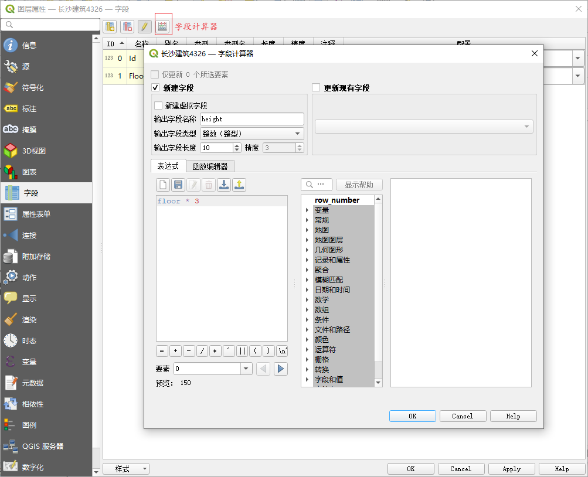

# FME操作流程

新建一个操作界面

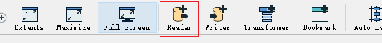
添加读模块

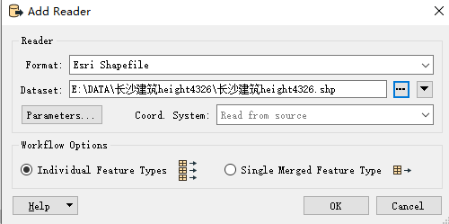
选择文件类型shp
选择数据集
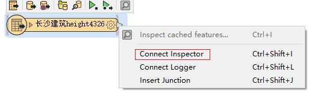
用浏览器看一下这个数据

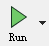
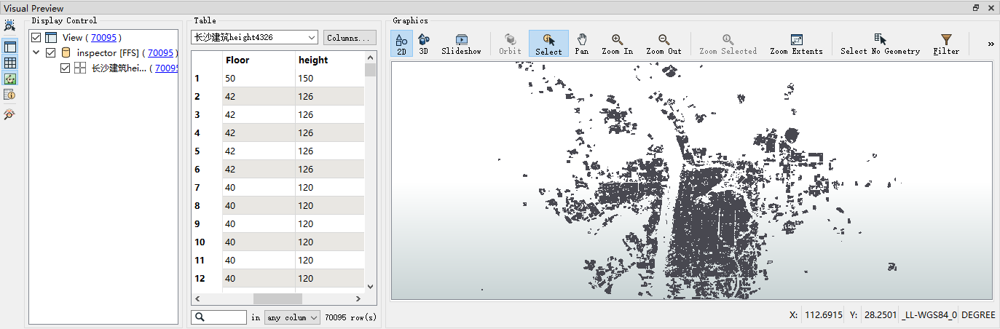
运行查看数据

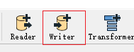
添加写模块
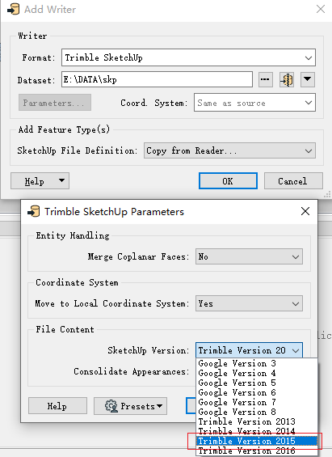

选择文件类型skp
选择数据集（输出目录）
注：Parameters中SketchUp Version 选择2015，版本不统一，可能会不兼容导致文件加载后SketchUp闪退
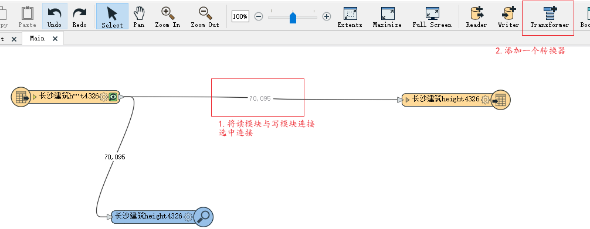
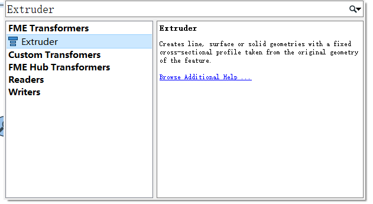
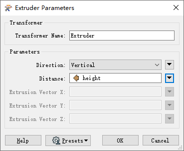
添加转换器extruder
点击小齿轮（Direction选择vertical,Distance选择新建的高度字段）
点击运行
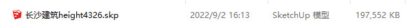
输出目录里生成好的skp文件

# SketchUp操作流程

（插件貌似有点问题）安装[SketchUp-glTF-Exporter](https://github.com/YulioTech/SketchUp-glTF-Exporter-Ruby)扩展：作用是将skp模型数据导出为glTF文件格式（如果解决了，直接用这个方便些）

[参考网站](https://blog.csdn.net/linziping/article/details/103032477?spm=1001.2101.3001.6650.9&utm_medium=distribute.pc_relevant.none-task-blog-2%7Edefault%7ECTRLIST%7ERate-9-103032477-blog-120023653.pc_relevant_multi_platform_whitelistv4&depth_1-utm_source=distribute.pc_relevant.none-task-blog-2%7Edefault%7ECTRLIST%7ERate-9-103032477-blog-120023653.pc_relevant_multi_platform_whitelistv4&utm_relevant_index=13)

点击文件 -> 导入生成的 skp 文件 -> 导出 fbx 格式文件 -> 使用 FBX2glTF 将 fbx 格式文件转换成 glb 文件（但cesium加载后的效果有破损，不知道为啥）

