# 1.3dtiles建筑

# 2.爆炸

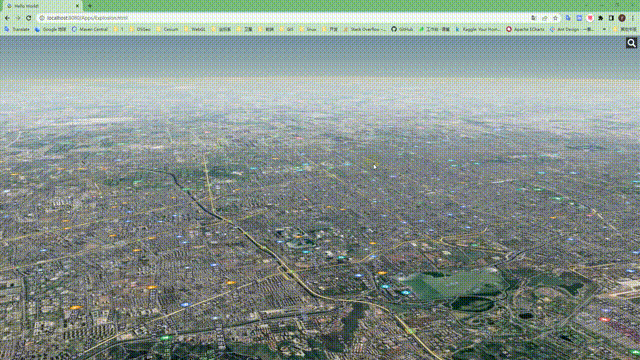

# 3.加载glTF模型

# 4.加载风场数据

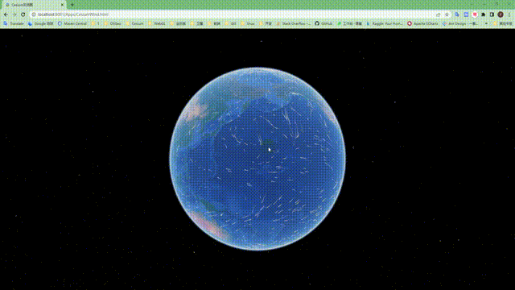

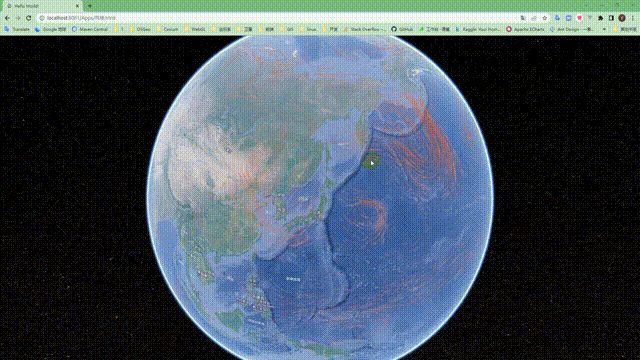

# 5.加载水路数据

# 6.降雪

# 7.降雨

# 8.雾天

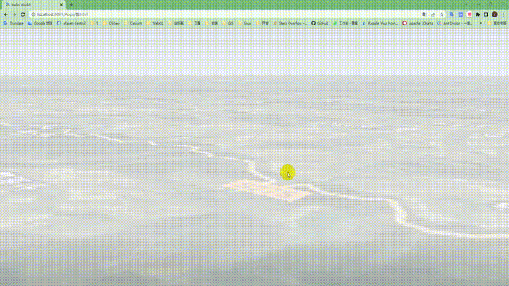

# 9.雷达扫描

# 10.台风路径

# 11.轮船行动轨迹

# 12.淹没分析

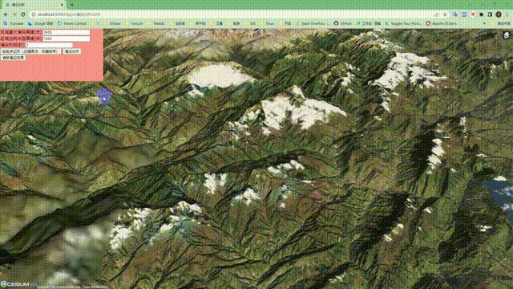

# 13.云层

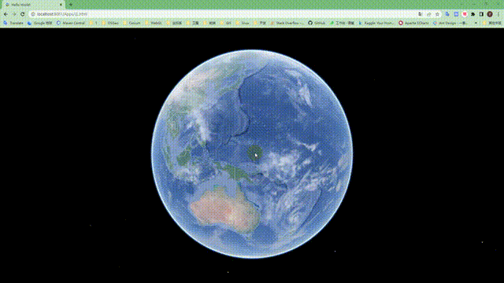

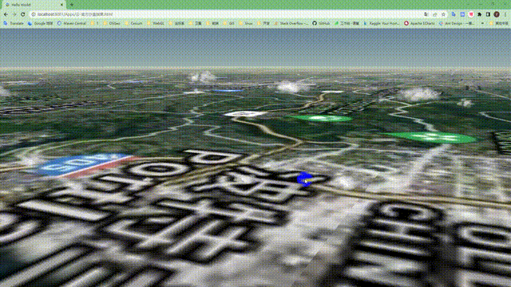

# 14.着火

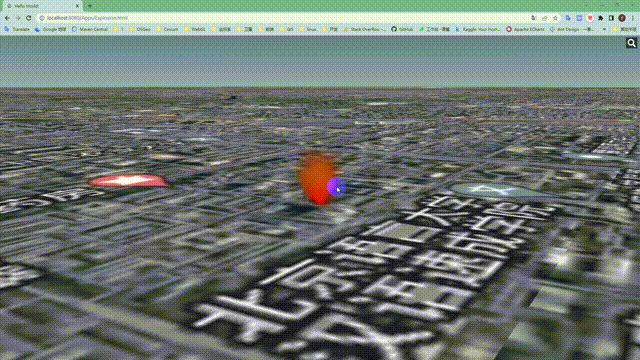

# 15.冒烟

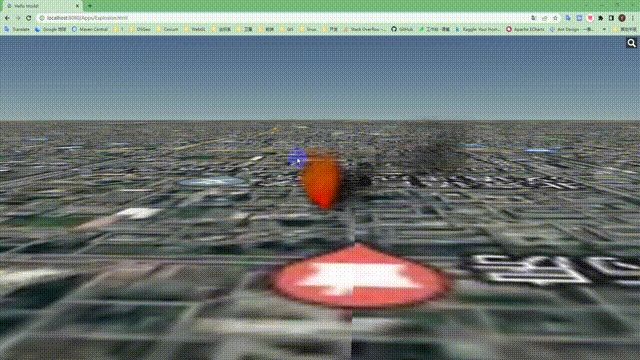

# 16.加载路网数据

# 17.滑坡

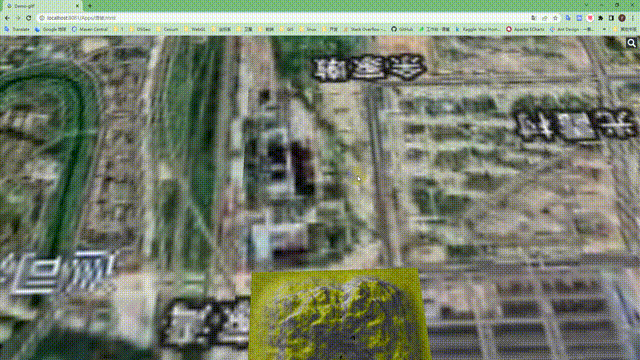

# 18.热力图

# 19.雷电

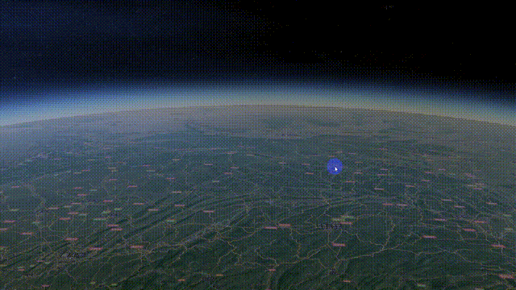