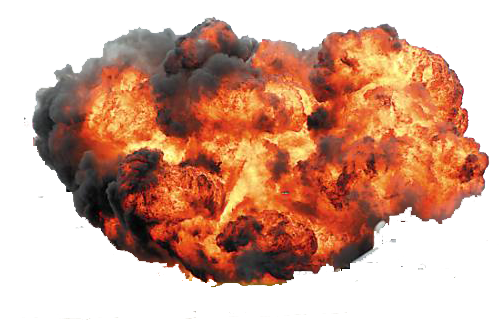

# 关于Cesium的离线效果展示

Cesium离线效果：海浪，天气，雷电，降雨，降雪，冰，雾，风，温度，建筑，水系，路网等效果

**注**：天气效果均是粒子效果，像海洋这种是材质效果（类似贴图）

刚开始的想法是通过自定义着色器来实现效果，相关链接如下：

```
[CustomShader](https://github.com/CesiumGS/cesium/tree/main/Documentation/CustomShaderGuide)

[自定义Shader 从shadertoy移植shader](https://zhuanlan.zhihu.com/p/357816375)
```

# 效果示例

##  [雨雪效果](https://sandcastle.cesium.com/index.html?src=Particle%20System%20Weather.html)

### 雨

```js
//下雨效果，参考简书上的代码(全屏)
        class RainEffect {
            constructor(viewer, options) {
                if (!viewer) throw new Error('no viewer object!');
                options = options || {};
                //倾斜角度，负数向右，正数向左
                this.tiltAngle = Cesium.defaultValue(options.tiltAngle, -.6);
                this.rainSize = Cesium.defaultValue(options.rainSize, 0.3);
                this.rainSpeed = Cesium.defaultValue(options.rainSpeed, 60.0);
                this.viewer = viewer;
                this.init();
            }

            init() {
                this.rainStage = new Cesium.PostProcessStage({
                    name: 'czm_rain',
                    fragmentShader: this.rain(),
                    uniforms: {
                        tiltAngle: () => {
                            return this.tiltAngle;
                        },
                        rainSize: () => {
                            return this.rainSize;
                        },
                        rainSpeed: () => {
                            return this.rainSpeed;
                        }
                    }
                });
                this.viewer.scene.postProcessStages.add(this.rainStage);
            }

            destroy() {
                if (!this.viewer || !this.rainStage) return;
                this.viewer.scene.postProcessStages.remove(this.rainStage);
                this.rainStage.destroy();
                delete this.tiltAngle;
                delete this.rainSize;
                delete this.rainSpeed;
            }

            show(visible) {
                this.rainStage.enabled = visible;
            }

            rain() {
                return "uniform sampler2D colorTexture;\n\
                        varying vec2 v_textureCoordinates;\n\
                        uniform float tiltAngle;\n\
                        uniform float rainSize;\n\
                        uniform float rainSpeed;\n\
                        float hash(float x) {\n\
                            return fract(sin(x * 133.3) * 13.13);\n\
                        }\n\
                        void main(void) {\n\
                            float time = czm_frameNumber / rainSpeed;\n\
                            vec2 resolution = czm_viewport.zw;\n\
                            vec2 uv = (gl_FragCoord.xy * 2. - resolution.xy) / min(resolution.x, resolution.y);\n\
                            vec3 c = vec3(.6, .7, .8);\n\
                            float a = tiltAngle;\n\
                            float si = sin(a), co = cos(a);\n\
                            uv *= mat2(co, -si, si, co);\n\
                            uv *= length(uv + vec2(0, 4.9)) * rainSize + 1.;\n\
                            float v = 1. - sin(hash(floor(uv.x * 100.)) * 2.);\n\
                            float b = clamp(abs(sin(20. * time * v + uv.y * (5. / (2. + v)))) - .95, 0., 1.) * 20.;\n\
                            c *= v * b;\n\
                            gl_FragColor = mix(texture2D(colorTexture, v_textureCoordinates), vec4(c, 1), .5);\n\
                        }\n\
                        ";
            }
        }

        Cesium.RainEffect = RainEffect;
        // 下雨效果
        new Cesium.RainEffect(viewer, {
            tiltAngle: -0.6, //倾斜角度
            rainSize: 0.6, // 雨大小
            rainSpeed: 120.0 // 雨速
        })
```


```js
// 区域降雨 待优化
// 实现区域降雨效果
        //创建雨
        function CreateRain() {
            var scene = viewer.scene;
            scene.camera.setView({
                destination: new Cesium.Cartesian3(277096.634865404, 5647834.481964232, 2985563.7039122293),
                orientation: {
                    heading: 4.731089976107251,
                    pitch: -0.32003481981370063
                }
            });
            //雨更新函数,雪粒子受重力下落
            var rainGravityScratch = new Cesium.Cartesian3();
            var rainUpdate = function (particle, dt) {
                rainGravityScratch = Cesium.Cartesian3.normalize(particle.position, rainGravityScratch);
                rainGravityScratch = Cesium.Cartesian3.multiplyByScalar(rainGravityScratch, -1050.0, rainGravityScratch);
                particle.position = Cesium.Cartesian3.add(particle.position, rainGravityScratch, particle.position);
            };
            //scene.skyAtmosphere.hueShift = -0.97; //光谱颜色
            //scene.skyAtmosphere.saturationShift = 0.25; //实际明暗分界线
            //scene.skyAtmosphere.brightnessShift = -0.4; //颜色对比强烈
            //scene.fog.density = 0.00025; //雾效果浓度
            //scene.fog.minimumBrightness = 0.01; //雾效透明度
            //雨粒子
            var rainParticleSize = scene.drawingBufferWidth / 100.0; //粒子系统大小
            var rainRadius = 100000.0; //半径
            rainSystem = new Cesium.ParticleSystem({
                modelMatrix: new Cesium.Matrix4.fromTranslation(scene.camera.position),
                speed: -1.0,
                lifetime: 15.0,
                emitter: new Cesium.SphereEmitter(rainRadius),
                startScale: 1.0,
                endScale: 0.0,
                image: "./SampleData/circular_particle.png",
                emissionRate: 9000.0,
                startColor: new Cesium.Color(0.27, 0.5, 0.70, 0.0),
                endColor: new Cesium.Color(0.27, 0.5, 0.70, 0.98),
                imageSize: new Cesium.Cartesian2(rainParticleSize, rainParticleSize * 2),
                updateCallback: rainUpdate
            });
            scene.primitives.add(rainSystem);
        }
        CreateRain();
```


```js
// EarthSDK实现雨效果
var EarthComp = {
            template: `
                    <div style="width: 100%; height: 100%">
                        <div ref="earthContainer" style="width: 100%; height: 100%"></div>
                    </div>
                `,
            data() {
                return {
                    _earth: undefined, // 注意：Earth和Cesium的相关变量放在vue中，必须使用下划线作为前缀！
                    enabled: true,
                    aroundTime: 0
                };
            },
            // 1.1 资源创建
            mounted() {
                // 1.1.1 创建地球
                var earth = new XE.Earth(this.$refs.earthContainer);

                this._earth = earth;

                // 1.1.2 场景配置
                earth.sceneTree.root = {
                    "children": [
                        {
                            "czmObject": {
                                "name": "本地地图",
                                "xbsjType": "Imagery",
                                "xbsjImageryProvider": {
                                    "XbsjImageryProvider": {
                                        "url": "http://localhost:8889/bm/map/{z}/{x}/{y}",
                                        "maximumLevel": 15,
                                    },
                                }
                            }
                        }
                    ]
                }

                // 1.1.3 数据绑定
                this._enabledUnbind = XE.MVVM.bind(this, 'enabled', earth.weather.cloud, 'enabled');
                this._aroundTimetUnbind = XE.MVVM.bind(this, 'aroundTime', earth.weather.cloud, 'aroundTime');

                // 1.1.4 设置初始值
                earth.weather.rainPostProcess.enabled = true;

                // only for Debug
                window.earth = earth;
            },
            methods: {
            },
            // 1.2 资源销毁
            beforeDestroy() {
                // vue程序销毁时，需要清理相关资源
                this._enabledUnbind = this._enabledUnbind && this._enabledUnbind();
                this._aroundTimetUnbind = this._aroundTimetUnbind && this._aroundTimetUnbind();
                this._earth = this._earth && this._earth.destroy();
            },
        }

        // 2 创建vue程序
        // XE.ready()用来加载Cesium.js等相关资源
        XE.ready().then(() => {
            var app = new Vue({
                el: '#vueApp',
                components: {
                    EarthComp,
                },
            });
        }); 
```


### 雪

```js
/**
         * @description:下雪效果，参考简书代码（全屏雪）
         * @date：2022-01-20
         */
        class SnowEffect {
            constructor(viewer, options) {
                if (!viewer) throw new Error('no viewer object!');
                options = options || {};
                this.snowSize = Cesium.defaultValue(options.snowSize, 0.02); //最好小于0.02
                this.snowSpeed = Cesium.defaultValue(options.snowSpeed, 60.0);
                this.viewer = viewer;
                this.init();
            }

            init() {
                this.snowStage = new Cesium.PostProcessStage({
                    name: 'czm_snow',
                    fragmentShader: this.snow(),
                    uniforms: {
                        snowSize: () => {
                            return this.snowSize;
                        },
                        snowSpeed: () => {
                            return this.snowSpeed;
                        }
                    }
                });
                this.viewer.scene.postProcessStages.add(this.snowStage);
            }

            destroy() {
                if (!this.viewer || !this.snowStage) return;
                this.viewer.scene.postProcessStages.remove(this.snowStage);
                this.snowStage.destroy();
                delete this.snowSize;
                delete this.snowSpeed;
            }

            show(visible) {
                this.snowStage.enabled = visible;
            }

            snow() {
                return "uniform sampler2D colorTexture;\n\
            varying vec2 v_textureCoordinates;\n\
            uniform float snowSpeed;\n\
                    uniform float snowSize;\n\
            float snow(vec2 uv,float scale)\n\
            {\n\
                float time=czm_frameNumber/snowSpeed;\n\
                float w=smoothstep(1.,0.,-uv.y*(scale/10.));if(w<.1)return 0.;\n\
                uv+=time/scale;uv.y+=time*2./scale;uv.x+=sin(uv.y+time*.5)/scale;\n\
                uv*=scale;vec2 s=floor(uv),f=fract(uv),p;float k=3.,d;\n\
                p=.5+.35*sin(11.*fract(sin((s+p+scale)*mat2(7,3,6,5))*5.))-f;d=length(p);k=min(d,k);\n\
                k=smoothstep(0.,k,sin(f.x+f.y)*snowSize);\n\
                return k*w;\n\
            }\n\
            void main(void){\n\
                vec2 resolution=czm_viewport.zw;\n\
                vec2 uv=(gl_FragCoord.xy*2.-resolution.xy)/min(resolution.x,resolution.y);\n\
                vec3 finalColor=vec3(0);\n\
                //float c=smoothstep(1.,0.3,clamp(uv.y*.3+.8,0.,.75));\n\
                float c=0.;\n\
                c+=snow(uv,30.)*.0;\n\
                c+=snow(uv,20.)*.0;\n\
                c+=snow(uv,15.)*.0;\n\
                c+=snow(uv,10.);\n\
                c+=snow(uv,8.);\n\
                c+=snow(uv,6.);\n\
                c+=snow(uv,5.);\n\
                finalColor=(vec3(c));\n\
                gl_FragColor=mix(texture2D(colorTexture,v_textureCoordinates),vec4(finalColor,1),.5);\n\
                }\n\
                ";
            }
        }

        Cesium.SnowEffect = SnowEffect;

        // 下雪效果
        new Cesium.SnowEffect(viewer, {
            snowSize: 0.02, // 雪花大小
            snowSpeed: 60.0, // 雪速
        })
```


```js
//雪效果 局部降雪
        var scene = viewer.scene;
        scene.globe.depthTestAgainstTerrain = true;
        scene.camera.setView({
            destination: new Cesium.Cartesian3(277096.634865404, 5647834.481964232, 2985563.7039122293),
            orientation: {
                heading: 4.731089976107251,
                pitch: -0.32003481981370063
            }
        });
        // snow
        var snowParticleSize = scene.drawingBufferWidth / 100.0;//例子系统大小
        var snowRadius = 100000.0;//雪的半径
        var minimumSnowImageSize = new Cesium.Cartesian2(snowParticleSize, snowParticleSize);//最小 雪大小
        var maximumSnowImageSize = new Cesium.Cartesian2(snowParticleSize * 2.0, snowParticleSize * 2.0);//最大 雪大小
        var snowSystem;

        var snowGravityScratch = new Cesium.Cartesian3();//竖直位置--名词存疑-实际上是一个坐标
        //每个粒子系统在仿真过程种，都会调用更新回调函数来修改粒子的属性。
        // 回调函数传过两个参数，一个是粒子本身，另一个是仿真时间步长
        var snowUpdate = function (particle, dt) {
            //计算提供的笛卡尔坐标的标准化形式
            snowGravityScratch = Cesium.Cartesian3.normalize(particle.position, snowGravityScratch);
            //所提供的标量对所提供的笛卡尔分量进行多重变换。最后写入到snowGravityScratch中，随机下落的距离
            Cesium.Cartesian3.multiplyByScalar(snowGravityScratch, Cesium.Math.randomBetween(-30.0, -300.0), snowGravityScratch);
            //粒子速度，两个笛卡尔坐标相加--赋值到第三个分量中，等价于速度自增velocity+=velocity
            particle.velocity = Cesium.Cartesian3.add(particle.velocity, snowGravityScratch, particle.velocity);
            //判断相机位置距离，
            var distance = Cesium.Cartesian3.distance(scene.camera.position, particle.position);
            //如果距离大于雪的半径，则透明度为0，否则逐渐增加
            if (distance > snowRadius) {
                particle.endColor.alpha = 0.0;
            } else {
                particle.endColor.alpha = snowSystem.endColor.alpha / (distance / snowRadius + 0.1);
            }
        };
        snowSystem = new Cesium.ParticleSystem({
            modelMatrix: new Cesium.Matrix4.fromTranslation(scene.camera.position),//粒子系统发射器的位置
            minimumSpeed: -1.0,//最小速度
            maximumSpeed: 0.0,//最大速度
            lifetime: 15.0,//例子生命周期长度
            emitter: new Cesium.SphereEmitter(snowRadius), //例子系统发射器，包裹圆形，椭圆，盒子，cone形状的发射器
            startScale: 0.5,//起始比例
            endScale: 1.0,//终止比例
            image: './SampleData/snowflake_particle.png',
            emissionRate: 7000.0,//每秒发射的粒子数量
            startColor: Cesium.Color.WHITE.withAlpha(0.0),//起始颜色
            endColor: Cesium.Color.WHITE.withAlpha(1.0),//终止颜色
            minimumImageSize: minimumSnowImageSize,//最小大小
            maximumImageSize: maximumSnowImageSize,//最大大小
            updateCallback: snowUpdate
        });
        scene.primitives.add(snowSystem);
```


## [云效果](https://sandcastle.cesium.com/index.html?src=Clouds.html&label=All)

```js
// 云 沙盒效果
        const scene = viewer.scene;
        scene.primitives.add(Cesium.createOsmBuildings());

        // ///////////////////////////
        // // Create clouds
        // ///////////////////////////

        Cesium.Math.setRandomNumberSeed(2.5);
        function getRandomNumberInRange(minValue, maxValue) {
            return (
                minValue + Cesium.Math.nextRandomNumber() * (maxValue - minValue)
            );
        }

        const clouds = new Cesium.CloudCollection();

        // manually position clouds in the mountains
        function createBackLayerClouds() {
            clouds.add({
                position: Cesium.Cartesian3.fromDegrees(-122.6908, 45.496, 300),
                scale: new Cesium.Cartesian2(1500, 250),
                maximumSize: new Cesium.Cartesian3(50, 15, 13),
                slice: 0.3,
            });

            clouds.add({
                position: Cesium.Cartesian3.fromDegrees(-122.72, 45.5, 335),
                scale: new Cesium.Cartesian2(1500, 300),
                maximumSize: new Cesium.Cartesian3(50, 12, 15),
                slice: 0.36,
            });

            clouds.add({
                position: Cesium.Cartesian3.fromDegrees(-122.72, 45.51, 260),
                scale: new Cesium.Cartesian2(2000, 300),
                maximumSize: new Cesium.Cartesian3(50, 12, 15),
                slice: 0.49,
            });

            clouds.add({
                position: Cesium.Cartesian3.fromDegrees(-122.705, 45.52, 250),
                scale: new Cesium.Cartesian2(230, 110),
                maximumSize: new Cesium.Cartesian3(13, 13, 13),
                slice: 0.2,
            });

            clouds.add({
                position: Cesium.Cartesian3.fromDegrees(-122.71, 45.522, 270),
                scale: new Cesium.Cartesian2(1700, 300),
                maximumSize: new Cesium.Cartesian3(50, 12, 15),
                slice: 0.6,
            });

            clouds.add({
                position: Cesium.Cartesian3.fromDegrees(-122.705, 45.525, 250),
                scale: new Cesium.Cartesian2(230, 110),
                maximumSize: new Cesium.Cartesian3(15, 13, 15),
                slice: 0.35,
            });

            clouds.add({
                position: Cesium.Cartesian3.fromDegrees(-122.721, 45.53, 220),
                scale: new Cesium.Cartesian2(1500, 500),
                maximumSize: new Cesium.Cartesian3(30, 20, 17),
                slice: 0.45,
            });
        }

        let long,
            lat,
            height,
            scaleX,
            scaleY,
            aspectRatio,
            cloudHeight,
            depth,
            slice;

        // randomly generate clouds in a certain area
        function createRandomClouds(
            numClouds,
            startLong,
            stopLong,
            startLat,
            stopLat,
            minHeight,
            maxHeight
        ) {
            const rangeLong = stopLong - startLong;
            const rangeLat = stopLat - startLat;
            for (let i = 0; i < numClouds; i++) {
                long = startLong + getRandomNumberInRange(0, rangeLong);
                lat = startLat + getRandomNumberInRange(0, rangeLat);
                height = getRandomNumberInRange(minHeight, maxHeight);
                scaleX = getRandomNumberInRange(150, 350);
                scaleY = scaleX / 2.0 - getRandomNumberInRange(0, scaleX / 4.0);
                slice = getRandomNumberInRange(0.3, 0.7);
                depth = getRandomNumberInRange(5, 20);
                aspectRatio = getRandomNumberInRange(1.5, 2.1);
                cloudHeight = getRandomNumberInRange(5, 20);
                clouds.add({
                    position: Cesium.Cartesian3.fromDegrees(long, lat, height),
                    scale: new Cesium.Cartesian2(scaleX, scaleY),
                    maximumSize: new Cesium.Cartesian3(
                        aspectRatio * cloudHeight,
                        cloudHeight,
                        depth
                    ),
                    slice: slice,
                });
            }
        }

        // manually position clouds in front
        const scratch = new Cesium.Cartesian3();
        function createFrontLayerClouds() {
            clouds.add({
                position: Cesium.Cartesian3.fromDegrees(-122.666, 45.5126, 97),
                scale: new Cesium.Cartesian2(400, 150),
                maximumSize: new Cesium.Cartesian3(25, 12, 15),
                slice: 0.36,
            });

            clouds.add({
                position: Cesium.Cartesian3.fromDegrees(-122.6665, 45.5262, 76),
                scale: new Cesium.Cartesian2(450, 200),
                maximumSize: new Cesium.Cartesian3(25, 14, 12),
                slice: 0.3,
            });
        }

        createBackLayerClouds();
        createRandomClouds(8, -122.685, -122.67, 45.51, 45.525, 50, 250);
        createFrontLayerClouds();

        scene.primitives.add(clouds);

        // Fly to Portland
        scene.camera.flyTo({
            destination: Cesium.Cartesian3.fromDegrees(-122.6515, 45.5252, 525),
            orientation: {
                heading: Cesium.Math.toRadians(-115),
                pitch: Cesium.Math.toRadians(-12),
                roll: 0.0,
            },
        });
        scene.fog.density = 1.15e-4;
```


```js
// 使用EarthSDK实现的效果
// 1 创建Earth的vue组件
        var EarthComp = {
            template: `
                    <div style="width: 100%; height: 100%">
                        <div ref="earthContainer" style="width: 100%; height: 100%"></div>
                    </div>
                `,
            data() {
                return {
                    _earth: undefined, // 注意：Earth和Cesium的相关变量放在vue中，必须使用下划线作为前缀！
                    enabled: true,
                    aroundTime: 0
                };
            },
            // 1.1 资源创建
            mounted() {
                // 1.1.1 创建地球
                var earth = new XE.Earth(this.$refs.earthContainer);

                this._earth = earth;

                // 1.1.2 场景配置
                earth.sceneTree.root = {
                    "children": [
                        {
                            "czmObject": {
                                "name": "本地地图",
                                "xbsjType": "Imagery",
                                "xbsjImageryProvider": {
                                    "XbsjImageryProvider": {
                                        "url": "http://localhost:8889/bm/map/{z}/{x}/{y}",
                                        "maximumLevel": 15,
                                    },
                                }
                            }
                        }
                    ]
                }

                // 1.1.3 数据绑定
                this._enabledUnbind = XE.MVVM.bind(this, 'enabled', earth.weather.cloud, 'enabled');
                this._aroundTimetUnbind = XE.MVVM.bind(this, 'aroundTime', earth.weather.cloud, 'aroundTime');

                // 1.1.4 设置初始值
                earth.weather.cloud.enabled = true;

                // only for Debug
                window.earth = earth;
            },
            methods: {
            },
            // 1.2 资源销毁
            beforeDestroy() {
                // vue程序销毁时，需要清理相关资源
                this._enabledUnbind = this._enabledUnbind && this._enabledUnbind();
                this._aroundTimetUnbind = this._aroundTimetUnbind && this._aroundTimetUnbind();
                this._earth = this._earth && this._earth.destroy();
            },
        }

        // 2 创建vue程序
        // XE.ready()用来加载Cesium.js等相关资源
        XE.ready().then(() => {
            var app = new Vue({
                el: '#vueApp',
                components: {
                    EarthComp,
                },
            });
        });
```


```js
// cesium原生实现（利用 贴图 循环动态实现效果）
var urls = [
            "./sate/SATE_L1_F2G_VISSR_MWB_NOM_FDI-201906171300.HDF.png",
            "./sate/SATE_L1_F2G_VISSR_MWB_NOM_FDI-201906171400.HDF.png",
            "./sate/SATE_L1_F2G_VISSR_MWB_NOM_FDI-201906171500.HDF.png",
            "./sate/SATE_L1_F2G_VISSR_MWB_NOM_FDI-201906171600.HDF.png",
        ];
        var i = 0;
        viewer.entities.add({

            // 全球贴图
            rectangle: {
                coordinates: Cesium.Rectangle.fromDegrees(-180.0, -90.0, 180.0, 90.0),
                material: new Cesium.ImageMaterialProperty({
                    image: new Cesium.CallbackProperty(function () {
                        return urls[i];
                    })
                }),
                color: Cesium.Color.WHITE.withAlpha(0.6) // 这里的颜色不会对图片材质造成影像
            },
        });
        setInterval(function () {
            i++;
            if (i == urls.length - 1) {
                i = 0;
            }
        }, 1000);
```


## [雾效果](https://jackie-sun.blog.csdn.net/article/details/122541959?spm=1001.2101.3001.6650.1&utm_medium=distribute.pc_relevant.none-task-blog-2%7Edefault%7ECTRLIST%7ERate-1-122541959-blog-102906189.pc_relevant_multi_platform_whitelistv3&depth_1-utm_source=distribute.pc_relevant.none-task-blog-2%7Edefault%7ECTRLIST%7ERate-1-122541959-blog-102906189.pc_relevant_multi_platform_whitelistv3&utm_relevant_index=2)

```js
 // 雾特效  全屏雾
        var fragmentShaderSource =
            // 计算每个渲染顶点和视点（相机）的距离
            "float getDistance(sampler2D depthTexture, vec2 texCoords) \n" +
            "{ \n" +
            "    float depth = czm_unpackDepth(texture2D(depthTexture, texCoords)); \n" +
            "    if (depth == 0.0) { \n" +
            "        return czm_infinity; \n" +
            "    } \n" +
            "    vec4 eyeCoordinate = czm_windowToEyeCoordinates(gl_FragCoord.xy, depth); \n" +
            "    return -eyeCoordinate.z / eyeCoordinate.w; \n" +
            "} \n" +
            "//计算雾化距离（当它远离眼睛位置时，系数变小）\n" +
            "float interpolateByDistance(vec4 nearFarScalar, float distance) \n" +
            "{ \n" +
            "    float startDistance = nearFarScalar.x;//雾化的起点距离 \n" +
            "    float startValue = nearFarScalar.y; \n" +
            "    float endDistance = nearFarScalar.z; \n" +
            "    float endValue = nearFarScalar.w; \n" +
            "    float t = clamp((distance - startDistance) / (endDistance - startDistance), 0.0, 1.0); \n" +
            "    return mix(startValue,endValue,t ); \n" +
            "} \n" +
            "vec4 alphaBlend(vec4 sourceColor, vec4 destinationColor) \n" +
            "{ \n" +
            "    return sourceColor * vec4(sourceColor.aaa, 1.0) + destinationColor * (1.0 - sourceColor.a); \n" +
            "} \n" +
            "uniform sampler2D colorTexture; \n" +
            "uniform sampler2D depthTexture; \n" +
            "uniform vec4 fogByDistance; \n" +
            "uniform vec4 fogColor; //雾的颜色\n" +
            "varying vec2 v_textureCoordinates; \n" +
            "void main(void) \n" +
            "{ \n" +
            "    float distance = getDistance(depthTexture, v_textureCoordinates); \n" +
            "    vec4 sceneColor = texture2D(colorTexture, v_textureCoordinates); \n" +
            "    float blendAmount = interpolateByDistance(fogByDistance, distance); \n" +
            "    vec4 finalFogColor = vec4(fogColor.rgb, fogColor.a * blendAmount); \n" +
            "    gl_FragColor = alphaBlend(finalFogColor, sceneColor); \n" +
            "} \n";
        function addFog() {
            var postProcessStage = viewer.scene.postProcessStages.add(
                new Cesium.PostProcessStage({
                    fragmentShader: fragmentShaderSource,
                    uniforms: {
                        fogByDistance: new Cesium.Cartesian4(10.0, 0.0, 1500, 1.0),
                        // 调节雾的颜色和能见度
                        fogColor: new Cesium.Color(1.0, 1.0, 1.0, 0.5),
                    },
                })
            );
        }
        addFog();
```


## 风效果

```js
var windy;
        function Draw() {
            $.ajax({
                type: "get",
                url: "./js/sampledata/wind/2017121300.json",//请求风场数据源json
                dataType: "json",
                success: function (response) {
                    var header = response[0].header;
                    windy = new Windy(response, viewer);
                    redraw();
                },
                error: function (errorMsg) {
                    alert("请求数据失败1!");
                }
            });
        }

        var timer = null;
        //加载风场图
        Draw();
        function redraw() {
            timer = setInterval(function () {
                windy.animate();
            }, 300);
        }
```


有一个效果更好的风场效果见[链接](https://github.com/RaymanNg/3D-Wind-Field)


## 海洋效果

```js
// 在线
//Cesium.Ion.defaultAccessToken = <your_access_token>;
var viewer = new Cesium.Viewer('cesiumContainer', {
    requestRenderMode: true,
    maximumRenderTimeChange: Infinity,
    timeline: false,
    animation: false,
    baseLayerPicker: false,
    sceneModePicker: false,
    terrainProvider: Cesium.createWorldTerrain(),
    imageryProvider: Cesium.createWorldImagery()
});
viewer.scene.primitives.add(Cesium.createOsmBuildings());
viewer.clock.currentTime = Cesium.JulianDate.fromIso8601('2020-09-01T16:23:19.06128571429871954Z');
viewer.scene.globe.depthTestAgainstTerrain = true;
viewer.camera.flyTo({
  destination : Cesium.Cartesian3.fromDegrees(-122.4175, 37.655, 400),
  orientation : {
    heading : Cesium.Math.toRadians(0.0),
    pitch : Cesium.Math.toRadians(-15.0),
  }
});
// Load Cesium World Terrain
viewer.terrainProvider = Cesium.createWorldTerrain({
    requestWaterMask : true, // required for water effects
    requestVertexNormals : true // required for terrain lighting
});
// Enable depth testing so things behind the terrain disappear.
viewer.scene.globe.depthTestAgainstTerrain = true;
```


```js
// 使用vue 材质  实现海洋效果
import { defineComponent, reactive, toRefs, onMounted } from "vue";
import "cesium/Build/Cesium/Widgets/widgets.css";
import * as Cesium from "cesium";
let viewer: any;
interface dataProps {
  GeoJsonPolygonData: any;
}
export default defineComponent({
  name: "Point",
  setup() {
    const data: dataProps = reactive({
      GeoJsonPolygonData: {},
    });
    const refData = toRefs(data);
    const init = () => {
      viewer = new Cesium.Viewer("cesiumContainer", {
        imageryProvider: new Cesium.UrlTemplateImageryProvider({
          url: "http://localhost:8889/bm/map/{z}/{x}/{y}",
          maximumLevel: 14,
        }),
        animation: false, // 隐藏动画控件
        baseLayerPicker: false, // 隐藏图层选择控件
        fullscreenButton: false, // 隐藏全屏按钮
        vrButton: false, // 隐藏VR按钮，默认false
        geocoder: false, // 隐藏地名查找控件
        homeButton: false, // 隐藏Home按钮
        infoBox: false, // 隐藏点击要素之后显示的信息窗口
        sceneModePicker: false, // 隐藏场景模式选择控件
        selectionIndicator: true, // 显示实体对象选择框，默认true
        timeline: false, // 隐藏时间线控件
        navigationHelpButton: false, // 隐藏帮助按钮
        scene3DOnly: true, // 每个几何实例将只在3D中呈现，以节省GPU内存
        shouldAnimate: true, // 开启动画自动播放
        sceneMode: 1, // 初始场景模式 1：2D 2：2D循环 3：3D，默认3
        requestRenderMode: true, // 减少Cesium渲染新帧总时间并减少Cesium在应用程序中总体CPU使用率
        // 如场景中的元素没有随仿真时间变化，请考虑将设置maximumRenderTimeChange为较高的值，例如Infinity
        maximumRenderTimeChange: Infinity,
      });
      viewer._cesiumWidget._creditContainer.style.display = "none";
      viewer.scene.skyAtmosphere.show = false;
      viewer.scene.globe.enableLighting = false;
      viewer.camera.flyTo({
        destination: Cesium.Cartesian3.fromDegrees(
          114.23812820479566,
          22.556171757652862,
          10000
        ),
        orientation: {
          heading: Cesium.Math.toRadians(0),
          pitch: Cesium.Math.toRadians(-90),
          roll: 0.0,
        },
        duration: 2,
      });
    };

    const addTexture = () => {
      function applyWaterMaterial(primitive: any) {
        primitive.appearance.material = new Cesium.Material({
          fabric: {
            type: "Water",
            uniforms: {
              specularMap: require("./earthspec1k.jpg"),
              normalMap: require("./waterNormals.png"),
              frequency: 10000.0,
              animationSpeed: 0.01,
              amplitude: 10,
            },
          },
        });
      }
      let worldRectangle = viewer.scene.primitives.add(
        new Cesium.Primitive({
          geometryInstances: new Cesium.GeometryInstance({
            geometry: new Cesium.RectangleGeometry({
              rectangle: Cesium.Rectangle.fromDegrees(-180, -90, 180.0, 90.0),
              vertexFormat: Cesium.EllipsoidSurfaceAppearance.VERTEX_FORMAT,
            }),
          }),
          appearance: new Cesium.EllipsoidSurfaceAppearance({
            aboveGround: true,
          }),
          show: true,
        })
      );
      applyWaterMaterial(worldRectangle);
    }; // 将水域处理为一维数组

    onMounted(() => {
      init();
      addTexture();
    });
    return {
      ...refData,
    };
  },
});
```


## 爆炸效果

```js
var staticPosition = Cesium.Cartesian3.fromDegrees(112, 22, 50);
        var entity44 = viewer.entities.add({
            position: staticPosition
        })
        // viewer.camera.heading
        viewer.camera.flyTo({
            destination: staticPosition,
            orientation: {
                heading: 0.035875924182943386,
                pitch: -0.3804836454134308
            }
        });

        function computeModelMatrix(entity, time) {
            var position = Cesium.Property.getValueOrUndefined(entity.position);
            let modelMatrix = Cesium.Transforms.eastNorthUpToFixedFrame(position);
            return modelMatrix;
        }

        function computeEmitterModelMatrix() {
            let hpr = Cesium.HeadingPitchRoll.fromDegrees(0, 0, 0);
            let trs = new Cesium.TranslationRotationScale();
            trs.translation = Cesium.Cartesian3.fromElements(2.5, 4, 1);
            trs.rotation = Cesium.Quaternion.fromHeadingPitchRoll(hpr);
            let result = Cesium.Matrix4.fromTranslationRotationScale(trs);
            return result
        }

        viewer.scene.primitives.add(new Cesium.ParticleSystem({
            image: './js/peng.png',
            startColor: Cesium.Color.RED.withAlpha(0.7),
            endColor: Cesium.Color.YELLOW.withAlpha(0.3),
            startScale: 0,
            endScale: 10,
            //设定粒子寿命可能持续时间的最小限值(以秒为单位)，在此限值之上将随机选择粒子的实际寿命。
            minimumParticleLife: 1,
            maximumParticleLife: 6,
            minimumSpeed: 1,
            maximumSpeed: 4,
            imageSize: new Cesium.Cartesian2(55, 55),
            // Particles per second.
            emissionRate: 4,
            lifetime: 160.0,
            //cesium内置的发射器，圆形发射器，因此参数是一个半径值
            //还有锥形发射器，new Cesium.ConeEmitter(Cesium.Math.toRadians(45.0))
            //长方形发射器，new Cesium.BoxEmitter(new Cesium.Cartesian3(1.0, 1.0, 1.0))
            //半球发射器，new Cesium.SphereEmitter(0.5)
            emitter: new Cesium.CircleEmitter(5.0),
            //将粒子系统从模型转换为世界坐标的4x4变换矩阵
            modelMatrix: computeModelMatrix(entity44),
            //在粒子系统局部坐标系中变换粒子系统发射器的4x4变换矩阵
            emitterModelMatrix: computeEmitterModelMatrix()
        }))
```




# 坐标系之间的转换

在 web/mobile 地图中，我们主要使用两个坐标系统 **EPSG: 4326(WGS 84)** 和 **EPSG: 3857 (Web Mercator)** 。下面将会告诉你什么是坐标系统，为什么会有这两个系统， 以及怎么理解它们之间的差异。 

## GeoDesy （大地测量学）

测量地球的学科叫做 geodesy （中文叫大地测量学）。以下是大地测量学的一个简单介绍：

1. 与我们通常的描述不同，地球不是一个球体，也不是一个球状体，甚至也不是一个椭球体。虽然使用这样的近似非常有用，但是事实上地球是一个在四维空间中旋转的奇怪的物体，而且也是由多层不同密度组成，导致它非常的不容易被模型化。
   **地球真实的形状太过复杂，使用它自己本身作为参考对于测量来说太难 **
2. 于是，我们使用一个参考椭球体来对地球表面进行模拟，一个参考椭球体（reference ellipsoid）是一个数学上定义的去掉了地表特征的球体（geoid — 真实的包含地表信息的模型）
3. 但是其实并没有一个权威的椭球体统一的用来标准化每一个位置。因为一个参考椭球体是一个近似值，在有的椭球体中，一些位置可以精准的表示出来，而在有些椭球体中则相差千里（因为他们的地表形态的不同）。在一些位置上，一个完全不同的参考椭球体比在别的位置使用的参考椭球体更加适用。

## 坐标系统

通过定义一个参考椭球体，我们现在终于能有一个东西来承载我们的地理坐标系统了。一个地理坐标系统通过一些可以测量的点来描述在这个椭球体表面的位置。这项工程非常的巨大 — 你可以想象尝试这个告诉某个人你的家，不使用英里，米，或者其他的基础度量单位，或者不使用平方米来描述房屋的面积。一个坐标系统也是这样的一个标准 — 用来标准描述地图上位置。通常的理解就是这个东西允许人们在外对这个世界进行探索的时候，能都轻松的找到对应的位置通过人们以往描述的数据。

有两种类型的坐标系统：地理学坐标系统和投影坐标系统

## 地理学坐标系统（Geographic coordinate systems）

地理学坐标系统使用三维建模构建一个椭球体，同时将椭球体表面进行删格化并在这个表面上标注位置。当我们在描述位置时使用的是『longitude』(东/西经)和『latitude』(南/北纬), 我们就是在使用地理学坐标系统

数据集（Datums），从另一方面来说，就是地理学坐标系统构建在一个典型的椭球体上（有如此之多的地理坐标系统），标注一个特定的位置，还有自己特定的朝向。它们也被称为『空间参考系』或者『坐标参考系』。数据集（Datums）是如此的重要：每一个地图和空间数据集都有一个，并且同时有如此之多的数据（Datums）被广泛的应用在地球上不同的位置。有一些数据集（Datums）能精准的描述这个世界的中心，因为这些参考椭球体对这些位置进行了非常准确的匹配，但是在一些别的地方可能就相差千里了。
幸运的是，如同我下面所说，你几乎不用担心怎么处理这些数据，因为现在已经有很多软件可以处理这些数据集了。

## 投影坐标系统

投影坐标系统有点像地理学坐标系统，但是相比而言省略了一步。投影坐标系统也是一个对地球各地位置进行栅格处理的系统，但是它会把三维的栅格拍平到一个二维的平面上（比如一张纸质地图或者屏幕）。

> 一个便于理解的可视化投影坐标系统的方案是，在这个参考椭球体的中心放置一个光源，并且同时使用一张纸将这个椭球体包裹，无论是裹成一个圆锥体，圆柱体，或者什么其他的形状。每一个坐标都会在这张纸上有一个投影，然后当你打开这张纸，并且放置在桌面上，这些坐标点就是你的投影数据

一个投影坐标系统就是定义了如何将一个三维的模型转换为一个二维的平面（这样相比于地球仪更容易携带），这个在数学上被称为投影。

## 坐标系代码

几乎所有的 Web 地图都是采用基于上面两种坐标系统的 EPSG: 4326（WGS84）和 EPSG: 3857（Pseudo-Mercator）。无论你是否知道自己在用这两种坐标系统，你只要和在线地图交互就不可能离开这两个坐标系统。

> 关于它们名称的说法：坐标系统（地理学或者投影）都会用 [EPSG](https://epsg.io/) 作为标志。EPSG 是 European Petroleum Survey Group 的缩写，这是一个致力于将大地测量学的研究和应用做到最完美的组织。 2005 年的时候， EPSG 被吸纳进 International Association of Oil & Gas Producers (IOGP) 组织， 但是坐标系统的支持部门还是叫做 EPSG Geodetic Parameter Dataset。

### EPSG:4326 (WGS84)

​        前面说了 WGS84 是目前最流行的地理坐标系统。在国际上，每个坐标系统都会被分配一个 EPSG 代码，EPSG:4326 就是 WGS84 的代码。GPS是基于WGS84的，所以通常我们得到的坐标数据都是WGS84的。一般我们在存储数据时，仍然按WGS84存储。

### EPSG:3857 (Pseudo-Mercator)

​        伪墨卡托投影，也被称为球体墨卡托，Web Mercator。它是基于墨卡托投影的，把 WGS84坐标系投影到正方形。我们前面已经知道 WGS84 是基于椭球体的，但是伪墨卡托投影把坐标投影到球体上，这导致两极的失真变大，但是却更容易计算。这也许是为什么被称为”伪“墨卡托吧。另外，伪墨卡托投影还切掉了南北85.051129°纬度以上的地区，以保证整个投影是正方形的。因为墨卡托投影等正形性的特点，在不同层级的图层上物体的形状保持不变，一个正方形可以不断被划分为更多更小的正方形以显示更清晰的细节。很明显，伪墨卡托坐标系是非常适合显示数据，但是不适合存储数据的，<font color='red'>**通常我们使用WGS84 存储数据，使用伪墨卡托显示数据**</font>。

`数据存储在EPSG:4326中，显示在EPSG:3857中 `

Web Mercator 最早是由 Google 提出的，当前已经成为 Web Map 的事实标准。但是也许是由于上面”伪“的原因，最初 Web Mercator 被拒绝分配EPSG 代码。于是大家普遍使用 EPSG:900913（Google的数字变形） 的非官方代码来代表它。直到2008年，才被分配了EPSG:3785的代码，但在同一年没多久，又被弃用，重新分配了 EPSG:3857 的正式代码，使用至今。

[EPSG:3857和EPSG:4326区别详解](https://blog.csdn.net/qq_36410795/article/details/106429109)

## 坐标系

- **CGCS2000（China Geodetic Coordinate System 2000）** ：2000国家大地坐标系，是我国当前最新的国家大地坐标系。（据说 GCJ-02是脱密的，不准确）

- **WGS84（World Geodetic System 1984）**：是 GPS 全球定位系统建立的坐标系统，通过GPS定位拿到的原始经纬度。

- **GCJ-02（国家测量局02号标准）**：**GCJ-02 是由中国国家测绘局（G表示Guojia国家，C表示Cehui测绘，J表示Ju局）制订的地理信息系统的坐标系统，是在WGS84经纬度的基础上执行加密算法而成**。因为GPS得到的经纬度直接在 GCJ-02 坐标系下会定位到错误的地点，有种到了火星的感觉，因此在坊间也将 GCJ-02 戏称为**火星坐标系**。**国内的高德地图就是用的 GCJ-02 坐标系**

  GCJ02坐标系是WGS84坐标系[加密](https://so.csdn.net/so/search?q=%E5%8A%A0%E5%AF%86&spm=1001.2101.3001.7020)后的坐标系 （GCJ02本质就是个加密算法，不是坐标系）

- **BD-09（Baidu, BD）**：**是百度地图使用的地理坐标系，其在GCJ-02上多增加了一次变换，用来保护用户隐私。从百度产品中得到的坐标都是BD-09坐标系。**

国家规定，所有公开地理数据都需要至少用GCJ-02进行加密，也就是说我们从国内公司的产品中得到的数据，一定是经过了加密的。绝大部分国内互联网地图提供商都是使用GCJ-02坐标系，包括高德地图，谷歌地图中国区等。

**WGS-84：是国际标准，GPS坐标（Google Earth使用、或者GPS模块）；**

**GCJ-02：中国坐标偏移标准，Google Map、高德、腾讯使用；**

**BD-09：百度坐标偏移标准，Baidu Map使用；**

**CGCS2000：天地图使用**

[国内常用坐标系](https://blog.csdn.net/xiaoxiaovbb/article/details/123111209?spm=1001.2101.3001.6650.5&utm_medium=distribute.pc_relevant.none-task-blog-2%7Edefault%7EBlogCommendFromBaidu%7ERate-5-123111209-blog-108383305.pc_relevant_default&depth_1-utm_source=distribute.pc_relevant.none-task-blog-2%7Edefault%7EBlogCommendFromBaidu%7ERate-5-123111209-blog-108383305.pc_relevant_default&utm_relevant_index=9)

## 坐标系转换

可以使用QGIS插件：**坐标纠偏/转换插件GeoHey Toolbox**  


目前获得的带有高度的建筑数据的坐标系是WGS84，而目前的离线地图的坐标系是GCJ-02，是有偏移的，所以需要将shp建筑数据进行纠偏（WGS to GCJ02）


# 3D Tiles规范(三维瓦片)

3D Tiles 专为流式传输和渲染大量 3D 地理空间内容而设计，例如摄影测量、3D 建筑、BIM/CAD、实例化特征和点云。它定义了一个分层数据结构和一组提供可渲染内容的图块格式。3D Tiles 没有为内容的可视化定义明确的规则；客户可以可视化 3D Tiles 数据，但它认为合适。

在 3D Tiles 中，*tileset*是在空间数据结构**树中组织的一组图块**。一个tileset由至少一个tileset JSON文件描述，该文件包含tileset元数据和一个tile对象树，每个对象都可以引用以下格式之一的可渲染内容：

| 类型         | 英文名称          | 文件后缀名 |
| ------------ | ----------------- | ---------- |
| 批量三维模型 | Batch 3D Model    | b3dm       |
| 实例三维模型 | Instance 3D Model | i3dm       |
| 点云         | PointCloud        | pnts       |
| 复合模型     | Component         | cmpt       |

| 格式                                                         | 用途                                                         |
| ------------------------------------------------------------ | ------------------------------------------------------------ |
| [批量 3D 模型 ( `b3dm`)](https://github.com/CesiumGS/3d-tiles/blob/main/specification/TileFormats/Batched3DModel/README.md) | 异构 3D 模型。例如带纹理的地形和表面、3D 建筑外部和内部、大型模型。 |
| [实例化 3D 模型 ( `i3dm`)](https://github.com/CesiumGS/3d-tiles/blob/main/specification/TileFormats/Instanced3DModel/README.md) | 3D 模型实例。例如树木、风车、螺栓。                          |
| [点云 ( `pnts`)](https://github.com/CesiumGS/3d-tiles/blob/main/specification/TileFormats/PointCloud/README.md) | 海量点数。                                                   |
| [复合 ( `cmpt`)](https://github.com/CesiumGS/3d-tiles/blob/main/specification/TileFormats/Composite/README.md) | 将不同格式的图块连接到一个图块中。                           |

| 瓦片类型 | 对应实际数据                                               |
| -------- | ---------------------------------------------------------- |
| b3dm     | 传统三维建模数据、BIM数据、倾斜摄影数据                    |
| i3dm     | 一个模型多次渲染的数据，灯塔、树木、椅子等                 |
| pnts     | 点云数据                                                   |
| cmpt     | 前三种数据的复合（允许一个cmpt文件内嵌多个其他类型的瓦片） |

 

3dTiles的特点总结如下：

- 三维模型使用了 glTF 规范，继承它的渲染高性能
- 除了嵌入的 glTF，3dTiles 自己 **只记录各级Tile的空间逻辑关系（如何构成整个3dtiles）和属性信息，以及模型与属性如何挂接在一起的信息**  

一份3dtiles数据集：

- 入口文件是`tileset.json`
- 各级瓦片用文件夹（目录）来组织

3dTiles 数据目前的具体文件实现，是一些零散的文件。

数据集的名称与所在文件夹的名称并无关系，数据集的名称写在入口文件中。

3dTiles至少有一个 `tileset.json` 文件，作为整个数据集的入口。它是一个 json 文件，描述了整个三维瓦片数据集，它记录的是上一节提及的“逻辑信息”，还包括一些其他的元数据。而“属性信息”、“嵌入的gltf模型” 则位于各个二进制瓦片文件中，这些二进制文件则由 `tileset.json` 中的瓦片中的 `uri` 来引用。

3dtiles十分灵活

- 3dTiles的文件名可以不是tileset.json
- 3dTiles允许套娃

原则上，只要被引用的子一级3dtiles 不循环引用父级3dtiles，那么就OK（规范如是说）。 

3dTiles在空间上允许数据集使用如下几种树结构： 四叉树 、八叉树、KD树、格网结构

# 一些概念

## 四叉树

四元树又称四叉树是一种树状数据结构，在每一个节点上会有四个子区块。四元树常应用于二维空间数据的分析与分类。 它将数据区分成为四个象限。数据范围可以是方形或矩形或其他任意形状。

## 八叉树

八叉树是一种用于描述三维空间的树状数据结构，八叉树的每个节点表示一个正方体的体积元素，每个节点有八个子节点，将八个子节点所表示的体积元素加在一起就等于父节点的体积。 

## KD树

Kd-树 其实是K-dimension tree的缩写，是对数据点在k维空间中划分的一种数据结构。其实，Kd-树是一种平衡二叉树。 

## 格网结构

格网结构是以格网单元为基础的地理空间数据组织方式，通过对制图区域按一定大小划分而构成的格网炬阵。 

每个格网单元是最基本的信息存贮和处理单元。格网形式有三角形、六边形、正方形、矩形等，但多采用正方形格网形式。格网结构是[地理信息系统](https://baike.baidu.com/item/%E5%9C%B0%E7%90%86%E4%BF%A1%E6%81%AF%E7%B3%BB%E7%BB%9F/171830?fromModule=lemma_inlink)常采用的数据结构之一。对于每一格网数据矩阵来说，其行、列号隐含了地理实体的空间分布位置及其空间关系。每个格网单元记录相应空间实体的属性类型码，即属性编码。如果对同一区域内格网单元不同专题类型的空间实体作属性编码，则在地学综合分析中每个格网单元成为多维判别空间中的一点，并可根据分析数学模型对各格网单元进行判别分类与制图。以格网结构为基础的地理信息系统，优点是数据结构与数据处理方法较简单，适用于地学综合分析，但几何精度较低，且占用较多存贮空间。通常采用游程编码（runlength encoding）方法进行格网数据的压缩。 

# glTF和3DTiles的选用

[两者之间的区别 参考博客](https://blog.csdn.net/hankern/article/details/101796600?spm=1001.2101.3001.6650.9&utm_medium=distribute.pc_relevant.none-task-blog-2%7Edefault%7EBlogCommendFromBaidu%7ERate-9-101796600-blog-107334174.pc_relevant_aa&depth_1-utm_source=distribute.pc_relevant.none-task-blog-2%7Edefault%7EBlogCommendFromBaidu%7ERate-9-101796600-blog-107334174.pc_relevant_aa&utm_relevant_index=12)

glTF小模型只是Primitive 或Entity的其中一种数据类型；

Cesium支持包含关键帧（key-frame）动画，骨骼（skinning）动画的glTF格式的三维模型，且支持模型节点（node）的拾取。glTf是Khronns Group定义的一个基于web的新兴三维模型格式行业标准；

3D Tiles是一个开发的规范，用于传输海量的异构三维地理空间数据集，使用概念类似terrain和imagery的瓦片流技术，3D Tiles使得建筑物数据集、BIM模型、点云和摄影测量模型等大模型比较流畅的在web端进行浏览展示。

glTF表示了渲染一个模型的几何数据、[纹理](https://so.csdn.net/so/search?q=%E7%BA%B9%E7%90%86&spm=1001.2101.3001.7020)数据、材质数据、元数据等。glTF一般用于表示一个具体模型，比如汽车、树木等，不会用于表示一个数字城市，数字城市一般用3DTiles来表示。 

# shp数据格式转换成3dtiles数据格式

使用到的工具 [Cesiumlab3](http://www.cesiumlab.com/)

处理建筑白膜，shp -> b3dm格式   使用Cesiumlab 通用模型切片，然后设置高度字段，选择八叉树处理器（Lod策略选择尺寸过滤【适用于个数非常多的BIM模型】），记得选择保存字段，否则根据高度区分建筑颜色，字段不会被识别，选择同一个目录输出，导出的b3dm数据会被覆盖掉（批量处理的时候，时间可能会超长）

**注：如果在转换时设置贴图纹理效果的话，那么转换时间会超长！！！！！** 

> 目前的离线地球地图的坐标系是GCJ-02，建筑等模型数据的坐标系是WGS84，需要利用QGIS 扩展-- GeoHey工具将shp数据进行坐标转换后（注意3857和4326，需要3857-GCJ-02数据）可批量转换 **（大概10分钟60个shp文件，处理过多可能卡住）**，再进行转b3dm格式

 **注**：cesium请求已发布的3DTileset数据时，是先加载json索引文件，后加载b3dm文件，所以会有些延迟（如果Lod策略选择**尺寸过滤**会好得多）

转换后的3dtiles数据由json文件和b3dm文件构成，一个城市一个文件夹，部署在minio上面，桶设置为公开即可无限期访问

# cesium加载3dtiles建筑数据

示例代码

```js
// 加载城市建筑tileset数据
// 可加载多个已部署发布的3dtileset数据
// Cesium.IonResource.fromAssetId(75343) 此为官方纽约部分的城市数据
// 加载tileset数据及其优化选项
var changsha = viewer.scene.primitives.add(new Cesium.Cesium3DTileset({
    // url: "./js/changsha/tileset.json",
    url: "http://192.168.1.91:9000/3dtiles/changsha/tileset.json",
    skipLevelOfDetail: true,
    baseScreenSpaceError: 1024,
    maximumScreenSpaceError: 256, // 数值加大，能让最终成像变模糊
    skipScreenSpaceErrorFactor: 16,
    skipLevels: 1,
    immediatelyLoadDesiredLevelOfDetail: false,
    loadSiblings: true, // 如果为true则不会在已加载完概况房屋后，自动从中心开始超清化房屋
    cullWithChildrenBounds: true,
    cullRequestsWhileMoving: true,
    cullRequestsWhileMovingMultiplier: 10, // 值越小能够更快的剔除
    preloadWhenHidden: true,
    preferLeaves: true,
    maximumMemoryUsage: 128, // 内存分配变小有利于倾斜摄影数据回收，提升性能体验
    progressiveResolutionHeightFraction: 0.5, // 数值偏于0能够让初始加载变得模糊
    dynamicScreenSpaceErrorDensity: 0.1, // 数值加大，能让周边加载变快
    dynamicScreenSpaceErrorFactor: 1,
    dynamicScreenSpaceError: true // 有了这个后，会在真正的全屏加载完之后才清晰化房屋
}));
```

可以使用[ 3D Tiles styling ](https://cesium.com/learn/cesiumjs-learn/cesiumjs-3d-tiles-styling/)来调整建筑的样式

# cesium加载glTF模型数据

示例代码

```js
var z = './js/csosm.gltf';
        var model, modelin, modelroot;
        //gltf数据加载位置——中点
        var modelMatrix = Cesium.Transforms.eastNorthUpToFixedFrame(Cesium.Cartesian3.fromDegrees(112.9459, 28.1796));
        //加载gltf格式数据到cesium，z为模型名称，modelMatrix为模型中心点的经纬度坐标
        function model_add(url) {
            /*        let index = url.lastIndexOf("/"); // lastIndexOf("/") 找到最后一个 / 的位置
                    let fileName = url.substr(index + 1); // substr() 截取剩余的字符，即得文件名xxx.doc*/
            model = viewer.scene.primitives.add(Cesium.Model.fromGltf({
                url: url,
                modelMatrix: modelMatrix,
                scale: 1.0,  //放大倍数
            }));
            /*获取3D model 的旋转矩阵modelMatrix*/
            let m = model.modelMatrix;
            //构建一个三阶旋转矩阵。模型旋转一定的角度，fromRotation[Z]来控制旋转轴，toRadians()为旋转角度，转为弧度再参与运算
            let m1 = Cesium.Matrix3.fromRotationZ(Cesium.Math.toRadians(-100));
            //矩阵计算
            Cesium.Matrix4.multiplyByMatrix3(m, m1, m);
            //将计算结果再赋值给modelMatrix
            model.modelMatrix = m;
        }
        model_add(z);
```

注：glTF数据不带有坐标，需要手动设置模型的加载位置

# shp数据格式转geojson数据格式

直接使用QGIS进行geojson格式导出即可


# cesium加载geojson数据

示例代码

```js
// 道路穿梭线
 Cesium.GeoJsonDataSource.load("http://192.168.1.91:9000/geojson/csroad3857GCJ02.geojson").then(function (dataSource) {
            viewer.dataSources.add(dataSource);
            const entities = dataSource.entities.values;
            for (let i = 0; i < entities.length; i++) {
                let entity = entities[i];
                entity.polyline.width = 1.7;
            }
        });
```

**注意！！！坑**     此geojson数据也部署到minio中测试过，加载时报错`Cesium 加载 GeoJson 报错 RuntimeError message: “Unknown crs name: urn:ogc:def:crs:EPSG::3857`

解决：[参考文章](https://blog.csdn.net/a571574085/article/details/108003955)

```js
<!-- 坐标转换 -->
    <script src="https://cdnjs.cloudflare.com/ajax/libs/proj4js/2.8.0/proj4.js"></script>
 // 解决"RuntimeError", message: "Unknown crs name: urn:ogc:def:crs:EPSG::3857"
        Cesium.GeoJsonDataSource.crsNames[
            "urn:ogc:def:crs:EPSG::3857"
        ] = Cesium.GeoJsonDataSource.crsNames["EPSG:3857"] = function (
            coordinates
        ) {
            const firstProjection =
                'PROJCS["WGS 84 / Pseudo-Mercator",GEOGCS["WGS 84",DATUM["WGS_1984",SPHEROID["WGS 84",6378137,298.257223563,AUTHORITY["EPSG","7030"]],AUTHORITY["EPSG","6326"]],PRIMEM["Greenwich",0,AUTHORITY["EPSG","8901"]],UNIT["degree",0.0174532925199433,AUTHORITY["EPSG","9122"]],AUTHORITY["EPSG","4326"]],PROJECTION["Mercator_1SP"],PARAMETER["central_meridian",0],PARAMETER["scale_factor",1],PARAMETER["false_easting",0],PARAMETER["false_northing",0],UNIT["metre",1,AUTHORITY["EPSG","9001"]],AXIS["X",EAST],AXIS["Y",NORTH],EXTENSION["PROJ4","+proj=merc +a=6378137 +b=6378137 +lat_ts=0.0 +lon_0=0.0 +x_0=0.0 +y_0=0 +k=1.0 +units=m +nadgrids=@null +wktext  +no_defs"],AUTHORITY["EPSG","3857"]]';
            const secondProjection =
                'GEOGCS["WGS 84",DATUM["WGS_1984",SPHEROID["WGS 84",6378137,298.257223563,AUTHORITY["EPSG","7030"]],AUTHORITY["EPSG","6326"]],PRIMEM["Greenwich",0,AUTHORITY["EPSG","8901"]],UNIT["degree",0.0174532925199433,AUTHORITY["EPSG","9122"]],AUTHORITY["EPSG","4326"]]';

            const xa = coordinates[0];
            const ya = coordinates[1];

            const newCoordinates = proj4(
                firstProjection,
                secondProjection,
                [xa, ya]
            );
            return Cesium.Cartesian3.fromDegrees(
                newCoordinates[0],
                newCoordinates[1],
                0
            );
        };
```

# Primitive与Entity的区别

在cesium中， Primitive更加底层，可自定义着色器，自定义样式等，灵活度更高，加载速度更快，缺点是需要了解比较底层的东西，像WebGL啥的，而且书写的代码较多。

相比Primitive来说，Entity实体，Cesium自己封装了Primitive，提供一些API直接调用，但缺点是不能自定义，灵活度不高，而且因其中设置了好多选项属性的原因，其加载数据的响应速度相对Primitive会慢一些。

注：使用Primitive比Entity加载数据渲染 速度会更快

# 参考链接

[Cesium后处理postProcessStages特效](http://www.manongjc.com/detail/23-lscvlmahlgssbba.html)

[glsl着色器](https://www.shadertoy.com/)

[雨雪雾云](https://blog.csdn.net/ly510812/article/details/126164624)

[一些特效](https://blog.csdn.net/weixin_45782925/article/details/123269490)

[火箭发射点火起飞](http://mars3d.cn/editor-vue.html?id=layer-graphic/file/czml&data=huojian&name=%E5%8F%AF%E8%A7%86%E5%8C%96%20%20-%20%20%E8%99%9A%E6%8B%9F%E4%BB%BF%E7%9C%9F%20%20-%20%20%E7%81%AB%E7%AE%AD%E5%8F%91%E5%B0%84%E8%BF%87%E7%A8%8B)

[雷达扫描](https://mp.weixin.qq.com/s?__biz=MzU1ODcyMjEwOA==&mid=2247484378&idx=6&sn=775a128a76da449d42fcf07975fcfc6c&chksm=fc237e89cb54f79f8a90ca6a27431f5cc4f8164103fc34117c334710e0b3bce8c8e6f2069ac3&scene=21#wechat_redirect)

[四种雷达扫描效果](https://blog.csdn.net/qq41400354/article/details/122509169)

[热力图](https://mp.weixin.qq.com/s?__biz=MzU1ODcyMjEwOA==&mid=2247484266&idx=1&sn=d72bf78f5e8799190e4f27b8bb4bc08c&chksm=fc237e39cb54f72f748908c5f877581dfba1e6b492873e928ad8d4cdec0487aa4c3d7bec5b33&scene=21#wechat_redirect)

[EarthSDK](http://earthsdk.com/)

[3DTiles参考博文](https://www.cnblogs.com/onsummer/p/12799366.html)

[primitive与Entity区别](https://blog.csdn.net/damadashen/article/details/125338902?spm=1001.2101.3001.6661.1&utm_medium=distribute.pc_relevant_t0.none-task-blog-2%7Edefault%7ECTRLIST%7ERate-1-125338902-blog-125484178.pc_relevant_multi_platform_whitelistv3&depth_1-utm_source=distribute.pc_relevant_t0.none-task-blog-2%7Edefault%7ECTRLIST%7ERate-1-125338902-blog-125484178.pc_relevant_multi_platform_whitelistv3&utm_relevant_index=1) 

[一些拓展示例和插件](https://github.com/zhangti0708/cesium-examples)


Cesium提供了三种插值算法

<http://localhost:8081/Apps/Sandcastle/index.html?src=Interpolation.html>

```
LinearApproximation
LagrangePolynomialApproximation
HermitePolynomialApproximation
```

