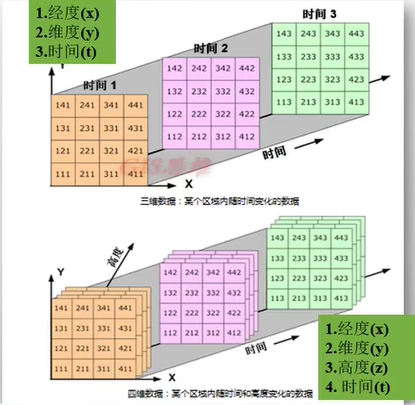

# GRIB2格式数据

GRIB 码是与计算机无关的压缩的*二*进制编码,主要用来表示数值天气预报的产品资料。现行的GRIB 码版本有GRIB1 和GRIB2两种格式。GRIB2较之GRIB1具有加大优点而被广泛使用。如：表示多维数据、模块性结构、支持多种压缩方式、IEEE标准浮点表示法等。 

风场数据获取：

WebGL风向图

客里提到：美国国家气象局每隔6个小时就会以纬度/经度网格(包括风速)的形式，发布全球的气象数据，即GFS。它以一种特殊的二进制格式编码，称为GRIB，它可以用一组特殊的工具解析成人类可读的JSON。

GFS数据下载脚本

```shell
#!/bin/bash

GFS_DATE="20161120"

GFS_TIME="00"; # 00, 06, 12, 18

RES="1p00" # 0p25, 0p50 or 1p00

BBOX="leftlon=0&rightlon=360&toplat=90&bottomlat=-90"

LEVEL="lev_10_m_above_ground=on"

GFS_URL="http://nomads.ncep.noaa.gov/cgi-bin/filter_gfs_${RES}.pl?file=gfs.t${GFS_TIME}z.pgrb2.${RES}.f000&${LEVEL}&${BBOX}&dir=%2Fgfs.${GFS_DATE}${GFS_TIME}"

curl "${GFS_URL}&var_UGRD=on" -o utmp.grib

curl "${GFS_URL}&var_VGRD=on" -o vtmp.grib

grib_set -r -s packingType=grid_simpleutmp.grib utmp.grib

grib_set -r -s packingType=grid_simplevtmp.grib vtmp.grib

printf "{\"u\":`grib_dump -jutmp.grib`,\"v\":`grib_dump -j vtmp.grib`}" > tmp.json

rm utmp.grib vtmp.grib

DIR=`dirname $0`

node ${DIR}/prepare.js${1}/${GFS_DATE}${GFS_TIME}

rm tmp.json
```

注：<https://blog.csdn.net/toby54king/article/details/82712131>可以使用ecCodes库去解析

```
js
使用export default时，对应的import语句不需要使用大括号；
不使用export default时，对应的import语句需要使用大括号。
export default命令用于指定模块的默认输出。显然，一个模块只能有一个默认输出，因此export default命令只能使用一次。所以，import命令后面才不用加大括号，因为只可能唯一对应export default命令
```

CRU格点数据 NetCDF数据

# NetCDF

网络公用数据格式，是一种用来存储温度，湿度，气压，风速和风向等多位科学数据（变量）的文件格式。在ArcGIS中通过根据NetCDF文件创建图层或表视图，可以用一个维度（例如时间）来显示上述所有变量。

NetCDF文件中的数据以数组形式存储，例如，某个位置处随时间变化的温度以一维数组的形式存储。某个区域内在指定时间的温度以二维数组的形式存储。



文件后缀是`.nc` 可以使用ArcGIS加载

> 多维工具-创建NetCDF栅格图层：加载.nc数据

前端netcdfjs   https://github.com/cheminfo/netcdfjs

后端geotools   gt-netcdf

https://www.unidata.ucar.edu/software/netcdf/examples/programs/


气象数据 QGIS ArcGIS matlab 可打开

可用java python等处理

Cesium加载nc例子

https://github.com/AlbertEjiestein/Wind-Field-Cesium

前端可以用热力图的方式去加载解析出来的nc数据，根据time字段去展现不同时间nc数据的变化